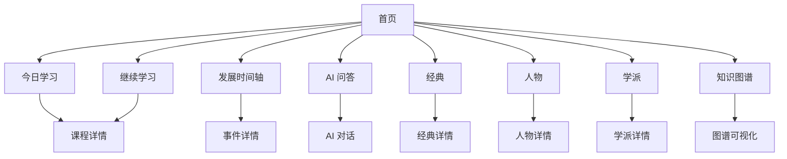
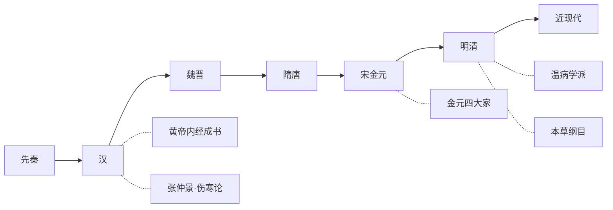
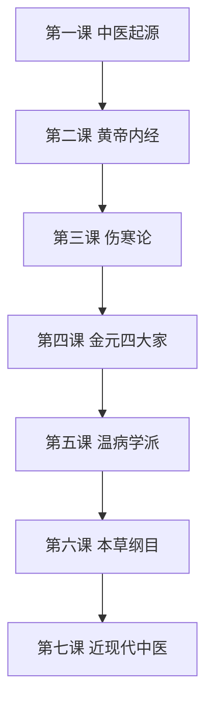
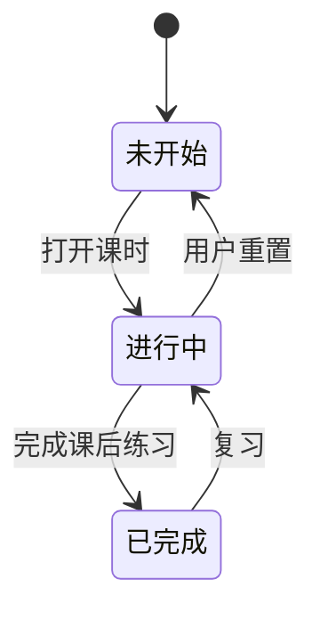
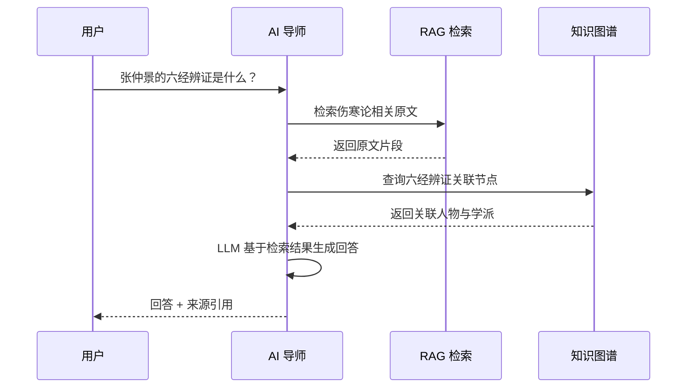
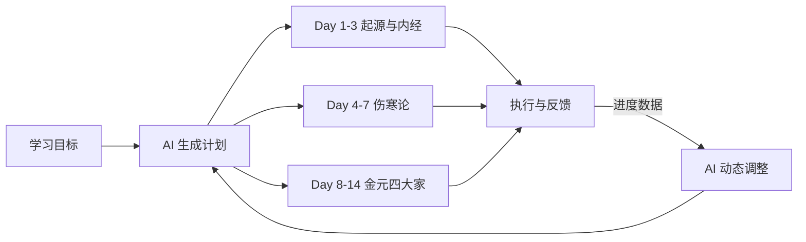
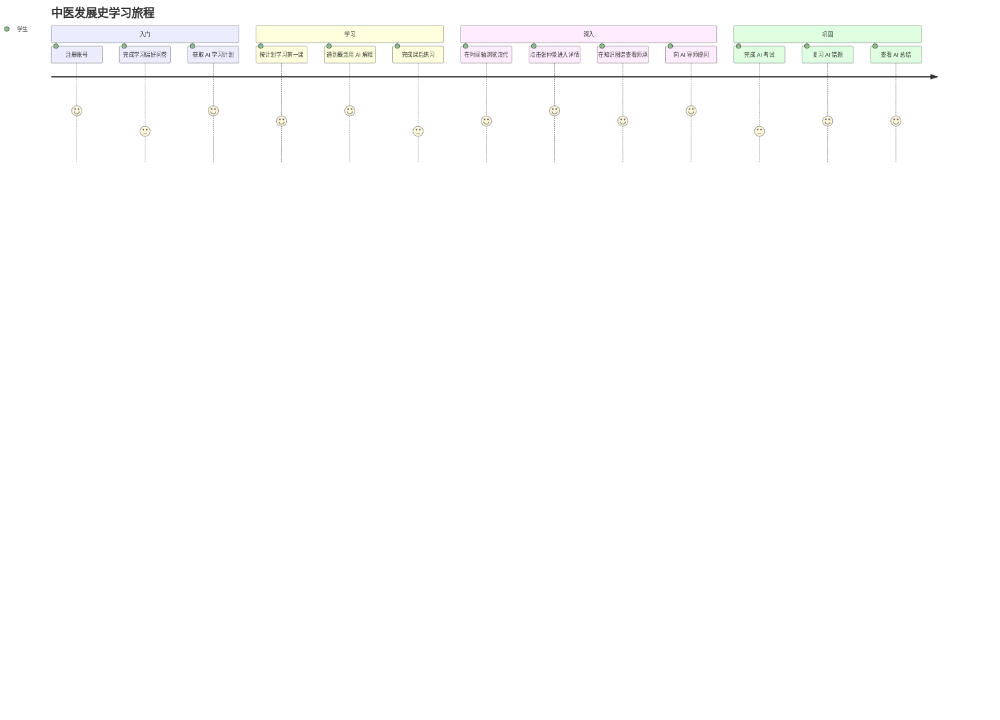

# 01 产品需求 PRD

## 1 产品目标

为不同水平的中医学习者提供一条从"了解中医发展史"到"深入学术研究"的完整路径，核心由三条主线支撑：结构化的历史知识图谱、AI 驱动的问答与学习辅助、个性化的学习进度管理。

## 2 用户角色

| 角色 | 权限 | 典型场景 |
| ---- | ---- | -------- |
| 游客 | 浏览公开内容、体验有限 AI 问答 | 了解平台、试听课程 |
| 注册学员 | 全部学习功能、AI 模块、个人进度 | 系统学习中医史 |
| 会员学员 | 无限 AI 问答、高级学习计划、独家课程 | 深度学习与备考 |
| 内容管理员 | CMS 后台管理人物/经典/课程等内容 | 内容运营 |
| 超级管理员 | 全部权限、系统配置、用户管理 | 平台运维 |

## 3 信息架构

平台首页作为学习入口，向下逐层引导用户进入具体内容与功能。

## 4 首页模块

### 4.1 今日学习

根据用户的学习进度与 AI 生成的学习计划，推荐当日应学内容。未登录用户展示推荐课程入口。已登录用户展示"上次学到哪里"的续学卡片与今日推荐课时。

### 4.2 发展时间轴

以朝代为时间轴主线，横向展示中医发展的关键节点。用户可拖动时间轴浏览不同时期的代表人物、经典著作与重大事件，点击节点进入详情页。

### 4.3 知识图谱入口

提供图谱可视化入口，用户输入或选择一个实体（如"张仲景"），平台以该实体为中心展开关联节点，支持拖拽、缩放、点击下钻。

## 5 学习模块

### 5.1 课程体系

课程按中医发展史的时间脉络编排，每门课程包含若干课时：

### 5.2 课时结构

每个课时包含以下组成部分：

| 组件 | 说明 |
| ---- | ---- |
| 正文 | 图文并茂的知识讲解，含原文引用与白话译注 |
| 关联实体 | 本课涉及的人物、经典、学派卡片，可点击跳转 |
| 知识图谱片段 | 本课相关实体在图谱中的局部视图 |
| 课后练习 | 3-5 道选择题，即时反馈对错与解析 |
| 学习标记 | 标记为已学，更新学习进度 |

### 5.3 学习记录

系统自动记录每个课时的学习状态（未开始/进行中/已完成）、学习时长、练习正确率，并据此计算整体进度。

## 6 AI 模块

AI 模块是平台的核心差异化能力，围绕学习场景提供七项 AI 功能。

### 6.1 AI 导师

以多轮对话形式回答用户关于中医发展史的任何问题。AI 导师基于 RAG 检索经典原文与知识图谱关联，回答可溯源到具体古籍与人物。

### 6.2 AI 总结

用户阅读完一篇经典或一个课时后，可一键生成结构化总结，包含核心观点、关键人物、学术影响三个维度。总结内容由 RAG 保证基于原文，避免幻觉。

### 6.3 AI 考试

根据用户已学内容与学习目标，AI 自动生成一套试题（选择题、判断题、简答题），题目难度匹配用户当前水平。考试结束后给出评分与薄弱知识点分析。

### 6.4 AI 错题

系统收集用户在课后练习与 AI 考试中的错题，AI 对错题进行归类分析，识别用户的知识盲区，并推荐针对性的复习内容与练习题。

### 6.5 AI 出题

针对指定课程、指定知识点，AI 按用户设定的题型与数量生成练习题，供用户自主刷题。所有题目标注来源知识点，便于回溯学习。

### 6.6 AI 学习计划

根据用户的学习目标（如"30 天了解中医发展史"）、可用时间与当前进度，AI 生成个性化学习计划，按天拆分学习任务。系统根据实际完成情况动态调整后续计划。

### 6.7 AI 知识解释

用户在阅读中遇到不懂的概念（如"卫气营血辨证"），选中文字后点击"解释"，AI 基于知识图谱与 RAG 给出该概念的通俗解释、学术源流与关联知识。

## 7 非功能性需求

| 维度 | 指标 |
| ---- | ---- |
| 首屏加载 | PC ≤ 2s，移动端 ≤ 3s |
| AI 问答首字延迟 | ≤ 3s（流式输出） |
| 接口 P99 延迟 | 普通接口 ≤ 200ms，AI 接口 ≤ 5s |
| 可用性 | 99.9% |
| 并发支撑 | 日常 1000 QPS，峰值 5000 QPS |
| 数据准确率 | AI 回答可溯源率 ≥ 95% |

## 8 用户旅程

以一个中医院校学生"系统学习中医发展史"为例：

