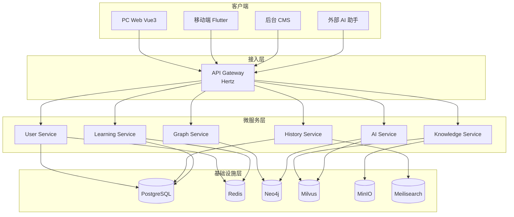
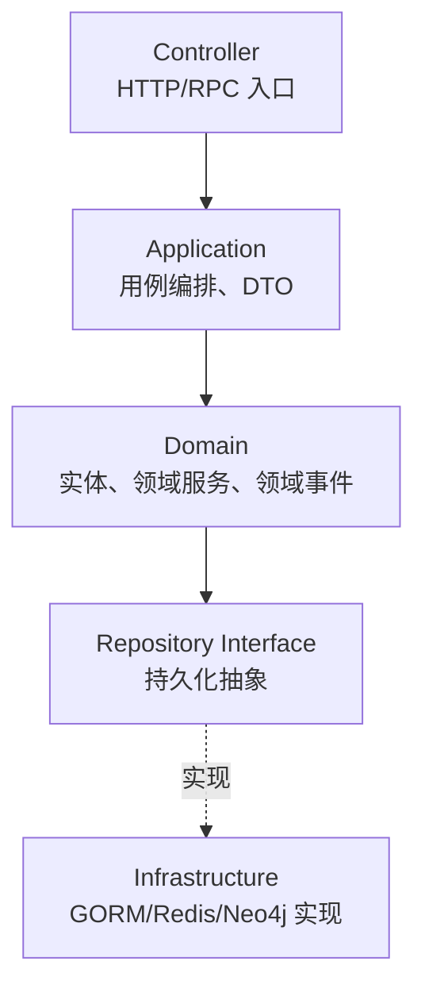
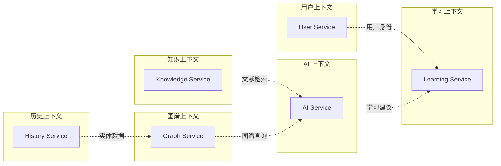
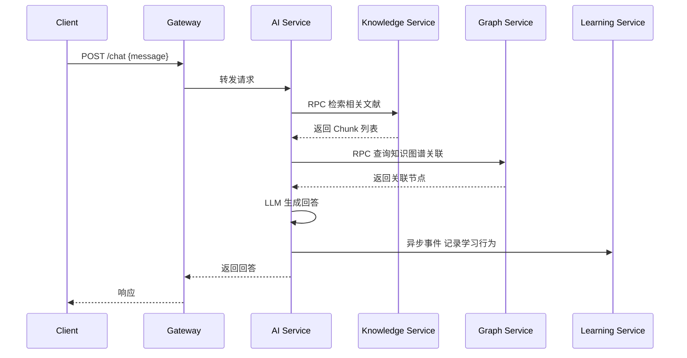
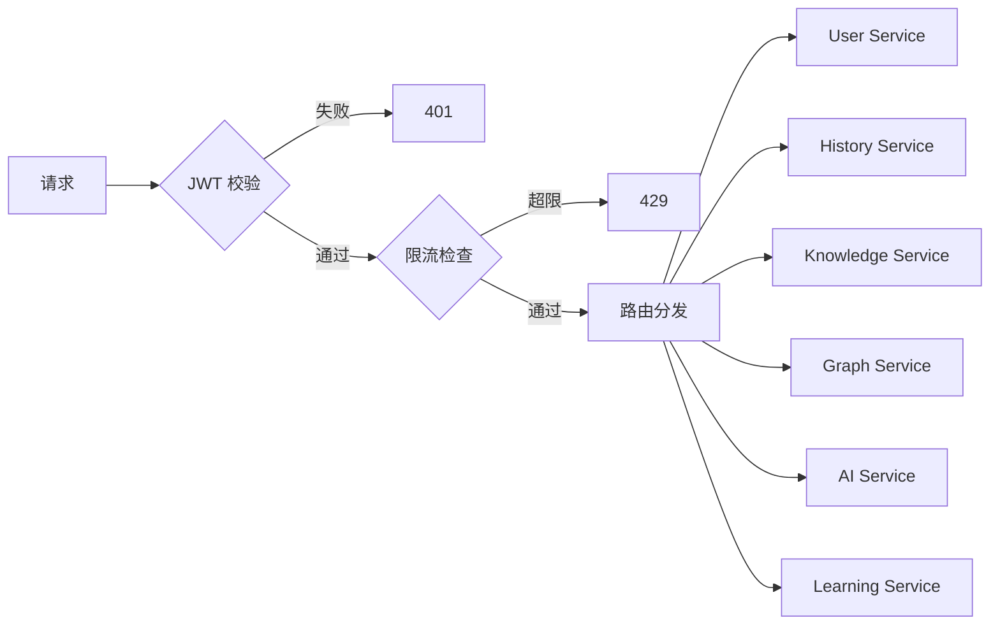

# 02 系统架构设计

## 1 架构总览

TCM-History-AI 采用分层微服务架构，后端遵循 Clean Architecture 与领域驱动设计（DDD），通过 API Gateway 统一对外暴露 REST 接口，服务间使用 Kitex RPC 通信。整体分为接入层、应用层、领域层、基础设施层四层，各层依赖方向自上而下单向流动。



## 2 Clean Architecture

每个微服务内部遵循 Clean Architecture，依赖方向始终指向领域层，领域层不依赖任何外部框架。



### 2.1 分层职责

| 层 | 职责 | 关键约束 |
| -- | ---- | -------- |
| Controller | 接收 HTTP/RPC 请求，参数校验，调用 Application 层 | 不含业务逻辑，不直接访问数据库 |
| Application | 用例编排，事务管理，DTO 转换，调用领域服务 | 编排而非实现业务规则 |
| Domain | 聚合根、实体、值对象、领域服务、领域事件 | 纯业务逻辑，零框架依赖 |
| Repository Interface | 定义持久化抽象接口 | 由领域层定义，基础设施层实现 |
| Infrastructure | GORM、Redis、Neo4j、Milvus 等技术实现 | 依赖倒置，实现 Domain 定义的接口 |

### 2.2 目录结构（单服务示例）

```
user-service/
├── cmd/
│   └── main.go
├── internal/
│   ├── controller/       # HTTP/RPC Controller
│   ├── application/      # 用例层
│   │   ├── usecase/
│   │   └── dto/
│   ├── domain/           # 领域层
│   │   ├── entity/
│   │   ├── service/
│   │   ├── event/
│   │   └── repository/   # 接口定义
│   └── infrastructure/   # 基础设施层
│       ├── persistence/  # GORM 实现
│       ├── cache/        # Redis 实现
│       └── config/       # Viper 配置
├── pkg/                  # 可复用公共包
└── api/                  # IDL/协议定义
```

## 3 领域驱动设计

### 3.1 限界上下文

平台划分为六个限界上下文，与六个微服务一一对应：



### 3.2 聚合根设计

| 限界上下文 | 聚合根 | 包含实体 |
| ---------- | ------ | -------- |
| 用户 | User | UserProfile、UserSettings |
| 历史 | Person、Book、School、Dynasty、Event | 各自独立聚合 |
| 知识 | Document、EmbeddingTask | Chunk（值对象） |
| 图谱 | GraphNode、GraphRelation | — |
| AI | ChatSession、AgentTask | Message、ToolCall |
| 学习 | Course、LearningRecord、Exam | Lesson、Question、Answer |

### 3.3 领域事件

服务间通过领域事件实现解耦协作。事件经 Kafka 异步传递（开发环境可用 Redis Stream 替代）。

| 事件 | 发布者 | 订阅者 | 用途 |
| ---- | ------ | ------ | ---- |
| `UserRegistered` | User Service | Learning Service | 初始化学习档案 |
| `CourseCompleted` | Learning Service | AI Service | 触发学习计划更新 |
| `DocumentIndexed` | Knowledge Service | Graph Service | 同步图谱节点 |
| `ChatMessageCreated` | AI Service | Learning Service | 记录学习行为 |
| `ExamSubmitted` | Learning Service | AI Service | 生成错题分析 |

## 4 微服务划分

### 4.1 服务职责

| 服务 | 职责 | 主要数据存储 |
| ---- | ---- | ------------ |
| User Service | 注册、登录、JWT 鉴权、RBAC 权限、用户资料 | PostgreSQL + Redis |
| History Service | 人物、经典、学派、朝代、事件、方剂、药物、疾病的 CRUD 与检索 | PostgreSQL + Meilisearch |
| Knowledge Service | 文献上传、OCR、Chunk、Embedding、RAG 检索 | Milvus + MinIO |
| Graph Service | Neo4j 知识图谱的节点/关系管理与 Cypher 查询 | Neo4j |
| AI Service | LLM 调用、Agent 编排、Prompt 管理、MCP Tool | Milvus + Neo4j |
| Learning Service | 课程、课时、学习记录、考试、错题、学习计划 | PostgreSQL + Redis |

### 4.2 服务间通信



外部请求统一经 Gateway 转发；同步调用使用 Kitex RPC，异步协作使用领域事件。Gateway 仅做路由、鉴权、限流，不含业务逻辑。

## 5 API Gateway

Gateway 基于 Hertz 实现，承担四项职责：

| 职责 | 实现方式 |
| ---- | -------- |
| 路由转发 | 按路径前缀路由到对应微服务 |
| 认证鉴权 | 校验 JWT，注入用户上下文 |
| 限流熔断 | 基于 Sentinel 的令牌桶限流与熔断 |
| 日志追踪 | 注入 TraceID，透传至下游服务 |



## 6 数据一致性

平台采用最终一致性模型。跨服务的数据变更通过领域事件 + Outbox 模式保证可靠投递：

1. 业务事务与 Outbox 写入在同一数据库事务中完成。
2. 独立的 Relay 进程轮询 Outbox 表，发布事件到 Kafka。
3. 消费方幂等处理事件，失败自动重试，超过阈值进入死信队列。

对于必须强一致的操作（如考试提交计分），使用 Kitex 同步 RPC 在单次请求内完成，不依赖事件。

## 7 可观测性

可观测性围绕指标、日志、链路追踪三支柱构建，全部通过 OpenTelemetry 标准化采集。

| 支柱 | 工具 | 用途 |
| ---- | ---- | ---- |
| 指标 | Prometheus + Grafana | QPS、延迟、错误率、资源水位 |
| 日志 | Loki | 结构化日志聚合检索 |
| 链路追踪 | Tempo + Jaeger | 跨服务调用链可视化 |
| 告警 | Grafana Alerting | 基于指标阈值的告警通知 |

每个请求在 Gateway 入口生成 TraceID，通过 HTTP Header / RPC Metadata 透传至所有下游服务，串联起完整的调用链。

## 8 安全设计

| 安全域 | 措施 |
| ------ | ---- |
| 身份认证 | JWT + Refresh Token，移动端附加设备指纹 |
| 授权 | RBAC 角色权限模型，接口级鉴权 |
| 传输安全 | 全站 HTTPS，服务间 mTLS（生产环境） |
| 输入安全 | 参数校验、SQL 注入防护（GORM 参数化）、XSS 过滤 |
| 速率限制 | 用户级 + IP 级双重限流，AI 接口单独配额 |
| 敏感数据 | 密码 bcrypt 哈希，密钥经 K8s Secret / Vault 管理 |