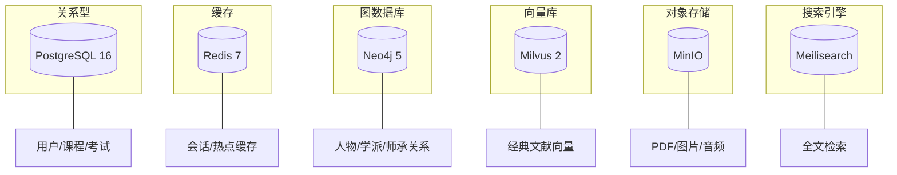

# 03 技术选型

## 1 选型原则

技术选型围绕三条原则展开：优先成熟稳定且有大规模生产验证的技术；优先生态完整、社区活跃的开源项目；优先团队可掌控、长期可维护的方案。中医发展史平台的内容生命周期长（知识库持续沉淀），技术栈的长期可维护性比短期开发速度更重要。

## 2 后端技术栈

### 2.1 语言与框架

| 组件 | 选型 | 选型理由 |
| ---- | ---- | -------- |
| 编程语言 | Go 1.22+ | 高并发、编译型、部署简单，适合微服务 |
| HTTP 框架 | Hertz | CloudWeGo 出品，高性能、非阻塞、中间件生态完善 |
| RPC 框架 | Kitex | CloudWeGo 出品，与 Hertz 同生态，Thrift/Protobuf 双协议 |
| 网络库 | Netpoll | CloudWeGo 底层网络库，epoll 驱动，Hertz/Kitex 默认依赖 |
| ORM | GORM v2 | Go 生态最成熟 ORM，支持 PostgreSQL 高级特性 |
| 配置管理 | Viper | 多源配置（文件/环境变量/配置中心），热更新 |
| 日志 | Zap | 结构化日志，零分配高性能 |
| 依赖注入 | Wire | 编译时依赖注入，无反射开销 |
| 验证 | go-tagexpr | Hertz 原生绑定的参数校验 |

选择 CloudWeGo 全套生态（Hertz + Kitex + Netpoll）而非 Gin + gRPC 的组合，主要因为同一生态内的框架在中间件、协议、网络层高度一致，降低跨框架适配成本，且字节跳动内部大规模验证过其性能与稳定性。

### 2.2 中间件

| 组件 | 选型 | 用途 |
| ---- | ---- | ---- |
| 消息队列 | Kafka | 领域事件异步传递，开发环境可用 Redis Stream 替代 |
| 限流熔断 | Sentinel | Go 版 Sentinel，令牌桶限流 + 熔断降级 |
| 分布式事务 | Outbox 模式 | 业务事务 + 事件投递的最终一致性 |
| 缓存 | Redis 7 | 会话、热点数据、限流计数器 |
| 任务调度 | Asynq | 基于 Redis 的异步任务队列，处理 Embedding 等长耗时任务 |

## 3 数据存储

### 3.1 存储矩阵

平台采用多模存储，按数据特征选择最合适的引擎：

### 3.2 选型说明

| 存储 | 选型 | 为什么不是其他 |
| ---- | ---- | -------------- |
| 关系型 | PostgreSQL 16 | 需要 JSONB（Prompt 配置）、全文检索（中文需 zhparser）、数组类型；MySQL 对复杂查询与 JSON 支持较弱 |
| 图数据库 | Neo4j 5 | 原生属性图模型，Cypher 查询表达力强，ACID 事务；JanusGraph 运维复杂度高 |
| 向量库 | Milvus 2 | 十亿级向量检索，多索引类型，云原生架构；Faiss 是库而非服务，无分布式能力 |
| 搜索 | Meilisearch | 毫秒级中文搜索，开箱即用；Elasticsearch 资源占用高，对中小规模偏重 |
| 对象存储 | MinIO | S3 兼容，自部署无厂商锁定；开发与生产环境一致 |
| 缓存 | Redis 7 | Streams 支持轻量消息队列，Functions 支持 Lua 扩展 |

### 3.3 数据归属

| 服务 | 主存储 | 缓存 | 辅助存储 |
| ---- | ------ | ---- | -------- |
| User Service | PostgreSQL | Redis | — |
| History Service | PostgreSQL | Redis | Meilisearch（全文检索） |
| Knowledge Service | Milvus | Redis | MinIO（原始文件） |
| Graph Service | Neo4j | Redis | — |
| AI Service | PostgreSQL | Redis | Milvus + Neo4j（只读查询） |
| Learning Service | PostgreSQL | Redis | — |

## 4 前端技术栈

### 4.1 PC 端

| 组件 | 选型 | 说明 |
| ---- | ---- | ---- |
| 框架 | Vue 3 | Composition API，TypeScript 优先 |
| UI 框架 | Vben Admin | 企业级中后台方案，内置权限、布局、主题 |
| 组件库 | Ant Design Vue | 与 Vben Admin 配套 |
| 状态管理 | Pinia | Vue 3 官方推荐 |
| 构建工具 | Vite | 快速 HMR，Rollup 打包 |
| 图谱可视化 | AntV G6 | 知识图谱节点关系渲染 |
| 时间轴 | 自研 Vue 组件 | 基于朝代的交互式时间轴 |
| HTTP | Axios | 请求拦截、统一错误处理 |

### 4.2 移动端

| 组件 | 选型 | 说明 |
| ---- | ---- | ---- |
| 框架 | Flutter 3 | 一套代码覆盖 iOS / Android |
| 状态管理 | Riverpod | 类型安全、可测试 |
| 路由 | go_router | 声明式路由 |
| 网络请求 | Dio | 拦截器、取消、FormData |
| 本地存储 | Isar | 高性能本地数据库，离线缓存课时 |

PC 端选 Vue3 + Vben Admin 而非 React，是因为 Vben Admin 在中后台管理场景的开箱即用程度高，且团队 Vue 技术栈可复用至 H5 活动页。移动端选 Flutter 而非 React Native，是因为 Flutter 在复杂动画（时间轴、图谱交互）上的渲染性能更稳定，且 Skia 自绘引擎保证双端一致性。

## 5 AI 技术栈

| 组件 | 选型 | 说明 |
| ---- | ---- | ---- |
| LLM 接入 | 多模型适配层 | 支持 OpenAI、Anthropic、通义千问、DeepSeek，可切换 |
| Embedding | bge-large-zh / text-embedding-3 | 中文文献向量化 |
| RAG 框架 | 自研 | Chunk + Embedding + Milvus 检索 + LLM 生成 |
| Agent 框架 | 自研 | Planner→Reasoner→Retriever→KG→Memory→Reflection→Answer |
| MCP 协议 | 自研 Tool Server | 标准 MCP Tool，供外部 AI 助手调用 |
| Prompt 管理 | Prompt Center | 模板化、版本化、A/B 测试 |

LLM 接入采用适配层而非绑定单一模型，原因是不同模型的中文古文理解能力与成本差异较大，适配层使平台可根据任务类型动态选择最优模型（如学术解释用强模型，日常问答用轻量模型）。

## 6 DevOps 工具链

| 环节 | 工具 |
| ---- | ---- |
| 代码托管 | GitHub |
| CI/CD | GitHub Actions |
| 容器 | Docker |
| 编排 | Kubernetes |
| 镜像仓库 | GitHub Container Registry |
| 配置管理 | K8s ConfigMap + Secret |
| 监控 | Prometheus + Grafana |
| 日志 | Loki |
| 链路追踪 | Tempo + Jaeger |
| 告警 | Grafana Alerting + 通知渠道 |

## 7 版本与依赖管理

| 维度 | 方案 |
| ---- | ---- |
| Go 模块 | Go Modules，`go 1.22` |
| Node 模块 | pnpm，Node 20 LTS |
| Flutter | Flutter 3.x，Dart 3.x |
| 版本锁定 | `go.sum` / `pnpm-lock.yaml` / `pubspec.lock` 入库 |
| 依赖扫描 | Dependabot 自动检测 Go/npm 依赖漏洞 |