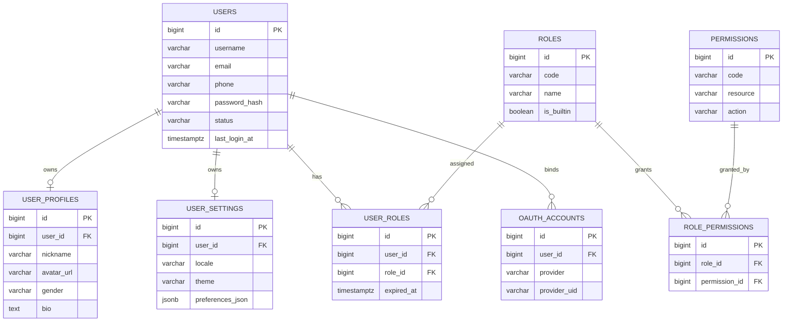
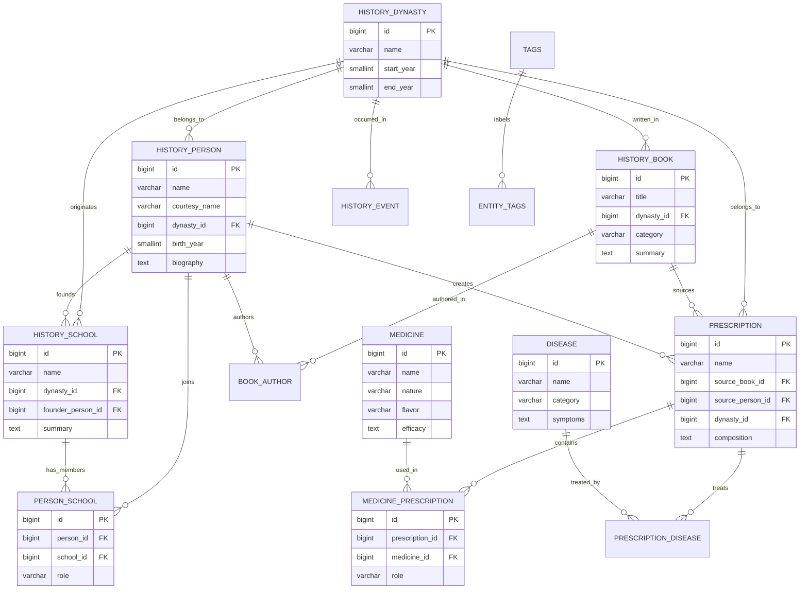
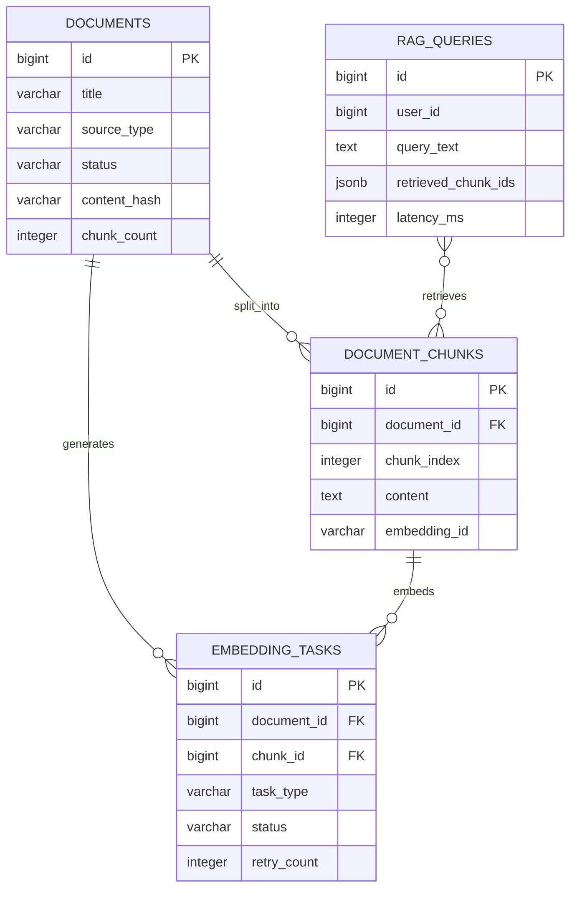
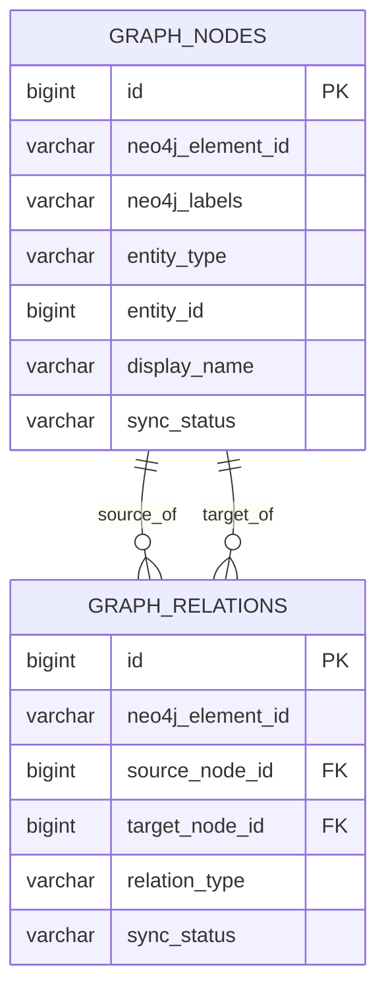
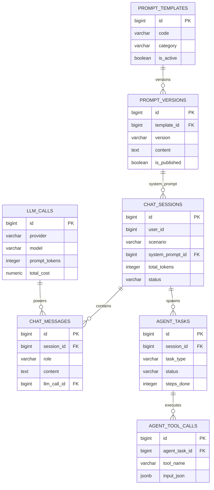
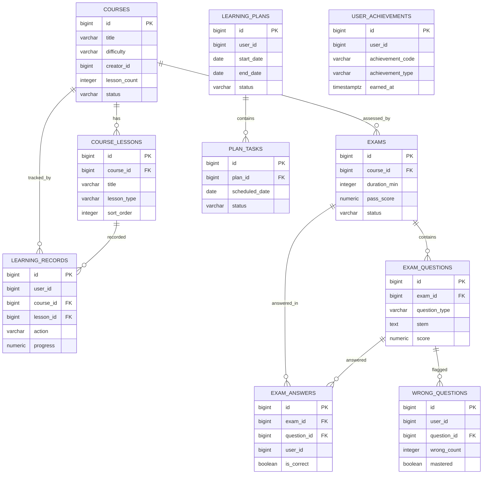

# 第四章 数据库设计

TCM-History-AI 平台采用「按微服务分库」的物理隔离策略，每个服务拥有独立的 PostgreSQL schema（开发期共享实例、生产期独立实例），跨服务数据访问通过 Kitex RPC 或 Kafka 领域事件完成，禁止跨库 JOIN。主数据存储于 PostgreSQL 16，热数据缓存于 Redis 7，知识图谱落盘 Neo4j 5，向量检索交由 Milvus 2，全文检索由 Meilisearch 承担，非结构化文件存入 MinIO。本章共定义 47 张关系表，按 7 个服务域组织，每张表给出字段、索引、外键三要素，并以 Mermaid erDiagram 描绘核心实体关系。

## 一、数据库设计原则

主键统一采用 `bigint` 类型，由应用层基于雪花算法（Snowflake）生成分布式 ID，规避数据库自增序列在分库分表后的冲突，同时保证趋势递增以利于 B-tree 聚簇写入。所有业务表强制包含 `created_at`、`updated_at`、`deleted_at` 三个 `timestamptz` 审计字段，`deleted_at` 为 NULL 表示记录存活，非 NULL 表示软删除，查询层通过 GORM 的默认 scope 自动过滤已删除记录。

命名一律采用 `snake_case`。实体表用复数形式（`users`、`history_person` 复数语义弱化保留业务名），关联表由两端实体名拼接（`user_roles`、`medicine_prescription`）。布尔字段以 `is_`/`has_` 前缀，JSONB 字段以 `_json` 后缀收尾，外键字段命名为 `<引用表单数>_id`。枚举值在应用层用常量映射，库内存短字符串（如 `status varchar(32)`）。

时间字段统一 `timestamptz` 带时区存储，货币与计量用 `numeric(12,2)`，主键与外键用 `bigint`，文本短字段 `varchar(255)`、长文本 `text`、结构化扩展数据用 `jsonb`。所有外键显式声明 `ON DELETE RESTRICT` 防止误删，仅关联表允许 `ON DELETE CASCADE`。每个服务库内通过 `CREATE SCHEMA` 划分命名空间，表名前不带 schema 前缀以保持可移植。

## 二、User Service 数据模型

User Service 负责身份认证、RBAC 权限与第三方登录，是全平台鉴权的唯一可信源。其数据库独立部署，仅通过 RPC 向外暴露用户与权限查询。

### users

| 字段名 | 类型 | 约束 | 说明 |
|---|---|---|---|
| id | bigint | PK | 雪花 ID |
| username | varchar(64) | NOT NULL, UNIQUE | 登录用户名 |
| email | varchar(255) | UNIQUE | 邮箱，可用于登录 |
| phone | varchar(20) | UNIQUE | 手机号，E.164 格式 |
| password_hash | varchar(255) | NOT NULL | bcrypt 哈希 |
| status | varchar(32) | NOT NULL DEFAULT 'active' | active/disabled/locked |
| last_login_at | timestamptz |  | 最近登录时间 |
| last_login_ip | varchar(45) |  | IPv4/IPv6 |
| created_at | timestamptz | NOT NULL DEFAULT now() | 创建时间 |
| updated_at | timestamptz | NOT NULL DEFAULT now() | 更新时间 |
| deleted_at | timestamptz |  | 软删除标记 |

- 索引：`uk_users_username`、`uk_users_email`、`uk_users_phone`、`idx_users_status_deleted_at(status, deleted_at)`
- 外键：无

### user_profiles

| 字段名 | 类型 | 约束 | 说明 |
|---|---|---|---|
| id | bigint | PK | 雪花 ID |
| user_id | bigint | NOT NULL, FK | 关联 users.id |
| nickname | varchar(64) |  | 昵称 |
| avatar_url | varchar(512) |  | 头像 MinIO 地址 |
| gender | varchar(16) |  | male/female/unknown |
| birth_date | date |  | 出生日期 |
| bio | text |  | 个人简介 |
| created_at | timestamptz | NOT NULL DEFAULT now() | 创建时间 |
| updated_at | timestamptz | NOT NULL DEFAULT now() | 更新时间 |

- 索引：`uk_user_profiles_user_id`、`idx_user_profiles_nickname`
- 外键：`user_id` REFERENCES `users(id) ON DELETE CASCADE`

### user_settings

| 字段名 | 类型 | 约束 | 说明 |
|---|---|---|---|
| id | bigint | PK | 雪花 ID |
| user_id | bigint | NOT NULL, FK | 关联 users.id |
| locale | varchar(16) | NOT NULL DEFAULT 'zh-CN' | 语言 |
| theme | varchar(16) | NOT NULL DEFAULT 'light' | light/dark |
| notify_email | boolean | NOT NULL DEFAULT true | 邮件通知 |
| notify_push | boolean | NOT NULL DEFAULT true | 推送通知 |
| preferences_json | jsonb | NOT NULL DEFAULT '{}' | 个性化偏好扩展 |
| created_at | timestamptz | NOT NULL DEFAULT now() | 创建时间 |
| updated_at | timestamptz | NOT NULL DEFAULT now() | 更新时间 |

- 索引：`uk_user_settings_user_id`
- 外键：`user_id` REFERENCES `users(id) ON DELETE CASCADE`

### roles

| 字段名 | 类型 | 约束 | 说明 |
|---|---|---|---|
| id | bigint | PK | 雪花 ID |
| code | varchar(64) | NOT NULL, UNIQUE | 角色编码 admin/teacher/student |
| name | varchar(64) | NOT NULL | 显示名 |
| description | varchar(255) |  | 描述 |
| is_builtin | boolean | NOT NULL DEFAULT false | 是否系统内置 |
| created_at | timestamptz | NOT NULL DEFAULT now() | 创建时间 |
| updated_at | timestamptz | NOT NULL DEFAULT now() | 更新时间 |

- 索引：`uk_roles_code`
- 外键：无

### permissions

| 字段名 | 类型 | 约束 | 说明 |
|---|---|---|---|
| id | bigint | PK | 雪花 ID |
| code | varchar(128) | NOT NULL, UNIQUE | 权限编码 history:person:read |
| name | varchar(64) | NOT NULL | 显示名 |
| resource | varchar(64) | NOT NULL | 资源类型 |
| action | varchar(32) | NOT NULL | read/write/delete |
| description | varchar(255) |  | 描述 |
| created_at | timestamptz | NOT NULL DEFAULT now() | 创建时间 |

- 索引：`uk_permissions_code`、`idx_permissions_resource_action(resource, action)`
- 外键：无

### role_permissions

| 字段名 | 类型 | 约束 | 说明 |
|---|---|---|---|
| id | bigint | PK | 雪花 ID |
| role_id | bigint | NOT NULL, FK | 关联 roles.id |
| permission_id | bigint | NOT NULL, FK | 关联 permissions.id |
| created_at | timestamptz | NOT NULL DEFAULT now() | 创建时间 |

- 索引：`uk_role_permissions_role_permission(role_id, permission_id)`
- 外键：`role_id` REFERENCES `roles(id) ON DELETE CASCADE`，`permission_id` REFERENCES `permissions(id) ON DELETE CASCADE`

### user_roles

| 字段名 | 类型 | 约束 | 说明 |
|---|---|---|---|
| id | bigint | PK | 雪花 ID |
| user_id | bigint | NOT NULL, FK | 关联 users.id |
| role_id | bigint | NOT NULL, FK | 关联 roles.id |
| granted_at | timestamptz | NOT NULL DEFAULT now() | 授权时间 |
| expired_at | timestamptz |  | 失效时间，NULL 永久 |
| created_at | timestamptz | NOT NULL DEFAULT now() | 创建时间 |

- 索引：`uk_user_roles_user_role(user_id, role_id)`、`idx_user_roles_expired_at`
- 外键：`user_id` REFERENCES `users(id) ON DELETE CASCADE`，`role_id` REFERENCES `roles(id) ON DELETE RESTRICT`

### oauth_accounts

| 字段名 | 类型 | 约束 | 说明 |
|---|---|---|---|
| id | bigint | PK | 雪花 ID |
| user_id | bigint | NOT NULL, FK | 关联 users.id |
| provider | varchar(32) | NOT NULL | wechat/github/google |
| provider_uid | varchar(128) | NOT NULL | 第三方唯一 ID |
| access_token | varchar(512) |  | 加密存储 |
| refresh_token | varchar(512) |  | 加密存储 |
| expired_at | timestamptz |  | token 过期时间 |
| created_at | timestamptz | NOT NULL DEFAULT now() | 创建时间 |
| updated_at | timestamptz | NOT NULL DEFAULT now() | 更新时间 |

- 索引：`uk_oauth_accounts_provider_uid(provider, provider_uid)`、`idx_oauth_accounts_user_id`
- 外键：`user_id` REFERENCES `users(id) ON DELETE CASCADE`

### User Service ER 图

## 三、History Service 数据模型

History Service 是平台知识底座，承载中医发展史的朝代、人物、学派、著作、事件以及方剂、药物、疾病等实体。该服务数据量大、关联密集，是 Graph Service 与 AI Service 的主要数据来源。

### history_dynasty

| 字段名 | 类型 | 约束 | 说明 |
|---|---|---|---|
| id | bigint | PK | 雪花 ID |
| name | varchar(64) | NOT NULL, UNIQUE | 朝代名 如「汉代」 |
| start_year | smallint |  | 起始年份（公元） |
| end_year | smallint |  | 结束年份 |
| sort_order | integer | NOT NULL DEFAULT 0 | 时间排序 |
| description | text |  | 简介 |
| created_at | timestamptz | NOT NULL DEFAULT now() | 创建时间 |
| updated_at | timestamptz | NOT NULL DEFAULT now() | 更新时间 |
| deleted_at | timestamptz |  | 软删除 |

- 索引：`uk_history_dynasty_name`、`idx_history_dynasty_sort_order`
- 外键：无

### history_school

| 字段名 | 类型 | 约束 | 说明 |
|---|---|---|---|
| id | bigint | PK | 雪花 ID |
| name | varchar(128) | NOT NULL | 学派名 如「伤寒学派」 |
| dynasty_id | bigint | FK | 起源朝代 |
| founder_person_id | bigint | FK | 创始人物 |
| summary | text |  | 学派概述 |
| established_year | smallint |  | 创立年份 |
| created_at | timestamptz | NOT NULL DEFAULT now() | 创建时间 |
| updated_at | timestamptz | NOT NULL DEFAULT now() | 更新时间 |
| deleted_at | timestamptz |  | 软删除 |

- 索引：`idx_history_school_name`、`idx_history_school_dynasty_id`
- 外键：`dynasty_id` REFERENCES `history_dynasty(id) ON DELETE RESTRICT`，`founder_person_id` REFERENCES `history_person(id) ON DELETE SET NULL`

### history_person

| 字段名 | 类型 | 约束 | 说明 |
|---|---|---|---|
| id | bigint | PK | 雪花 ID |
| name | varchar(64) | NOT NULL | 姓名 |
| courtesy_name | varchar(64) |  | 字 |
| alias_name | varchar(128) |  | 号/别名 |
| dynasty_id | bigint | FK | 所处朝代 |
| birth_year | smallint |  | 生年 |
| death_year | smallint |  | 卒年 |
| gender | varchar(16) |  | male/female/unknown |
| title | varchar(128) |  | 官职/称谓 |
| biography | text |  | 生平 |
| achievements | text |  | 主要成就 |
| portrait_url | varchar(512) |  | 画像 MinIO 地址 |
| created_at | timestamptz | NOT NULL DEFAULT now() | 创建时间 |
| updated_at | timestamptz | NOT NULL DEFAULT now() | 更新时间 |
| deleted_at | timestamptz |  | 软删除 |

- 索引：`idx_history_person_name`、`idx_history_person_dynasty_id`、`idx_history_person_name_dynasty(name, dynasty_id)`
- 外键：`dynasty_id` REFERENCES `history_dynasty(id) ON DELETE RESTRICT`

### history_book

| 字段名 | 类型 | 约束 | 说明 |
|---|---|---|---|
| id | bigint | PK | 雪花 ID |
| title | varchar(255) | NOT NULL | 书名 如「伤寒杂病论」 |
| dynasty_id | bigint | FK | 成书朝代 |
| published_year | smallint |  | 成书年份 |
| category | varchar(64) |  | 经典/方书/本草/医案 |
| summary | text |  | 内容概要 |
| volume_count | integer |  | 卷数 |
| is_extant | boolean | NOT NULL DEFAULT true | 是否存世 |
| file_url | varchar(512) |  | 原文 PDF MinIO 地址 |
| created_at | timestamptz | NOT NULL DEFAULT now() | 创建时间 |
| updated_at | timestamptz | NOT NULL DEFAULT now() | 更新时间 |
| deleted_at | timestamptz |  | 软删除 |

- 索引：`idx_history_book_title`、`idx_history_book_dynasty_id`、`idx_history_book_category`
- 外键：`dynasty_id` REFERENCES `history_dynasty(id) ON DELETE RESTRICT`

### history_event

| 字段名 | 类型 | 约束 | 说明 |
|---|---|---|---|
| id | bigint | PK | 雪花 ID |
| title | varchar(255) | NOT NULL | 事件名 |
| dynasty_id | bigint | FK | 所属朝代 |
| occurred_year | smallint |  | 发生年份 |
| event_type | varchar(32) | NOT NULL | 出版/战乱/学术/制度 |
| description | text |  | 事件描述 |
| impact | text |  | 影响 |
| location | varchar(128) |  | 发生地 |
| created_at | timestamptz | NOT NULL DEFAULT now() | 创建时间 |
| updated_at | timestamptz | NOT NULL DEFAULT now() | 更新时间 |
| deleted_at | timestamptz |  | 软删除 |

- 索引：`idx_history_event_dynasty_id`、`idx_history_event_occurred_year`、`idx_history_event_type(event_type)`
- 外键：`dynasty_id` REFERENCES `history_dynasty(id) ON DELETE RESTRICT`

### prescription

| 字段名 | 类型 | 约束 | 说明 |
|---|---|---|---|
| id | bigint | PK | 雪花 ID |
| name | varchar(128) | NOT NULL | 方剂名 如「麻黄汤」 |
| pinyin | varchar(128) |  | 拼音 |
| source_book_id | bigint | FK | 出处著作 |
| source_person_id | bigint | FK | 创制者 |
| dynasty_id | bigint | FK | 所属朝代 |
| composition | text |  | 组成描述 |
| usage | text |  | 用法 |
| indications | text |  | 主治 |
| category | varchar(64) |  | 解表/泻下/和解 |
| created_at | timestamptz | NOT NULL DEFAULT now() | 创建时间 |
| updated_at | timestamptz | NOT NULL DEFAULT now() | 更新时间 |
| deleted_at | timestamptz |  | 软删除 |

- 索引：`idx_prescription_name`、`idx_prescription_pinyin`、`idx_prescription_source_book_id`、`idx_prescription_category`
- 外键：`source_book_id` REFERENCES `history_book(id) ON DELETE SET NULL`，`source_person_id` REFERENCES `history_person(id) ON DELETE SET NULL`，`dynasty_id` REFERENCES `history_dynasty(id) ON DELETE RESTRICT`

### medicine

| 字段名 | 类型 | 约束 | 说明 |
|---|---|---|---|
| id | bigint | PK | 雪花 ID |
| name | varchar(64) | NOT NULL | 药名 如「麻黄」 |
| pinyin | varchar(128) |  | 拼音 |
| alias_json | jsonb | NOT NULL DEFAULT '[]' | 别名数组 |
| nature | varchar(32) |  | 四气 寒热温凉 |
| flavor | varchar(64) |  | 五味 |
| meridian | varchar(128) |  | 归经 |
| efficacy | text |  | 功效 |
| dosage | varchar(128) |  | 用量 |
| toxicity | varchar(32) |  | 毒性等级 |
| created_at | timestamptz | NOT NULL DEFAULT now() | 创建时间 |
| updated_at | timestamptz | NOT NULL DEFAULT now() | 更新时间 |
| deleted_at | timestamptz |  | 软删除 |

- 索引：`uk_medicine_name`、`idx_medicine_pinyin`、`idx_medicine_nature`、`GIN idx_medicine_alias_json(alias_json)`
- 外键：无

### disease

| 字段名 | 类型 | 约束 | 说明 |
|---|---|---|---|
| id | bigint | PK | 雪花 ID |
| name | varchar(128) | NOT NULL | 疾病名 |
| pinyin | varchar(128) |  | 拼音 |
| category | varchar(64) |  | 外感/内伤/杂病 |
| description | text |  | 病症描述 |
| symptoms | text |  | 主要症状 |
| tcm_pathogenesis | text |  | 中医病机 |
| created_at | timestamptz | NOT NULL DEFAULT now() | 创建时间 |
| updated_at | timestamptz | NOT NULL DEFAULT now() | 更新时间 |
| deleted_at | timestamptz |  | 软删除 |

- 索引：`uk_disease_name`、`idx_disease_category`、`idx_disease_pinyin`
- 外键：无

### person_school

| 字段名 | 类型 | 约束 | 说明 |
|---|---|---|---|
| id | bigint | PK | 雪花 ID |
| person_id | bigint | NOT NULL, FK | 关联 history_person.id |
| school_id | bigint | NOT NULL, FK | 关联 history_school.id |
| role | varchar(32) | NOT NULL | founder/member/disciple |
| joined_year | smallint |  | 加入年份 |
| created_at | timestamptz | NOT NULL DEFAULT now() | 创建时间 |

- 索引：`uk_person_school(person_id, school_id)`、`idx_person_school_school_id`
- 外键：`person_id` REFERENCES `history_person(id) ON DELETE CASCADE`，`school_id` REFERENCES `history_school(id) ON DELETE CASCADE`

### book_author

| 字段名 | 类型 | 约束 | 说明 |
|---|---|---|---|
| id | bigint | PK | 雪花 ID |
| book_id | bigint | NOT NULL, FK | 关联 history_book.id |
| person_id | bigint | NOT NULL, FK | 关联 history_person.id |
| author_type | varchar(32) | NOT NULL | author/editor/annotator |
| sort_order | integer | NOT NULL DEFAULT 0 | 作者顺序 |
| created_at | timestamptz | NOT NULL DEFAULT now() | 创建时间 |

- 索引：`uk_book_author(book_id, person_id)`、`idx_book_author_person_id`
- 外键：`book_id` REFERENCES `history_book(id) ON DELETE CASCADE`，`person_id` REFERENCES `history_person(id) ON DELETE CASCADE`

### medicine_prescription

| 字段名 | 类型 | 约束 | 说明 |
|---|---|---|---|
| id | bigint | PK | 雪花 ID |
| prescription_id | bigint | NOT NULL, FK | 关联 prescription.id |
| medicine_id | bigint | NOT NULL, FK | 关联 medicine.id |
| role | varchar(32) | NOT NULL | 君/臣/佐/使 |
| dosage | varchar(64) |  | 该药用量 |
| sort_order | integer | NOT NULL DEFAULT 0 | 组方顺序 |
| created_at | timestamptz | NOT NULL DEFAULT now() | 创建时间 |

- 索引：`uk_medicine_prescription(prescription_id, medicine_id)`、`idx_medicine_prescription_medicine_id`
- 外键：`prescription_id` REFERENCES `prescription(id) ON DELETE CASCADE`，`medicine_id` REFERENCES `medicine(id) ON DELETE CASCADE`

### prescription_disease

| 字段名 | 类型 | 约束 | 说明 |
|---|---|---|---|
| id | bigint | PK | 雪花 ID |
| prescription_id | bigint | NOT NULL, FK | 关联 prescription.id |
| disease_id | bigint | NOT NULL, FK | 关联 disease.id |
| efficacy_note | varchar(255) |  | 疗效说明 |
| is_primary | boolean | NOT NULL DEFAULT false | 是否主治 |
| created_at | timestamptz | NOT NULL DEFAULT now() | 创建时间 |

- 索引：`uk_prescription_disease(prescription_id, disease_id)`、`idx_prescription_disease_disease_id`
- 外键：`prescription_id` REFERENCES `prescription(id) ON DELETE CASCADE`，`disease_id` REFERENCES `disease(id) ON DELETE CASCADE`

### tags

| 字段名 | 类型 | 约束 | 说明 |
|---|---|---|---|
| id | bigint | PK | 雪花 ID |
| name | varchar(64) | NOT NULL, UNIQUE | 标签名 |
| slug | varchar(64) | NOT NULL, UNIQUE | 拼音/英文标识 |
| category | varchar(32) |  | 标签分类 |
| usage_count | integer | NOT NULL DEFAULT 0 | 引用次数 |
| created_at | timestamptz | NOT NULL DEFAULT now() | 创建时间 |
| updated_at | timestamptz | NOT NULL DEFAULT now() | 更新时间 |

- 索引：`uk_tags_name`、`uk_tags_slug`、`idx_tags_category`
- 外键：无

### entity_tags

| 字段名 | 类型 | 约束 | 说明 |
|---|---|---|---|
| id | bigint | PK | 雪花 ID |
| tag_id | bigint | NOT NULL, FK | 关联 tags.id |
| entity_type | varchar(32) | NOT NULL | person/book/prescription |
| entity_id | bigint | NOT NULL | 多态实体 ID |
| created_at | timestamptz | NOT NULL DEFAULT now() | 创建时间 |

- 索引：`uk_entity_tags(tag_id, entity_type, entity_id)`、`idx_entity_tags_entity(entity_type, entity_id)`
- 外键：`tag_id` REFERENCES `tags(id) ON DELETE CASCADE`

### History Service ER 图

## 四、Knowledge Service 数据模型

Knowledge Service 负责文档接入、分块、向量化与 RAG 检索。原始文档与切片存于 PostgreSQL，向量同步至 Milvus，检索日志用于复盘召回质量。

### documents

| 字段名 | 类型 | 约束 | 说明 |
|---|---|---|---|
| id | bigint | PK | 雪花 ID |
| title | varchar(255) | NOT NULL | 文档标题 |
| source_type | varchar(32) | NOT NULL | book/upload/api |
| source_ref | varchar(255) |  | 来源标识 如 book_id |
| file_url | varchar(512) |  | MinIO 原文地址 |
| mime_type | varchar(64) |  | 文件类型 |
| content_hash | varchar(64) |  | 内容 SHA256 去重 |
| status | varchar(32) | NOT NULL DEFAULT 'pending' | pending/chunked/embedded/failed |
| chunk_count | integer | NOT NULL DEFAULT 0 | 切片数 |
| metadata_json | jsonb | NOT NULL DEFAULT '{}' | 扩展元数据 |
| created_at | timestamptz | NOT NULL DEFAULT now() | 创建时间 |
| updated_at | timestamptz | NOT NULL DEFAULT now() | 更新时间 |
| deleted_at | timestamptz |  | 软删除 |

- 索引：`uk_documents_content_hash`、`idx_documents_status`、`idx_documents_source(source_type, source_ref)`
- 外键：无

### document_chunks

| 字段名 | 类型 | 约束 | 说明 |
|---|---|---|---|
| id | bigint | PK | 雪花 ID |
| document_id | bigint | NOT NULL, FK | 关联 documents.id |
| chunk_index | integer | NOT NULL | 切片序号 |
| content | text | NOT NULL | 切片文本 |
| token_count | integer |  | token 数 |
| embedding_id | varchar(128) |  | Milvus 向量 ID |
| embedding_model | varchar(64) |  | 向量模型名 |
| metadata_json | jsonb | NOT NULL DEFAULT '{}' | 段落/页码定位 |
| created_at | timestamptz | NOT NULL DEFAULT now() | 创建时间 |

- 索引：`uk_document_chunks_doc_index(document_id, chunk_index)`、`idx_document_chunks_embedding_id`
- 外键：`document_id` REFERENCES `documents(id) ON DELETE CASCADE`

### embedding_tasks

| 字段名 | 类型 | 约束 | 说明 |
|---|---|---|---|
| id | bigint | PK | 雪花 ID |
| document_id | bigint | FK | 关联 documents.id |
| chunk_id | bigint | FK | 关联 document_chunks.id |
| task_type | varchar(32) | NOT NULL | document/chunk/retry |
| status | varchar(32) | NOT NULL DEFAULT 'queued' | queued/running/done/failed |
| model | varchar(64) |  | 嵌入模型 |
| error_message | text |  | 失败原因 |
| retry_count | integer | NOT NULL DEFAULT 0 | 重试次数 |
| started_at | timestamptz |  | 开始时间 |
| finished_at | timestamptz |  | 完成时间 |
| created_at | timestamptz | NOT NULL DEFAULT now() | 创建时间 |
| updated_at | timestamptz | NOT NULL DEFAULT now() | 更新时间 |

- 索引：`idx_embedding_tasks_status`、`idx_embedding_tasks_document_id`、`idx_embedding_tasks_status_created(status, created_at)`
- 外键：`document_id` REFERENCES `documents(id) ON DELETE CASCADE`，`chunk_id` REFERENCES `document_chunks(id) ON DELETE CASCADE`

### rag_queries

| 字段名 | 类型 | 约束 | 说明 |
|---|---|---|---|
| id | bigint | PK | 雪花 ID |
| session_id | varchar(64) |  | 会话标识 |
| user_id | bigint |  | 发起用户 |
| query_text | text | NOT NULL | 查询原文 |
| query_embedding | jsonb |  | 查询向量（调试用） |
| top_k | integer | NOT NULL DEFAULT 5 | 召回数量 |
| retrieved_chunk_ids | jsonb | NOT NULL DEFAULT '[]' | 命中切片 ID |
| latency_ms | integer |  | 检索耗时 |
| feedback | varchar(16) |  | good/bad |
| created_at | timestamptz | NOT NULL DEFAULT now() | 创建时间 |

- 索引：`idx_rag_queries_user_id`、`idx_rag_queries_created_at`、`idx_rag_queries_session_id`
- 外键：无（user_id 为跨服务软引用）

### Knowledge Service ER 图

## 五、Graph Service 数据模型

Graph Service 以 Neo4j 为图存储主库，承载人物-学派-著作-方剂-药物-疾病的复杂关系网络。PostgreSQL 仅保存图元数据镜像，用于后台管理、版本审计与批量导入编排，真正的图查询经 Cypher 直接访问 Neo4j。

### graph_nodes

| 字段名 | 类型 | 约束 | 说明 |
|---|---|---|---|
| id | bigint | PK | 雪花 ID |
| neo4j_element_id | varchar(128) | UNIQUE | Neo4j 内部 elementId |
| neo4j_labels | varchar(255) | NOT NULL | 节点标签逗号分隔 |
| entity_type | varchar(32) | NOT NULL | person/book/prescription |
| entity_id | bigint | NOT NULL | 源实体 ID |
| display_name | varchar(255) | NOT NULL | 节点显示名 |
| properties_json | jsonb | NOT NULL DEFAULT '{}' | 节点属性快照 |
| sync_status | varchar(32) | NOT NULL DEFAULT 'synced' | synced/pending/failed |
| last_synced_at | timestamptz |  | 最近同步时间 |
| created_at | timestamptz | NOT NULL DEFAULT now() | 创建时间 |
| updated_at | timestamptz | NOT NULL DEFAULT now() | 更新时间 |

- 索引：`uk_graph_nodes_neo4j_element_id`、`uk_graph_nodes_entity(entity_type, entity_id)`、`idx_graph_nodes_sync_status`
- 外键：无

### graph_relations

| 字段名 | 类型 | 约束 | 说明 |
|---|---|---|---|
| id | bigint | PK | 雪花 ID |
| neo4j_element_id | varchar(128) | UNIQUE | Neo4j 关系 elementId |
| source_node_id | bigint | NOT NULL, FK | 起点节点 |
| target_node_id | bigint | NOT NULL, FK | 终点节点 |
| relation_type | varchar(64) | NOT NULL | AUTHORED/BELONGS_TO/TREATS |
| properties_json | jsonb | NOT NULL DEFAULT '{}' | 关系属性 |
| sync_status | varchar(32) | NOT NULL DEFAULT 'synced' | synced/pending/failed |
| last_synced_at | timestamptz |  | 最近同步时间 |
| created_at | timestamptz | NOT NULL DEFAULT now() | 创建时间 |
| updated_at | timestamptz | NOT NULL DEFAULT now() | 更新时间 |

- 索引：`uk_graph_relations_neo4j_element_id`、`idx_graph_relations_source`、`idx_graph_relations_target`、`idx_graph_relations_type(relation_type)`
- 外键：`source_node_id` REFERENCES `graph_nodes(id) ON DELETE CASCADE`，`target_node_id` REFERENCES `graph_nodes(id) ON DELETE CASCADE`

### Graph Service ER 图

## 六、AI Service 数据模型

AI Service 管理对话会话、Agent 任务编排、Prompt 版本与 LLM 调用审计。所有大模型交互均落库，便于成本核算与质量回溯。

### chat_sessions

| 字段名 | 类型 | 约束 | 说明 |
|---|---|---|---|
| id | bigint | PK | 雪花 ID |
| user_id | bigint | NOT NULL | 用户 ID（跨服务引用） |
| title | varchar(255) |  | 会话标题 |
| scenario | varchar(32) | NOT NULL | qa/tutor/case_analysis |
| model | varchar(64) |  | 默认模型 |
| system_prompt_id | bigint | FK | 系统提示词版本 |
| message_count | integer | NOT NULL DEFAULT 0 | 消息数 |
| total_tokens | integer | NOT NULL DEFAULT 0 | 累计 token |
| status | varchar(32) | NOT NULL DEFAULT 'active' | active/archived |
| created_at | timestamptz | NOT NULL DEFAULT now() | 创建时间 |
| updated_at | timestamptz | NOT NULL DEFAULT now() | 更新时间 |
| deleted_at | timestamptz |  | 软删除 |

- 索引：`idx_chat_sessions_user_id`、`idx_chat_sessions_status_created(user_id, status, created_at)`
- 外键：`system_prompt_id` REFERENCES `prompt_versions(id) ON DELETE SET NULL`

### chat_messages

| 字段名 | 类型 | 约束 | 说明 |
|---|---|---|---|
| id | bigint | PK | 雪花 ID |
| session_id | bigint | NOT NULL, FK | 关联 chat_sessions.id |
| role | varchar(16) | NOT NULL | user/assistant/system |
| content | text | NOT NULL | 消息内容 |
| prompt_tokens | integer |  | 输入 token |
| completion_tokens | integer |  | 输出 token |
| model | varchar(64) |  | 实际调用模型 |
| retrieval_context_json | jsonb |  | RAG 上下文切片 |
| llm_call_id | bigint | FK | 关联 llm_calls.id |
| created_at | timestamptz | NOT NULL DEFAULT now() | 创建时间 |

- 索引：`idx_chat_messages_session_id`、`idx_chat_messages_session_created(session_id, created_at)`
- 外键：`session_id` REFERENCES `chat_sessions(id) ON DELETE CASCADE`，`llm_call_id` REFERENCES `llm_calls(id) ON DELETE SET NULL`

### agent_tasks

| 字段名 | 类型 | 约束 | 说明 |
|---|---|---|---|
| id | bigint | PK | 雪花 ID |
| session_id | bigint | FK | 关联 chat_sessions.id |
| user_id | bigint | NOT NULL | 发起用户 |
| task_type | varchar(32) | NOT NULL | research/summarize/translate |
| input_json | jsonb | NOT NULL | 任务输入 |
| output_json | jsonb |  | 任务输出 |
| status | varchar(32) | NOT NULL DEFAULT 'pending' | pending/running/done/failed |
| steps_total | integer | NOT NULL DEFAULT 0 | 计划步数 |
| steps_done | integer | NOT NULL DEFAULT 0 | 已完成步数 |
| error_message | text |  | 失败原因 |
| started_at | timestamptz |  | 开始时间 |
| finished_at | timestamptz |  | 完成时间 |
| created_at | timestamptz | NOT NULL DEFAULT now() | 创建时间 |
| updated_at | timestamptz | NOT NULL DEFAULT now() | 更新时间 |

- 索引：`idx_agent_tasks_user_id`、`idx_agent_tasks_status`、`idx_agent_tasks_session_id`
- 外键：`session_id` REFERENCES `chat_sessions(id) ON DELETE SET NULL`

### agent_tool_calls

| 字段名 | 类型 | 约束 | 说明 |
|---|---|---|---|
| id | bigint | PK | 雪花 ID |
| agent_task_id | bigint | NOT NULL, FK | 关联 agent_tasks.id |
| step_index | integer | NOT NULL | 执行步骤序号 |
| tool_name | varchar(64) | NOT NULL | 工具名 search_kg/query_db |
| input_json | jsonb | NOT NULL | 工具入参 |
| output_json | jsonb |  | 工具返回 |
| duration_ms | integer |  | 耗时 |
| status | varchar(32) | NOT NULL DEFAULT 'success' | success/error |
| error_message | text |  | 错误信息 |
| created_at | timestamptz | NOT NULL DEFAULT now() | 创建时间 |

- 索引：`idx_agent_tool_calls_task_id`、`idx_agent_tool_calls_task_step(agent_task_id, step_index)`
- 外键：`agent_task_id` REFERENCES `agent_tasks(id) ON DELETE CASCADE`

### prompt_templates

| 字段名 | 类型 | 约束 | 说明 |
|---|---|---|---|
| id | bigint | PK | 雪花 ID |
| code | varchar(64) | NOT NULL, UNIQUE | 模板编码 |
| name | varchar(128) | NOT NULL | 模板名 |
| category | varchar(32) |  | 分类 qa/tutor/summary |
| description | varchar(255) |  | 描述 |
| variables_json | jsonb | NOT NULL DEFAULT '[]' | 变量定义 |
| is_active | boolean | NOT NULL DEFAULT true | 是否启用 |
| created_at | timestamptz | NOT NULL DEFAULT now() | 创建时间 |
| updated_at | timestamptz | NOT NULL DEFAULT now() | 更新时间 |
| deleted_at | timestamptz |  | 软删除 |

- 索引：`uk_prompt_templates_code`、`idx_prompt_templates_category`
- 外键：无

### prompt_versions

| 字段名 | 类型 | 约束 | 说明 |
|---|---|---|---|
| id | bigint | PK | 雪花 ID |
| template_id | bigint | NOT NULL, FK | 关联 prompt_templates.id |
| version | varchar(16) | NOT NULL | 版本号 1.0.0 |
| content | text | NOT NULL | 提示词正文 |
| change_log | varchar(255) |  | 变更说明 |
| is_published | boolean | NOT NULL DEFAULT false | 是否发布 |
| created_by | bigint |  | 创建人 |
| created_at | timestamptz | NOT NULL DEFAULT now() | 创建时间 |

- 索引：`uk_prompt_versions_template_version(template_id, version)`、`idx_prompt_versions_published`
- 外键：`template_id` REFERENCES `prompt_templates(id) ON DELETE CASCADE`

### llm_calls

| 字段名 | 类型 | 约束 | 说明 |
|---|---|---|---|
| id | bigint | PK | 雪花 ID |
| provider | varchar(32) | NOT NULL | openai/doubao/qwen |
| model | varchar(64) | NOT NULL | 模型名 |
| request_json | jsonb | NOT NULL | 请求体 |
| response_json | jsonb |  | 响应体 |
| prompt_tokens | integer |  | 输入 token |
| completion_tokens | integer |  | 输出 token |
| total_cost | numeric(12,6) |  | 调用成本（元） |
| latency_ms | integer |  | 耗时 |
| status | varchar(32) | NOT NULL DEFAULT 'success' | success/error/timeout |
| error_message | text |  | 错误信息 |
| created_at | timestamptz | NOT NULL DEFAULT now() | 创建时间 |

- 索引：`idx_llm_calls_model_created(model, created_at)`、`idx_llm_calls_status`、`idx_llm_calls_created_at`
- 外键：无

### AI Service ER 图

## 七、Learning Service 数据模型

Learning Service 承载课程、学习记录、学习计划、考试与成就体系，是面向学生与教师的核心业务域。

### courses

| 字段名 | 类型 | 约束 | 说明 |
|---|---|---|---|
| id | bigint | PK | 雪花 ID |
| title | varchar(255) | NOT NULL | 课程名 |
| subtitle | varchar(255) |  | 副标题 |
| cover_url | varchar(512) |  | 封面图 |
| description | text |  | 课程介绍 |
| difficulty | varchar(16) | NOT NULL DEFAULT 'beginner' | beginner/intermediate/advanced |
| category | varchar(64) |  | 分类 |
| creator_id | bigint | NOT NULL | 创建教师 |
| lesson_count | integer | NOT NULL DEFAULT 0 | 课时数 |
| enroll_count | integer | NOT NULL DEFAULT 0 | 报名数 |
| status | varchar(32) | NOT NULL DEFAULT 'draft' | draft/published/archived |
| created_at | timestamptz | NOT NULL DEFAULT now() | 创建时间 |
| updated_at | timestamptz | NOT NULL DEFAULT now() | 更新时间 |
| deleted_at | timestamptz |  | 软删除 |

- 索引：`idx_courses_status`、`idx_courses_category`、`idx_courses_creator_id`
- 外键：无（creator_id 跨服务引用 User Service）

### course_lessons

| 字段名 | 类型 | 约束 | 说明 |
|---|---|---|---|
| id | bigint | PK | 雪花 ID |
| course_id | bigint | NOT NULL, FK | 关联 courses.id |
| title | varchar(255) | NOT NULL | 课时标题 |
| content | text |  | 图文内容 |
| video_url | varchar(512) |  | 视频 MinIO 地址 |
| duration_sec | integer |  | 视频时长（秒） |
| sort_order | integer | NOT NULL DEFAULT 0 | 课时顺序 |
| lesson_type | varchar(32) | NOT NULL DEFAULT 'video' | video/article/quiz |
| created_at | timestamptz | NOT NULL DEFAULT now() | 创建时间 |
| updated_at | timestamptz | NOT NULL DEFAULT now() | 更新时间 |

- 索引：`uk_course_lessons_course_sort(course_id, sort_order)`、`idx_course_lessons_course_id`
- 外键：`course_id` REFERENCES `courses(id) ON DELETE CASCADE`

### learning_records

| 字段名 | 类型 | 约束 | 说明 |
|---|---|---|---|
| id | bigint | PK | 雪花 ID |
| user_id | bigint | NOT NULL | 学习用户 |
| course_id | bigint | NOT NULL, FK | 关联 courses.id |
| lesson_id | bigint | FK | 关联 course_lessons.id |
| action | varchar(32) | NOT NULL | enroll/start/complete/view |
| progress | numeric(5,2) | NOT NULL DEFAULT 0 | 完成度百分比 |
| duration_sec | integer |  | 学习时长（秒） |
| metadata_json | jsonb | NOT NULL DEFAULT '{}' | 扩展数据 |
| created_at | timestamptz | NOT NULL DEFAULT now() | 创建时间 |

- 索引：`idx_learning_records_user_course(user_id, course_id)`、`idx_learning_records_user_created(user_id, created_at)`、`idx_learning_records_lesson_id`
- 外键：`course_id` REFERENCES `courses(id) ON DELETE CASCADE`，`lesson_id` REFERENCES `course_lessons(id) ON DELETE SET NULL`

### learning_plans

| 字段名 | 类型 | 约束 | 说明 |
|---|---|---|---|
| id | bigint | PK | 雪花 ID |
| user_id | bigint | NOT NULL | 计划归属用户 |
| title | varchar(255) | NOT NULL | 计划名 |
| goal | text |  | 学习目标 |
| start_date | date | NOT NULL | 起始日期 |
| end_date | date | NOT NULL | 截止日期 |
| status | varchar(32) | NOT NULL DEFAULT 'active' | active/completed/abandoned |
| created_at | timestamptz | NOT NULL DEFAULT now() | 创建时间 |
| updated_at | timestamptz | NOT NULL DEFAULT now() | 更新时间 |
| deleted_at | timestamptz |  | 软删除 |

- 索引：`idx_learning_plans_user_id`、`idx_learning_plans_status_end(status, end_date)`
- 外键：无

### plan_tasks

| 字段名 | 类型 | 约束 | 说明 |
|---|---|---|---|
| id | bigint | PK | 雪花 ID |
| plan_id | bigint | NOT NULL, FK | 关联 learning_plans.id |
| course_id | bigint | FK | 关联课程 |
| lesson_id | bigint | FK | 关联课时 |
| title | varchar(255) | NOT NULL | 任务标题 |
| scheduled_date | date |  | 计划完成日期 |
| completed_at | timestamptz |  | 实际完成时间 |
| status | varchar(32) | NOT NULL DEFAULT 'pending' | pending/done/skipped |
| sort_order | integer | NOT NULL DEFAULT 0 | 顺序 |
| created_at | timestamptz | NOT NULL DEFAULT now() | 创建时间 |

- 索引：`idx_plan_tasks_plan_id`、`idx_plan_tasks_scheduled_date`、`idx_plan_tasks_status(status, scheduled_date)`
- 外键：`plan_id` REFERENCES `learning_plans(id) ON DELETE CASCADE`

### exams

| 字段名 | 类型 | 约束 | 说明 |
|---|---|---|---|
| id | bigint | PK | 雪花 ID |
| title | varchar(255) | NOT NULL | 考试名 |
| course_id | bigint | FK | 关联 courses.id |
| description | text |  | 说明 |
| duration_min | integer | NOT NULL | 时长（分钟） |
| pass_score | numeric(5,2) | NOT NULL | 及格分 |
| total_score | numeric(5,2) | NOT NULL | 总分 |
| question_count | integer | NOT NULL DEFAULT 0 | 题目数 |
| attempt_limit | integer | NOT NULL DEFAULT 1 | 最大尝试次数 |
| start_at | timestamptz |  | 开放开始 |
| end_at | timestamptz |  | 开放结束 |
| status | varchar(32) | NOT NULL DEFAULT 'draft' | draft/published/closed |
| created_at | timestamptz | NOT NULL DEFAULT now() | 创建时间 |
| updated_at | timestamptz | NOT NULL DEFAULT now() | 更新时间 |
| deleted_at | timestamptz |  | 软删除 |

- 索引：`idx_exams_course_id`、`idx_exams_status`、`idx_exams_window(start_at, end_at)`
- 外键：`course_id` REFERENCES `courses(id) ON DELETE SET NULL`

### exam_questions

| 字段名 | 类型 | 约束 | 说明 |
|---|---|---|---|
| id | bigint | PK | 雪花 ID |
| exam_id | bigint | NOT NULL, FK | 关联 exams.id |
| question_type | varchar(32) | NOT NULL | single/multiple/truefalse/essay |
| stem | text | NOT NULL | 题干 |
| options_json | jsonb |  | 选项数组 |
| answer_json | jsonb | NOT NULL | 正确答案 |
| explanation | text |  | 解析 |
| score | numeric(5,2) | NOT NULL | 分值 |
| difficulty | varchar(16) | NOT NULL DEFAULT 'easy' | easy/medium/hard |
| sort_order | integer | NOT NULL DEFAULT 0 | 题目顺序 |
| created_at | timestamptz | NOT NULL DEFAULT now() | 创建时间 |

- 索引：`idx_exam_questions_exam_id`、`idx_exam_questions_exam_sort(exam_id, sort_order)`、`idx_exam_questions_difficulty(difficulty)`
- 外键：`exam_id` REFERENCES `exams(id) ON DELETE CASCADE`

### exam_answers

| 字段名 | 类型 | 约束 | 说明 |
|---|---|---|---|
| id | bigint | PK | 雪花 ID |
| exam_id | bigint | NOT NULL, FK | 关联 exams.id |
| question_id | bigint | NOT NULL, FK | 关联 exam_questions.id |
| user_id | bigint | NOT NULL | 答题用户 |
| attempt_no | integer | NOT NULL DEFAULT 1 | 第几次尝试 |
| answer_json | jsonb | NOT NULL | 用户答案 |
| is_correct | boolean |  | 是否正确 |
| score | numeric(5,2) |  | 得分 |
| answered_at | timestamptz | NOT NULL DEFAULT now() | 答题时间 |
| created_at | timestamptz | NOT NULL DEFAULT now() | 创建时间 |

- 索引：`idx_exam_answers_user_exam(user_id, exam_id)`、`idx_exam_answers_question_id`、`idx_exam_answers_user_attempt(user_id, exam_id, attempt_no)`
- 外键：`exam_id` REFERENCES `exams(id) ON DELETE CASCADE`，`question_id` REFERENCES `exam_questions(id) ON DELETE CASCADE`

### wrong_questions

| 字段名 | 类型 | 约束 | 说明 |
|---|---|---|---|
| id | bigint | PK | 雪花 ID |
| user_id | bigint | NOT NULL | 归属用户 |
| question_id | bigint | NOT NULL, FK | 关联 exam_questions.id |
| exam_id | bigint | FK | 关联 exams.id |
| wrong_answer_json | jsonb | NOT NULL | 错误答案 |
| correct_answer_json | jsonb |  | 正确答案 |
| wrong_count | integer | NOT NULL DEFAULT 1 | 答错次数 |
| mastered | boolean | NOT NULL DEFAULT false | 是否已掌握 |
| last_wrong_at | timestamptz | NOT NULL DEFAULT now() | 最近答错时间 |
| created_at | timestamptz | NOT NULL DEFAULT now() | 创建时间 |
| updated_at | timestamptz | NOT NULL DEFAULT now() | 更新时间 |

- 索引：`idx_wrong_questions_user_id`、`uk_wrong_questions_user_question(user_id, question_id)`、`idx_wrong_questions_user_mastered(user_id, mastered)`
- 外键：`question_id` REFERENCES `exam_questions(id) ON DELETE CASCADE`，`exam_id` REFERENCES `exams(id) ON DELETE SET NULL`

### user_achievements

| 字段名 | 类型 | 约束 | 说明 |
|---|---|---|---|
| id | bigint | PK | 雪花 ID |
| user_id | bigint | NOT NULL | 归属用户 |
| achievement_code | varchar(64) | NOT NULL | 成就编码 |
| achievement_type | varchar(32) | NOT NULL | course/exam/streak/special |
| title | varchar(128) | NOT NULL | 成就名 |
| description | varchar(255) |  | 描述 |
| icon_url | varchar(512) |  | 图标 |
| earned_at | timestamptz | NOT NULL DEFAULT now() | 获得时间 |
| metadata_json | jsonb | NOT NULL DEFAULT '{}' | 触发条件快照 |
| created_at | timestamptz | NOT NULL DEFAULT now() | 创建时间 |

- 索引：`uk_user_achievements_user_code(user_id, achievement_code)`、`idx_user_achievements_type(achievement_type)`、`idx_user_achievements_earned_at(earned_at)`
- 外键：无

### Learning Service ER 图

## 八、通用数据模型

通用表跨服务共享，部署于独立的 `common` schema，各服务通过应用层或事件总线访问，避免破坏分库边界。`outbox_events` 实现事务性发件箱模式保证领域事件可靠投递，`file_uploads` 统一记录 MinIO 上传元数据。

### outbox_events

| 字段名 | 类型 | 约束 | 说明 |
|---|---|---|---|
| id | bigint | PK | 雪花 ID |
| aggregate_type | varchar(64) | NOT NULL | 聚合类型 user/history_person |
| aggregate_id | bigint | NOT NULL | 聚合 ID |
| event_type | varchar(64) | NOT NULL | 事件类型 UserCreated |
| payload_json | jsonb | NOT NULL | 事件负载 |
| headers_json | jsonb | NOT NULL DEFAULT '{}' | 事件头/trace |
| status | varchar(32) | NOT NULL DEFAULT 'pending' | pending/sent/failed |
| retry_count | integer | NOT NULL DEFAULT 0 | 重试次数 |
| published_at | timestamptz |  | 发布到 Kafka 时间 |
| created_at | timestamptz | NOT NULL DEFAULT now() | 创建时间 |

- 索引：`idx_outbox_events_status_created(status, created_at)`、`idx_outbox_events_aggregate(aggregate_type, aggregate_id)`
- 外键：无

### file_uploads

| 字段名 | 类型 | 约束 | 说明 |
|---|---|---|---|
| id | bigint | PK | 雪花 ID |
| uploader_id | bigint | NOT NULL | 上传用户 |
| service | varchar(32) | NOT NULL | 归属服务 history/ai/learning |
| bucket | varchar(64) | NOT NULL | MinIO bucket |
| object_key | varchar(512) | NOT NULL | 对象 key |
| file_name | varchar(255) | NOT NULL | 原始文件名 |
| mime_type | varchar(64) | NOT NULL | MIME 类型 |
| size_bytes | bigint | NOT NULL | 文件大小 |
| checksum | varchar(64) |  | MD5/SHA256 |
| url | varchar(512) | NOT NULL | 访问地址 |
| is_public | boolean | NOT NULL DEFAULT false | 是否公开 |
| created_at | timestamptz | NOT NULL DEFAULT now() | 创建时间 |

- 索引：`idx_file_uploads_uploader_id`、`idx_file_uploads_service`、`idx_file_uploads_object_key(object_key)`、`idx_file_uploads_checksum(checksum)`
- 外键：无

## 九、索引策略

B-tree 是默认索引类型，覆盖所有等值查询、范围查询与排序场景，主键、唯一约束、外键自动创建。高频筛选字段（如 `status`、`deleted_at`）采用组合索引，遵循最左前缀原则，将等值列置于范围列之前，例如 `idx_learning_records_user_course(user_id, course_id)` 同时服务「某用户某课程」与「某用户全部」两种查询。

GIN 索引专用于 jsonb 与数组列。`medicine.alias_json`、`documents.metadata_json`、`rag_queries.retrieved_chunk_ids` 等需要按 JSON 键或数组元素检索的字段建立 GIN 索引，支持 `@>`、`?` 操作符。全文检索场景由 Meilisearch 承担，PostgreSQL 内不重复建 `tsvector` 索引以降低写入开销。

部分索引（Partial Index）用于软删除与状态过滤，例如 `CREATE INDEX idx_users_active_email ON users(email) WHERE deleted_at IS NULL`，缩小索引体积并加速热路径查询。时间序列型表（`llm_calls`、`rag_queries`、`learning_records`）按 `created_at` 建索引支持范围扫描与分页，数据量增长后启用 PostgreSQL 16 的范围分区按月切分。

唯一索引承担业务约束，如 `uk_medicine_name`、`uk_courses_title`、`uk_prompt_versions_template_version`。多态关联表 `entity_tags` 用 `(entity_type, entity_id)` 联合索引支撑多态查询，避免全表扫描。所有外键列必须建索引，防止父表更新时的行锁升级与全表扫描。

## 十、分库分表预留方案

当前阶段各服务独立 schema 共享单实例，通过 Viper 配置切换为独立实例即可完成垂直分库。应用层 GORM 通过 `DBResolver` 插件管理多数据源，Repository 接口屏蔽底层路由，分库改造对业务代码零侵入。

水平分表按「先 hash 分片、后时间分区」两阶段推进。`learning_records`、`llm_calls`、`rag_queries`、`outbox_events` 等高增长表优先采用 `user_id` 或 `created_at` 作为分片键，引入 ShardingSphere-JDBC（Go 侧用自研中间件或 PostgreSQL FDW + Citus）路由。`user_id` 哈希分片保证单用户数据落同一分片，避免跨库 JOIN；时间分区表按月切分历史数据，冷数据迁移至 OSS 归档。

ID 生成已采用雪花算法，分库后天然兼容。跨分片聚合查询通过 Kafka 预计算投影到 `common` schema 的汇总表，或下沉到 ClickHouse 做离线分析。Neo4j 与 Milvus 的扩展独立于关系库，按节点/向量规模横向扩容副本即可，关系库分片不波及图与向量存储。预留 `shard_key` 字段在 `outbox_events`、`file_uploads` 等通用表，便于未来按服务或租户二次切分。
