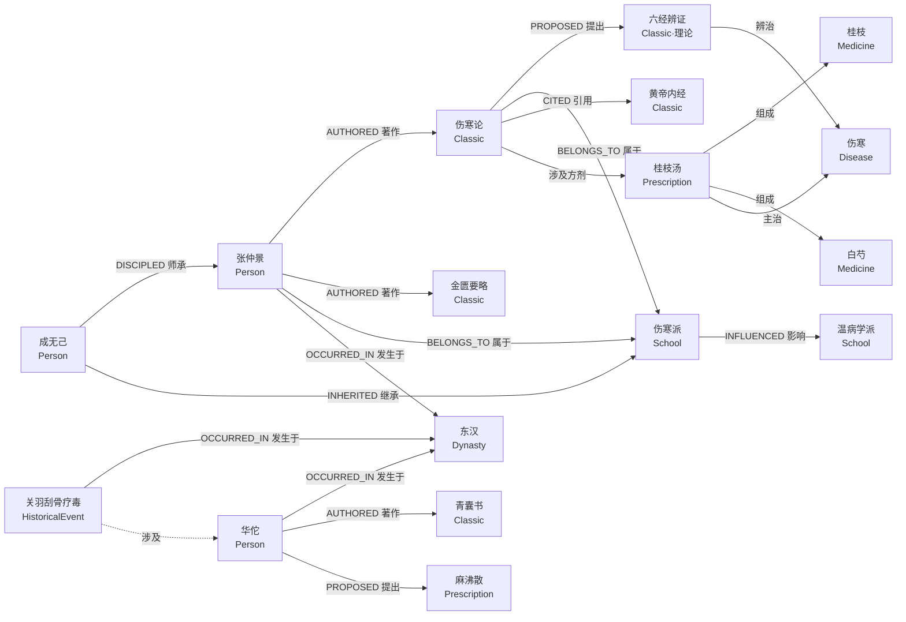
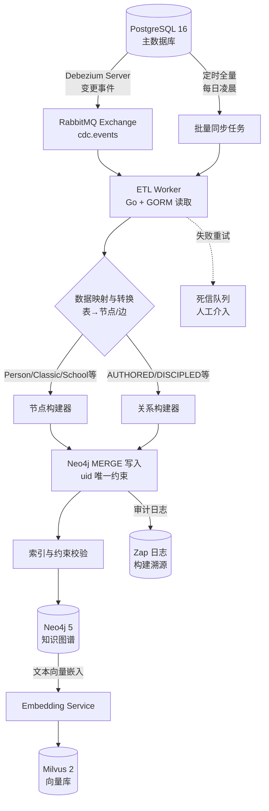

# 第五章 知识图谱设计

## 5.1 为什么用知识图谱建模中医发展史

中医发展史本质上是一张高密度关联的网络。一位医家既是某学派的传人，又是若干部经典的作者，其学术思想又通过师承、引用、影响等关系向后延伸数百年。关系型数据库以二维表组织数据，跨实体多跳关联查询需要多重 JOIN，性能与表达力均难以支撑中医史研究中"谁影响了谁""某学派三百年间如何演化""两位医家之间是否存在师承链"这类问题。

本项目选用 Neo4j 5 作为知识图谱存储，原因有三。其一，关联查询在图模型下天然高效。从张仲景出发查找其学术影响链上的所有方剂，在图数据库中沿边遍历即可，无需关心连接代价。其二，路径推理是中医史研究的核心诉求。师承传承链、学术源流脉络、跨朝代的理论继承路径，都本质上是图上的路径查找问题，Cypher 的 `shortestPath`、变长路径 `*1..n` 与 APOC 路径过程能够直接表达。其三，知识图谱天然适配可视化。前端基于 AntV G6 渲染节点与边，研究者可直观观察学派演化、医家关系、经典引用网络。

Graph Service 作为专属微服务，通过 Kitex RPC 对外提供图谱查询能力，遵循 Clean Architecture 与 DDD 分层，将图模型的领域逻辑与基础设施（Neo4j 驱动、PostgreSQL 数据源、Milvus 向量检索）解耦。主数据持久化在 PostgreSQL 16，Neo4j 作为查询加速与推理引擎存在，二者通过 ETL 流程保持最终一致。

---

## 5.2 节点设计

图谱共定义 8 种节点类型，覆盖中医发展史研究的全部核心实体。每种节点以 `:Label` 标注类型，业务主键统一使用 `uid` 字段（UUID v7，与 PostgreSQL 主键一致），保证跨数据源可追溯。

### 5.2.1 节点类型总览

| 节点类型 | Label | 核心语义 | 典型实例 |
|---------|-------|---------|---------|
| 人物 | `Person` | 历代医家 | 张仲景、华佗、孙思邈 |
| 经典 | `Classic` | 医学著作与理论概念 | 伤寒论、黄帝内经、六经辨证 |
| 学派 | `School` | 学术流派 | 伤寒派、温病学派、易水学派 |
| 方剂 | `Prescription` | 成方 | 桂枝汤、麻黄汤、银翘散 |
| 药物 | `Medicine` | 中药材 | 桂枝、白芍、麻黄 |
| 疾病 | `Disease` | 病证 | 伤寒、温病、消渴 |
| 朝代 | `Dynasty` | 历史时期 | 东汉、唐、宋、金元 |
| 历史事件 | `HistoricalEvent` | 医史事件 | 关羽刮骨疗毒、太医院设立 |

设计决策：经典节点（`Classic`）既承载著作文本，也承载由经典提出的理论概念（如六经辨证、卫气营血辨证）。通过 `category` 字段区分"著作"与"理论"，避免为单一理论概念新增节点类型，保持模型收敛。`Person` 节点冗余存储 `dynasty_name`，用于按朝代聚合的高频查询，避免每次遍历 `OCCURRED_IN` 边。

### 5.2.2 Person 人物节点

| 属性 | 类型 | 必填 | 说明 |
|------|------|------|------|
| uid | STRING | 是 | 业务主键，UUID v7 |
| name | STRING | 是 | 姓名 |
| courtesy_name | STRING | 否 | 字 |
| alias | STRING[] | 否 | 别名列表 |
| literary_name | STRING | 否 | 号 |
| dynasty_name | STRING | 否 | 所属朝代名（冗余） |
| birth_year | INTEGER | 否 | 出生年（公元纪年，负数表公元前） |
| death_year | INTEGER | 否 | 逝世年 |
| hometown | STRING | 否 | 籍贯 |
| intro | STRING | 否 | 简介 |
| achievements | STRING | 否 | 主要成就 |
| wiki_url | STRING | 否 | 百科链接 |

```cypher
CREATE (p:Person {
    uid: '01HXY7QK3PERSONZHANGZHONGJING',
    name: '张仲景',
    courtesy_name: '仲景',
    alias: ['张机'],
    literary_name: null,
    dynasty_name: '东汉',
    birth_year: 150,
    death_year: 219,
    hometown: '南阳涅阳',
    intro: '东汉末年著名医学家，被后世尊为医圣',
    achievements: '确立辨证论治体系，著《伤寒杂病论》'
})
RETURN p;
```

### 5.2.3 Classic 经典节点

| 属性 | 类型 | 必填 | 说明 |
|------|------|------|------|
| uid | STRING | 是 | 业务主键 |
| title | STRING | 是 | 书名或理论名 |
| alias | STRING[] | 否 | 别名 |
| category | STRING | 是 | 类别：著作/理论/注疏 |
| dynasty_name | STRING | 否 | 成书朝代 |
| completion_year | INTEGER | 否 | 成书年 |
| volumes | INTEGER | 否 | 卷数 |
| author_uid | STRING | 否 | 作者 uid（冗余） |
| abstract | STRING | 否 | 内容摘要 |
| embedding | LIST<FLOAT> | 否 | 向量嵌入（Milvus 同步） |

```cypher
CREATE (c1:Classic {
    uid: '01HXY7QL8SHANGHANLUN',
    title: '伤寒论',
    alias: ['伤寒杂病论·伤寒部分'],
    category: '著作',
    dynasty_name: '东汉',
    completion_year: 210,
    volumes: 10,
    abstract: '论述外感热病六经辨证体系'
}),
(c2:Classic {
    uid: '01HXY7QL9LIUJINGBIANZHENG',
    title: '六经辨证',
    category: '理论',
    dynasty_name: '东汉',
    abstract: '以太阳、阳明、少阳、太阴、少阴、厥阴六经辨治外感热病'
})
RETURN c1, c2;
```

### 5.2.4 School 学派节点

| 属性 | 类型 | 必填 | 说明 |
|------|------|------|------|
| uid | STRING | 是 | 业务主键 |
| name | STRING | 是 | 学派名 |
| dynasty_name | STRING | 否 | 形成朝代 |
| founder_uid | STRING | 否 | 创始人 uid（冗余） |
| establish_year | INTEGER | 否 | 形成年 |
| core_theory | STRING | 否 | 核心理论 |
| intro | STRING | 否 | 学派简介 |

```cypher
CREATE (s:School {
    uid: '01HXY7QMASHANGHANPAI',
    name: '伤寒派',
    dynasty_name: '东汉',
    establish_year: 210,
    core_theory: '六经辨证，方证对应',
    intro: '以张仲景《伤寒论》为宗，研究外感热病辨证论治的学派'
})
RETURN s;
```

### 5.2.5 Prescription 方剂节点

| 属性 | 类型 | 必填 | 说明 |
|------|------|------|------|
| uid | STRING | 是 | 业务主键 |
| name | STRING | 是 | 方剂名 |
| alias | STRING[] | 否 | 别名 |
| source | STRING | 否 | 出处经典 |
| composition | STRING | 否 | 组成描述 |
| efficacy | STRING | 否 | 功效 |
| indication | STRING | 否 | 主治 |
| usage | STRING | 否 | 用法 |

```cypher
CREATE (p:Prescription {
    uid: '01HXY7QNBGUIZHITANG',
    name: '桂枝汤',
    alias: ['桂枝加芍药汤'],
    source: '伤寒论',
    composition: '桂枝、芍药、生姜、大枣、甘草',
    efficacy: '解肌发表，调和营卫',
    indication: '外感风寒表虚证',
    usage: '水煎服，温覆取微汗'
})
RETURN p;
```

### 5.2.6 Medicine 药物节点

| 属性 | 类型 | 必填 | 说明 |
|------|------|------|------|
| uid | STRING | 是 | 业务主键 |
| name | STRING | 是 | 药名 |
| alias | STRING[] | 否 | 别名 |
| nature | STRING | 否 | 药性（寒/热/温/凉/平） |
| flavor | STRING[] | 否 | 药味 |
| meridian_tropism | STRING[] | 否 | 归经 |
| efficacy | STRING | 否 | 功效 |
| toxicity | STRING | 否 | 毒性等级 |

```cypher
CREATE (m:Medicine {
    uid: '01HXY7QPCGUIZHI',
    name: '桂枝',
    alias: ['嫩桂枝', '桂枝尖'],
    nature: '温',
    flavor: ['辛', '甘'],
    meridian_tropism: ['心', '肺', '膀胱'],
    efficacy: '发汗解肌，温通经脉，助阳化气',
    toxicity: '无毒'
})
RETURN m;
```

### 5.2.7 Disease 疾病节点

| 属性 | 类型 | 必填 | 说明 |
|------|------|------|------|
| uid | STRING | 是 | 业务主键 |
| name | STRING | 是 | 病名 |
| alias | STRING[] | 否 | 别名 |
| category | STRING | 否 | 病类 |
| symptoms | STRING[] | 否 | 主要症状 |
| description | STRING | 否 | 病证描述 |

```cypher
CREATE (d:Disease {
    uid: '01HXY7QDCSHANGHAN',
    name: '伤寒',
    alias: ['外感伤寒'],
    category: '外感病',
    symptoms: ['发热', '恶寒', '头痛', '脉浮'],
    description: '外感风寒之邪所致的热病'
})
RETURN d;
```

### 5.2.8 Dynasty 朝代节点

| 属性 | 类型 | 必填 | 说明 |
|------|------|------|------|
| uid | STRING | 是 | 业务主键 |
| name | STRING | 是 | 朝代名 |
| start_year | INTEGER | 是 | 起始年 |
| end_year | INTEGER | 是 | 终止年 |
| capital | STRING | 否 | 都城 |
| intro | STRING | 否 | 简介 |

```cypher
CREATE (d:Dynasty {
    uid: '01HXY7QECDONGHAN',
    name: '东汉',
    start_year: 25,
    end_year: 220,
    capital: '洛阳',
    intro: '公元25年至220年，医学体系初步形成时期'
})
RETURN d;
```

### 5.2.9 HistoricalEvent 历史事件节点

| 属性 | 类型 | 必填 | 说明 |
|------|------|------|------|
| uid | STRING | 是 | 业务主键 |
| name | STRING | 是 | 事件名 |
| occurred_year | INTEGER | 否 | 发生年 |
| location | STRING | 否 | 地点 |
| dynasty_name | STRING | 否 | 朝代（冗余） |
| description | STRING | 否 | 事件描述 |
| impact | STRING | 否 | 医史影响 |

```cypher
CREATE (e:HistoricalEvent {
    uid: '01HXY7QFCGUANYUGUAGU',
    name: '关羽刮骨疗毒',
    occurred_year: 219,
    location: '襄阳',
    dynasty_name: '东汉',
    description: '华佗为关羽刮骨去毒，外科麻醉术的早期记载',
    impact: '反映汉末外科与麻醉术水平'
})
RETURN e;
```

---

## 5.3 关系设计

图谱定义 9 种关系类型，方向严格约束在领域语义合理的范围内。所有关系均带 `uid` 与时间戳属性，便于血缘追溯与增量同步。

### 5.3.1 关系类型总览

| 关系 | 类型 | 方向 | 起点节点 | 终点节点 | 核心属性 |
|------|------|------|---------|---------|---------|
| 著作 | `AUTHORED` | Person → Classic | 人物 | 经典 | role, completion_year |
| 师承 | `DISCIPLED` | Person → Person | 弟子 | 师父 | start_year, end_year, type |
| 影响 | `INFLUENCED` | 任意 → 任意 | 源 | 目标 | aspect, degree |
| 属于 | `BELONGS_TO` | Person/Classic/Prescription → School | 实体 | 学派 | join_year, role |
| 发生于 | `OCCURRED_IN` | Person/Classic/HistoricalEvent → Dynasty | 实体 | 朝代 | description |
| 引用 | `CITED` | Classic → Classic | 后出经典 | 被引经典 | chapter, context |
| 提出 | `PROPOSED` | Person/Classic → Classic(理论) | 提出者 | 理论 | year, source |
| 反对 | `OPPOSED` | Person/Classic → Person/Classic/School | 反对者 | 对象 | year, reason |
| 继承 | `INHERITED` | Person/School → Person/Classic/School | 继承者 | 源 | aspect, degree |

### 5.3.2 AUTHORED 著作关系

| 属性 | 类型 | 说明 |
|------|------|------|
| uid | STRING | 关系主键 |
| role | STRING | 角色：作者/编者/注家 |
| completion_year | INTEGER | 成书年 |
| description | STRING | 说明 |

```cypher
MATCH (p:Person {name: '张仲景'}), (c:Classic {title: '伤寒论'})
CREATE (p)-[r:AUTHORED {
    uid: '01HXY7R-AUTH-ZSJ-SHL',
    role: '作者',
    completion_year: 210,
    description: '张仲景撰《伤寒杂病论》，后世分为伤寒与杂病两部'
}]->(c)
RETURN r;
```

### 5.3.3 DISCIPLED 师承关系

弟子指向师父。`type` 区分师徒授受、家族传承、私淑遥承三种师承形态。

| 属性 | 类型 | 说明 |
|------|------|------|
| uid | STRING | 关系主键 |
| start_year | INTEGER | 拜师年 |
| end_year | INTEGER | 结束年 |
| type | STRING | 师徒/家传/私淑 |
| description | STRING | 师承说明 |

```cypher
MATCH (d:Person {name: '成无己'}), (m:Person {name: '张仲景'})
CREATE (d)-[r:DISCIPLED {
    uid: '01HXY7RB-DIS-CWJ-ZSJ',
    start_year: 1140,
    end_year: null,
    type: '私淑',
    description: '成无己私淑仲景，首注《伤寒论》'
}]->(m)
RETURN r;
```

### 5.3.4 INFLUENCED 影响关系

影响关系允许跨节点类型，承载学术思想、临床经验、理论方法等多维影响。`degree` 取值 1–5 量化影响强度，供路径权重计算。

| 属性 | 类型 | 说明 |
|------|------|------|
| uid | STRING | 关系主键 |
| aspect | STRING | 影响维度：理论/临床/方药 |
| degree | INTEGER | 影响强度 1–5 |
| description | STRING | 说明 |

```cypher
MATCH (s:School {name: '伤寒派'}), (t:School {name: '温病学派'})
CREATE (s)-[r:INFLUENCED {
    uid: '01HXY7RC-INF-SHP-WBX',
    aspect: '理论',
    degree: 4,
    description: '温病学派在伤寒派辨证论治思想基础上发展卫气营血辨证'
}]->(t)
RETURN r;
```

### 5.3.5 BELONGS_TO 属于关系

Person、Classic、Prescription 均可指向 School。`role` 标注该成员在学派中的地位：创始人/代表人物/传人/经典著作。

| 属性 | 类型 | 说明 |
|------|------|------|
| uid | STRING | 关系主键 |
| join_year | INTEGER | 加入年 |
| role | STRING | 创始人/代表人物/传人/经典著作 |

```cypher
MATCH (p:Person {name: '张仲景'}), (s:School {name: '伤寒派'})
CREATE (p)-[r:BELONGS_TO {
    uid: '01HXY7RD-BLT-ZSJ-SHP',
    join_year: 210,
    role: '创始人'
}]->(s)
RETURN r;
```

### 5.3.6 OCCURRED_IN 发生于关系

实体指向朝代节点。对时间跨度不确定的人物，仍建边以支持按朝代聚合查询。

| 属性 | 类型 | 说明 |
|------|------|------|
| uid | STRING | 关系主键 |
| description | STRING | 说明 |

```cypher
MATCH (p:Person {name: '张仲景'}), (d:Dynasty {name: '东汉'})
CREATE (p)-[r:OCCURRED_IN {
    uid: '01HXY7RE-OCC-ZSJ-DH',
    description: '生活于东汉末年'
}]->(d)
RETURN r;
```

### 5.3.7 CITED 引用关系

后出经典引用前代经典。`chapter` 与 `context` 记录引用位置与上下文，支撑细粒度引用网络分析。

| 属性 | 类型 | 说明 |
|------|------|------|
| uid | STRING | 关系主键 |
| chapter | STRING | 引用章节 |
| context | STRING | 引用上下文 |
| description | STRING | 说明 |

```cypher
MATCH (c1:Classic {title: '伤寒论'}), (c2:Classic {title: '黄帝内经'})
CREATE (c1)-[r:CITED {
    uid: '01HXY7RF-CIT-SHL-HDNJ',
    chapter: '原序',
    context: '撰用《素问》《九卷》',
    description: '伤寒论序明示参引内经'
}]->(c2)
RETURN r;
```

### 5.3.8 PROPOSED 提出关系

Person 或 Classic 指向作为理论概念的 Classic 节点（`category='理论'`）。该关系是示例链路"张仲景 →著作→ 伤寒论 →提出→ 六经辨证"的核心承载。

| 属性 | 类型 | 说明 |
|------|------|------|
| uid | STRING | 关系主键 |
| year | INTEGER | 提出年 |
| source | STRING | 来源 |
| description | STRING | 说明 |

```cypher
MATCH (c:Classic {title: '伤寒论'}), (t:Classic {title: '六经辨证', category: '理论'})
CREATE (c)-[r:PROPOSED {
    uid: '01HXY7RG-PRP-SHL-LJBZ',
    year: 210,
    source: '伤寒论',
    description: '伤寒论确立六经辨证体系'
}]->(t)
RETURN r;
```

### 5.3.9 OPPOSED 反对关系

记录学术争鸣。反对者可为人、经典或学派，对象同理，承载中医史中的学派论辩（如寒凉派与温补派之争）。

| 属性 | 类型 | 说明 |
|------|------|------|
| uid | STRING | 关系主键 |
| year | INTEGER | 反对年 |
| reason | STRING | 反对理由 |
| description | STRING | 说明 |

```cypher
MATCH (p:Person {name: '张从正'}), (s:School {name: '温补学派'})
CREATE (p)-[r:OPPOSED {
    uid: '01HXY7RH-OPP-ZCZ-WBX',
    year: 1217,
    reason: '反对滥用温补，主张攻邪存正',
    description: '攻下派张从正批温补用药偏温'
}]->(s)
RETURN r;
```

### 5.3.10 INHERITED 继承关系

继承者指向被继承对象，与 `INFLUENCED` 的区别在于继承强调直接接续与扬弃，影响偏重间接作用。`aspect` 标注继承的学术层面。

| 属性 | 类型 | 说明 |
|------|------|------|
| uid | STRING | 关系主键 |
| aspect | STRING | 继承层面 |
| degree | INTEGER | 继承程度 1–5 |
| description | STRING | 说明 |

```cypher
MATCH (s1:School {name: '伤寒派'}), (s2:School {name: '易水学派'})
CREATE (s2)-[r:INHERITED {
    uid: '01HXY7RI-INH-YS-SSP',
    aspect: '辨证方法',
    degree: 3,
    description: '易水学派脏腑辨证吸收伤寒派辨证论治框架'
}]->(s1)
RETURN r;
```

---

## 5.4 核心实体关系网络

下图展示以张仲景、华佗为核心的东汉医学知识网络，涵盖著作、师承、影响、属于、发生于、引用、提出等关系，直观呈现图谱语义密度。



---

## 5.5 典型查询场景

以下查询覆盖中医史研究的高频诉求，均以参数化 Cypher 表达，便于 Graph Service 封装为 RPC 方法。

### 5.5.1 查询某人物的所有著作

```cypher
MATCH (p:Person {name: $name})-[:AUTHORED]->(c:Classic)
RETURN c.title AS 著作, c.category AS 类别,
       c.completion_year AS 成书年, c.abstract AS 摘要
ORDER BY c.completion_year;
```

### 5.5.2 查询某学派的师承传承链

沿 `DISCIPLED` 边变长遍历 1–6 跳，还原学派内部师承脉络。`apoc.path.expandConfig` 限制深度避免环爆炸。

```cypher
MATCH (root:Person)-[:BELONGS_TO {role: '创始人'}]->(:School {name: $school})
CALL apoc.path.expandConfig(root, {
    relationshipFilter: 'DISCIPLED>',
    minLevel: 1,
    maxLevel: 6,
    uniqueness: 'NODE_GLOBAL'
})
YIELD path
RETURN [n IN nodes(path) | n.name] AS 师承链,
       length(path) AS 代际
ORDER BY 代际;
```

### 5.5.3 查询两个概念之间的最短关联路径

`shortestPath` 用于发现两个看似无关实体间的隐性关联，是图谱推理的标志性能力。

```cypher
MATCH (start), (end), p = shortestPath((start)-[*..8]-(end))
WHERE start.name = $startName AND end.name = $endName
RETURN [n IN nodes(p) | coalesce(n.name, n.title)] AS 节点序列,
       [r IN relationships(p) | type(r)] AS 关系序列,
       length(p) AS 跳数;
```

### 5.5.4 查询某朝代的所有代表人物与著作

先定位朝代节点，反向遍历 `OCCURRED_IN`，再联动 `AUTHORED` 与 `BELONGS_TO`，输出代表人物、著作与所属学派。

```cypher
MATCH (d:Dynasty {name: $dynasty})<-[:OCCURRED_IN]-(p:Person)
OPTIONAL MATCH (p)-[:AUTHORED]->(c:Classic)
OPTIONAL MATCH (p)-[:BELONGS_TO]->(s:School)
WITH p, collect(DISTINCT c.title) AS 著作,
     collect(DISTINCT s.name) AS 学派
RETURN p.name AS 人物, p.birth_year AS 生年,
       著作, 学派
ORDER BY p.birth_year;
```

### 5.5.5 查询某方剂涉及的所有药物与主治疾病

方剂经"组成"关系连向药物，经"主治"关系连向疾病，一条语句完成方剂全貌检索。

```cypher
MATCH (pr:Prescription {name: $name})
OPTIONAL MATCH (pr)-[:COMPOSED_OF]->(m:Medicine)
OPTIONAL MATCH (pr)-[:TREATS]->(dis:Disease)
WITH pr,
     collect(DISTINCT {药名: m.name, 性: m.nature, 味: m.flavor}) AS 药物,
     collect(DISTINCT dis.name) AS 主治
RETURN pr.name AS 方剂, pr.efficacy AS 功效,
       pr.composition AS 组成, 药物, 主治;
```

> 注：`COMPOSED_OF` 与 `TREATS` 为方剂内部支撑关系，承接 `Prescription` 与 `Medicine`、`Disease` 的组成与主治语义，与项目核心 9 类关系并列使用，用于细化方剂子图。

---

## 5.6 图谱构建流程

Neo4j 不作为写入主库，主数据落在 PostgreSQL。ETL 流程负责将关系库数据映射为图节点与边，保持最终一致。流程采用事件驱动与定时批量双触发，事件驱动保障近实时，定时批量兜底补偿。



映射规则集中配置于 `graph_mapping.yaml`（Viper 加载），将 PostgreSQL 表与字段映射为节点 Label 与属性，外键映射为关系类型。Worker 采用幂等 `MERGE` 写入，按 `uid` 匹配更新，保证重复消费安全。向量化步骤异步执行，Neo4j 写入成功后投递 embedding 任务至 Milvus，文本检索与图谱查询解耦。

---

## 5.7 Graph Service 接口设计概要

Graph Service 以 Kitex RPC 对外提供查询能力，遵循 Clean Architecture，领域层定义查询用例，基础设施层封装 Neo4j 驱动。完整 API 规范见第十章，此处列出核心方法概要。

| RPC 方法 | 入参 | 出参 | 语义 |
|---------|------|------|------|
| `GetPersonWorks` | person_uid | []Classic | 人物著作列表 |
| `GetSchoolLineage` | school_name, max_depth | LineagePath | 学派师承传承链 |
| `FindShortestPath` | start_uid, end_uid, max_hops | GraphPath | 两概念最短关联路径 |
| `GetDynastyFigures` | dynasty_name | []FigureWithWorks | 朝代代表人物与著作 |
| `GetPrescriptionDetail` | prescription_uid | PrescriptionGraph | 方剂药物与主治 |
| `SearchNodes` | keyword, label?, limit | []Node | 全文/向量混合检索 |
| `GetSubgraph` | center_uid, depth, limit | Subgraph | 以节点为中心的子图，供可视化 |

`GetSubgraph` 是可视化场景的关键方法，返回以指定节点为中心、限定深度的子图，前端直接渲染。检索类方法（`SearchNodes`）先查 Milvus 取候选 uid，再回查 Neo4j 补全结构化属性，兼顾语义相似与图谱结构。

---

## 5.8 索引与约束策略

Neo4j 索引与约束在模型上线时通过迁移脚本一次性建立，保障查询性能与数据一致。

### 5.8.1 唯一约束

每个节点 Label 的 `uid` 建立唯一约束，作为 MERGE 的匹配锚点，杜绝重复节点。

```cypher
CREATE CONSTRAINT person_uid_unique IF NOT EXISTS
FOR (n:Person) REQUIRE n.uid IS UNIQUE;

CREATE CONSTRAINT classic_uid_unique IF NOT EXISTS
FOR (n:Classic) REQUIRE n.uid IS UNIQUE;

CREATE CONSTRAINT school_uid_unique IF NOT EXISTS
FOR (n:School) REQUIRE n.uid IS UNIQUE;

CREATE CONSTRAINT prescription_uid_unique IF NOT EXISTS
FOR (n:Prescription) REQUIRE n.uid IS UNIQUE;

CREATE CONSTRAINT medicine_uid_unique IF NOT EXISTS
FOR (n:Medicine) REQUIRE n.uid IS UNIQUE;

CREATE CONSTRAINT disease_uid_unique IF NOT EXISTS
FOR (n:Disease) REQUIRE n.uid IS UNIQUE;

CREATE CONSTRAINT dynasty_uid_unique IF NOT EXISTS
FOR (n:Dynasty) REQUIRE n.uid IS UNIQUE;

CREATE CONSTRAINT event_uid_unique IF NOT EXISTS
FOR (n:HistoricalEvent) REQUIRE n.uid IS UNIQUE;
```

### 5.8.2 B-Tree 索引

高频等值与范围查询字段建立 B-Tree 索引，覆盖按朝代、按姓名检索场景。

```cypher
CREATE INDEX person_name_index IF NOT EXISTS
FOR (n:Person) ON (n.name);

CREATE INDEX person_dynasty_index IF NOT EXISTS
FOR (n:Person) ON (n.dynasty_name);

CREATE INDEX classic_title_index IF NOT EXISTS
FOR (n:Classic) ON (n.title);

CREATE INDEX classic_category_index IF NOT EXISTS
FOR (n:Classic) ON (n.category);

CREATE INDEX school_name_index IF NOT EXISTS
FOR (n:School) ON (n.name);

CREATE INDEX dynasty_name_index IF NOT EXISTS
FOR (n:Dynasty) ON (n.name);
```

### 5.8.3 全文索引

节点 `intro`、`abstract`、`achievements` 文本字段建立全文索引，支撑关键词检索与 Milvus 向量召回的回填。

```cypher
CREATE FULLTEXT INDEX node_fulltext IF NOT EXISTS
FOR (n:Person|Classic|School|Prescription|Disease)
ON EACH [n.intro, n.abstract, n.achievements, n.description];
```

关系上的 `uid` 同样建立唯一约束，便于增量同步时按关系主键 MERGE，避免重复建边。

```cypher
CREATE CONSTRAINT rel_uid_unique IF NOT EXISTS
FOR ()-[r:AUTHORED|DISCIPLED|INFLUENCED|BELONGS_TO|OCCURRED_IN|CITED|PROPOSED|OPPOSED|INHERITED]-()
REQUIRE r.uid IS UNIQUE;
```

---

## 5.9 图谱可视化方案

前端采用 AntV G6 4.x 渲染知识图谱，后端 Graph Service 的 `GetSubgraph` 返回标准节点与边数据结构，二者协议对齐。

### 5.9.1 数据契约

后端返回的子图数据结构如下：

```json
{
  "nodes": [
    {
      "id": "01HXY7QK3ZSJ",
      "label": "张仲景",
      "nodeType": "Person",
      "properties": { "dynasty_name": "东汉", "intro": "医圣" }
    }
  ],
  "edges": [
    {
      "source": "01HXY7QK3ZSJ",
      "target": "01HXY7QL8SHL",
      "label": "著作",
      "edgeType": "AUTHORED",
      "properties": { "completion_year": 210 }
    }
  ]
}
```

### 5.9.2 前端渲染策略

节点样式按 `nodeType` 分配颜色与图标：人物用圆形、经典用书卷图标、学派用六边形、方剂用胶囊形、药物用菱形、疾病用三角、朝代用矩形、历史事件用星形。边样式按 `edgeType` 区分线型：`AUTHORED` 实线、`DISCIPLED` 粗实线带箭头、`INFLUENCED` 虚线、`CITED` 点线、`OPPOSED` 红色波浪线，使关系语义在视觉上一眼可辨。

布局算法按场景选择：师承传承链采用 `dagre` 有向分层布局，呈现代际纵向延伸；人物关系网络采用 `force` 力导向布局，呈现集群自然聚集；朝代时序采用 `grid` 网格布局，按 `start_year` 排列。交互层面提供节点点击下钻（调用 `GetSubgraph` 二次扩展）、双击折叠子图、路径高亮（配合 `FindShortestPath` 结果）、按 Label 过滤显隐等能力。

性能方面，子图节点上限设为 300，超过阈值改用聚类折叠，将同类同派节点合并为超节点，避免 G6 大图渲染卡顿。前端配合 Web Worker 进行布局计算，主线程仅承担绘制，保障交互流畅。
