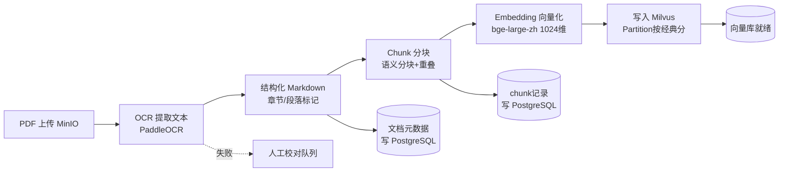
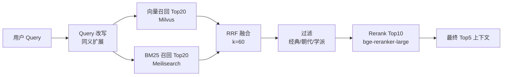
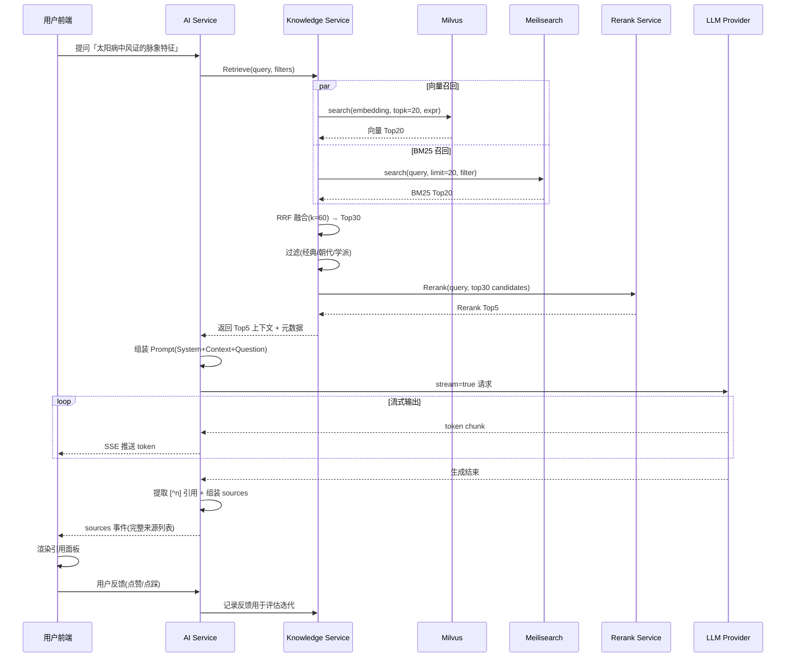

# 第六章 RAG 设计

## 6.1 RAG 在中医文献场景的价值

中医典籍具有强术语壁垒、强上下文依赖、强跨文献引用的特征。直接调用通用 LLM 回答中医问题会出现三类问题：术语漂移（如「少阳病」被泛化为一般发热证候）、出处编造（《伤寒论》条文序号张冠李戴）、学派混淆（伤寒派与温病学派理法错配）。RAG（Retrieval-Augmented Generation）通过在生成前检索权威文献片段，从根本上缓解上述问题。

中医文献场景下 RAG 的核心价值体现在三点：

- **降低幻觉**：生成内容被约束在检索召回的原文片段之内，模型无法凭空捏造条文。通过 Prompt 中的「无依据则拒答」约束，进一步压缩幻觉空间。
- **可溯源**：每条回答都附带原文片段、经典名称、卷次、条文序号，学习者可一键回查原始文献。这是教学场景的刚需——学生必须能验证答案是否真出自经典。
- **多经典交叉引用**：同一中医概念在不同经典中常有不同表述（如「太阳病」在《伤寒论》与《温病条辨》中的内涵差异）。RAG 可在召回阶段同时检索多部经典，让 LLM 在生成时呈现跨文献对照，这正是中医「以经解经」治学方法的技术化落地。

平台收录六部核心经典作为初始知识库：《黄帝内经》《伤寒论》《金匮要略》《针灸甲乙经》《温病条辨》《本草纲目》。这六部覆盖了中医理论（内经）、辨证论治（伤寒、金匮）、针灸（甲乙经）、温病（温病条辨）、本草（本草纲目）五大分支，足以支撑交叉引用需求。

## 6.2 文献处理流水线

完整流水线从 PDF 上传到写入 Milvus 共六个阶段，全部由 Knowledge Service 的离线 Worker 异步执行，状态写回 `embedding_tasks` 表供前端追踪进度。



### 6.2.1 PDF 上传到 MinIO

运营人员通过管理后台上传经典 PDF（含影印古籍扫描件）。前端分片直传至 MinIO 的 `tcm-original` 桶，对象 Key 采用 `{classic_code}/{upload_id}.pdf` 规则，例如 `shanghan_lun/20260115_001.pdf`。上传完成后向 Kafka topic `doc.uploaded` 发送消息，触发 Worker 消费。MinIO 对象设置 `Content-Type: application/pdf` 并计算 MD5 用于后续幂等校验，重复上传相同 MD5 的文件直接复用既有处理结果。

### 6.2.2 OCR 提取文本

影印古籍 OCR 是整个流水线的难点。竖排繁体、无标点、虫蛀污渍、夹注小字均会拉低识别准确率。平台选用 PaddleOCR 作为基础引擎，叠加中医古籍增强方案：

- **版面分析**：使用 PP-StructureV2 识别竖排文本区域，区分正文与夹注。夹注以独立段落保留但打标 `type=annotation`，不参与主检索召回，仅在被引用时作为补充上下文返回。
- **文字识别**：竖排模型 `chinese_cht_V2` + 繁体识别字典，对常见异体字（如「𤕠」→「疒」）做后处理映射。
- **标点恢复**：古籍原无标点，OCR 结果为连续文本。调用轻量 BERT 模型（`guwen-punct-bert`）做断句标点恢复，输出「，。；：」四类标点，便于后续分块。
- **置信度过滤**：单字置信度低于 0.6 的字符标记为 `[UNK]` 并汇总，若整页 `[UNK]` 占比超过 5%，该页进入人工校对队列，不直接进入下一阶段。

文字版 PDF（非扫描件）走快速通道：用 `pdfplumber` 直接抽取文本，跳过 OCR 环节，处理速度提升约 20 倍。

### 6.2.3 转换为结构化 Markdown

OCR 输出的纯文本需结构化为带语义层级的 Markdown，才能支撑后续按章节分块与按卷次检索。结构化规则按经典定制，以《伤寒论》为例：

```markdown
# 伤寒论
## 卷第二 · 辨太阳病脉证并治上
### 第1条
太阳之为病，脉浮，头项强痛而恶寒。
### 第2条
太阳病，发热，汗出，恶风，脉缓者，名为中风。
```

层级映射规则：

- 一级标题 `#` = 经典名称，全局唯一。
- 二级标题 `##` = 卷次/篇目，对应原书目录结构。
- 三级标题 `###` = 条文/段落编号，伤寒论与金匮要略按「第 N 条」编号，内经按「篇第 N」，本草纲目按「部·类·条」。

对于配有白话译注的版本，原文与译文以 `> 译：` 引用块对照存放，确保 Chunk 阶段能同时保留两者：

```markdown
### 第1条
太阳之为病，脉浮，头项强痛而恶寒。
> 译：太阳病的特征是脉象浮，头项部强硬疼痛而怕冷。
```

结构化后的 Markdown 写回 MinIO 的 `tcm-markdown` 桶，同时在 PostgreSQL 的 `documents` 表写入元数据（经典编码、版本、卷次数、条文数、字数）。

### 6.2.4 Chunk 策略

Chunk 质量直接决定检索上限。中医文献若按固定 token 数机械切分，会把一条完整的辨证条文腰斩，导致召回片段语义残缺。平台采用「语义分块 + 重叠窗口」混合策略，具体参数如下。

**分块单元**：以 Markdown 三级标题（条文/段落）为最小语义单元。单条条文作为一个 Chunk，不做拆分。绝大多数条文长度在 20-80 字之间，远小于 Embedding 模型的最优输入区间（bge-large-zh 建议 128-512 token），单条独立反而能精准命中。

**长文本合并**：本草纲目的单条药物描述可能超过 512 token。对超长条文采用滑动窗口二次切分，参数为：

| 参数 | 取值 | 说明 |
|------|------|------|
| `max_chunk_tokens` | 400 | 单 Chunk 上限，留 112 token 余量给特殊 token |
| `overlap_tokens` | 80 | 相邻 Chunk 重叠窗口，约为上限的 20% |
| `min_chunk_tokens` | 30 | 末尾 Chunk 不足此值则并入前一 Chunk |

**白话对照保留**：每个 Chunk 同时包含原文与译文，以结构化字段存储而非拼接成纯文本。原文用于精确匹配（BM25），译文用于语义检索（向量）。Embedding 时对原文+译文拼接向量化，使向量同时编码古文与白话语义。

**Chunk 元数据**：每个 Chunk 携带以下元数据，写入 Milvus 标量字段供过滤：

- `classic_code`：经典编码（如 `shanghan_lun`）
- `dynasty`：朝代（如 `东汉`）
- `school`：学派（如 `伤寒派`）
- `volume`：卷次
- `clause_no`：条文序号
- `content_type`：`original` / `annotation` / `formula`（方剂）

典型 Chunk 结构示例：

```json
{
  "chunk_id": "shanghan_lun_v2_c12_001",
  "text_original": "太阳之为病，脉浮，头项强痛而恶寒。",
  "text_translation": "太阳病的特征是脉象浮，头项部强硬疼痛而怕冷。",
  "classic_code": "shanghan_lun",
  "dynasty": "东汉",
  "school": "伤寒派",
  "volume": "卷第二",
  "clause_no": 1,
  "content_type": "original",
  "token_count": 38
}
```

### 6.2.5 Embedding 向量化

选用 `bge-large-zh-v1.5` 作为主力 Embedding 模型，维度 1024。选型依据三点：在 C-MTEB 中文检索榜单召回率领先；对古汉语与白话混合文本表现稳健；支持本地 GPU 部署，避免外部 API 依赖与数据出境。

向量化输入为「原文 + [SEP] + 译文」拼接形式，对无译文的纯原文 Chunk 仅用原文。批处理参数：`batch_size=32`，部署在单卡 A10 GPU 上，吞吐约 800 条/秒，六部经典约 12000 条文全量向量化耗时约 15 秒。

模型服务以独立进程部署，通过 gRPC 暴露 `Embed(texts []string) -> [][]float32` 接口，Knowledge Service 的 Worker 调用该接口完成批量向量化。模型权重缓存本地，冷启动加载约 8 秒。

平台保留 `text-embedding-3`（OpenAI）作为备选，通过 Embedding Provider 适配层切换。当且仅当 bge-large-zh 在新增经典上评估召回率低于阈值（0.75）时启用备选，且两套向量分属不同 Milvus Collection，不混用。

### 6.2.6 写入 Milvus

向量写入 Milvus 2 的 `tcm_chunks` Collection，Partition 按经典编码划分（`partition_huangdi_neijing`、`partition_shanghan_lun` 等），共六个 Partition。按经典分区的收益在于：按经典过滤检索时只需扫描单分区，跳过分区裁剪开销；某部经典版本更新时可 `drop_partition` 后重建，不影响其他经典在线服务。

写入流程为：Worker 批量调用 `milvus.Insert(collection, partition, records)`，每批 500 条，写入后立即 `Flush`。单条 Chunk 写入耗时约 1.5ms，全量 12000 条约 18 秒。写入完成后更新 `embedding_tasks` 状态为 `success`，并记录写入的 Chunk 数与向量数用于对账。

## 6.3 检索策略

单路向量检索在中医术语精确匹配场景下存在短板：「桂枝汤」与「桂支汤」「桂枝汤证」的向量距离接近，但语义判断需精确匹配条文。平台采用「向量召回 + BM25 召回 + RRF 融合 + Rerank 精排」四阶段混合检索架构。



### 6.3.1 混合检索：向量 + BM25

**向量召回**：Query 经 bge-large-zh 向量化后，在 Milvus 执行 `search`，参数 `topk=20`、`metric_type=IP`（内积，配合向量 L2 归一化等价于余弦相似度）、`consistency_level=Bounded`。检索时通过 `expr` 传入过滤条件，利用标量字段索引跳过不相关分区。

**BM25 召回**：Meilisearch 存储 Chunk 的原文与元数据，构建 BM25 倒排索引。中医分词采用自定义词典（含 8000 余条中医术语，如「太阳病」「少阳枢机」「卫气营血」），用 jieba 加载该词典分词，避免「太阳病」被切为「太阳」+「病」导致召回噪声。Meilisearch 检索参数 `limit=20`，并对 `classic_code`、`dynasty`、`school` 字段建立 filterable 属性。

两路召回各有侧重：向量召回覆盖「白话提问命中古文原文」（用户问「怕冷发热怎么办」，命中「恶寒发热」条文）；BM25 召回覆盖「精确术语命中」（用户搜「桂枝汤」，严格匹配含「桂枝汤」的方剂条文）。

### 6.3.2 多路召回与 RRF 融合

两路召回结果通过 RRF（Reciprocal Rank Fusion）算法融合。RRF 对每条候选按其在各路结果中的排名计算倒数得分，公式为：

```
score(d) = Σ 1 / (k + rank_i(d))
```

其中 `k=60`（经验值，平衡头部与尾部排名权重），`rank_i(d)` 为文档 d 在第 i 路召回中的排名（从 1 开始）。RRF 的优势在于无需对两路原始分数做归一化——向量余弦分数与 BM25 分数量纲不同，直接加权会扭曲；RRF 只用排名信息，天然规避该问题。

融合后取 Top 30 进入过滤阶段。融合算法实现示例：

```go
func RRF(rankings [][]string, k int, topN int) []string {
    scores := make(map[string]float64)
    for _, ranking := range rankings {
        for rank, docID := range ranking {
            scores[docID] += 1.0 / float64(k+rank+1)
        }
    }
    // 按分数降序取 topN
    return sortByScoreDesc(scores, topN)
}
```

### 6.3.3 检索结果过滤

融合后的候选集按用户上下文过滤。过滤维度有三：

- **经典**：用户在 UI 选定「仅伤寒论」时，过滤条件 `classic_code in ["shanghan_lun"]`。
- **朝代**：研究某朝代医学发展时，按 `dynasty` 过滤，如 `dynasty = "东汉"`。
- **学派**：对比学派观点时，按 `school` 过滤，如 `school in ["伤寒派", "温病学派"]`。

过滤在 Milvus 与 Meilisearch 召回阶段即下推（通过 `expr` 与 filter），RRF 融合后再次复核，确保无漏网。未指定过滤时，默认召回全部分区，由 LLM 在生成阶段自行判断跨经典对照的必要性。

### 6.3.4 重排序（Rerank）

融合后的 Top 30 经 Rerank 模型精排，取 Top 5 作为最终上下文。选用 `bge-reranker-large`（Cross-Encoder 架构），它将 Query 与每个候选 Chunk 拼接后输入，输出相关性分数，精度显著高于双塔向量相似度。

Rerank 阶段额外引入 Query-Chunk 交互信号：对「太阳病中风证」这类多术语组合 Query，Cross-Encoder 能捕捉术语共现关系，把同时命中「太阳病」与「中风」的条文排在前面，而向量召回可能因平均化导致仅命中单一术语的条文排名靠前。

Rerank 单次推理约 30ms（30 候选 × 1ms），部署在与 Embedding 同一 GPU 上复用显存。最终 Top 5 上下文的平均相关度（Rerank 分数）低于 0.3 时，触发「低置信度」标记，LLM Prompt 中加入「检索结果可能不完全相关，请谨慎回答」提示。

## 6.4 生成策略

### 6.4.1 Prompt 组装

Prompt 分三段：System Prompt（角色与约束）、Retrieved Context（检索片段）、User Question（用户问题）。System Prompt 固化中医专家角色与输出规范，确保回答风格一致。

```
[System]
你是中医文献研究助手，专精《黄帝内经》《伤寒论》《金匮要略》《针灸甲乙经》
《温病条辨》《本草纲目》六部经典。回答必须遵循以下规则：
1. 仅基于下方【检索上下文】回答，不得引用未提供的文献。
2. 每条论断后以 [^n] 标注来源编号，对应检索上下文序号。
3. 若检索上下文不足以回答，直接回复「现有文献未能覆盖该问题」。
4. 涉及跨经典概念时，呈现不同经典的表述差异，不做单一归纳。
5. 不提供现代临床诊疗建议，仅做文献解读。

[检索上下文]
[1] 《伤寒论·卷第二·第2条》
原文：太阳病，发热，汗出，恶风，脉缓者，名为中风。
译文：太阳病，出现发热、出汗、怕风、脉象缓的，称为中风。
[2] 《温病条辨·上焦篇·第4条》
原文：太阴之为病，脉不缓不紧而动数，或两寸独大。
译文：太阴温病的特征是脉象不缓不紧而呈动态数脉，或两寸脉独大。

[用户问题]
太阳病和太阴温病在脉象上有什么区别？
```

检索上下文按 Rerank 分数降序排列，每条片段标注来源编号、经典、卷次、条文序号、原文、译文。Token 预算控制在 2500 以内（约 5 条上下文 × 500 token），为 LLM 输出预留 1500 token。

### 6.4.2 流式输出

AI Service 通过 SSE（Server-Sent Events）向前端流式推送生成内容。Knowledge Service 返回检索结果后，AI Service 调用 LLM Provider 适配层，以 `stream=true` 模式请求，逐 token 转发至前端。前端在流式过程中实时渲染 Markdown，并在遇到 `[^n]` 标记时高亮对应来源卡片。

流式输出同时解决两个体验问题：首字延迟从 4-6 秒压缩至 800ms 以内；长答案（多经典对照）的等待焦虑被消解。AI Service 在流式结束时附加一个 `sources` 事件，包含完整的来源元数据列表，供前端渲染引用面板。

### 6.4.3 来源引用标注

每条回答的引用标注分两层呈现：

- **行内标注**：生成文本中以 `[^n]` 标记，对应检索上下文序号。
- **文末来源列表**：流式结束后推送 `sources` 数组，每项含经典名、卷次、条文序号、原文片段、MinIO Markdown 对象 Key（支持「查看原文」跳转）。

来源列表结构示例：

```json
{
  "sources": [
    {
      "index": 1,
      "classic": "伤寒论",
      "volume": "卷第二",
      "clause_no": 2,
      "snippet": "太阳病，发热，汗出，恶风，脉缓者，名为中风。",
      "source_url": "minio://tcm-markdown/shanghan_lun/v2.md#clause-2"
    },
    {
      "index": 2,
      "classic": "温病条辨",
      "volume": "上焦篇",
      "clause_no": 4,
      "snippet": "太阴之为病，脉不缓不紧而动数……",
      "source_url": "minio://tcm-markdown/wenbing_tiaobian/sj.md#clause-4"
    }
  ]
}
```

「查看原文」跳转至 MinIO 预签名 URL 渲染对应 Markdown 锚点，学习者可立即核对原文上下文，满足教学场景的可溯源刚需。

## 6.5 Milvus Collection Schema 设计

Collection 名为 `tcm_chunks`，含 6 个 Partition（按经典编码）。Schema 字段如下：

| 字段名 | 类型 | 说明 | 索引 |
|--------|------|------|------|
| `chunk_id` | VARCHAR(64) | 主键，如 `shanghan_lun_v2_c12_001` | PK |
| `embedding` | FLOAT_VECTOR(1024) | bge-large-zh 向量 | 向量索引 |
| `classic_code` | VARCHAR(32) | 经典编码 | 标量索引 |
| `dynasty` | VARCHAR(16) | 朝代 | 标量索引 |
| `school` | VARCHAR(32) | 学派 | 标量索引 |
| `volume` | VARCHAR(64) | 卷次 | 标量索引 |
| `clause_no` | INT64 | 条文序号 | 标量索引 |
| `content_type` | VARCHAR(16) | 内容类型 | 标量索引 |
| `doc_id` | INT64 | 关联 PostgreSQL documents.id | 标量索引 |

**向量索引**：选用 `HNSW` 索引，参数 `M=16`、`efConstruction=200`、`metric_type=IP`、查询时 `ef=64`。选 HNSW 而非 IVF_FLAT 的依据：中医文献库规模小（约 12000 条），HNSW 在小规模数据上召回率与延迟均优于 IVF_FLAT，且无需训练聚类中心。检索 P99 延迟约 8ms，满足实时问答需求。当库规模增长至 50 万条以上时，可切换 IVF_FLAT + PQ 压缩以平衡内存。

**标量索引**：对所有过滤字段建 `STL_SORT`（数值型）或 `Trie`（字符串型）索引，加速 `expr` 过滤。

**Partition 设计**：六个 Partition 按 `classic_code` 划分，Partition 名为 `p_{classic_code}`。检索时若用户指定经典，通过 `partition_names` 参数仅扫描目标分区，延迟降低约 40%。未指定经典时扫描全部分区。

Collection 创建语句（Go SDK 摘要）：

```go
schema := &entity.Schema{
    CollectionName: "tcm_chunks",
    Fields: []*entity.Field{
        {Name: "chunk_id", DataType: entity.FieldTypeVarChar, MaxLength: 64, IsPrimaryKey: true},
        {Name: "embedding", DataType: entity.FieldTypeFloatVector, Dim: 1024},
        {Name: "classic_code", DataType: entity.FieldTypeVarChar, MaxLength: 32},
        {Name: "dynasty", DataType: entity.FieldTypeVarChar, MaxLength: 16},
        {Name: "school", DataType: entity.FieldTypeVarChar, MaxLength: 32},
        {Name: "volume", DataType: entity.FieldTypeVarChar, MaxLength: 64},
        {Name: "clause_no", DataType: entity.FieldTypeInt64},
        {Name: "content_type", DataType: entity.FieldTypeVarChar, MaxLength: 16},
        {Name: "doc_id", DataType: entity.FieldTypeInt64},
    },
}
// 创建 HNSW 索引
idx, _ := entity.NewIndexHNSW("embedding", 16, 200, entity.IP)
client.CreateIndex(ctx, "tcm_chunks", "embedding", idx, false)
// 创建六个分区
for _, code := range classicCodes {
    client.CreatePartition(ctx, "tcm_chunks", "p_"+code)
}
```

## 6.6 数据库表设计

PostgreSQL 存储文献元数据与 Chunk 文本，与 Milvus 通过 `chunk_id` 关联。详细字段定义在第十章给出，本节仅概述三张核心表。

**`documents` 表**：记录经典文献的元信息，每部经典的每个版本一行。

| 字段 | 类型 | 说明 |
|------|------|------|
| `id` | BIGSERIAL | 主键 |
| `classic_code` | VARCHAR(32) | 经典编码，如 `shanghan_lun` |
| `title` | VARCHAR(128) | 经典全称 |
| `version` | VARCHAR(32) | 版本（如「宋本」「康平本」） |
| `dynasty` | VARCHAR(16) | 朝代 |
| `school` | VARCHAR(32) | 学派 |
| `author` | VARCHAR(64) | 作者/整理者 |
| `pdf_object_key` | VARCHAR(256) | MinIO 原始 PDF 对象 Key |
| `markdown_object_key` | VARCHAR(256) | MinIO 结构化 Markdown 对象 Key |
| `volume_count` | INT | 卷数 |
| `clause_count` | INT | 条文数 |
| `status` | VARCHAR(16) | 处理状态：`uploaded`/`ocr_done`/`markdown_done`/`embedded`/`online` |
| `created_at` | TIMESTAMPTZ | 创建时间 |
| `updated_at` | TIMESTAMPTZ | 更新时间 |

**`document_chunks` 表**：记录每个 Chunk 的文本与元数据，与 Milvus 中的向量一一对应。

| 字段 | 类型 | 说明 |
|------|------|------|
| `id` | BIGSERIAL | 主键 |
| `chunk_id` | VARCHAR(64) | 全局唯一，与 Milvus PK 一致 |
| `doc_id` | BIGINT | 关联 documents.id |
| `classic_code` | VARCHAR(32) | 经典编码 |
| `volume` | VARCHAR(64) | 卷次 |
| `clause_no` | INT | 条文序号 |
| `content_type` | VARCHAR(16) | 内容类型 |
| `text_original` | TEXT | 原文 |
| `text_translation` | TEXT | 白话译文 |
| `token_count` | INT | Token 数 |
| `embedding_model` | VARCHAR(32) | 向量化所用模型 |
| `created_at` | TIMESTAMPTZ | 创建时间 |

**`embedding_tasks` 表**：记录文献处理任务的状态与进度，支撑前端进度追踪与失败重试。

| 字段 | 类型 | 说明 |
|------|------|------|
| `id` | BIGSERIAL | 主键 |
| `doc_id` | BIGINT | 关联 documents.id |
| `stage` | VARCHAR(32) | 当前阶段：`upload`/`ocr`/`markdown`/`chunk`/`embed`/`milvus` |
| `status` | VARCHAR(16) | 状态：`pending`/`running`/`success`/`failed` |
| `progress` | INT | 进度百分比 0-100 |
| `error_msg` | TEXT | 失败原因 |
| `chunk_count` | INT | 已处理 Chunk 数 |
| `vector_count` | INT | 已写入向量数 |
| `started_at` | TIMESTAMPTZ | 开始时间 |
| `finished_at` | TIMESTAMPTZ | 完成时间 |

三张表通过 `doc_id` 串联，形成「文献 → Chunk → 向量」的完整链路。Chunk 文本存 PostgreSQL 而非 Milvus，是为了利用关系数据库的事务与全文检索能力（PostgreSQL 的 `pg_trgm` 支撑运营后台的模糊查询），Milvus 仅承担向量检索职责。

## 6.7 检索质量评估方案

RAG 上线前必须建立量化评估闭环，避免「感觉还行」的主观判断。平台采用「人工标注集 + 自动化指标」双轨评估，每月迭代一次。

### 6.7.1 人工标注集构建

由 3 名中医文献专业研究生构建标注集，规模 200 条 Query，覆盖五类典型问题：

- **条文检索类**（60 条）：直接提问某条文内容，如「伤寒论第 12 条原文是什么」。
- **概念解释类**（50 条）：提问中医概念，如「什么是少阳病」。
- **跨经典对照类**（40 条）：要求对比不同经典的表述，如「内经和伤寒论对太阳病的论述有何不同」。
- **方剂查询类**（30 条）：查询方剂组成与主治，如「桂枝汤的组成和适应证」。
- **否定/陷阱类**（20 条）：提问经典中不存在的内容，检验拒答能力，如「伤寒论里有没有提到新冠病毒」。

每条 Query 标注金标准答案（含期望命中的经典、卷次、条文序号集合）与可接受的相关文档集合。标注集存在 PostgreSQL 的 `eval_queries` 表，版本化管理。

### 6.7.2 自动化指标

评估在召回、精排、生成三层分别度量：

| 层级 | 指标 | 计算方式 | 目标值 |
|------|------|----------|--------|
| 召回 | Recall@20 | 金标准文档在 Top20 命中比例 | ≥ 0.85 |
| 召回 | MRR | 金标准文档的倒数排名均值 | ≥ 0.65 |
| 精排 | Recall@5 | Rerank 后 Top5 命中比例 | ≥ 0.80 |
| 精排 | nDCG@5 | 考虑排序位置的归一化增益 | ≥ 0.70 |
| 生成 | 引用准确率 | 引用编号对应正确原文的比例 | ≥ 0.95 |
| 生成 | 拒答准确率 | 陷阱类正确拒答比例 | ≥ 0.90 |
| 生成 | 幻觉率 | 生成内容无出处依据的比例 | ≤ 0.05 |

评估脚本批量执行 200 条 Query，跑通完整 RAG 链路，自动计算上述指标并生成报告。生成层的引用准确率与幻觉率用 LLM-as-Judge（GPT-4）辅助判定，人工抽检 20% 校准。

### 6.7.3 迭代机制

每次 Embedding 模型、Chunk 策略、检索参数调整后，必须跑完整评估集，对比指标变化。指标回退超 3% 的改动不予上线。评估报告归档至 `eval_reports` 表，含指标快照、改动摘要、负责人，供后续回归对比。

线上运行时，对每次问答记录「用户反馈」（点赞/点踩/纠错），点踩样本进入人工复核队列，复核确认的 bad case 补入标注集，形成「线上反馈 → 标注集扩充 → 评估迭代」的闭环。

## 6.8 RAG 问答完整时序

下图展示一次完整的 RAG 问答流程，从用户提问到流式输出完成，涵盖前端、AI Service、Knowledge Service、Milvus、Meilisearch、Rerank 服务、LLM Provider 七个角色。



时序关键点：

- 向量召回与 BM25 召回并行执行（`par` 块），总检索延迟由较慢一路决定，P99 约 30ms。
- RRF 融合与过滤在 Knowledge Service 内完成，不引入额外网络开销。
- Rerank 作为独立 gRPC 服务，30 候选推理约 30ms。
- LLM 流式输出首字延迟约 800ms，全文生成 3-8 秒视答案长度而定。
- 用户反馈异步记录，不阻塞主流程。

整条链路 P99 端到端延迟（首字）约 900ms，满足教学场景的实时交互预期。
