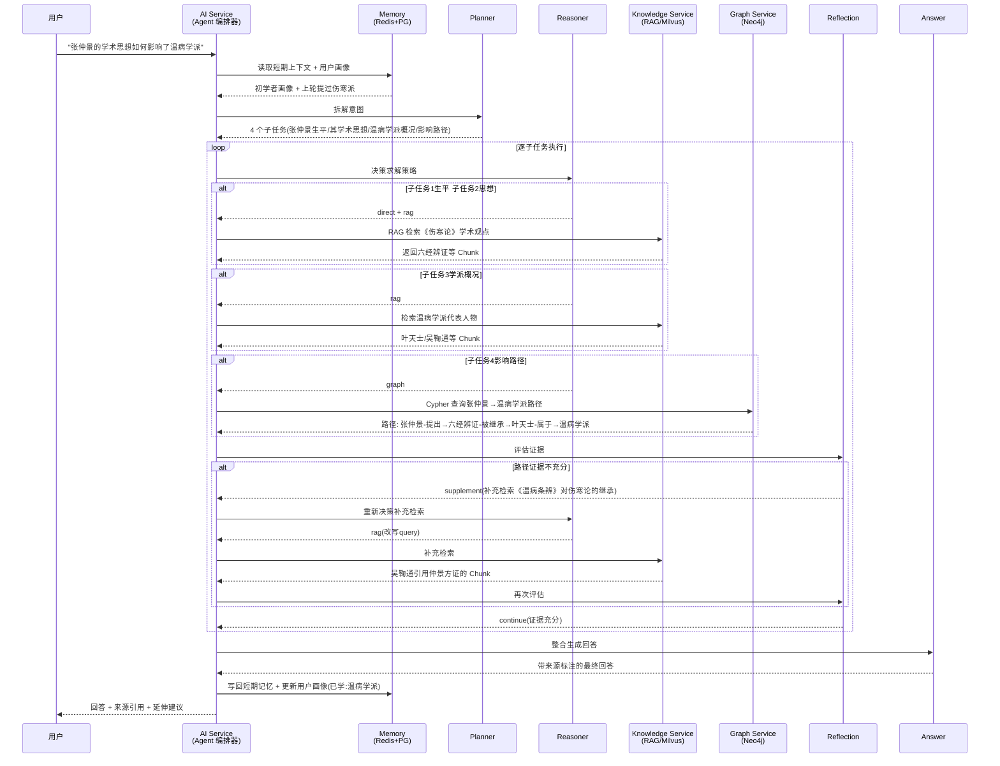
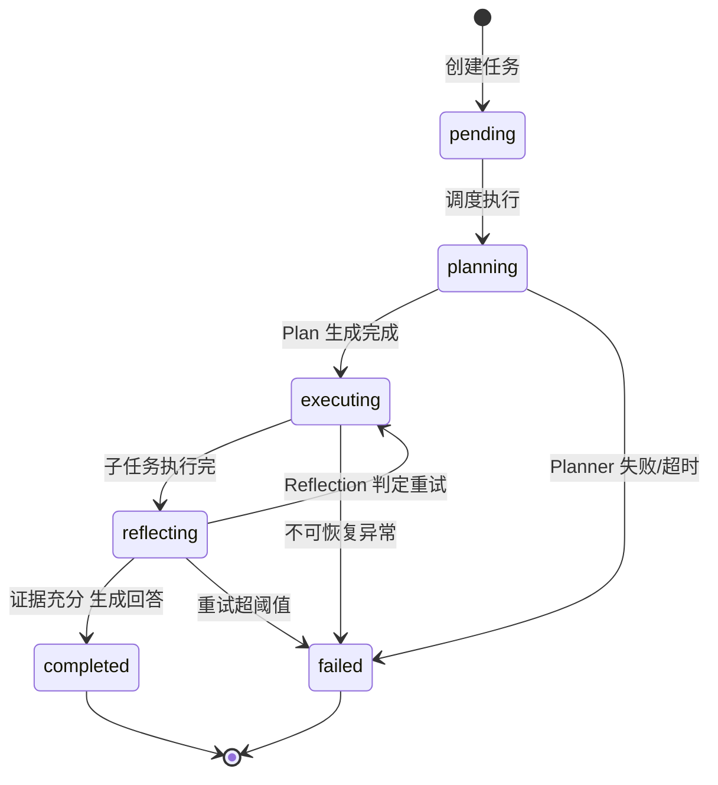

# 07 Agent 设计

## 1 为什么需要完整 Agent

单轮 RAG 把"用户提问 → 向量检索 → LLM 拼接上下文生成回答"压缩成一次线性调用，对于"《伤寒论》共有多少篇"这类事实型问题足够，但中医发展史场景下的真实提问往往是关联性、推理性、跨实体的复合问题。以"张仲景的学术思想如何影响了温病学派"为例，回答它至少要拆出四个子问题：张仲景是谁、其学术思想包含什么、温病学派是何、二者之间存在怎样的传承与影响路径。单轮 RAG 一次性检索无法把如此异构的信息需求塞进一个 query，强行合并只会让向量召回偏向某一支而漏掉另一支。

完整 Agent 引入 Planner→Reasoner→Retriever→Knowledge Graph→Memory→Reflection→Answer 七阶段链路，解决单轮 RAG 的四类固有缺陷：

- **多步推理**。复杂问题需要分步求解，前一步的结论是后一步的前提。Planner 把大问题拆成有依赖关系的子任务，Reasoner 逐个判定求解策略，使推理链路显式化、可追踪、可中断恢复。
- **意图拆解**。一个自然语言提问背后往往隐藏多个意图（查人物、查学派、查影响路径、查原文出处）。Agent 把混合意图拆成原子子任务，分别路由到最合适的检索通道，而非把所有意图压进一次模糊检索。
- **自我纠错**。Reflection 阶段对中间结果打分，当证据不足、来源冲突或答非所问时主动触发补充检索或换策略重试，形成闭环纠错，而非一次性出错即定型。
- **上下文记忆**。Memory 阶段注入短期对话窗口与长期用户学习画像，使 Agent 能理解"他"指代上一轮的哪位医家、能根据用户已学知识点调整回答深度，而非每轮从零开始。

从工程视角看，Agent 把"一次大模型调用"升级为"一条可观测、可编排、可降级的状态机流水线"，每个阶段独立打日志、独立设超时、独立选模型，整体可控性远高于黑盒式的单轮 RAG。

## 2 Agent 整体架构

AI Service 内部以 Agent 编排器为核心，将一次用户请求驱动为一个有状态的多阶段流水线。Planner 生成计划后，Reasoner 逐个子任务决策求解路径，Retriever 与 Knowledge Graph 并行或串行执行检索，Memory 在全流程中持续注入上下文，Reflection 评估中间结果质量并决定是否回退重试，最终由 Answer 整合产出带来源标注的回答。

```mermaid
graph TB
    U[用户提问] --> MEM_IN[Memory 注入上下文]
    MEM_IN --> P[Planner<br/>意图拆解与计划生成]
    P --> R[Reasoner<br/>逐子任务决策求解策略]
    R --> DEC{求解路径}
    DEC -->|需文献检索| RT[Retriever<br/>RAG 向量检索]
    DEC -->|需图谱关联| KG[Knowledge Graph<br/>Neo4j 查询]
    DEC -->|可直接回答| SK[Skip 直答]
    RT --> RF[Reflection<br/>中间结果评估]
    KG --> RF
    SK --> RF
    RF -->|证据不足| R
    RF -->|重试超阈值| FAIL[失败兜底]
    RF -->|证据充分| A[Answer<br/>整合生成带来源回答]
    A --> MEM_OUT[Memory 写回<br/>短期+长期]
    MEM_OUT --> OUT[返回用户]
    FAIL --> OUT

    MEM_IN -.读.> M1[(Memory)]
    MEM_OUT -.写.> M1
```

链路设计有三处关键约束：第一，Reasoner 到 Retriever/Knowledge Graph 的路由是运行时决策，而非编译期固定，依据子任务类型与可用工具动态选择；第二，Reflection 形成回退回路，最多重试两轮，第三轮仍不足则进入失败兜底，输出"暂无充分证据"而非硬编造；第三，Memory 既是入口（注入）也是出口（写回），贯穿全程，保证跨轮记忆连续性。

## 3 各阶段详解

### 3.1 Planner

职责是将一个自然语言问题拆解为有序、有依赖的子任务列表，并生成结构化执行计划。Planner 是整条链路的"大脑前置"，拆解质量直接决定后续检索能否覆盖问题全貌。

| 项 | 说明 |
| -- | ---- |
| 输入 | 用户原始问题、短期对话上下文（最近 N 轮）、用户学习画像（兴趣偏好、已学知识点） |
| 输出 | `Plan` 结构：子任务数组，每个子任务含 id、描述、意图类型、依赖的前置子任务 id |
| 实现要点 | 调用强模型，强制 JSON Schema 输出；内置中医领域 few-shot 示例；限制子任务数 3~6 个防过度拆解 |

意图类型枚举覆盖中医发展史的高频提问模式：`fact_lookup`（事实查询，如某人生卒年）、`thought_summary`（思想概括，如某医家学术观点）、`relation_path`（关联路径，如 A 如何影响 B）、`origin_cite`（原文溯源，如某观点出自哪部经典哪一篇）、`compare`（对比分析，如两学派异同）。

```go
type SubTask struct {
    ID           string      `json:"id"`            // t1, t2...
    Description  string      `json:"description"`   // "查询张仲景的学术思想"
    IntentType   IntentType  `json:"intent_type"`   // relation_path / thought_summary ...
    DependsOn    []string    `json:"depends_on"`    // 依赖的前置子任务 id
    SuggestedTool string     `json:"suggested_tool"` // planner 的工具建议（供 Reasoner 参考）
}

type Plan struct {
    TaskID    string    `json:"task_id"`
    Question  string    `json:"question"`
    SubTasks  []SubTask `json:"sub_tasks"`
    CreatedAt int64     `json:"created_at"`
}
```

Planner 的 Prompt 中注入用户画像后，拆解会向用户薄弱项倾斜。例如对初学者会把"温病学派"额外拆出一个背景介绍子任务，对研究者则跳过背景直接进入学术观点对比。

### 3.2 Reasoner

职责是对每个子任务推理出最优求解策略，决定走 RAG 检索、走知识图谱查询，还是直接用模型内部知识回答。Reasoner 是路由中枢，避免所有子任务无差别都打向检索通道造成的资源浪费与噪声。

| 项 | 说明 |
| -- | ---- |
| 输入 | 单个子任务、前置子任务的中间结论、可用 Tool 列表、当前 Memory 上下文 |
| 输出 | `Strategy`：选择的通道（rag / graph / tool / direct）、查询参数（query 改写、Cypher 片段、Tool 参数） |
| 实现要点 | 路由决策树 + 模型兜底；query 改写融合前序结论以提升召回；保留置信度供 Reflection 参考 |

路由决策遵循领域先验：`fact_lookup` 与 `origin_cite` 优先 RAG（原文片段在向量库），`relation_path` 优先 Knowledge Graph（Neo4j 路径），`compare` 同时触发 RAG 与 Graph。当模型判定问题属于常识或前序结论已足够，返回 `direct` 跳过检索。

```go
type Strategy struct {
    SubTaskID  string         `json:"sub_task_id"`
    Channel    Channel        `json:"channel"`    // rag / graph / tool / direct
    RAGQuery   string         `json:"rag_query"`  // 改写后的检索 query
    Cypher     string         `json:"cypher"`     // 图谱查询语句
    ToolName   string         `json:"tool_name"`  // 调用的 Tool
    ToolArgs   map[string]any `json:"tool_args"`
    Confidence float64        `json:"confidence"` // 路由置信度
}
```

Reasoner 关键的工程动作是 query 改写。原始子任务描述往往不是好的向量检索 query，需要结合前序子任务结论重写。例如子任务"查询温病学派的传承脉络"在 RAG 通道会被改写为"温病学派 吴又可 叶天士 吴鞠通 王孟英 传承 发展 学术源流"，把隐含的实体显式化以提升召回。

### 3.3 Retriever

职责是执行 RAG 检索，从 Milvus 取回与子任务相关的文献片段。Retriever 通过 Kitex RPC 调用 Knowledge Service，AI Service 自身不直接持有 Milvus 连接，保持检索能力下沉到知识上下文。

| 项 | 说明 |
| -- | ---- |
| 输入 | 改写后的 query、检索 Top-K、可选的元数据过滤（朝代、经典、学派） |
| 输出 | `Chunk` 列表，每条含原文、来源经典、章节、相似度分数、Embedding 命中标记 |
| 实现要点 | 向量检索 + BM25 关键词检索混合排序；元数据过滤收窄到相关经典；Top-K 动态调整（首轮 K=8，补充轮 K=4） |

混合检索是降低幻觉的关键。纯向量检索对中医专名（如"六经辨证""卫气营血"）的精确匹配能力弱，叠加 BM25 后能捞回向量召不中的精确术语命中。两路结果用 RRF（Reciprocal Rank Fusion）合并排序。

```go
type Chunk struct {
    ID         string  `json:"id"`
    Content    string  `json:"content"`     // 文献片段原文
    Source     string  `json:"source"`      // 《伤寒论》《温病条辨》
    Chapter    string  `json:"chapter"`     // 篇章节
    Dynasty    string  `json:"dynasty"`
    Score      float64 `json:"score"`       // 混合排序分
    HitType    string  `json:"hit_type"`    // vector / bm25 / both
}

func (a *Agent) Retrieve(ctx context.Context, q string, topK int, filter map[string]string) ([]Chunk, error) {
    // Kitex RPC 调用 Knowledge Service.HybridSearch
    resp, err := a.ksClient.HybridSearch(ctx, &ks.SearchReq{
        Query:  q,
        TopK:   int32(topK),
        Filter: filter,
    })
    // ...
}
```

### 3.4 Knowledge Graph

职责是查询 Neo4j 知识图谱，获取实体间的关联与路径。中医发展史的本质是"人物—学派—经典—思想"的传承网络，关联路径问题正是图数据库的强项，是 RAG 无法替代的能力。

| 项 | 说明 |
| -- | ---- |
| 输入 | 起止实体（如张仲景、温病学派）、关系类型过滤、最大跳数 |
| 输出 | 命中的节点列表、关系列表、最短路径与可达路径、路径语义摘要 |
| 实现要点 | Kitex RPC 调用 Graph Service；Reasoner 生成的 Cypher 经校验后执行；路径过长时做摘要压缩 |

对于"张仲景如何影响温病学派"这类关联路径问题，Knowledge Graph 执行多跳查询：从张仲景节点出发，沿 `影响`、`继承`、`引用` 关系向外扩展，找到温病学派节点及其代表人物（吴又可、叶天士、吴鞠通、王孟英），返回最短路径与关键中间节点。

```cypher
// 查询张仲景到温病学派的关联路径
MATCH path = shortestPath(
  (p:Person {name: '张仲景'})-[:影响|继承|引用*1..5]-(s:School {name: '温病学派'})
)
RETURN path
```

Graph Service 返回的原始路径可能含十几个节点，直接塞进上下文会稀释注意力。Knowledge Graph 阶段对路径做语义压缩：只保留每跳的关键节点与关系标签，如"张仲景—提出→六经辨证—被继承→叶天士—属于→温病学派"，把图结构转成线性叙事供 Answer 阶段使用。

### 3.5 Memory

职责是维护对话的短期记忆与用户的长期记忆，并在链路各阶段按需注入。Memory 不是独立于检索的一个阶段，而是横跨全流程的上下文管理组件，在 Planner 前、Answer 后分别读写。

| 项 | 说明 |
| -- | ---- |
| 输入 | 当前会话 ID、用户 ID、本轮问题、各阶段产出 |
| 输出 | 短期上下文摘要、长期画像片段（兴趣偏好、已学知识点、薄弱项） |
| 实现要点 | 短期记忆 Redis 存原始 + 摘要双份；长期记忆 PostgreSQL 结构化存储；注入策略按阶段裁剪 |

短期记忆保留最近 N 轮（默认 6 轮）的原始问答，超出后由 LLM 压缩为滚动摘要，避免上下文无限膨胀。长期记忆存储用户学习画像，包含已学知识点集合、薄弱项标签、兴趣偏好向量，用于个性化回答深度与延伸推荐。

短期与长期记忆的分工边界：短期记忆解决"对话连续性"（代词消解、上下文承接），长期记忆解决"个性化"（按用户水平调整深度、按薄弱项主动补强）。两者职责不重叠，避免重复存储。

### 3.6 Reflection

职责是评估中间结果质量，决定是否重试、补充检索或直接进入 Answer。Reflection 是 Agent 区别于流水线 pipeline 的核心机制，把单向执行变成带反馈回路的自适应系统。

| 项 | 说明 |
| -- | ---- |
| 输入 | 子任务、检索/图谱返回的证据、原始问题、已重试次数 |
| 输出 | 决策（continue / retry / supplement / abort）、质量分数、补充检索 query（若需） |
| 实现要点 | 多维评分（相关性、充分性、来源可信度）；重试上限 2 次；触发降级阈值 |

Reflection 从三个维度评估证据质量：

- **相关性**：返回的证据是否切题，分数低于 0.5 触发 query 改写重检索。
- **充分性**：证据量是否足以支撑回答，关联路径问题至少需 1 条连通路径，原文溯源至少需 1 条精确命中。
- **一致性**：多源证据是否冲突（如两本古籍对同一医家生年记载不一），冲突时触发补充检索以仲裁。

```go
type ReflectionResult struct {
    SubTaskID  string  `json:"sub_task_id"`
    Decision   string  `json:"decision"`    // continue / retry / supplement / abort
    Score      float64 `json:"score"`       // 综合质量分 0~1
    Reason     string  `json:"reason"`
    SupplementQuery string `json:"supplement_query,omitempty"`
}
```

当 Reflection 判定 `supplement` 时，会把缺口描述回传给 Reasoner 生成新的检索 query，形成 Reasoner→Retriever→Reflection 的内循环。重试累计超过 2 次仍不达标，Reflection 输出 `abort`，Answer 阶段基于已有部分证据给出带不确定标注的回答，而非硬编造。

### 3.7 Answer

职责是整合所有子任务的证据与中间结论，生成最终回答并标注来源。Answer 是链路的收敛点，承担信息综合、语言润色、来源标注三项任务。

| 项 | 说明 |
| -- | ---- |
| 输入 | 原始问题、各子任务的证据集合、图谱路径摘要、Memory 上下文 |
| 输出 | 最终回答（Markdown）、来源引用列表、延伸学习建议 |
| 实现要点 | 来源强制标注（原文引用 + 图谱节点）；区分确证与推测；按用户画像调整详略 |

Answer 的 Prompt 工程围绕三点：第一，回答中每个事实陈述必须能映射到一条证据 ID，无证据支撑的结论显式标注"推测"；第二，来源引用区分古籍原文（标注经典名与篇目）与图谱关联（标注路径）；第三，回答详略受用户画像控制，初学者自动展开术语解释，研究者则保留术语原貌。

```go
type FinalAnswer struct {
    TaskID      string         `json:"task_id"`
    Answer      string         `json:"answer"`       // Markdown 正文
    Citations   []Citation     `json:"citations"`    // 来源引用
    Suggestions []string       `json:"suggestions"`  // 延伸学习建议
    Confidence  float64        `json:"confidence"`
}

type Citation struct {
    ID       string `json:"id"`        // [1][2]...
    Type     string `json:"type"`      // classic / graph / tool
    Source   string `json:"source"`    // 《伤寒论·辨太阳病脉证并治》
    Snippet  string `json:"snippet"`   // 引用片段
}
```

## 4 多轮对话时序

以用户提问"张仲景的学术思想如何影响了温病学派"为例，展示一次完整的 Agent 多轮对话时序。该问题属 `relation_path` 意图，需同时走 RAG 与 Knowledge Graph，且 Reflection 触发一次补充检索。



时序中有两个关键控制点：子任务 4 的图谱路径首检仅返回单跳，Reflection 判定充分性不足，触发一次补充检索补充《温病条辨》对仲景方的继承证据；第二轮 Reflection 通过后才放行至 Answer。整个流程中 Memory 在入口读、出口写，保证下一轮对话能承接"温病学派"这一上下文。

## 5 Agent 与 Tool 协作

Agent 除调用 Knowledge Service 与 Graph Service 外，还可调用一组封装好的 Tool 完成结构化查询。Tool 走 MCP 协议统一注册与发现，Agent 通过 Reasoner 决定何时调用哪个 Tool，调用细节与多模型接入在第八章 MCP 设计中详述。

| Tool | 职责 | 典型调用场景 |
| ---- | ---- | ------------ |
| TimelineTool | 查询某朝代/时段的医史事件与人物 | "唐代有哪些重要医学事件" |
| PersonTool | 查询历史人物详情（生卒、师承、著作） | "叶天士的师承关系" |
| SchoolTool | 查询学派信息（代表人物、核心思想、代表著作） | "温病学派的核心观点" |
| ClassicTool | 查询经典著作（成书年代、篇目结构、内容概要） | "《温病条辨》的结构" |
| GraphTool | 执行 Cypher 查询实体关联与路径 | "张仲景和刘完素有无学术联系" |
| SearchTool | 全文检索（Meilisearch）历史内容 | "所有提到辨证论治的条目" |
| MedicineTool | 查询中药信息（性味归经、功效） | "麻黄的性味归经" |
| PrescriptionTool | 查询方剂信息（组成、主治、出处） | "银翘散的组成与出处" |

Reasoner 在决策时优先评估子任务是否能由某个 Tool 精确命中。例如"叶天士的师承关系"用 PersonTool 一次结构化查询即可拿到精确师承链，比 RAG 模糊检索更准。Tool 调用结果与 RAG/Graph 结果统一进入 Reflection 评估，对 Agent 而言三者是平行的证据来源。

## 6 记忆系统设计

### 6.1 短期记忆

短期记忆存储当前会话的对话窗口，解决跨轮的上下文连续性。存储介质为 Redis 7，以会话 ID 为 Key，保留最近 N 轮（默认 6 轮）的原始问答对。

| 字段 | 类型 | 说明 |
| ---- | ---- | ---- |
| session_id | string | 会话唯一标识 |
| user_id | string | 用户标识 |
| turns | list | 每轮含 question、answer、citations、timestamp |
| summary | string | 超出窗口轮次的滚动摘要 |
| updated_at | int64 | 最后更新时间 |

窗口管理采用"原始 + 摘要"双轨：窗口内的轮次存完整原文，供精确引用；窗口外的轮次由 LLM 压缩为一段滚动摘要，仅保留关键实体与结论，避免上下文无限增长导致 token 爆炸。摘要每超出 2 轮触发一次更新。

```go
type ShortTermMemory struct {
    SessionID string     `json:"session_id"`
    UserID    string     `json:"user_id"`
    Turns     []Turn     `json:"turns"`      // 最近 N 轮原文
    Summary   string     `json:"summary"`    // 历史滚动摘要
}

// Redis Key: mem:short:{session_id}，TTL 24h
```

### 6.2 长期记忆

长期记忆存储用户学习画像，跨会话持久，驱动个性化。存储介质为 PostgreSQL 16，按用户 ID 聚合。

| 字段 | 类型 | 说明 |
| ---- | ---- | ---- |
| user_id | string | 用户标识 |
| learned_points | jsonb | 已学知识点集合（实体名 + 掌握度） |
| weak_tags | jsonb | 薄弱项标签（如"温病学派""方剂学"） |
| interest_vector | vector | 兴趣偏好向量，用于延伸推荐 |
| study_depth | enum | 学习深度档位（beginner/intermediate/advanced） |
| updated_at | timestamp | 最后更新时间 |

学习画像在每轮 Answer 后增量更新：回答中涉及的知识点加入 `learned_points`，Reflection 标记为不确定的领域写入 `weak_tags`，用户后续追问的主题更新 `interest_vector`。`study_depth` 由历史答题正确率与对话深度综合判定，直接影响 Planner 的拆解粒度与 Answer 的详略。

### 6.3 记忆检索与注入策略

记忆注入不是无差别全量塞入，而是按阶段裁剪，控制 token 预算：

| 阶段 | 注入内容 | token 预算 |
| ---- | -------- | ---------- |
| Planner | 短期摘要 + 用户 study_depth + 兴趣偏好 | ≤ 500 |
| Reasoner | 前序子任务结论 + weak_tags（影响路由倾向） | ≤ 300 |
| Answer | 短期最近 2 轮原文 + study_depth（控制详略） | ≤ 800 |

注入策略遵循"相关性优先 + 预算上限"：长期画像中与当前问题实体相关的知识点优先注入，无关的仅注入摘要级信息。当注入内容超过阶段 token 预算时，按"摘要 > 相关知识点 > 原文"优先级裁剪，保证核心上下文不丢。

## 7 Agent 状态管理

### 7.1 AgentTask 数据模型

每次用户请求在 AI Service 内部实例化为一个 AgentTask，贯穿七阶段全生命周期。AgentTask 持久化到 PostgreSQL，支撑中断恢复、审计追溯与离线分析。

```go
type AgentTask struct {
    ID          string         `gorm:"primaryKey"`       // 任务唯一 ID
    SessionID   string         `gorm:"index"`            // 会话 ID
    UserID      string         `gorm:"index"`            // 用户 ID
    Question    string                                   // 原始问题
    Status      TaskStatus     `gorm:"index"`            // 状态机字段
    Plan        datatypes.JSON `gorm:"type:jsonb"`       // Planner 产出的 Plan
    Strategies  datatypes.JSON `gorm:"type:jsonb"`       // 各子任务 Strategy
    Evidences   datatypes.JSON `gorm:"type:jsonb"`       // 检索/图谱证据
    Reflections datatypes.JSON `gorm:"type:jsonb"`       // Reflection 结果
    Answer      string                                   // 最终回答
    RetryCount  int                                      // 累计重试次数
    ModelUsage  datatypes.JSON `gorm:"type:jsonb"`       // 各阶段模型用量与 token
    StartedAt   time.Time
    FinishedAt  *time.Time
    Error       string                                   // 失败原因
}

type TaskStatus string

const (
    StatusPending    TaskStatus = "pending"
    StatusPlanning   TaskStatus = "planning"
    StatusExecuting  TaskStatus = "executing"
    StatusReflecting TaskStatus = "reflecting"
    StatusCompleted  TaskStatus = "completed"
    StatusFailed     TaskStatus = "failed"
)
```

每个阶段完成后将产出增量写入对应 JSON 字段，并推进 Status。Evidence 与 Reflection 字段保留全量中间结果，便于离线复盘检索质量与路由准确性。

### 7.2 状态机

AgentTask 的状态流转由状态机严格控制，非法迁移直接拒绝。



状态机有三条关键迁移规则：第一，`reflecting → executing` 的回退仅允许在重试次数未超阈值（默认 2 次）时发生，超过则强制转 `failed`；第二，`planning` 阶段失败直接转 `failed`，不进入执行；第三，任意阶段的不可恢复异常（如数据库连接断开）统一兜底转 `failed` 并记录 Error。状态变更全部写 Zap 结构化日志并关联 TraceID，与链路追踪系统打通。

## 8 多模型路由策略

七阶段对模型能力的需求差异显著，统一用强模型会造成成本浪费与延迟叠加，统一用轻量模型则拉低 Planner 与 Answer 的质量。多模型适配层按阶段配置不同档位的模型，支持 OpenAI、Anthropic、通义千问、DeepSeek 四类供应商。

| 阶段 | 模型档位 | 推荐模型 | 选择理由 |
| ---- | -------- | -------- | -------- |
| Planner | 强模型 | Claude 3.5 / GPT-4o / DeepSeek-R1 | 意图拆解需要强推理与长上下文理解 |
| Reasoner | 强模型 | Claude 3.5 / DeepSeek-R1 | 路由决策与 query 改写需准确判断 |
| Retriever | 轻量模型 | 通义千问-Turbo / GPT-4o-mini | 仅做 query 改写辅助，要求低延迟 |
| Knowledge Graph | 轻量模型 | 通义千问-Turbo / GPT-4o-mini | Cypher 生成与路径摘要，结构化任务 |
| Reflection | 中等模型 | DeepSeek-V3 / GPT-4o-mini | 质量评估需一定判断力但非最强 |
| Answer | 强模型 | Claude 3.5 / GPT-4o | 整合生成与语言润色需强表达力 |

路由策略通过 Viper 配置中心管理，支持按环境（dev/staging/prod）与按租户档位（免费/付费）动态切换模型组合。配置示例如下：

```yaml
agent:
  model_routing:
    planner:    { provider: anthropic, model: claude-3-5-sonnet, max_tokens: 2000 }
    reasoner:   { provider: deepseek,  model: deepseek-reasoner, max_tokens: 1500 }
    retriever:  { provider: qwen,      model: qwen-turbo,        max_tokens: 500  }
    graph:      { provider: qwen,      model: qwen-turbo,        max_tokens: 800  }
    reflection: { provider: deepseek,  model: deepseek-chat,     max_tokens: 800  }
    answer:     { provider: anthropic, model: claude-3-5-sonnet, max_tokens: 3000 }
  fallback:
    planner:  { provider: deepseek, model: deepseek-reasoner }
    answer:   { provider: qwen,      model: qwen-max }
```

免费用户与付费用户的模型组合不同：免费用户 Planner/Answer 降级到中等模型（DeepSeek-V3 / 通义千问-Max），付费用户使用强模型，既控制成本又保证核心体验。模型档位切换通过配置热更新，无需重新部署。

## 9 容错与降级

Agent 链路依赖多个外部 LLM 供应商与内部微服务，任一环节失败都可能阻塞整条流水线。容错设计覆盖 LLM 调用、RPC 调用、状态恢复三个层面。

### 9.1 LLM 调用容错

LLM 调用是最高频的失败点，采用"重试 + 降级 + 熔断"三层防护：

| 策略 | 参数 | 说明 |
| ---- | ---- | ---- |
| 超时 | 单次 30s，阶段级 90s | 超时即判定失败，触发重试 |
| 重试 | 最多 3 次，指数退避 1s/2s/4s | 仅对 5xx 与超时重试，4xx 不重试 |
| 降级 | 主模型失败切备选模型 | Planner/Answer 有 fallback 配置 |
| 熔断 | 1 分钟内失败率 >50% 触发熔断 30s | 熔断期直接走降级模型，不再打主模型 |

```go
func (a *Agent) callLLM(ctx context.Context, stage string, prompt string) (string, error) {
    cfg := a.cfg.ModelRouting[stage]
    // 主模型调用，带超时与重试
    resp, err := a.llmClient.CallWithRetry(ctx, cfg, prompt,
        retry.Attempts(3),
        retry.Backoff(1*time.Second, 2*time.Second, 4*time.Second),
        retry.Timeout(30*time.Second),
    )
    if err == nil {
        return resp, nil
    }
    // 降级到备选模型
    if fb, ok := a.cfg.Fallback[stage]; ok {
        zap.L().Warn("llm fallback", zap.String("stage", stage), zap.Error(err))
        return a.llmClient.Call(ctx, fb, prompt)
    }
    return "", err
}
```

### 9.2 RPC 与检索降级

Knowledge Service 与 Graph Service 的 RPC 调用同样设超时与重试，但降级策略不同：检索服务不可用时，Agent 不应直接失败，而应降级为"仅基于已有证据回答 + 显式标注检索受限"。

| 故障场景 | 降级动作 |
| -------- | -------- |
| Knowledge Service 超时 | 跳过 RAG，仅用 Graph 证据，回答标注"未检索到原文佐证" |
| Graph Service 超时 | 跳过图谱查询，仅用 RAG 证据，回答标注"未验证关联路径" |
| 两者同时不可用 | 直接走 direct 通道，回答标注"基于通用知识，未经检索验证" |
| Reflection 阶段 LLM 失败 | 跳过反思，直接进入 Answer，标注"未经验证" |

降级的核心原则是"宁可标注不确定，也不编造"。任何降级路径都在最终回答的 Confidence 字段反映，并在正文显式提示证据缺口，让用户知晓回答的可靠性边界。

### 9.3 状态恢复与超时兜底

AgentTask 持久化到 PostgreSQL，使链路具备中断恢复能力。当服务重启或实例迁移时，调度器扫描处于 `planning`/`executing`/`reflecting` 状态且超过 5 分钟无更新的任务，标记为 `failed` 并向用户返回"处理中断，请重试"。这一兜底避免任务永久卡在中间态。

每阶段设独立超时预算，超时即终止该阶段并按降级策略处理。整条链路设总超时上限（默认 60s），超限直接返回当前最佳部分结果，保证用户端响应延迟可控。所有超时、重试、降级事件经 Zap 记录为结构化日志，并上报 Prometheus 指标（`agent_stage_timeout_total`、`agent_fallback_total`），用于监控链路健康度与持续优化降级阈值。
