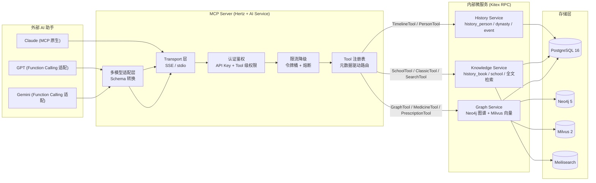
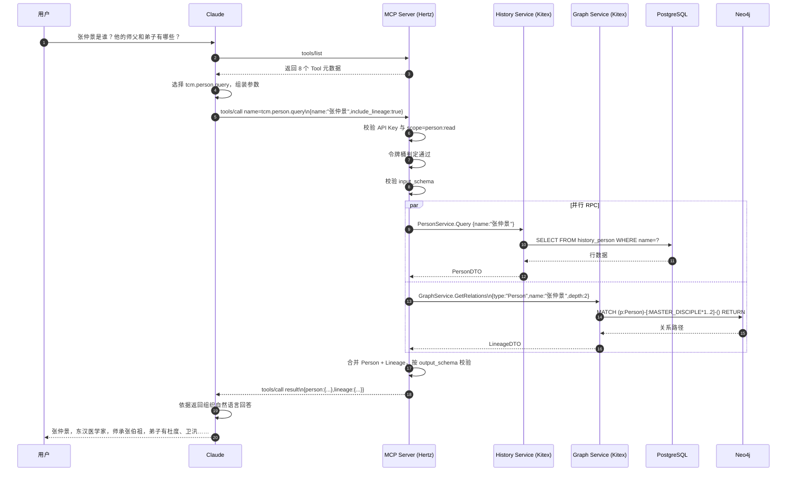
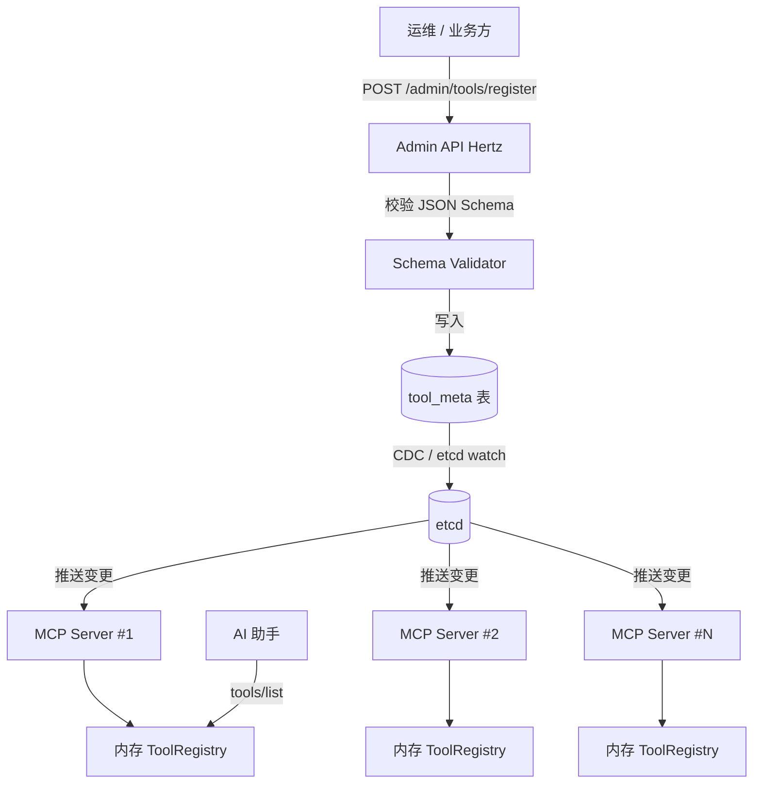
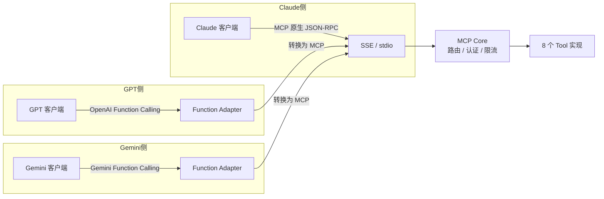

# 第八章 MCP 设计

## 8.1 MCP 的价值定位

Model Context Protocol（MCP）是 Anthropic 提出的开放协议，定义了 AI 助手与外部能力之间的标准化通信契约。在 TCM-History-AI 中，MCP 把中医发展史的全部检索、图谱、方药能力从封闭的 Web 应用中抽离出来，封装为可被任意支持 MCP 的 AI 助手直接调用的 Tool。Claude、GPT、Gemini 不再需要为每个平台单独编写插件，只要接入 MCP Server 即获得时间轴、人物、学派、经典、图谱、检索、中药、方剂八类能力。

这一设计带来三个直接收益。第一，知识能力与前端解耦，History Service、Knowledge Service、Graph Service 的业务逻辑演进不依赖任何特定 AI 厂商的 SDK。第二，Tool 调用契约以 JSON Schema 显式声明，AI 助手可在推理过程中自主选择 Tool 并组装参数，降低 prompt 工程的维护成本。第三，调用链路统一收敛到 MCP Server，便于做认证、限流、审计与降级，而非散落在多个 REST 端点上。

## 8.2 MCP 架构设计

MCP Server 基于 CloudWeGo Hertz 实现，承担协议解析、Tool 路由、认证鉴权、限流降级四项职责，对外同时暴露 SSE（Server-Sent Events）与 stdio 两种传输方式。SSE 传输面向远程 AI 助手，通过 HTTP 长连接推送 Tool 调用结果，适合 Claude Desktop、自研 Agent 等云端场景；stdio 传输面向本地进程，适合 CLI 工具与本地大模型推理框架。两种传输共享同一套 Tool 注册表与调用管线，差异仅体现在 Transport 层。

每个 MCP Tool 在内部对应一次 Kitex RPC 调用，目标服务由 Tool 元数据中的 `backend_service` 字段决定。AI Service 作为 MCP Server 的宿主，持有 History Service、Knowledge Service、Graph Service 的 Kitex Client，通过服务发现（Nacos）完成负载均衡。PostgreSQL、Neo4j、Milvus、Meilisearch 的访问全部封装在内部微服务中，MCP Server 不直接接触存储层，保证数据访问的一致性与可观测性。



Tool 路由的核心数据结构是 `ToolMeta`，注册时写入 etcd，运行时由 Registry 热加载。`backend_service` 与 `rpc_method` 共同确定一次 RPC 调用，`input_schema` 与 `output_schema` 用于参数校验与多模型适配层的 Schema 转换。

```go
type ToolMeta struct {
    Name            string          `json:"name"`
    Description     string          `json:"description"`
    BackendService  string          `json:"backend_service"`
    RPCMethod       string          `json:"rpc_method"`
    InputSchema     json.RawMessage `json:"input_schema"`
    OutputSchema    json.RawMessage `json:"output_schema"`
    RequiredScopes  []string        `json:"required_scopes"`
    TimeoutMs       int             `json:"timeout_ms"`
    Degradation     string          `json:"degradation"` // none | cache | fallback
    Enabled         bool            `json:"enabled"`
}
```

## 8.3 Tool 详细定义

八个 Tool 覆盖中医发展史平台的核心知识能力，输入输出均以 JSON Schema 声明，字段命名遵循项目数据库表结构，便于内部 RPC 直接映射 GORM Model。

### 8.3.1 TimelineTool

按朝代或时间区间查询历史事件时间轴，返回事件标题、发生年份、关联人物与经典，供 AI 助手构建叙事性回答。

| 属性 | 值 |
|---|---|
| 名称 | `tcm.timeline.query` |
| 描述 | 按朝代或起止年份查询中医历史事件时间轴 |
| 对应内部服务 | History Service / `HistoryEventService.QueryTimeline` |
| 超时 | 3000ms |
| 降级策略 | 命中本地缓存则返回缓存，否则返回空列表与降级标记 |

输入 Schema：

```json
{
  "type": "object",
  "properties": {
    "dynasty": {
      "type": "string",
      "description": "朝代名称，如「东汉」「唐代」，与 history_dynasty.name 对齐"
    },
    "start_year": { "type": "integer", "description": "起始年份（公元，负数表示公元前）" },
    "end_year": { "type": "integer", "description": "结束年份（公元）" },
    "category": {
      "type": "string",
      "enum": ["medical", "political", "cultural"],
      "description": "事件类别，默认 medical"
    },
    "limit": { "type": "integer", "default": 20, "maximum": 100 }
  },
  "oneOf": [
    { "required": ["dynasty"] },
    { "required": ["start_year", "end_year"] }
  ]
}
```

输出 Schema：

```json
{
  "type": "object",
  "properties": {
    "events": {
      "type": "array",
      "items": {
        "type": "object",
        "properties": {
          "event_id": { "type": "integer" },
          "title": { "type": "string" },
          "year": { "type": "integer" },
          "dynasty": { "type": "string" },
          "summary": { "type": "string" },
          "related_persons": { "type": "array", "items": { "type": "string" } },
          "related_books": { "type": "array", "items": { "type": "string" } }
        }
      }
    },
    "degraded": { "type": "boolean" }
  }
}
```

示例调用：

```json
{ "dynasty": "东汉", "category": "medical", "limit": 10 }
```

示例返回（节选）：

```json
{
  "events": [
    {
      "event_id": 142,
      "title": "张仲景撰《伤寒杂病论》",
      "year": 210,
      "dynasty": "东汉",
      "summary": "张仲景汇集前人医经与临证经验，确立六经辨证体系。",
      "related_persons": ["张仲景"],
      "related_books": ["伤寒杂病论"]
    }
  ],
  "degraded": false
}
```

### 8.3.2 PersonTool

查询历史人物基本信息与师承关系，师承关系从 Neo4j 的 `MASTER_DISCIPLE` 边导出，支持向上追溯师长、向下展开弟子。

| 属性 | 值 |
|---|---|
| 名称 | `tcm.person.query` |
| 描述 | 查询历史人物信息与师承关系 |
| 对应内部服务 | History Service / `PersonService.Query` + Graph Service / `GraphService.GetRelations` |
| 超时 | 2500ms |
| 降级策略 | Graph Service 不可用时返回人物基础信息，`lineage` 字段为空数组并置 `lineage_degraded=true` |

输入 Schema：

```json
{
  "type": "object",
  "properties": {
    "name": { "type": "string", "description": "人物姓名，如「张仲景」" },
    "person_id": { "type": "integer", "description": "人物 ID，与 name 二选一" },
    "include_lineage": { "type": "boolean", "default": true, "description": "是否返回师承关系" },
    "lineage_depth": { "type": "integer", "default": 2, "maximum": 5, "description": "师承关系展开深度" }
  },
  "oneOf": [
    { "required": ["name"] },
    { "required": ["person_id"] }
  ]
}
```

输出 Schema：

```json
{
  "type": "object",
  "properties": {
    "person": {
      "type": "object",
      "properties": {
        "person_id": { "type": "integer" },
        "name": { "type": "string" },
        "courtesy_name": { "type": "string", "description": "字" },
        "alias": { "type": "string", "description": "号" },
        "dynasty": { "type": "string" },
        "birth_year": { "type": "integer" },
        "death_year": { "type": "integer" },
        "hometown": { "type": "string" },
        "school": { "type": "string" },
        "major_works": { "type": "array", "items": { "type": "string" } },
        "biography": { "type": "string" }
      }
    },
    "lineage": {
      "type": "object",
      "properties": {
        "masters": { "type": "array", "items": { "type": "string" } },
        "disciples": { "type": "array", "items": { "type": "string" } }
      }
    },
    "lineage_degraded": { "type": "boolean" }
  }
}
```

示例调用：

```json
{ "name": "张仲景", "include_lineage": true, "lineage_depth": 2 }
```

示例返回（节选）：

```json
{
  "person": {
    "person_id": 38,
    "name": "张仲景",
    "courtesy_name": "仲景",
    "alias": null,
    "dynasty": "东汉",
    "birth_year": 150,
    "death_year": 219,
    "hometown": "南阳涅阳",
    "school": "伤寒学派",
    "major_works": ["伤寒杂病论"],
    "biography": "东汉末年医学家，被后世尊为医圣。"
  },
  "lineage": {
    "masters": ["张伯祖"],
    "disciples": ["杜度", "卫汛"]
  },
  "lineage_degraded": false
}
```

### 8.3.3 SchoolTool

查询中医学派信息及其代表人物、核心经典与学术主张。

| 属性 | 值 |
|---|---|
| 名称 | `tcm.school.query` |
| 描述 | 查询学派信息与代表人物 |
| 对应内部服务 | Knowledge Service / `SchoolService.Query` |
| 超时 | 2000ms |
| 降级策略 | 缓存命中则返回，否则返回学派基础字段，`representatives` 为空 |

输入 Schema：

```json
{
  "type": "object",
  "properties": {
    "name": { "type": "string", "description": "学派名称，如「伤寒学派」「温病学派」" },
    "dynasty": { "type": "string", "description": "按朝代过滤" },
    "include_representatives": { "type": "boolean", "default": true }
  },
  "required": ["name"]
}
```

输出 Schema：

```json
{
  "type": "object",
  "properties": {
    "school": {
      "type": "object",
      "properties": {
        "school_id": { "type": "integer" },
        "name": { "type": "string" },
        "founded_dynasty": { "type": "string" },
        "core_theory": { "type": "string" },
        "classics": { "type": "array", "items": { "type": "string" } },
        "representatives": {
          "type": "array",
          "items": {
            "type": "object",
            "properties": {
              "name": { "type": "string" },
              "dynasty": { "type": "string" },
              "contribution": { "type": "string" }
            }
          }
        }
      }
    }
  }
}
```

示例调用：

```json
{ "name": "温病学派", "include_representatives": true }
```

示例返回（节选）：

```json
{
  "school": {
    "school_id": 7,
    "name": "温病学派",
    "founded_dynasty": "明代",
    "core_theory": "以卫气营血与三焦辨证为核心，阐发温热病传变规律。",
    "classics": ["温热论", "温病条辨"],
    "representatives": [
      { "name": "叶天士", "dynasty": "清代", "contribution": "创立卫气营血辨证" },
      { "name": "吴鞠通", "dynasty": "清代", "contribution": "创立三焦辨证" }
    ]
  }
}
```

### 8.3.4 ClassicTool

查询经典著作的元信息与章节内容，章节内容来自 `history_book` 关联的全文索引，按 `chapter_id` 精确定位。

| 属性 | 值 |
|---|---|
| 名称 | `tcm.classic.query` |
| 描述 | 查询经典著作内容与章节 |
| 对应内部服务 | Knowledge Service / `ClassicService.Query` |
| 超时 | 3000ms |
| 降级策略 | 全文不可用时返回章节目录，`content` 字段省略并置 `content_degraded=true` |

输入 Schema：

```json
{
  "type": "object",
  "properties": {
    "title": { "type": "string", "description": "书名，如「伤寒论」" },
    "book_id": { "type": "integer" },
    "chapter_id": { "type": "integer", "description": "指定章节则只返回该章内容" },
    "keyword": { "type": "string", "description": "章节内关键词高亮检索" },
    "return_content": { "type": "boolean", "default": true }
  },
  "oneOf": [
    { "required": ["title"] },
    { "required": ["book_id"] }
  ]
}
```

输出 Schema：

```json
{
  "type": "object",
  "properties": {
    "book": {
      "type": "object",
      "properties": {
        "book_id": { "type": "integer" },
        "title": { "type": "string" },
        "author": { "type": "string" },
        "dynasty": { "type": "string" },
        "completed_year": { "type": "integer" },
        "volumes": { "type": "integer" },
        "summary": { "type": "string" }
      }
    },
    "chapters": {
      "type": "array",
      "items": {
        "type": "object",
        "properties": {
          "chapter_id": { "type": "integer" },
          "title": { "type": "string" },
          "content": { "type": "string" }
        }
      }
    },
    "content_degraded": { "type": "boolean" }
  }
}
```

示例调用：

```json
{ "title": "伤寒论", "keyword": "桂枝汤", "return_content": true }
```

示例返回（节选）：

```json
{
  "book": {
    "book_id": 12,
    "title": "伤寒论",
    "author": "张仲景",
    "dynasty": "东汉",
    "completed_year": 210,
    "volumes": 10,
    "summary": "论述外感热病辨证论治，奠定中医临床医学基础。"
  },
  "chapters": [
    {
      "chapter_id": 201,
      "title": "辨太阳病脉证并治上",
      "content": "太阳病，头痛发热，汗出恶风，桂枝汤主之。"
    }
  ],
  "content_degraded": false
}
```

### 8.3.5 GraphTool

查询知识图谱中任意两类节点之间的关联路径，底层为 Neo4j Cypher 查询，支持设定最大跳数与关系类型过滤。

| 属性 | 值 |
|---|---|
| 名称 | `tcm.graph.path` |
| 描述 | 查询知识图谱关联路径 |
| 对应内部服务 | Graph Service / `GraphService.FindPath` |
| 超时 | 4000ms |
| 降级策略 | Neo4j 不可用时返回 `paths` 为空，置 `graph_degraded=true`，并尝试从 PostgreSQL 的关系表回退单跳关系 |

输入 Schema：

```json
{
  "type": "object",
  "properties": {
    "source": {
      "type": "object",
      "properties": {
        "type": { "type": "string", "enum": ["Person", "Book", "School", "Prescription", "Medicine", "Disease", "Dynasty", "Event"] },
        "name": { "type": "string" }
      },
      "required": ["type", "name"]
    },
    "target": {
      "type": "object",
      "properties": {
        "type": { "type": "string", "enum": ["Person", "Book", "School", "Prescription", "Medicine", "Disease", "Dynasty", "Event"] },
        "name": { "type": "string" }
      },
      "required": ["type", "name"]
    },
    "max_hops": { "type": "integer", "default": 3, "maximum": 6 },
    "rel_types": {
      "type": "array",
      "items": { "type": "string" },
      "description": "限定关系类型，如 WROTE、BELONGS_TO、TREATS、CONTAINS"
    }
  },
  "required": ["source", "target"]
}
```

输出 Schema：

```json
{
  "type": "object",
  "properties": {
    "paths": {
      "type": "array",
      "items": {
        "type": "object",
        "properties": {
          "length": { "type": "integer" },
          "nodes": {
            "type": "array",
            "items": {
              "type": "object",
              "properties": {
                "type": { "type": "string" },
                "name": { "type": "string" }
              }
            }
          },
          "edges": {
            "type": "array",
            "items": {
              "type": "object",
              "properties": {
                "type": { "type": "string" },
                "direction": { "type": "string", "enum": ["out", "in"] }
              }
            }
          }
        }
      }
    },
    "graph_degraded": { "type": "boolean" }
  }
}
```

示例调用：

```json
{
  "source": { "type": "Person", "name": "张仲景" },
  "target": { "type": "Medicine", "name": "桂枝" },
  "max_hops": 3,
  "rel_types": ["WROTE", "CONTAINS", "CONTAINS_MEDICINE"]
}
```

示例返回（节选）：

```json
{
  "paths": [
    {
      "length": 3,
      "nodes": [
        { "type": "Person", "name": "张仲景" },
        { "type": "Book", "name": "伤寒论" },
        { "type": "Prescription", "name": "桂枝汤" },
        { "type": "Medicine", "name": "桂枝" }
      ],
      "edges": [
        { "type": "WROTE", "direction": "out" },
        { "type": "CONTAINS", "direction": "out" },
        { "type": "CONTAINS_MEDICINE", "direction": "out" }
      ]
    }
  ],
  "graph_degraded": false
}
```

### 8.3.6 SearchTool

全文检索中医内容，底层为 Meilisearch，索引覆盖 `history_book` 全文、`history_person` 传记、`prescription` 主治、`medicine` 功效。

| 属性 | 值 |
|---|---|
| 名称 | `tcm.search` |
| 描述 | 全文检索中医内容 |
| 对应内部服务 | Knowledge Service / `SearchService.Search` |
| 超时 | 2000ms |
| 降级策略 | Meilisearch 不可用时回退 PostgreSQL 的 `ILIKE` 模糊匹配，置 `search_degraded=true` |

输入 Schema：

```json
{
  "type": "object",
  "properties": {
    "query": { "type": "string", "description": "检索关键词" },
    "indexes": {
      "type": "array",
      "items": { "type": "string", "enum": ["book", "person", "prescription", "medicine"] },
      "default": ["book", "person"]
    },
    "filters": {
      "type": "object",
      "properties": {
        "dynasty": { "type": "string" },
        "school": { "type": "string" }
      }
    },
    "limit": { "type": "integer", "default": 10, "maximum": 50 }
  },
  "required": ["query"]
}
```

输出 Schema：

```json
{
  "type": "object",
  "properties": {
    "hits": {
      "type": "array",
      "items": {
        "type": "object",
        "properties": {
          "index": { "type": "string" },
          "id": { "type": "integer" },
          "title": { "type": "string" },
          "snippet": { "type": "string", "description": "高亮摘要" },
          "score": { "type": "number" }
        }
      }
    },
    "estimated_total": { "type": "integer" },
    "search_degraded": { "type": "boolean" }
  }
}
```

示例调用：

```json
{ "query": "六经辨证", "indexes": ["book", "person"], "limit": 5 }
```

示例返回（节选）：

```json
{
  "hits": [
    {
      "index": "book",
      "id": 12,
      "title": "伤寒论",
      "snippet": "张仲景以<em>六经辨证</em>体系论述外感热病",
      "score": 0.92
    }
  ],
  "estimated_total": 23,
  "search_degraded": false
}
```

### 8.3.7 MedicineTool

查询单味中药的性味归经、功效、主治与来源，数据来自 `medicine` 表。

| 属性 | 值 |
|---|---|
| 名称 | `tcm.medicine.query` |
| 描述 | 查询中药信息 |
| 对应内部服务 | Graph Service / `MedicineService.Query` |
| 超时 | 2000ms |
| 降级策略 | 命中缓存则返回，否则仅返回名称与性味字段 |

输入 Schema：

```json
{
  "type": "object",
  "properties": {
    "name": { "type": "string", "description": "药材名称，如「桂枝」「麻黄」" },
    "medicine_id": { "type": "integer" },
    "include_prescriptions": { "type": "boolean", "default": false, "description": "是否返回含该药的方剂列表" }
  },
  "oneOf": [
    { "required": ["name"] },
    { "required": ["medicine_id"] }
  ]
}
```

输出 Schema：

```json
{
  "type": "object",
  "properties": {
    "medicine": {
      "type": "object",
      "properties": {
        "medicine_id": { "type": "integer" },
        "name": { "type": "string" },
        "pinyin": { "type": "string" },
        "nature": { "type": "string", "description": "寒热温凉" },
        "flavor": { "type": "string", "description": "辛甘酸苦咸" },
        "meridians": { "type": "array", "items": { "type": "string" } },
        "efficacy": { "type": "string" },
        "indications": { "type": "array", "items": { "type": "string" } },
        "source": { "type": "string", "description": "原植物/动物/矿物来源" },
        "contraindication": { "type": "string" }
      }
    },
    "prescriptions": {
      "type": "array",
      "items": { "type": "string" },
      "description": "含该药的方剂名称，仅当 include_prescriptions=true 时返回"
    }
  }
}
```

示例调用：

```json
{ "name": "桂枝", "include_prescriptions": true }
```

示例返回（节选）：

```json
{
  "medicine": {
    "medicine_id": 56,
    "name": "桂枝",
    "pinyin": "guizhi",
    "nature": "温",
    "flavor": "辛甘",
    "meridians": ["心", "肺", "膀胱"],
    "efficacy": "发汗解肌，温通经脉，助阳化气",
    "indications": ["风寒表证", "肩背肢节酸痛", "痰饮蓄水"],
    "source": "樟科植物肉桂的干燥嫩枝",
    "contraindication": "温热病及阴虚阳盛之证忌用"
  },
  "prescriptions": ["桂枝汤", "麻黄汤", "桂枝茯苓丸"]
}
```

### 8.3.8 PrescriptionTool

查询方剂的组成、主治、煎服法与加减法，数据来自 `prescription` 表，组成药味通过 Graph Service 的 `CONTAINS_MEDICINE` 边关联。

| 属性 | 值 |
|---|---|
| 名称 | `tcm.prescription.query` |
| 描述 | 查询方剂组成与主治 |
| 对应内部服务 | Graph Service / `PrescriptionService.Query` |
| 超时 | 2500ms |
| 降级策略 | Graph Service 不可用时从 PostgreSQL 读取 `prescription` 表，`composition` 字段为空并置 `composition_degraded=true` |

输入 Schema：

```json
{
  "type": "object",
  "properties": {
    "name": { "type": "string", "description": "方剂名称，如「桂枝汤」「麻黄汤」" },
    "prescription_id": { "type": "integer" },
    "include_modifications": { "type": "boolean", "default": false, "description": "是否返回加减法" }
  },
  "oneOf": [
    { "required": ["name"] },
    { "required": ["prescription_id"] }
  ]
}
```

输出 Schema：

```json
{
  "type": "object",
  "properties": {
    "prescription": {
      "type": "object",
      "properties": {
        "prescription_id": { "type": "integer" },
        "name": { "type": "string" },
        "source_book": { "type": "string" },
        "author": { "type": "string" },
        "dynasty": { "type": "string" },
        "composition": {
          "type": "array",
          "items": {
            "type": "object",
            "properties": {
              "medicine": { "type": "string" },
              "dosage": { "type": "string" },
              "role": { "type": "string", "enum": ["君", "臣", "佐", "使"] }
            }
          }
        },
        "indications": { "type": "array", "items": { "type": "string" } },
        "preparation": { "type": "string" },
        "usage": { "type": "string" },
        "modifications": {
          "type": "array",
          "items": {
            "type": "object",
            "properties": {
              "condition": { "type": "string" },
              "add": { "type": "array", "items": { "type": "string" } },
              "remove": { "type": "array", "items": { "type": "string" } }
            }
          }
        }
      }
    },
    "composition_degraded": { "type": "boolean" }
  }
}
```

示例调用：

```json
{ "name": "桂枝汤", "include_modifications": true }
```

示例返回（节选）：

```json
{
  "prescription": {
    "prescription_id": 9,
    "name": "桂枝汤",
    "source_book": "伤寒论",
    "author": "张仲景",
    "dynasty": "东汉",
    "composition": [
      { "medicine": "桂枝", "dosage": "三两", "role": "君" },
      { "medicine": "芍药", "dosage": "三两", "role": "臣" },
      { "medicine": "甘草", "dosage": "二两", "role": "佐" },
      { "medicine": "生姜", "dosage": "三两", "role": "佐" },
      { "medicine": "大枣", "dosage": "十二枚", "role": "使" }
    ],
    "indications": ["外感风寒表虚证", "头痛发热汗出恶风"],
    "preparation": "上五味，㕮咀三味，以水七升，微火煮取三升",
    "usage": "适寒温，服一升，服已须臾，啜热稀粥一升余",
    "modifications": [
      { "condition": "项背强几几", "add": ["葛根"], "remove": [] },
      { "condition": "喘家作", "add": ["厚朴", "杏子"], "remove": [] }
    ]
  },
  "composition_degraded": false
}
```

## 8.4 调用时序：Claude 调用 PersonTool 查询张仲景

Claude 在对话中识别到用户询问「张仲景是谁」，根据 `tools/list` 返回的 Tool 描述选择 `tcm.person.query`，组装参数发起调用。MCP Server 完成认证、限流、参数校验后，并行调用 History Service 与 Graph Service，合并结果返回。



时序图中的并行 RPC 由 Hertz 侧用 `errgroup.Group` 实现，任一分支失败不阻塞另一分支，失败分支的结果以降级标记补齐。`tools/list` 与 `tools/call` 是 MCP 协议的标准化方法名，MCP Server 必须按协议返回 JSON-RPC 2.0 格式的响应。

## 8.5 认证与授权

MCP Server 在 Transport 层之上设置认证中间件，所有 `tools/call` 请求必须携带 API Key。API Key 通过 Hertz 中间件解析，写入请求 context 供后续限流与权限判定使用。

### 8.5.1 API Key 认证

API Key 由平台后台签发，绑定到租户或应用，存储于 PostgreSQL 的 `mcp_api_key` 表，字段包含 `key_id`、`key_hash`（bcrypt）、`tenant_id`、`scopes`、`rate_limit_rps`、`enabled`。请求头格式为 `Authorization: Bearer <api_key>`，stdio 传输则通过环境变量 `MCP_API_KEY` 注入。

认证流程为：解析 Key → bcrypt 比对 → 加载租户配置 → 写入 context。Key 比对失败返回 `401 Unauthorized`，Key 被禁用返回 `403 Forbidden`。

### 8.5.2 调用频率限制

限流采用令牌桶算法，维度为 `tenant_id + tool_name`，桶容量与填充速率由 `mcp_api_key.rate_limit_rps` 决定。令牌桶在 Redis 中以 INCR + EXPIRE 实现，避免单实例限流的偏差。超限请求返回 `429 Too Many Requests`，响应头 `Retry-After` 给出建议等待秒数。

| Tool | 默认 RPS | 突发容量 |
|---|---|---|
| TimelineTool | 10 | 20 |
| PersonTool | 10 | 20 |
| SchoolTool | 10 | 20 |
| ClassicTool | 5 | 10 |
| GraphTool | 3 | 6 |
| SearchTool | 20 | 40 |
| MedicineTool | 15 | 30 |
| PrescriptionTool | 10 | 20 |

GraphTool 因 Neo4j Cypher 开销较高，配额最紧；SearchTool 走 Meilisearch 索引，吞吐高，配额最宽。

### 8.5.3 Tool 级别权限控制

每个 API Key 持有 `scopes` 列表，Tool 元数据声明 `required_scopes`。调用时中间件比对 `scopes ⊇ required_scopes`，不满足则返回 `403 Forbidden` 并附带缺失的 scope 列表。scope 命名遵循 `<resource>:<action>` 约定，如 `person:read`、`graph:read`、`prescription:read`。

```go
func CheckScope(ctx context.Context, meta ToolMeta) error {
    scopes := ctx.Value(scopesKey).([]string)
    set := make(map[string]struct{}, len(scopes))
    for _, s := range scopes {
        set[s] = struct{}{}
    }
    for _, req := range meta.RequiredScopes {
        if _, ok := set[req]; !ok {
            return ErrMissingScope{Missing: req}
        }
    }
    return nil
}
```

scope 可在后台按租户动态调整，无需重新签发 Key，调整后通过 etcd watch 通知所有 MCP Server 实例刷新内存中的 scope 缓存。

## 8.6 错误处理与降级

MCP Server 的错误以 JSON-RPC 2.0 的 `error` 对象返回，`code` 为整数，`message` 为人类可读说明，`data` 携带结构化诊断信息。错误码分段：`-32xxx` 沿用 JSON-RPC 协议错误，`40000-40999` 为 MCP 协议错误，`50000-50999` 为业务错误。

| 错误码 | 含义 | 触发场景 | HTTP 类比 |
|---|---|---|---|
| -32600 | Invalid Request | 请求体不符合 JSON-RPC 规范 | 400 |
| -32602 | Invalid Params | input_schema 校验失败 | 422 |
| -32603 | Internal Error | RPC 调用未捕获异常 | 500 |
| 40001 | Unauthorized | API Key 缺失或无效 | 401 |
| 40003 | Forbidden | scope 不足或 Key 禁用 | 403 |
| 40029 | Rate Limited | 令牌桶耗尽 | 429 |
| 50001 | Backend Timeout | RPC 超过 ToolMeta.TimeoutMs | 504 |
| 50002 | Backend Unavailable | 下游服务熔断 | 503 |
| 50003 | Partial Degraded | 部分子调用降级 | 200（带 degraded 标记） |

降级策略在 ToolMeta 中声明，分为三档。`none` 表示不降级，失败即返回 5xx 错误；`cache` 表示优先读本地缓存（bigcache + Redis 二级），缓存未命中再返回错误；`fallback` 表示切换到备用数据源，如 SearchTool 从 Meilisearch 切到 PostgreSQL `ILIKE`，GraphTool 从 Neo4j 切到 PostgreSQL 的关系表。

熔断采用 sony/gobreaker，参数 `MaxRequests=5`、`Interval=10s`、`Timeout=30s`、`FailureRatio=0.6`。熔断器打开期间所有请求直接返回 `50002 Backend Unavailable`，避免下游雪崩。每个 `(backend_service, rpc_method)` 维护独立熔断器，单点故障不扩散到其他 Tool。

降级标记 `degraded` / `lineage_degraded` / `content_degraded` / `graph_degraded` / `search_degraded` / `composition_degraded` 在输出 Schema 中显式声明，AI 助手可据此向用户说明数据可能不完整，避免幻觉。

## 8.7 Tool 注册与发现

Tool 注册表是 MCP Server 的核心数据结构，支持静态注册与动态注册两种方式。静态注册在 AI Service 启动时从 `tool_meta` 表加载所有 `enabled=true` 的 Tool，构建内存路由表。动态注册通过 `tools/register` 方法接收新 Tool 定义，校验 schema 合法性后写入 `tool_meta` 表，并通过 etcd watch 通知集群内所有 MCP Server 实例热加载。

`tools/list` 方法返回当前注册表中所有可见 Tool，过滤条件为 `enabled=true` 且调用方 scope 满足 `required_scopes`。AI 助手在会话开始时调用 `tools/list` 拉取能力清单，作为 Tool 选择与参数组装的依据。



Tool 元数据包含版本字段 `version`，动态注册新版本时旧版本标记为 `deprecated=true`，`tools/list` 默认只返回非 deprecated 的 Tool。调用方在 `tools/call` 中可通过 `version` 字段显式指定旧版本，便于灰度迁移。版本兼容性约束：新增可选字段为 minor 升级，可不通知调用方；删除字段或修改字段语义为 major 升级，必须先发布 deprecated 版本并设置 `sunset_at` 时间戳。

## 8.8 多模型适配

同一套 Tool 需要被 Claude、GPT、Gemini 三类模型调用，但三者对外部工具的协议存在差异。Claude 原生支持 MCP，Tool 定义直接以 MCP 协议格式下发；GPT 通过 Function Calling 调用，Tool 定义需转换为 OpenAI 的 `functions` 数组；Gemini 同样使用 Function Calling，但 Schema 字段命名与 OpenAI 略有不同。多模型适配层在 MCP Server 内部完成协议转换，使八个 Tool 的实现代码保持单一。



适配层的核心职责有三项。第一，Schema 转换：MCP 的 `input_schema` 是标准 JSON Schema，OpenAI 的 `parameters` 字段同样基于 JSON Schema 但不支持 `$ref` 与 `oneOf`，Gemini 的 `parameters` 不支持 `oneOf` 且 `enum` 必须为字符串数组。适配层在 `tools/list` 返回前根据调用方标识做字段改写：将 `oneOf` 展开为 `anyOf`，将 `$ref` 内联，将整数 enum 转换为字符串 enum 并附 `enum_names`。第二，调用封装：GPT 与 Gemini 的 Function Calling 通过 HTTP 调用 MCP Server 暴露的 `/v1/functions` 端点，适配层把 OpenAI/Gemini 的 `function_call` / `functionCall` 结构转换为 MCP 的 `tools/call`，再把 MCP 的 result 包装为对应模型的返回格式。第三，错误码映射：MCP 的 `error.code` 映射为 OpenAI 的 HTTP 状态码与 `error.type`，映射为 Gemini 的 `error.code` 与 `error.status`。

```go
type ModelAdapter interface {
    ConvertTools(tools []ToolMeta) ([]byte, error)
    ConvertCall(raw []byte) (string, json.RawMessage, error) // 返回 tool name 与参数
    ConvertResult(toolName string, result json.RawMessage, err error) ([]byte, error)
}

func NewAdapter(model string) ModelAdapter {
    switch model {
    case "claude":
        return &ClaudeAdapter{}
    case "gpt":
        return &OpenAIAdapter{}
    case "gemini":
        return &GeminiAdapter{}
    default:
        return &ClaudeAdapter{}
    }
}
```

`model` 标识通过请求头 `X-Model-Vendor` 传入，SSE 与 stdio 传输均支持。Claude 走原生路径，零转换开销；GPT 与 Gemini 走适配路径，单次调用的转换开销在 1ms 以内，相对 RPC 耗时可忽略。八个 Tool 的实现代码不感知调用方模型，新增模型只需实现 `ModelAdapter` 接口并在 `NewAdapter` 中注册，无需改动任何 Tool 逻辑。

## 8.9 小结

MCP 把 TCM-History-AI 的中医知识能力以八类 Tool 的形式标准化开放，Hertz 实现的 MCP Server 承担协议、认证、限流、降级四项职责，每个 Tool 通过 Kitex RPC 调用 History Service、Knowledge Service、Graph Service，存储层由 PostgreSQL、Neo4j、Milvus、Meilisearch 分工承载。Tool 元数据驱动注册与发现，支持动态上线与版本灰度；多模型适配层以 `ModelAdapter` 接口屏蔽 Claude、GPT、Gemini 的协议差异，使同一套 Tool 实现可被三类 AI 助手无缝调用。降级标记与分段错误码保证调用链路的可观测性，AI 助手可据此向用户如实反馈数据完整性，避免在中医历史知识场景下产生幻觉。