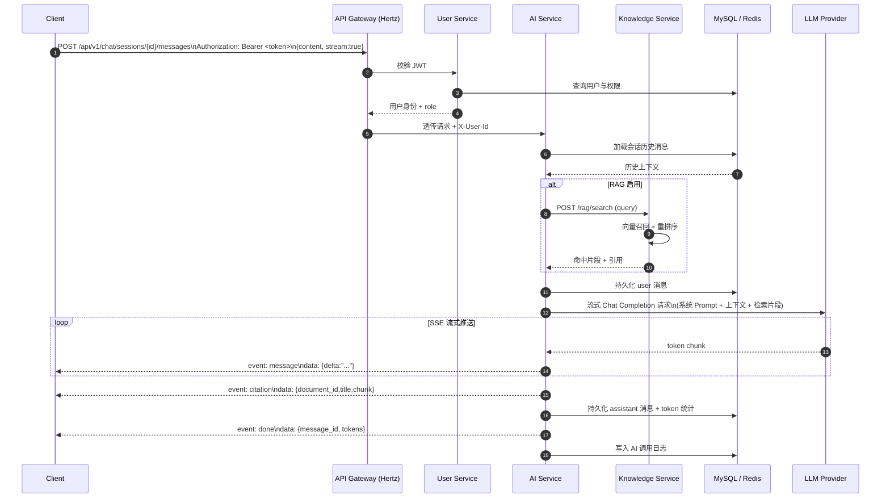
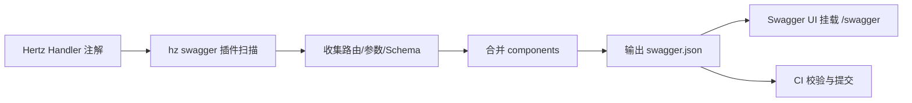

# 第十章 接口设计 OpenAPI

## 1. API 设计规范

### 1.1 设计原则

平台对外全部采用 RESTful 风格，资源以名词表达、动作以 HTTP method 表达。GET 用于查询且幂等，POST 用于创建与非幂等动作，PUT/PATCH 用于全量/部分更新，DELETE 用于删除。所有接口返回统一 JSON 结构，禁止裸返回数组或裸字符串，保证客户端解析一致性。

### 1.2 版本前缀

所有业务接口路径以 `/api/v1` 为版本前缀，内部微服务间 RPC 不携带版本前缀。版本通过 URL Path 暴露而非 Header，便于 Gateway 路由分发和缓存命中。新版本采用 `/api/v2` 并行存在，旧版本至少维护 12 个月。

### 1.3 统一响应格式

统一响应体包含四个字段：`code`（业务状态码，0 表示成功）、`message`（人类可读信息）、`data`（业务数据，可为 null）、`trace_id`（链路追踪 ID，用于排查问题）。HTTP 状态码与业务码分离：HTTP 层只表达传输层成功（2xx）或客户端错误（4xx）、服务端错误（5xx），业务语义全部由 `code` 承载。

### 1.4 分页规范

列表类接口统一使用游标与偏移两种分页模式。普通后台管理与查询使用 `page` + `page_size` 偏移分页，时序性强的数据（如消息流、日志）使用 `cursor` + `limit` 游标分页。默认 `page_size=20`，最大 `page_size=100`，超出按 100 截断。分页响应额外返回 `total`、`has_more` 字段。

### 1.5 错误码体系

错误码采用 6 位数字结构：`{服务段}{模块段}{具体错误}`。服务段范围：1xx 用户、2xx 历史、3xx 知识、4xx 图谱、5xx AI、6xx 学习、7xx 后台。例如 `100102` 表示 User Service 的认证模块 Token 过期。错误码与 HTTP 状态码存在映射关系但不强绑定。

## 2. 统一响应格式定义

### 2.1 基础响应结构

```json
{
  "code": 0,
  "message": "success",
  "data": { },
  "trace_id": "a1b2c3d4e5f6"
}
```

对应 OpenAPI Schema 定义：

```yaml
ApiResponse:
  type: object
  required: [code, message, trace_id]
  properties:
    code:
      type: integer
      description: 业务状态码，0 表示成功
      example: 0
    message:
      type: string
      description: 人类可读的提示信息
      example: success
    data:
      description: 业务数据，失败时为 null
    trace_id:
      type: string
      description: 链路追踪 ID
      example: a1b2c3d4e5f6
```

### 2.2 分页响应结构

```yaml
PagedResponse:
  allOf:
    - $ref: '#/components/schemas/ApiResponse'
    - type: object
      properties:
        data:
          type: object
          properties:
            list:
              type: array
              items: { }
            total:
              type: integer
              format: int64
              description: 记录总数
            page:
              type: integer
              description: 当前页码
            page_size:
              type: integer
              description: 每页条数
            has_more:
              type: boolean
              description: 是否还有更多数据
```

### 2.3 错误响应结构

```json
{
  "code": 100102,
  "message": "token expired",
  "data": null,
  "trace_id": "a1b2c3d4e5f6"
}
```

### 2.4 错误码分类表

| 段位 | 服务 | 范围 | 示例错误码与含义 |
|------|------|------|------------------|
| 1xxxxx | User Service | 100000–199999 | 100101 账号不存在、100102 Token 过期、100103 密码错误、100104 账号已锁定 |
| 2xxxxx | History Service | 200000–299999 | 200101 人物不存在、200202 经典已被引用不可删除、200303 朝代时间冲突 |
| 3xxxxx | Knowledge Service | 300000–399999 | 300101 文档格式不支持、300202 Embedding 任务失败、300303 向量库写入失败 |
| 4xxxxx | Graph Service | 400000–499999 | 400101 节点不存在、400202 路径不可达、400303 子图过大超过节点上限 |
| 5xxxxx | AI Service | 500000–599999 | 500101 会话不存在、500202 模型调用超时、500303 内容触发安全策略 |
| 6xxxxx | Learning Service | 600000–699999 | 600101 课程不存在、600202 已完成考试不可重复提交、600303 错题已收集 |
| 7xxxxx | Admin | 700000–799999 | 700101 权限不足、700202 操作对象不存在、700303 系统配置项非法 |
| 9xxxxx | 公共错误 | 900000–999999 | 900404 资源不存在、900429 触发限流、900500 服务内部错误、900503 依赖服务不可用 |

## 3. 认证机制

### 3.1 JWT Bearer Token

登录成功后下发 Access Token（有效期 2 小时）与 Refresh Token（有效期 7 天）。Access Token 通过 `Authorization: Bearer <token>` 头部传递，Gateway 校验签名与过期时间后写入 `X-User-Id`、`X-User-Role` 头部透传给下游服务。Token 载荷（payload）包含 `user_id`、`role`、`type`、`exp`、`iat`、`jti`，采用 HS256 签名，密钥从配置中心读取并支持热轮换。

### 3.2 Refresh Token 机制

Access Token 过期后客户端使用 Refresh Token 调用 `/api/v1/auth/refresh` 换取新的 Access Token。Refresh Token 一次性使用，刷新后旧 Token 失效并下发新 Refresh Token（滑动过期）。Refresh Token 存储于 Redis 黑白名单，登出时主动拉黑。

### 3.3 接口权限标注

每个接口标注访问级别，对应四个等级：

| 标注 | 含义 | Gateway 行为 |
|------|------|--------------|
| `[公开]` | 无需鉴权，如登录、注册、公开课程列表 | 直接放行 |
| `[登录]` | 需要有效 Access Token | 校验 Token 后透传用户身份 |
| `[会员]` | 需要会员角色，如完整 RAG 检索、AI 学习计划 | 校验 Token + 角色 `vip`/`admin` |
| `[管理员]` | 需要管理员角色，所有后台接口 | 校验 Token + 角色 `admin` |

## 4. 服务接口定义

### 4.1 User Service

User Service 负责账号生命周期、第三方登录、会员权益、消息通知，共 15 个接口。下面给出 5 个代表性接口的完整 OpenAPI 定义。

#### 4.1.1 用户注册

```yaml
POST /api/v1/auth/register
权限: [公开]
```

```yaml
paths:
  /auth/register:
    post:
      tags: [User]
      summary: 用户注册
      operationId: register
      requestBody:
        required: true
        content:
          application/json:
            schema:
              type: object
              required: [username, password, email]
              properties:
                username:
                  type: string
                  minLength: 3
                  maxLength: 32
                password:
                  type: string
                  minLength: 8
                  maxLength: 64
                email:
                  type: string
                  format: email
                invite_code:
                  type: string
                  description: 邀请码，可选
      responses:
        '200':
          description: 注册成功
          content:
            application/json:
              schema:
                allOf:
                  - $ref: '#/components/schemas/ApiResponse'
                  - properties:
                      data:
                        type: object
                        properties:
                          user_id:
                            type: integer
                            format: int64
                          access_token:
                            type: string
                          refresh_token:
                            type: string
                          expires_in:
                            type: integer
                            example: 7200
```

请求示例：

```json
{
  "username": "tcm_learner",
  "password": "Tr0ub4dor&3",
  "email": "learner@example.com",
  "invite_code": "WELCOME2026"
}
```

响应示例：

```json
{
  "code": 0,
  "message": "register success",
  "data": {
    "user_id": 1024,
    "access_token": "eyJhbGciOiJIUzI1NiIsInR5cCI6IkpXVCJ9...",
    "refresh_token": "rt_9f8e7d6c5b4a",
    "expires_in": 7200
  },
  "trace_id": "a1b2c3d4e5f6"
}
```

#### 4.1.2 用户登录

```yaml
POST /api/v1/auth/login
权限: [公开]
```

```yaml
paths:
  /auth/login:
    post:
      tags: [User]
      summary: 用户登录（支持账号密码或手机验证码）
      operationId: login
      requestBody:
        required: true
        content:
          application/json:
            schema:
              type: object
              properties:
                account:
                  type: string
                  description: 用户名 / 邮箱 / 手机号
                password:
                  type: string
                captcha_id:
                  type: string
                  description: 图形验证码 ID，连续失败后必填
                captcha_code:
                  type: string
      responses:
        '200':
          description: 登录成功
          content:
            application/json:
              schema:
                type: object
                properties:
                  code: { type: integer, example: 0 }
                  message: { type: string }
                  data:
                    type: object
                    properties:
                      user_id: { type: integer, format: int64 }
                      access_token: { type: string }
                      refresh_token: { type: string }
                      expires_in: { type: integer, example: 7200 }
                      role: { type: string, example: user }
                  trace_id: { type: string }
```

#### 4.1.3 刷新 Token

```yaml
POST /api/v1/auth/refresh
权限: [公开]
```

```yaml
paths:
  /auth/refresh:
    post:
      tags: [User]
      summary: 刷新 Access Token
      operationId: refreshToken
      requestBody:
        required: true
        content:
          application/json:
            schema:
              type: object
              required: [refresh_token]
              properties:
                refresh_token:
                  type: string
      responses:
        '200':
          description: 刷新成功
          content:
            application/json:
              schema:
                type: object
                properties:
                  code: { type: integer, example: 0 }
                  data:
                    type: object
                    properties:
                      access_token: { type: string }
                      refresh_token: { type: string }
                      expires_in: { type: integer, example: 7200 }
```

#### 4.1.4 获取当前用户信息

```yaml
GET /api/v1/users/me
权限: [登录]
```

```yaml
paths:
  /users/me:
    get:
      tags: [User]
      summary: 获取当前登录用户信息
      operationId: getCurrentUser
      security:
        - BearerAuth: []
      responses:
        '200':
          description: 成功
          content:
            application/json:
              schema:
                type: object
                properties:
                  code: { type: integer, example: 0 }
                  data:
                    type: object
                    properties:
                      id: { type: integer, format: int64, example: 1024 }
                      username: { type: string, example: tcm_learner }
                      email: { type: string, example: learner@example.com }
                      phone: { type: string }
                      avatar: { type: string, format: uri }
                      role: { type: string, example: user }
                      vip_level: { type: integer, example: 0 }
                      vip_expire_at: { type: string, format: date-time, nullable: true }
                      created_at: { type: string, format: date-time }
                      stats:
                        type: object
                        properties:
                          learning_days: { type: integer, example: 32 }
                          courses_finished: { type: integer, example: 5 }
                          questions_asked: { type: integer, example: 128 }
```

#### 4.1.5 更新用户信息

```yaml
PUT /api/v1/users/me
权限: [登录]
```

```yaml
paths:
  /users/me:
    put:
      tags: [User]
      summary: 更新当前用户资料
      operationId: updateUser
      security:
        - BearerAuth: []
      requestBody:
        required: true
        content:
          application/json:
            schema:
              type: object
              properties:
                avatar: { type: string, format: uri }
                nickname: { type: string, maxLength: 32 }
                bio: { type: string, maxLength: 200 }
                preferred_dynasties:
                  type: array
                  items: { type: string }
                  description: 感兴趣的朝代，用于个性化推荐
      responses:
        '200':
          description: 更新成功
```

#### 4.1.6 User Service 接口汇总

| # | Method | Path | 说明 | 权限 |
|---|--------|------|------|------|
| 1 | POST | /auth/register | 用户注册 | [公开] |
| 2 | POST | /auth/login | 用户登录 | [公开] |
| 3 | POST | /auth/refresh | 刷新 Token | [公开] |
| 4 | POST | /auth/logout | 登出 | [登录] |
| 5 | POST | /auth/sms/send | 发送短信验证码 | [公开] |
| 6 | POST | /auth/sms/login | 短信验证码登录 | [公开] |
| 7 | POST | /auth/oauth/{provider} | 第三方登录（wechat/github/google） | [公开] |
| 8 | POST | /auth/oauth/bind | 绑定第三方账号 | [登录] |
| 9 | DELETE | /auth/oauth/{provider} | 解绑第三方账号 | [登录] |
| 10 | GET | /users/me | 获取当前用户信息 | [登录] |
| 11 | PUT | /users/me | 更新用户资料 | [登录] |
| 12 | PUT | /users/me/password | 修改密码 | [登录] |
| 13 | POST | /users/me/avatar | 上传头像 | [登录] |
| 14 | GET | /users/me/notifications | 获取站内通知 | [登录] |
| 15 | PUT | /users/me/notifications/{id}/read | 标记通知已读 | [登录] |

### 4.2 History Service

History Service 承载中医发展史全部实体管理，是接口规模最大的服务，共 60 个接口。实体包括人物（history_person）、经典（history_book）、学派（history_school）、朝代（history_dynasty）、事件（history_event）、方剂（prescription）、药物（medicine）、疾病（disease）共 8 类。每类实体统一提供「列表、详情、创建、更新、删除、搜索」6 个接口，外加跨实体关联与时间线查询。下面给出 5 个代表性接口的完整 OpenAPI 定义。

#### 4.2.1 人物列表

```yaml
GET /api/v1/persons
权限: [公开]
```

```yaml
paths:
  /persons:
    get:
      tags: [History-Person]
      summary: 人物列表（支持分页与多条件筛选）
      operationId: listPersons
      parameters:
        - name: page
          in: query
          schema: { type: integer, default: 1 }
        - name: page_size
          in: query
          schema: { type: integer, default: 20, maximum: 100 }
        - name: dynasty
          in: query
          schema: { type: string }
          description: 朝代名称精确匹配，如「明代」
        - name: school
          in: query
          schema: { type: string }
          description: 学派 ID
        - name: keyword
          in: query
          schema: { type: string }
          description: 姓名 / 字 / 号 模糊匹配
        - name: sort
          in: query
          schema:
            type: string
            enum: [birth_year_asc, birth_year_desc, hot]
            default: birth_year_asc
        - name: fields
          in: query
          schema: { type: string }
          description: 字段裁剪，逗号分隔，如 id,name,dynasty
      responses:
        '200':
          description: 成功
          content:
            application/json:
              schema:
                type: object
                properties:
                  code: { type: integer, example: 0 }
                  data:
                    type: object
                    properties:
                      list:
                        type: array
                        items:
                          $ref: '#/components/schemas/PersonBrief'
                      total: { type: integer, format: int64 }
                      page: { type: integer }
                      page_size: { type: integer }
                      has_more: { type: boolean }
components:
  schemas:
    PersonBrief:
      type: object
      properties:
        id: { type: integer, format: int64 }
        name: { type: string, example: 李时珍 }
        courtesy_name: { type: string, example: 东璧 }
        alias: { type: string, example: 濒湖山人 }
        dynasty: { type: string, example: 明代 }
        birth_year: { type: integer, example: 1518 }
        death_year: { type: integer, example: 1593 }
        avatar: { type: string, format: uri }
        title: { type: string, example: 医药学家 }
        view_count: { type: integer, format: int64 }
```

响应示例：

```json
{
  "code": 0,
  "message": "success",
  "data": {
    "list": [
      {
        "id": 18,
        "name": "李时珍",
        "courtesy_name": "东璧",
        "alias": "濒湖山人",
        "dynasty": "明代",
        "birth_year": 1518,
        "death_year": 1593,
        "title": "医药学家",
        "view_count": 28456
      }
    ],
    "total": 1280,
    "page": 1,
    "page_size": 20,
    "has_more": true
  },
  "trace_id": "a1b2c3d4e5f6"
}
```

#### 4.2.2 人物详情

```yaml
GET /api/v1/persons/{id}
权限: [公开]
```

```yaml
paths:
  /persons/{id}:
    get:
      tags: [History-Person]
      summary: 获取人物详情（含关联经典、学派、事件）
      operationId: getPerson
      parameters:
        - name: id
          in: path
          required: true
          schema: { type: integer, format: int64 }
        - name: include
          in: query
          schema: { type: string }
          description: 关联数据，逗号分隔，如 books,events,schools
      responses:
        '200':
          description: 成功
          content:
            application/json:
              schema:
                type: object
                properties:
                  code: { type: integer, example: 0 }
                  data:
                    type: object
                    properties:
                      id: { type: integer, format: int64 }
                      name: { type: string }
                      courtesy_name: { type: string }
                      alias: { type: string }
                      dynasty: { type: string }
                      birth_year: { type: integer }
                      death_year: { type: integer }
                      birthplace: { type: string }
                      title: { type: string }
                      summary: { type: string }
                      biography: { type: string, description: Markdown 长文 }
                      avatar: { type: string, format: uri }
                      schools:
                        type: array
                        items:
                          type: object
                          properties:
                            id: { type: integer }
                            name: { type: string }
                      books:
                        type: array
                        items:
                          type: object
                          properties:
                            id: { type: integer }
                            title: { type: string }
                            year: { type: integer }
                      events:
                        type: array
                        items:
                          type: object
                          properties:
                            id: { type: integer }
                            title: { type: string }
                            occurred_at: { type: string }
        '404':
          description: 人物不存在
          content:
            application/json:
              schema:
                type: object
                properties:
                  code: { type: integer, example: 200101 }
                  message: { type: string, example: person not found }
                  data: { nullable: true }
                  trace_id: { type: string }
```

#### 4.2.3 创建人物

```yaml
POST /api/v1/persons
权限: [管理员]
```

```yaml
paths:
  /persons:
    post:
      tags: [History-Person]
      summary: 新增历史人物
      operationId: createPerson
      security:
        - BearerAuth: []
      requestBody:
        required: true
        content:
          application/json:
            schema:
              type: object
              required: [name, dynasty, birth_year]
              properties:
                name: { type: string, example: 张仲景 }
                courtesy_name: { type: string, example: 机 }
                alias: { type: string }
                dynasty: { type: string, example: 东汉 }
                birth_year: { type: integer, example: 150 }
                death_year: { type: integer, example: 219 }
                birthplace: { type: string, example: 南阳涅阳 }
                title: { type: string, example: 医圣 }
                summary: { type: string, maxLength: 500 }
                biography: { type: string, description: Markdown }
                school_ids:
                  type: array
                  items: { type: integer }
      responses:
        '201':
          description: 创建成功
          content:
            application/json:
              schema:
                type: object
                properties:
                  code: { type: integer, example: 0 }
                  data:
                    type: object
                    properties:
                      id: { type: integer, format: int64 }
```

#### 4.2.4 人物搜索（全文检索）

```yaml
POST /api/v1/persons/search
权限: [公开]
```

```yaml
paths:
  /persons/search:
    post:
      tags: [History-Person]
      summary: 人物全文检索（基于 Elasticsearch）
      operationId: searchPersons
      requestBody:
        required: true
        content:
          application/json:
            schema:
              type: object
              properties:
                query:
                  type: string
                  description: 检索关键词，支持姓名、字号、著作、事件联合匹配
                  example: 伤寒论 作者
                filters:
                  type: object
                  properties:
                    dynasty_in:
                      type: array
                      items: { type: string }
                    year_from: { type: integer }
                    year_to: { type: integer }
                    school_ids:
                      type: array
                      items: { type: integer }
                sort:
                  type: string
                  enum: [relevance, year_asc, year_desc]
                  default: relevance
                highlight: { type: boolean, default: true }
                page: { type: integer, default: 1 }
                page_size: { type: integer, default: 20, maximum: 100 }
      responses:
        '200':
          description: 成功
          content:
            application/json:
              schema:
                type: object
                properties:
                  code: { type: integer, example: 0 }
                  data:
                    type: object
                    properties:
                      list:
                        type: array
                        items:
                          type: object
                          properties:
                            id: { type: integer }
                            name: { type: string }
                            dynasty: { type: string }
                            score: { type: number, description: 相关性得分 }
                            highlight:
                              type: object
                              description: 字段高亮片段
                      total: { type: integer }
                      took_ms: { type: integer, description: 检索耗时毫秒 }
```

#### 4.2.5 时间线查询

```yaml
GET /api/v1/timeline
权限: [公开]
```

```yaml
paths:
  /timeline:
    get:
      tags: [History]
      summary: 历史时间线（按年份聚合人物、事件、经典）
      operationId: getTimeline
      parameters:
        - name: year_from
          in: query
          required: true
          schema: { type: integer, example: -206 }
        - name: year_to
          in: query
          required: true
          schema: { type: integer, example: 220 }
        - name: dynasty
          in: query
          schema: { type: string }
        - name: types
          in: query
          schema:
            type: string
            description: 聚合类型，逗号分隔，如 person,event,book
      responses:
        '200':
          description: 成功
          content:
            application/json:
              schema:
                type: object
                properties:
                  code: { type: integer, example: 0 }
                  data:
                    type: object
                    properties:
                      buckets:
                        type: array
                        items:
                          type: object
                          properties:
                            year: { type: integer }
                            dynasty: { type: string }
                            persons:
                              type: array
                              items:
                                type: object
                                properties:
                                  id: { type: integer }
                                  name: { type: string }
                                  event: { type: string, description: 出生/逝世 }
                            events:
                              type: array
                              items:
                                type: object
                                properties:
                                  id: { type: integer }
                                  title: { type: string }
                            books:
                              type: array
                              items:
                                type: object
                                properties:
                                  id: { type: integer }
                                  title: { type: string }
```

#### 4.2.6 History Service 接口汇总

下表汇总 60 个接口，每类实体（persons/books/schools/dynasties/events/prescriptions/medicines/diseases）遵循统一 CRUD + 搜索模板。

| # | Method | Path | 说明 | 权限 |
|---|--------|------|------|------|
| 1 | GET | /persons | 人物列表 | [公开] |
| 2 | GET | /persons/{id} | 人物详情 | [公开] |
| 3 | POST | /persons | 创建人物 | [管理员] |
| 4 | PUT | /persons/{id} | 更新人物 | [管理员] |
| 5 | DELETE | /persons/{id} | 删除人物 | [管理员] |
| 6 | POST | /persons/search | 人物搜索 | [公开] |
| 7 | GET | /persons/{id}/books | 人物著作 | [公开] |
| 8 | GET | /persons/{id}/events | 人物相关事件 | [公开] |
| 9 | GET | /books | 经典列表 | [公开] |
| 10 | GET | /books/{id} | 经典详情 | [公开] |
| 11 | POST | /books | 创建经典 | [管理员] |
| 12 | PUT | /books/{id} | 更新经典 | [管理员] |
| 13 | DELETE | /books/{id} | 删除经典 | [管理员] |
| 14 | POST | /books/search | 经典搜索 | [公开] |
| 15 | GET | /books/{id}/chapters | 经典章节列表 | [公开] |
| 16 | GET | /books/{id}/chapters/{cid} | 章节内容 | [公开] |
| 17 | GET | /books/{id}/authors | 经典作者 | [公开] |
| 18 | GET | /books/{id}/prescriptions | 经典方剂 | [公开] |
| 19 | GET | /schools | 学派列表 | [公开] |
| 20 | GET | /schools/{id} | 学派详情 | [公开] |
| 21 | POST | /schools | 创建学派 | [管理员] |
| 22 | PUT | /schools/{id} | 更新学派 | [管理员] |
| 23 | DELETE | /schools/{id} | 删除学派 | [管理员] |
| 24 | POST | /schools/search | 学派搜索 | [公开] |
| 25 | GET | /schools/{id}/members | 学派成员 | [公开] |
| 26 | GET | /schools/{id}/books | 学派著作 | [公开] |
| 27 | GET | /dynasties | 朝代列表 | [公开] |
| 28 | GET | /dynasties/{id} | 朝代详情 | [公开] |
| 29 | POST | /dynasties | 创建朝代 | [管理员] |
| 30 | PUT | /dynasties/{id} | 更新朝代 | [管理员] |
| 31 | DELETE | /dynasties/{id} | 删除朝代 | [管理员] |
| 32 | GET | /dynasties/{id}/persons | 朝代人物 | [公开] |
| 33 | GET | /dynasties/{id}/events | 朝代事件 | [公开] |
| 34 | GET | /dynasties/{id}/books | 朝代经典 | [公开] |
| 35 | GET | /events | 事件列表 | [公开] |
| 36 | GET | /events/{id} | 事件详情 | [公开] |
| 37 | POST | /events | 创建事件 | [管理员] |
| 38 | PUT | /events/{id} | 更新事件 | [管理员] |
| 39 | DELETE | /events/{id} | 删除事件 | [管理员] |
| 40 | POST | /events/search | 事件搜索 | [公开] |
| 41 | GET | /events/{id}/persons | 事件涉及人物 | [公开] |
| 42 | GET | /prescriptions | 方剂列表 | [公开] |
| 43 | GET | /prescriptions/{id} | 方剂详情 | [公开] |
| 44 | POST | /prescriptions | 创建方剂 | [管理员] |
| 45 | PUT | /prescriptions/{id} | 更新方剂 | [管理员] |
| 46 | DELETE | /prescriptions/{id} | 删除方剂 | [管理员] |
| 47 | POST | /prescriptions/search | 方剂搜索 | [公开] |
| 48 | GET | /prescriptions/{id}/medicines | 方剂药物组成 | [公开] |
| 49 | GET | /prescriptions/{id}/diseases | 方剂主治疾病 | [公开] |
| 50 | GET | /medicines | 药物列表 | [公开] |
| 51 | GET | /medicines/{id} | 药物详情 | [公开] |
| 52 | POST | /medicines | 创建药物 | [管理员] |
| 53 | PUT | /medicines/{id} | 更新药物 | [管理员] |
| 54 | DELETE | /medicines/{id} | 删除药物 | [管理员] |
| 55 | POST | /medicines/search | 药物搜索 | [公开] |
| 56 | GET | /diseases | 疾病列表 | [公开] |
| 57 | GET | /diseases/{id} | 疾病详情 | [公开] |
| 58 | POST | /diseases | 创建疾病 | [管理员] |
| 59 | PUT | /diseases/{id} | 更新疾病 | [管理员] |
| 60 | GET | /timeline | 历史时间线 | [公开] |

### 4.3 Knowledge Service

Knowledge Service 负责知识库文档管理、向量化、RAG 检索，共 15 个接口。下面给出 4 个代表性接口的完整 OpenAPI 定义。

#### 4.3.1 上传知识文档

```yaml
POST /api/v1/knowledge/documents
权限: [管理员]
```

```yaml
paths:
  /knowledge/documents:
    post:
      tags: [Knowledge]
      summary: 上传知识库文档（支持 PDF/Markdown/TXT/DOCX）
      operationId: uploadDocument
      security:
        - BearerAuth: []
      requestBody:
        required: true
        content:
          multipart/form-data:
            schema:
              type: object
              required: [file]
              properties:
                file:
                  type: string
                  format: binary
                title:
                  type: string
                category:
                  type: string
                  enum: [classics, modern_research, textbook, case]
                source:
                  type: string
                  description: 文档来源，如《本草纲目》《中医杂志》
                tags:
                  type: array
                  items: { type: string }
                auto_embed:
                  type: boolean
                  default: true
                  description: 上传后是否自动触发向量化
      responses:
        '201':
          description: 上传成功
          content:
            application/json:
              schema:
                type: object
                properties:
                  code: { type: integer, example: 0 }
                  data:
                    type: object
                    properties:
                      document_id: { type: integer, format: int64 }
                      embedding_task_id: { type: string, description: 向量化任务 ID }
                      status:
                        type: string
                        enum: [pending, processing, ready, failed]
                        example: pending
```

#### 4.3.2 RAG 检索

```yaml
POST /api/v1/rag/search
权限: [会员]
```

```yaml
paths:
  /rag/search:
    post:
      tags: [Knowledge]
      summary: RAG 检索（向量召回 + 重排序 + 引用片段）
      operationId: ragSearch
      security:
        - BearerAuth: []
      requestBody:
        required: true
        content:
          application/json:
            schema:
              type: object
              required: [query]
              properties:
                query:
                  type: string
                  example: 伤寒六经辨证的传变规律
                top_k:
                  type: integer
                  default: 10
                  maximum: 50
                rerank:
                  type: boolean
                  default: true
                filters:
                  type: object
                  properties:
                    categories:
                      type: array
                      items: { type: string }
                    dynasties:
                      type: array
                      items: { type: string }
                    document_ids:
                      type: array
                      items: { type: integer }
                score_threshold:
                  type: number
                  default: 0.6
                  description: 相似度阈值，低于则不返回
                return_chunks:
                  type: boolean
                  default: true
      responses:
        '200':
          description: 成功
          content:
            application/json:
              schema:
                type: object
                properties:
                  code: { type: integer, example: 0 }
                  data:
                    type: object
                    properties:
                      query: { type: string }
                      results:
                        type: array
                        items:
                          type: object
                          properties:
                            document_id: { type: integer }
                            document_title: { type: string }
                            chunk_id: { type: string }
                            content:
                              type: string
                              description: 命中的文本片段
                            score: { type: number }
                            metadata:
                              type: object
                              properties:
                                dynasty: { type: string }
                                page: { type: integer }
                                source: { type: string }
                      took_ms: { type: integer }
```

响应示例：

```json
{
  "code": 0,
  "message": "success",
  "data": {
    "query": "伤寒六经辨证的传变规律",
    "results": [
      {
        "document_id": 88,
        "document_title": "伤寒论",
        "chunk_id": "chunk_1024",
        "content": "太阳病，若发汗，若下，若亡血，无阳而阴独，复加烧针...",
        "score": 0.872,
        "metadata": {
          "dynasty": "东汉",
          "page": 12,
          "source": "《伤寒论》原文"
        }
      }
    ],
    "took_ms": 86
  },
  "trace_id": "a1b2c3d4e5f6"
}
```

#### 4.3.3 查询 Embedding 任务状态

```yaml
GET /api/v1/knowledge/embeddings/{taskId}
权限: [管理员]
```

```yaml
paths:
  /knowledge/embeddings/{taskId}:
    get:
      tags: [Knowledge]
      summary: 查询向量化任务状态
      operationId: getEmbeddingTask
      security:
        - BearerAuth: []
      parameters:
        - name: taskId
          in: path
          required: true
          schema: { type: string }
      responses:
        '200':
          description: 成功
          content:
            application/json:
              schema:
                type: object
                properties:
                  code: { type: integer, example: 0 }
                  data:
                    type: object
                    properties:
                      task_id: { type: string }
                      document_id: { type: integer }
                      status:
                        type: string
                        enum: [queued, processing, ready, failed]
                      progress:
                        type: integer
                        description: 进度百分比 0-100
                      chunk_total: { type: integer }
                      chunk_embedded: { type: integer }
                      error: { type: string, nullable: true }
                      started_at: { type: string, format: date-time }
                      finished_at: { type: string, format: date-time, nullable: true }
```

#### 4.3.4 知识文档列表

```yaml
GET /api/v1/knowledge/documents
权限: [登录]
```

```yaml
paths:
  /knowledge/documents:
    get:
      tags: [Knowledge]
      summary: 知识库文档列表
      operationId: listDocuments
      security:
        - BearerAuth: []
      parameters:
        - name: page
          in: query
          schema: { type: integer, default: 1 }
        - name: page_size
          in: query
          schema: { type: integer, default: 20 }
        - name: category
          in: query
          schema: { type: string }
        - name: status
          in: query
          schema:
            type: string
            enum: [pending, processing, ready, failed]
        - name: keyword
          in: query
          schema: { type: string }
      responses:
        '200':
          description: 成功
          content:
            application/json:
              schema:
                type: object
                properties:
                  code: { type: integer, example: 0 }
                  data:
                    type: object
                    properties:
                      list:
                        type: array
                        items:
                          type: object
                          properties:
                            id: { type: integer }
                            title: { type: string }
                            category: { type: string }
                            source: { type: string }
                            status: { type: string }
                            chunk_count: { type: integer }
                            file_size: { type: integer, format: int64 }
                            uploaded_at: { type: string, format: date-time }
                      total: { type: integer }
```

#### 4.3.5 Knowledge Service 接口汇总

| # | Method | Path | 说明 | 权限 |
|---|--------|------|------|------|
| 1 | POST | /knowledge/documents | 上传文档 | [管理员] |
| 2 | GET | /knowledge/documents | 文档列表 | [登录] |
| 3 | GET | /knowledge/documents/{id} | 文档详情 | [登录] |
| 4 | DELETE | /knowledge/documents/{id} | 删除文档 | [管理员] |
| 5 | PUT | /knowledge/documents/{id} | 更新文档元信息 | [管理员] |
| 6 | GET | /knowledge/documents/{id}/chunks | 文档分块列表 | [登录] |
| 7 | GET | /knowledge/documents/{id}/download | 下载原文档 | [登录] |
| 8 | POST | /knowledge/embeddings | 手动触发向量化 | [管理员] |
| 9 | GET | /knowledge/embeddings/{taskId} | 向量化任务状态 | [管理员] |
| 10 | GET | /knowledge/embeddings | 向量化任务列表 | [管理员] |
| 11 | POST | /rag/search | RAG 检索 | [会员] |
| 12 | POST | /rag/hybrid-search | 混合检索（向量+全文） | [会员] |
| 13 | POST | /knowledge/reindex | 重建索引 | [管理员] |
| 14 | GET | /knowledge/stats | 知识库统计 | [登录] |
| 15 | GET | /knowledge/categories | 分类列表 | [公开] |

### 4.4 Graph Service

Graph Service 基于知识图谱提供节点、关系、路径、子图查询能力，共 15 个接口。底层采用 NebulaGraph，对外封装为 RESTful 接口。下面给出 4 个代表性接口的完整 OpenAPI 定义。

#### 4.4.1 图谱节点查询

```yaml
GET /api/v1/graph/nodes/{id}
权限: [公开]
```

```yaml
paths:
  /graph/nodes/{id}:
    get:
      tags: [Graph]
      summary: 获取图谱节点（含属性与类型）
      operationId: getNode
      parameters:
        - name: id
          in: path
          required: true
          schema: { type: string, example: "person:18" }
        - name: with_relations
          in: query
          schema: { type: boolean, default: false }
        - name: relation_depth
          in: query
          schema: { type: integer, default: 1, maximum: 3 }
      responses:
        '200':
          description: 成功
          content:
            application/json:
              schema:
                type: object
                properties:
                  code: { type: integer, example: 0 }
                  data:
                    type: object
                    properties:
                      id: { type: string }
                      label:
                        type: string
                        enum: [Person, Book, School, Dynasty, Event, Prescription, Medicine, Disease]
                      properties:
                        type: object
                        additionalProperties: true
                      relations:
                        type: array
                        description: 当 with_relations=true 时返回
                        items:
                          type: object
                          properties:
                            type: { type: string, example: WROTE }
                            direction: { type: string, enum: [out, in] }
                            target_id: { type: string }
                            target_label: { type: string }
                            properties: { type: object }
```

#### 4.4.2 关系查询

```yaml
POST /api/v1/graph/relations
权限: [公开]
```

```yaml
paths:
  /graph/relations:
    post:
      tags: [Graph]
      summary: 查询节点关系（支持多跳、多类型过滤）
      operationId: queryRelations
      requestBody:
        required: true
        content:
          application/json:
            schema:
              type: object
              required: [node_id]
              properties:
                node_id: { type: string, example: "person:18" }
                relation_types:
                  type: array
                  items:
                    type: string
                    enum: [WROTE, BELONGS_TO, STUDIED, TREATED, COMPOSED_OF, CITIED]
                direction:
                  type: string
                  enum: [out, in, both]
                  default: both
                depth: { type: integer, default: 1, maximum: 3 }
                target_labels:
                  type: array
                  items: { type: string }
                limit: { type: integer, default: 50, maximum: 500 }
      responses:
        '200':
          description: 成功
          content:
            application/json:
              schema:
                type: object
                properties:
                  code: { type: integer, example: 0 }
                  data:
                    type: object
                    properties:
                      edges:
                        type: array
                        items:
                          type: object
                          properties:
                            source_id: { type: string }
                            target_id: { type: string }
                            relation_type: { type: string }
                            properties: { type: object }
                      total: { type: integer }
```

#### 4.4.3 路径查询

```yaml
POST /api/v1/graph/path
权限: [公开]
```

```yaml
paths:
  /graph/path:
    post:
      tags: [Graph]
      summary: 最短路径查询（如某人物与某经典之间的关联路径）
      operationId: queryPath
      requestBody:
        required: true
        content:
          application/json:
            schema:
              type: object
              required: [source_id, target_id]
              properties:
                source_id: { type: string, example: "person:18" }
                target_id: { type: string, example: "disease:32" }
                max_depth: { type: integer, default: 4, maximum: 6 }
                relation_types:
                  type: array
                  items: { type: string }
                algorithm:
                  type: string
                  enum: [shortest, all_simple, all_shortest]
                  default: shortest
      responses:
        '200':
          description: 成功
          content:
            application/json:
              schema:
                type: object
                properties:
                  code: { type: integer, example: 0 }
                  data:
                    type: object
                    properties:
                      paths:
                        type: array
                        items:
                          type: object
                          properties:
                            nodes:
                              type: array
                              items:
                                type: object
                                properties:
                                  id: { type: string }
                                  label: { type: string }
                                  name: { type: string }
                            edges:
                              type: array
                              items:
                                type: object
                                properties:
                                  relation_type: { type: string }
                                  direction: { type: string }
                            length: { type: integer }
                      total: { type: integer }
```

#### 4.4.4 子图查询

```yaml
POST /api/v1/graph/subgraph
权限: [公开]
```

```yaml
paths:
  /graph/subgraph:
    post:
      tags: [Graph]
      summary: 子图查询（围绕一组种子节点展开）
      operationId: querySubgraph
      requestBody:
        required: true
        content:
          application/json:
            schema:
              type: object
              required: [seed_ids]
              properties:
                seed_ids:
                  type: array
                  items: { type: string }
                  example: ["person:18", "book:42"]
                depth: { type: integer, default: 2, maximum: 3 }
                max_nodes: { type: integer, default: 100, maximum: 500 }
                node_labels:
                  type: array
                  items: { type: string }
                relation_types:
                  type: array
                  items: { type: string }
      responses:
        '200':
          description: 成功
          content:
            application/json:
              schema:
                type: object
                properties:
                  code: { type: integer, example: 0 }
                  data:
                    type: object
                    properties:
                      nodes:
                        type: array
                        items:
                          type: object
                          properties:
                            id: { type: string }
                            label: { type: string }
                            name: { type: string }
                            properties: { type: object }
                      edges:
                        type: array
                        items:
                          type: object
                          properties:
                            source: { type: string }
                            target: { type: string }
                            type: { type: string }
                      node_count: { type: integer }
                      edge_count: { type: integer }
        '400':
          description: 子图节点数超限
          content:
            application/json:
              schema:
                type: object
                properties:
                  code: { type: integer, example: 400303 }
                  message: { type: string, example: subgraph exceeds node limit }
```

#### 4.4.5 Graph Service 接口汇总

| # | Method | Path | 说明 | 权限 |
|---|--------|------|------|------|
| 1 | GET | /graph/nodes/{id} | 节点查询 | [公开] |
| 2 | POST | /graph/nodes/batch | 批量节点查询 | [公开] |
| 3 | POST | /graph/nodes/search | 节点搜索 | [公开] |
| 4 | POST | /graph/relations | 关系查询 | [公开] |
| 5 | POST | /graph/relations/batch | 批量关系查询 | [公开] |
| 6 | POST | /graph/path | 路径查询 | [公开] |
| 7 | POST | /graph/shortest-path | 最短路径 | [公开] |
| 8 | POST | /graph/all-paths | 全部简单路径 | [公开] |
| 9 | POST | /graph/subgraph | 子图查询 | [公开] |
| 10 | POST | /graph/neighbors | 邻居节点 | [公开] |
| 11 | POST | /graph/common-neighbors | 共同邻居 | [公开] |
| 12 | POST | /graph/centrality | 中心度分析 | [公开] |
| 13 | POST | /graph/community | 社区发现 | [公开] |
| 14 | GET | /graph/schema | 图谱 Schema | [公开] |
| 15 | GET | /graph/stats | 图谱统计（节点/边总数） | [公开] |

### 4.5 AI Service

AI Service 提供对话、总结、出题、考试、学习计划等智能能力，共 25 个接口。对话接口采用 SSE 流式响应。下面给出 5 个代表性接口的完整 OpenAPI 定义。

#### 4.5.1 创建会话

```yaml
POST /api/v1/chat/sessions
权限: [登录]
```

```yaml
paths:
  /chat/sessions:
    post:
      tags: [AI-Chat]
      summary: 创建对话会话
      operationId: createChatSession
      security:
        - BearerAuth: []
      requestBody:
        required: true
        content:
          application/json:
            schema:
              type: object
              properties:
                title:
                  type: string
                  maxLength: 100
                  description: 会话标题，留空则由首条消息摘要生成
                mode:
                  type: string
                  enum: [general, history_qa, prescription, diagnosis_assist]
                  default: general
                context:
                  type: object
                  properties:
                    person_id: { type: integer }
                    book_id: { type: integer }
                    rag_enabled: { type: boolean, default: true }
                model:
                  type: string
                  enum: [doubao-pro, doubao-lite, gpt-4o]
                  default: doubao-pro
      responses:
        '201':
          description: 创建成功
          content:
            application/json:
              schema:
                type: object
                properties:
                  code: { type: integer, example: 0 }
                  data:
                    type: object
                    properties:
                      session_id: { type: string, example: sess_9f8e7d6c }
                      title: { type: string }
                      mode: { type: string }
                      model: { type: string }
                      created_at: { type: string, format: date-time }
```

#### 4.5.2 发送消息（SSE 流式）

```yaml
POST /api/v1/chat/sessions/{sessionId}/messages
权限: [登录]
```

```yaml
paths:
  /chat/sessions/{sessionId}/messages:
    post:
      tags: [AI-Chat]
      summary: 发送消息并获取 SSE 流式回复
      operationId: sendChatMessage
      security:
        - BearerAuth: []
      parameters:
        - name: sessionId
          in: path
          required: true
          schema: { type: string }
      requestBody:
        required: true
        content:
          application/json:
            schema:
              type: object
              required: [content]
              properties:
                content:
                  type: string
                  maxLength: 4000
                  example: 请解释「同病异治」的含义并举一个方剂例子
                stream:
                  type: boolean
                  default: true
                  description: false 时返回完整 JSON，true 时返回 SSE 流
                attachments:
                  type: array
                  items:
                    type: object
                    properties:
                      type: { type: string, enum: [image, document] }
                      url: { type: string }
                rag_top_k: { type: integer, default: 5 }
      responses:
        '200':
          description: 流式响应
          content:
            text/event-stream:
              schema:
                type: string
                description: |
                  SSE 事件流，事件类型包括：
                  - message: 文本增量片段
                  - citation: RAG 引用片段
                  - tool_call: 工具调用通知
                  - done: 完成事件，携带完整 message_id 与 token 统计
                  - error: 错误事件
              examples:
                stream:
                  value: |
                    event: message
                    data: {"delta":"同病异治是指"}

                    event: message
                    data: {"delta":"同一疾病在不同阶段"}

                    event: citation
                    data: {"document_id":88,"title":"伤寒论","chunk":"太阳病...","score":0.91}

                    event: message
                    data: {"delta":"采用不同治法，例如麻黄汤与桂枝汤..."}

                    event: done
                    data: {"message_id":"msg_a1b2","tokens":{"prompt":128,"completion":256}}
        '200-plain':
          description: 非流式响应
          content:
            application/json:
              schema:
                type: object
                properties:
                  code: { type: integer, example: 0 }
                  data:
                    type: object
                    properties:
                      message_id: { type: string }
                      role: { type: string, example: assistant }
                      content: { type: string }
                      citations:
                        type: array
                        items:
                          type: object
                          properties:
                            document_id: { type: integer }
                            title: { type: string }
                            chunk: { type: string }
                            score: { type: number }
                      tokens:
                        type: object
                        properties:
                          prompt: { type: integer }
                          completion: { type: integer }
```

#### 4.5.3 获取会话历史消息

```yaml
GET /api/v1/chat/sessions/{sessionId}/messages
权限: [登录]
```

```yaml
paths:
  /chat/sessions/{sessionId}/messages:
    get:
      tags: [AI-Chat]
      summary: 获取会话历史消息（游标分页）
      operationId: listChatMessages
      security:
        - BearerAuth: []
      parameters:
        - name: sessionId
          in: path
          required: true
          schema: { type: string }
        - name: cursor
          in: query
          schema: { type: string, description: 上一页最后一条消息 ID }
        - name: limit
          in: query
          schema: { type: integer, default: 20, maximum: 50 }
        - name: order
          in: query
          schema:
            type: string
            enum: [asc, desc]
            default: asc
      responses:
        '200':
          description: 成功
          content:
            application/json:
              schema:
                type: object
                properties:
                  code: { type: integer, example: 0 }
                  data:
                    type: object
                    properties:
                      list:
                        type: array
                        items:
                          type: object
                          properties:
                            id: { type: string }
                            role:
                              type: string
                              enum: [user, assistant, system]
                            content: { type: string }
                            citations: { type: array, items: { type: object } }
                            created_at: { type: string, format: date-time }
                            tokens:
                              type: object
                              properties:
                                prompt: { type: integer }
                                completion: { type: integer }
                      next_cursor: { type: string, nullable: true }
                      has_more: { type: boolean }
```

#### 4.5.4 AI 总结

```yaml
POST /api/v1/ai/summarize
权限: [会员]
```

```yaml
paths:
  /ai/summarize:
    post:
      tags: [AI]
      summary: AI 内容总结（人物、经典、学习记录）
      operationId: aiSummarize
      security:
        - BearerAuth: []
      requestBody:
        required: true
        content:
          application/json:
            schema:
              type: object
              properties:
                target_type:
                  type: string
                  enum: [person, book, learning_record, custom_text]
                target_id: { type: integer, description: 当 target_type 非 custom_text 时必填 }
                text: { type: string, description: 当 target_type=custom_text 时必填 }
                style:
                  type: string
                  enum: [brief, detailed, bullet]
                  default: brief
                max_length: { type: integer, default: 500 }
      responses:
        '200':
          description: 成功
          content:
            application/json:
              schema:
                type: object
                properties:
                  code: { type: integer, example: 0 }
                  data:
                    type: object
                    properties:
                      summary: { type: string }
                      key_points:
                        type: array
                        items: { type: string }
                      tokens: { type: object }
```

#### 4.5.5 AI 出题

```yaml
POST /api/v1/ai/quiz
权限: [会员]
```

```yaml
paths:
  /ai/quiz:
    post:
      tags: [AI]
      summary: AI 自动出题（基于知识点或文档）
      operationId: aiGenerateQuiz
      security:
        - BearerAuth: []
      requestBody:
        required: true
        content:
          application/json:
            schema:
              type: object
              required: [source]
              properties:
                source:
                  type: object
                  properties:
                    type: { type: string, enum: [person, book, lesson, custom] }
                    id: { type: integer }
                    text: { type: string }
                question_types:
                  type: array
                  items:
                    type: string
                    enum: [single_choice, multi_choice, true_false, fill_blank, short_answer]
                  default: [single_choice, true_false]
                difficulty:
                  type: string
                  enum: [easy, medium, hard]
                  default: medium
                count: { type: integer, default: 10, maximum: 30 }
      responses:
        '200':
          description: 成功
          content:
            application/json:
              schema:
                type: object
                properties:
                  code: { type: integer, example: 0 }
                  data:
                    type: object
                    properties:
                      questions:
                        type: array
                        items:
                          type: object
                          properties:
                            id: { type: string }
                            type: { type: string }
                            difficulty: { type: string }
                            stem: { type: string }
                            options:
                              type: array
                              items:
                                type: object
                                properties:
                                  key: { type: string, example: A }
                                  text: { type: string }
                            answer: { type: string }
                            explanation: { type: string }
                            knowledge_points:
                              type: array
                              items: { type: string }
```

#### 4.5.6 AI Service 接口汇总

| # | Method | Path | 说明 | 权限 |
|---|--------|------|------|------|
| 1 | POST | /chat/sessions | 创建会话 | [登录] |
| 2 | GET | /chat/sessions | 会话列表 | [登录] |
| 3 | GET | /chat/sessions/{id} | 会话详情 | [登录] |
| 4 | PUT | /chat/sessions/{id} | 更新会话（标题/置顶） | [登录] |
| 5 | DELETE | /chat/sessions/{id} | 删除会话 | [登录] |
| 6 | POST | /chat/sessions/{id}/messages | 发送消息（SSE） | [登录] |
| 7 | GET | /chat/sessions/{id}/messages | 历史消息 | [登录] |
| 8 | DELETE | /chat/messages/{id} | 删除单条消息 | [登录] |
| 9 | POST | /chat/sessions/{id}/regenerate | 重新生成回复 | [登录] |
| 10 | POST | /chat/sessions/{id}/stop | 停止生成 | [登录] |
| 11 | POST | /chat/messages/{id}/feedback | 消息反馈（赞/踩） | [登录] |
| 12 | POST | /ai/summarize | AI 总结 | [会员] |
| 13 | POST | /ai/quiz | AI 出题 | [会员] |
| 14 | POST | /ai/exam | AI 生成完整试卷 | [会员] |
| 15 | POST | /ai/exam/grade | AI 主观题批改 | [会员] |
| 16 | POST | /ai/learning-plan | AI 学习计划生成 | [会员] |
| 17 | POST | /ai/knowledge-graph/explain | 知识点图谱解释 | [会员] |
| 18 | POST | /ai/translate | 古文翻译 | [会员] |
| 19 | POST | /ai/explain | 概念解释 | [会员] |
| 20 | POST | /ai/diagnosis-assist | 证候辅助分析 | [会员] |
| 21 | POST | /ai/prescription-recommend | 方剂推荐 | [会员] |
| 22 | GET | /ai/models | 可用模型列表 | [登录] |
| 23 | POST | /ai/compare-answers | 答案对比 | [会员] |
| 24 | POST | /ai/weakness-analysis | 薄弱知识点分析 | [会员] |
| 25 | POST | /ai/review-plan | 复习计划生成 | [会员] |

### 4.6 Learning Service

Learning Service 覆盖课程、课时、学习记录、学习计划、考试、错题本，共 40 个接口。下面给出 5 个代表性接口的完整 OpenAPI 定义。

#### 4.6.1 课程列表

```yaml
GET /api/v1/courses
权限: [公开]
```

```yaml
paths:
  /courses:
    get:
      tags: [Learning]
      summary: 课程列表
      operationId: listCourses
      parameters:
        - name: page
          in: query
          schema: { type: integer, default: 1 }
        - name: page_size
          in: query
          schema: { type: integer, default: 20 }
        - name: category
          in: query
          schema:
            type: string
            enum: [history, classic, prescription, clinical, culture]
        - name: difficulty
          in: query
          schema:
            type: string
            enum: [beginner, intermediate, advanced]
        - name: keyword
          in: query
          schema: { type: string }
        - name: sort
          in: query
          schema:
            type: string
            enum: [newest, hottest, rating]
            default: newest
      responses:
        '200':
          description: 成功
          content:
            application/json:
              schema:
                type: object
                properties:
                  code: { type: integer, example: 0 }
                  data:
                    type: object
                    properties:
                      list:
                        type: array
                        items:
                          type: object
                          properties:
                            id: { type: integer }
                            title: { type: string }
                            subtitle: { type: string }
                            cover: { type: string, format: uri }
                            category: { type: string }
                            difficulty: { type: string }
                            lesson_count: { type: integer }
                            duration_min: { type: integer, description: 总时长分钟 }
                            rating: { type: number, example: 4.8 }
                            student_count: { type: integer }
                            is_free: { type: boolean }
                            progress:
                              type: integer
                              description: 已登录用户的进度百分比，未登录为 0
                      total: { type: integer }
                      page: { type: integer }
                      page_size: { type: integer }
                      has_more: { type: boolean }
```

#### 4.6.2 课时详情

```yaml
GET /api/v1/lessons/{id}
权限: [登录]
```

```yaml
paths:
  /lessons/{id}:
    get:
      tags: [Learning]
      summary: 课时详情（含视频、文档、章节）
      operationId: getLesson
      security:
        - BearerAuth: []
      parameters:
        - name: id
          in: path
          required: true
          schema: { type: integer }
      responses:
        '200':
          description: 成功
          content:
            application/json:
              schema:
                type: object
                properties:
                  code: { type: integer, example: 0 }
                  data:
                    type: object
                    properties:
                      id: { type: integer }
                      course_id: { type: integer }
                      title: { type: string }
                      order: { type: integer }
                      duration_min: { type: integer }
                      video_url: { type: string, format: uri }
                      doc_url: { type: string, format: uri }
                      content: { type: string, description: Markdown 正文 }
                      attachments:
                        type: array
                        items:
                          type: object
                          properties:
                            name: { type: string }
                            url: { type: string, format: uri }
                            size: { type: integer }
                      is_free_preview: { type: boolean }
                      user_progress:
                        type: object
                        properties:
                          status:
                            type: string
                            enum: [not_started, learning, completed]
                          position_sec: { type: integer }
                          last_learned_at: { type: string, format: date-time }
```

#### 4.6.3 提交学习记录

```yaml
POST /api/v1/learning/records
权限: [登录]
```

```yaml
paths:
  /learning/records:
    post:
      tags: [Learning]
      summary: 上报学习记录（视频播放进度、文档阅读）
      operationId: submitLearningRecord
      security:
        - BearerAuth: []
      requestBody:
        required: true
        content:
          application/json:
            schema:
              type: object
              required: [lesson_id, action]
              properties:
                lesson_id: { type: integer }
                course_id: { type: integer }
                action:
                  type: string
                  enum: [start, progress, complete, pause]
                position_sec: { type: integer, description: 视频播放位置 }
                duration_sec: { type: integer, description: 本次学习时长 }
                device: { type: string, enum: [web, ios, android, pad] }
      responses:
        '200':
          description: 成功
          content:
            application/json:
              schema:
                type: object
                properties:
                  code: { type: integer, example: 0 }
                  data:
                    type: object
                    properties:
                      lesson_status: { type: string }
                      course_progress: { type: integer, description: 课程整体进度百分比 }
                      streak_days: { type: integer, description: 连续学习天数 }
```

#### 4.6.4 提交考试

```yaml
POST /api/v1/exams/{id}/submit
权限: [登录]
```

```yaml
paths:
  /exams/{id}/submit:
    post:
      tags: [Learning]
      summary: 提交考试答卷
      operationId: submitExam
      security:
        - BearerAuth: []
      parameters:
        - name: id
          in: path
          required: true
          schema: { type: integer, description: exam_id }
      requestBody:
        required: true
        content:
          application/json:
            schema:
              type: object
              required: [answers, time_used_sec]
              properties:
                answers:
                  type: array
                  items:
                    type: object
                    properties:
                      question_id: { type: string }
                      answer: { type: string, description: 客观题选项 / 主观题文本 }
                time_used_sec: { type: integer }
                client_meta:
                  type: object
                  properties:
                    device: { type: string }
                    submitted_at: { type: string, format: date-time }
      responses:
        '200':
          description: 成功
          content:
            application/json:
              schema:
                type: object
                properties:
                  code: { type: integer, example: 0 }
                  data:
                    type: object
                    properties:
                      result_id: { type: integer }
                      score: { type: number }
                      total_score: { type: number }
                      passed: { type: boolean }
                      objective_score: { type: number }
                      subjective_status:
                        type: string
                        enum: [auto_graded, pending_ai, pending_manual]
                      detail:
                        type: array
                        items:
                          type: object
                          properties:
                            question_id: { type: string }
                            correct: { type: boolean, nullable: true }
                            score: { type: number }
                            explanation: { type: string }
        '409':
          description: 已完成考试不可重复提交
          content:
            application/json:
              schema:
                type: object
                properties:
                  code: { type: integer, example: 600202 }
                  message: { type: string, example: exam already submitted }
```

#### 4.6.5 错题本

```yaml
GET /api/v1/learning/wrong-questions
权限: [登录]
```

```yaml
paths:
  /learning/wrong-questions:
    get:
      tags: [Learning]
      summary: 错题本（按知识点/课程/时间筛选）
      operationId: listWrongQuestions
      security:
        - BearerAuth: []
      parameters:
        - name: page
          in: query
          schema: { type: integer, default: 1 }
        - name: page_size
          in: query
          schema: { type: integer, default: 20 }
        - name: course_id
          in: query
          schema: { type: integer }
        - name: knowledge_point
          in: query
          schema: { type: string }
        - name: date_from
          in: query
          schema: { type: string, format: date }
        - name: date_to
          in: query
          schema: { type: string, format: date }
        - name: mastered
          in: query
          schema: { type: boolean, description: 是否已掌握 }
      responses:
        '200':
          description: 成功
          content:
            application/json:
              schema:
                type: object
                properties:
                  code: { type: integer, example: 0 }
                  data:
                    type: object
                    properties:
                      list:
                        type: array
                        items:
                          type: object
                          properties:
                            id: { type: integer }
                            question_id: { type: string }
                            stem: { type: string }
                            options: { type: array, items: { type: object } }
                            my_answer: { type: string }
                            correct_answer: { type: string }
                            explanation: { type: string }
                            knowledge_points: { type: array, items: { type: string } }
                            source_exam: { type: string }
                            wrong_count: { type: integer }
                            mastered: { type: boolean }
                            created_at: { type: string, format: date-time }
                      total: { type: integer }
                      summary:
                        type: object
                        properties:
                          total_wrong: { type: integer }
                          mastered: { type: integer }
                          pending: { type: integer }
                          top_weak_points:
                            type: array
                            items: { type: string }
```

#### 4.6.6 Learning Service 接口汇总

| # | Method | Path | 说明 | 权限 |
|---|--------|------|------|------|
| 1 | GET | /courses | 课程列表 | [公开] |
| 2 | GET | /courses/{id} | 课程详情 | [公开] |
| 3 | GET | /courses/{id}/lessons | 课时列表 | [公开] |
| 4 | GET | /lessons/{id} | 课时详情 | [登录] |
| 5 | POST | /courses/{id}/enroll | 报名课程 | [登录] |
| 6 | DELETE | /courses/{id}/enroll | 退订课程 | [登录] |
| 7 | GET | /courses/enrolled | 已报名课程 | [登录] |
| 8 | GET | /courses/{id}/progress | 课程进度 | [登录] |
| 9 | POST | /learning/records | 上报学习记录 | [登录] |
| 10 | GET | /learning/records | 学习记录查询 | [登录] |
| 11 | GET | /learning/stats | 学习统计 | [登录] |
| 12 | GET | /learning/streak | 连续学习天数 | [登录] |
| 13 | POST | /learning/plans | 创建学习计划 | [登录] |
| 14 | GET | /learning/plans | 学习计划列表 | [登录] |
| 15 | GET | /learning/plans/{id} | 学习计划详情 | [登录] |
| 16 | PUT | /learning/plans/{id} | 更新学习计划 | [登录] |
| 17 | DELETE | /learning/plans/{id} | 删除学习计划 | [登录] |
| 18 | POST | /learning/plans/{id}/tasks | 添加计划任务 | [登录] |
| 19 | PUT | /learning/plans/{id}/tasks/{tid} | 更新计划任务 | [登录] |
| 20 | DELETE | /learning/plans/{id}/tasks/{tid} | 删除计划任务 | [登录] |
| 21 | GET | /learning/plans/{id}/progress | 计划进度 | [登录] |
| 22 | GET | /exams | 考试列表 | [登录] |
| 23 | GET | /exams/{id} | 考试详情 | [登录] |
| 24 | POST | /exams/{id}/start | 开始考试 | [登录] |
| 25 | POST | /exams/{id}/submit | 提交考试 | [登录] |
| 26 | GET | /exams/{id}/results | 考试结果 | [登录] |
| 27 | GET | /exams/results | 历史成绩 | [登录] |
| 28 | GET | /exams/{id}/review | 试卷回顾 | [登录] |
| 29 | GET | /learning/wrong-questions | 错题本 | [登录] |
| 30 | GET | /learning/wrong-questions/{id} | 错题详情 | [登录] |
| 31 | POST | /learning/wrong-questions/{id}/review | 复习错题 | [登录] |
| 32 | PUT | /learning/wrong-questions/{id}/mastered | 标记已掌握 | [登录] |
| 33 | DELETE | /learning/wrong-questions/{id} | 移出错题本 | [登录] |
| 34 | GET | /learning/notes | 学习笔记列表 | [登录] |
| 35 | POST | /learning/notes | 创建笔记 | [登录] |
| 36 | GET | /learning/notes/{id} | 笔记详情 | [登录] |
| 37 | PUT | /learning/notes/{id} | 更新笔记 | [登录] |
| 38 | DELETE | /learning/notes/{id} | 删除笔记 | [登录] |
| 39 | GET | /learning/certificates | 证书列表 | [登录] |
| 40 | GET | /learning/certificates/{id} | 证书详情与下载 | [登录] |

### 4.7 后台管理

后台管理面向管理员，覆盖各实体审核、用户管理、Prompt 管理、AI 日志、系统配置，共 30 个接口。下面给出 4 个代表性接口的完整 OpenAPI 定义。

#### 4.7.1 用户管理列表

```yaml
GET /api/v1/admin/users
权限: [管理员]
```

```yaml
paths:
  /admin/users:
    get:
      tags: [Admin]
      summary: 后台用户列表（含筛选与状态）
      operationId: adminListUsers
      security:
        - BearerAuth: []
      parameters:
        - name: page
          in: query
          schema: { type: integer, default: 1 }
        - name: page_size
          in: query
          schema: { type: integer, default: 20 }
        - name: role
          in: query
          schema:
            type: string
            enum: [user, vip, editor, admin]
        - name: status
          in: query
          schema:
            type: string
            enum: [active, locked, banned]
        - name: keyword
          in: query
          schema: { type: string }
        - name: registered_from
          in: query
          schema: { type: string, format: date }
        - name: registered_to
          in: query
          schema: { type: string, format: date }
      responses:
        '200':
          description: 成功
          content:
            application/json:
              schema:
                type: object
                properties:
                  code: { type: integer, example: 0 }
                  data:
                    type: object
                    properties:
                      list:
                        type: array
                        items:
                          type: object
                          properties:
                            id: { type: integer }
                            username: { type: string }
                            email: { type: string }
                            phone: { type: string }
                            role: { type: string }
                            status: { type: string }
                            vip_level: { type: integer }
                            created_at: { type: string, format: date-time }
                            last_login_at: { type: string, format: date-time }
                      total: { type: integer }
```

#### 4.7.2 更新用户状态

```yaml
PUT /api/v1/admin/users/{id}/status
权限: [管理员]
```

```yaml
paths:
  /admin/users/{id}/status:
    put:
      tags: [Admin]
      summary: 更新用户状态（锁定/封禁/激活）
      operationId: adminUpdateUserStatus
      security:
        - BearerAuth: []
      parameters:
        - name: id
          in: path
          required: true
          schema: { type: integer }
      requestBody:
        required: true
        content:
          application/json:
            schema:
              type: object
              required: [status]
              properties:
                status:
                  type: string
                  enum: [active, locked, banned]
                reason: { type: string, maxLength: 200 }
                duration_hours:
                  type: integer
                  description: 临时封禁时长，0 表示永久
      responses:
        '200':
          description: 成功
          content:
            application/json:
              schema:
                type: object
                properties:
                  code: { type: integer, example: 0 }
                  data:
                    type: object
                    properties:
                      id: { type: integer }
                      status: { type: string }
                      updated_at: { type: string, format: date-time }
```

#### 4.7.3 创建 Prompt 模板

```yaml
POST /api/v1/admin/prompts
权限: [管理员]
```

```yaml
paths:
  /admin/prompts:
    post:
      tags: [Admin]
      summary: 创建 Prompt 模板（用于 AI Service 复用）
      operationId: adminCreatePrompt
      security:
        - BearerAuth: []
      requestBody:
        required: true
        content:
          application/json:
            schema:
              type: object
              required: [name, scene, content]
              properties:
                name: { type: string, maxLength: 64 }
                scene:
                  type: string
                  enum: [chat, summarize, quiz, exam, learning_plan, diagnosis]
                content:
                  type: string
                  description: Prompt 模板，支持 {{variable}} 占位符
                variables:
                  type: array
                  items:
                    type: object
                    properties:
                      name: { type: string }
                      type: { type: string, enum: [string, int, bool, array] }
                      required: { type: boolean }
                      default: { }
                model: { type: string }
                temperature: { type: number, minimum: 0, maximum: 2, default: 0.7 }
                is_active: { type: boolean, default: true }
                version: { type: integer, default: 1 }
      responses:
        '201':
          description: 创建成功
          content:
            application/json:
              schema:
                type: object
                properties:
                  code: { type: integer, example: 0 }
                  data:
                    type: object
                    properties:
                      id: { type: integer }
                      version: { type: integer }
```

#### 4.7.4 AI 日志查询

```yaml
GET /api/v1/admin/ai-logs
权限: [管理员]
```

```yaml
paths:
  /admin/ai-logs:
    get:
      tags: [Admin]
      summary: AI 调用日志查询
      operationId: adminListAiLogs
      security:
        - BearerAuth: []
      parameters:
        - name: page
          in: query
          schema: { type: integer, default: 1 }
        - name: page_size
          in: query
          schema: { type: integer, default: 20 }
        - name: user_id
          in: query
          schema: { type: integer }
        - name: scene
          in: query
          schema:
            type: string
            enum: [chat, summarize, quiz, exam, learning_plan]
        - name: model
          in: query
          schema: { type: string }
        - name: status
          in: query
          schema:
            type: string
            enum: [success, failed, timeout]
        - name: date_from
          in: query
          schema: { type: string, format: date }
        - name: date_to
          in: query
          schema: { type: string, format: date }
      responses:
        '200':
          description: 成功
          content:
            application/json:
              schema:
                type: object
                properties:
                  code: { type: integer, example: 0 }
                  data:
                    type: object
                    properties:
                      list:
                        type: array
                        items:
                          type: object
                          properties:
                            id: { type: string }
                            user_id: { type: integer }
                            scene: { type: string }
                            model: { type: string }
                            prompt_tokens: { type: integer }
                            completion_tokens: { type: integer }
                            latency_ms: { type: integer }
                            status: { type: string }
                            cost_cents: { type: integer, description: 调用费用（分） }
                            session_id: { type: string }
                            created_at: { type: string, format: date-time }
                            error: { type: string, nullable: true }
                      total: { type: integer }
                      summary:
                        type: object
                        properties:
                          total_calls: { type: integer }
                          success_rate: { type: number }
                          total_tokens: { type: integer }
                          total_cost_cents: { type: integer }
```

#### 4.7.5 后台管理接口汇总

| # | Method | Path | 说明 | 权限 |
|---|--------|------|------|------|
| 1 | GET | /admin/users | 用户列表 | [管理员] |
| 2 | GET | /admin/users/{id} | 用户详情 | [管理员] |
| 3 | PUT | /admin/users/{id}/status | 更新用户状态 | [管理员] |
| 4 | PUT | /admin/users/{id}/role | 更新用户角色 | [管理员] |
| 5 | PUT | /admin/users/{id}/vip | 设置会员 | [管理员] |
| 6 | DELETE | /admin/users/{id} | 删除用户 | [管理员] |
| 7 | GET | /admin/persons/pending | 人物审核列表 | [管理员] |
| 8 | PUT | /admin/persons/{id}/review | 审核人物 | [管理员] |
| 9 | GET | /admin/books/pending | 经典审核列表 | [管理员] |
| 10 | PUT | /admin/books/{id}/review | 审核经典 | [管理员] |
| 11 | GET | /admin/prescriptions/pending | 方剂审核列表 | [管理员] |
| 12 | PUT | /admin/prescriptions/{id}/review | 审核方剂 | [管理员] |
| 13 | GET | /admin/medicines/pending | 药物审核列表 | [管理员] |
| 14 | PUT | /admin/medicines/{id}/review | 审核药物 | [管理员] |
| 15 | GET | /admin/courses | 课程管理列表 | [管理员] |
| 16 | POST | /admin/courses | 创建课程 | [管理员] |
| 17 | PUT | /admin/courses/{id} | 更新课程 | [管理员] |
| 18 | DELETE | /admin/courses/{id} | 删除课程 | [管理员] |
| 19 | POST | /admin/lessons | 创建课时 | [管理员] |
| 20 | PUT | /admin/lessons/{id} | 更新课时 | [管理员] |
| 21 | GET | /admin/prompts | Prompt 列表 | [管理员] |
| 22 | POST | /admin/prompts | 创建 Prompt | [管理员] |
| 23 | PUT | /admin/prompts/{id} | 更新 Prompt | [管理员] |
| 24 | GET | /admin/prompts/{id}/versions | Prompt 版本历史 | [管理员] |
| 25 | PUT | /admin/prompts/{id}/activate | 启用指定版本 | [管理员] |
| 26 | GET | /admin/ai-logs | AI 日志列表 | [管理员] |
| 27 | GET | /admin/ai-logs/{id} | AI 日志详情 | [管理员] |
| 28 | GET | /admin/ai-logs/export | 导出 AI 日志 | [管理员] |
| 29 | GET | /admin/stats/dashboard | 运营看板 | [管理员] |
| 30 | GET | /admin/system/configs | 系统配置 | [管理员] |

## 5. AI 对话接口调用流程

下图为一次完整的 AI 对话接口调用流程，包含鉴权、上下文加载、RAG 检索、模型流式调用与 SSE 推送。



关键步骤说明：第 1-4 步在 Gateway 完成鉴权，下游服务信任 `X-User-Id`；第 6-7 步加载会话历史以维持多轮上下文；第 8-11 步仅在 `rag_enabled=true` 时执行，检索结果作为引用注入 Prompt；第 13 步起的循环通过 chunked transfer 持续推送 token，客户端边接收边渲染；最后 `done` 事件携带完整 `message_id` 与 token 用量，客户端据此更新本地会话状态。

## 6. Swagger 自动生成方案

平台采用基于 Hertz 的 OpenAPI 注解自动生成 swagger.json，避免手写 YAML 与代码漂移。具体方案如下。

### 6.1 注解定义

在 Hertz handler 上通过 `swagger-go` 风格注解声明接口元数据，编译期采集注解生成 OpenAPI 3.0 文档。注解示例：

```go
// @Summary 创建对话会话
// @Tags AI-Chat
// @Accept json
// @Produce json
// @Param body body CreateSessionRequest true "会话参数"
// @Success 201 {object} ApiResponse{data=SessionResponse}
// @Router /chat/sessions [post]
// @Security BearerAuth
func CreateChatSession(ctx *app.RequestContext) { }
```

### 6.2 生成流程



1. 在 `cmd/api` 启动时调用 `swagger.Register(swagger.Handler)` 注册内置 UI，挂载路径 `/swagger` 与 `/swagger/doc.json`。
2. CI 流水线运行 `make swagger`，调用 `hz plugin swagger` 重新生成 `api/docs/swagger.json` 并与仓库内文件 diff，差异不为空则流水线失败，强制开发者更新文档。
3. Schema 结构体定义在 `biz/model/` 下，由 IDL（Thrift/Protobuf）通过 `hz` 工具生成，保证 DTO 与文档一致。

### 6.3 鉴权与示例配置

```yaml
swagger:
  enabled: true
  ui_path: /swagger
  json_path: /swagger/doc.json
  title: TCM-History-AI API
  version: 1.0.0
  security:
    - BearerAuth: []
  components:
    securitySchemes:
      BearerAuth:
        type: http
        scheme: bearer
        bearerFormat: JWT
```

生产环境通过配置 `swagger.enabled=false` 关闭 UI，仅保留 JSON 用于对接前端代码生成与 SDK 生成。

## 7. 接口版本管理策略

### 7.1 版本策略

采用 URL Path 版本（`/api/v1`、`/api/v2`），不使用 Header 版本。同一资源在新版本下保持路径不变，旧版本接口标记为 `deprecated` 但继续维护。新版本上线后旧版本至少保留 12 个月，并在响应头 `Sunset` 与 `Deprecation` 中声明下线时间。

### 7.2 兼容性规则

- 不向后兼容的变更必须升大版本：必填字段新增、字段语义变更、删除字段、路径变更。
- 向后兼容的变更直接在当前版本迭代：新增可选字段、新增可选接口、放宽校验。
- 响应新增字段视为兼容变更，但需在变更日志中记录。

### 7.3 灰度与下线

新版本上线后通过 Gateway 按用户 ID 取模灰度 5%-50%-100% 流量。旧版本下线前 30 天在所有旧版本响应中追加 `Warning: 299 - "API v1 will be sunset on 2026-12-31"` 提示客户端迁移。下线后 Gateway 对旧版本返回 `410 Gone` 并在响应体给出迁移指引。

## 8. 接口总数汇总

| 服务 | 代表性完整定义 | 汇总表接口数 |
|------|---------------|-------------|
| User Service | 5 | 15 |
| History Service | 5 | 60 |
| Knowledge Service | 4 | 15 |
| Graph Service | 4 | 15 |
| AI Service | 5 | 25 |
| Learning Service | 5 | 40 |
| 后台管理 | 4 | 30 |
| **合计** | **32** | **200** |

平台对外 RESTful 接口总计 200 个，覆盖账号、历史实体、知识库与 RAG、知识图谱、AI 智能能力、学习闭环与后台管理全链路。所有接口统一遵循 `/api/v1` 前缀、统一响应格式、JWT 鉴权与四档权限标注，并通过 Hertz 注解自动生成 Swagger 文档，保证接口与代码的一致性。
