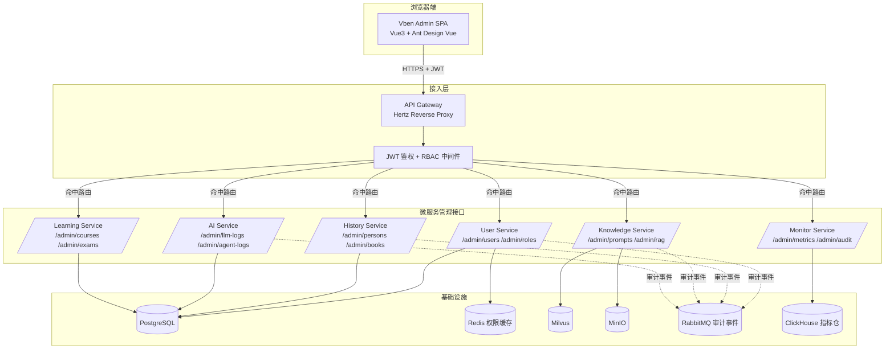
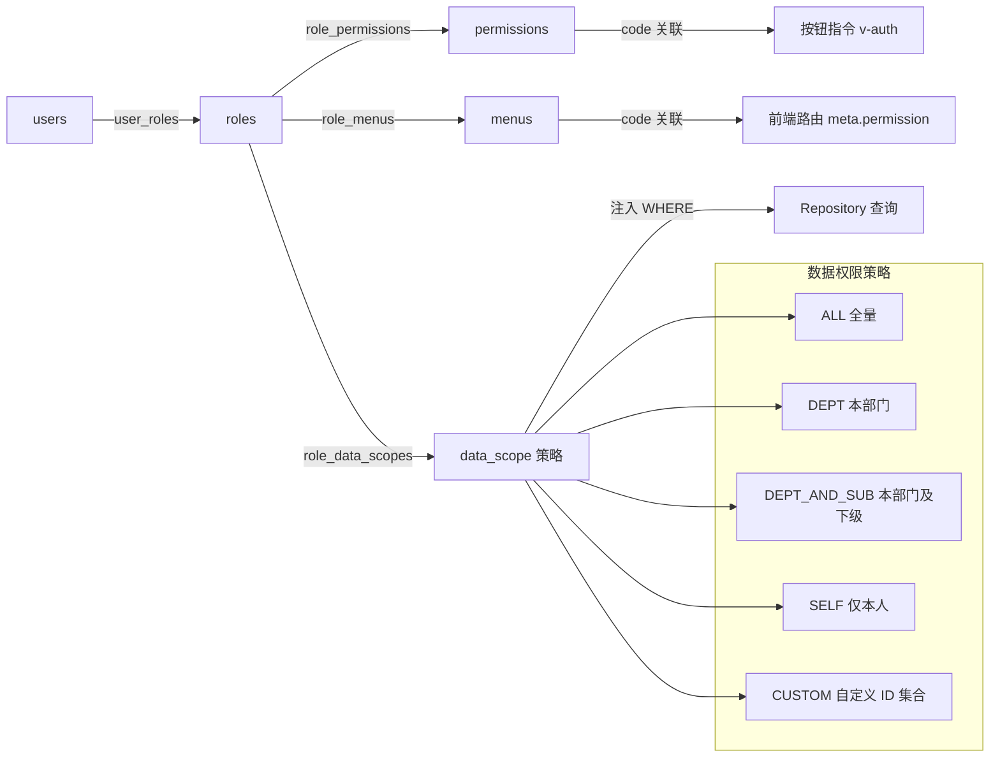
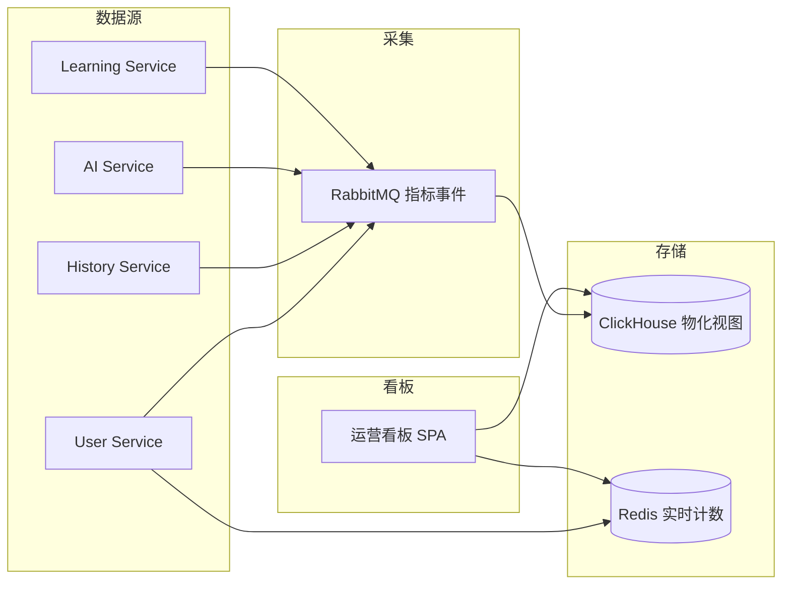
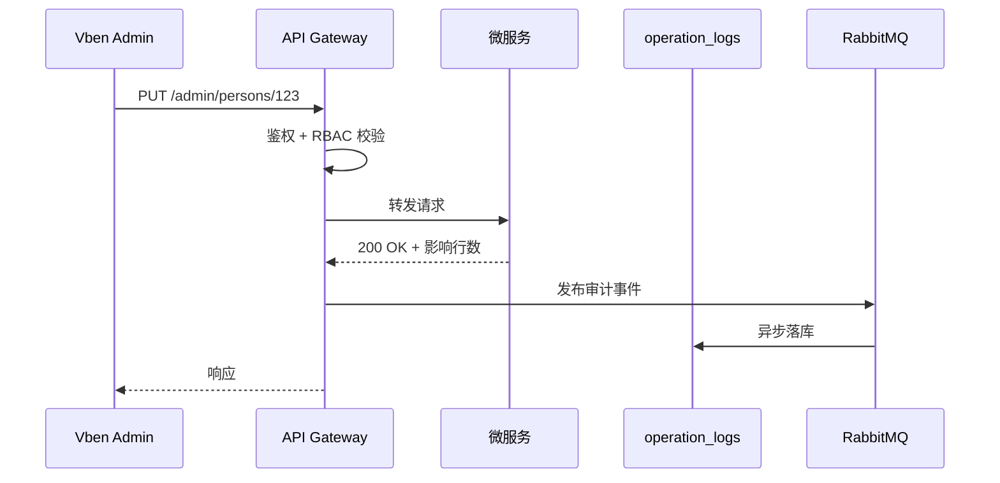
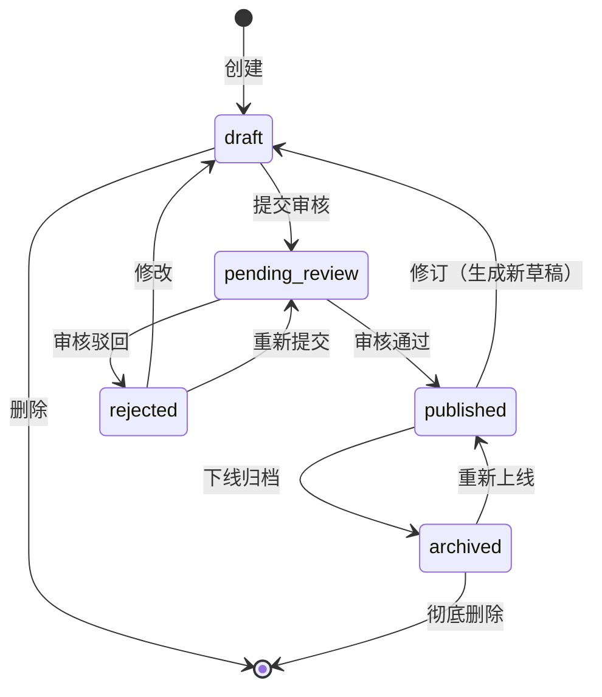

# 第十一章 后台管理设计

后台 CMS（Content Management System）是 TCM-History-AI 平台面向运营人员、内容管理员、超级管理员的统一治理入口，承担中医历史内容的生产与审核、知识库与 Prompt 的运维、AI 调用与成本的可观测、用户与权限的管控、学习数据的统计以及系统健康度的监控。前台学员端只读不写，后台承担全部写操作与审核职责，所有写请求经过 API Gateway 鉴权后落到对应微服务的管理接口，确保数据入口唯一、可审计、可回滚。

## 一、后台架构

后台前端基于 Vue3 + Vben Admin + Ant Design Vue 构建，复用 Vben Admin 的 ProTable、ProForm、BasicLayout 组件体系；后端复用六大微服务的管理接口，通过 API Gateway 统一路由、鉴权、限流。后台不另起服务，而是各微服务在 Hertz 中注册 `/admin/**` 路由组，由 Gateway 的路由策略区分前台 `/api/**` 与后台 `/admin/**` 流量，前者走学员 JWT，后者走管理员 JWT + RBAC 二次校验。

后台前端按 Vben Admin 的多标签页布局组织：左侧菜单树由后端 `GET /admin/menus/current` 动态下发，按当前用户角色过滤可见节点；顶部为面包屑与全局搜索；主区采用 ProTable + 抽屉/弹窗表单的 CRUD 范式，列表页统一支持搜索、列配置、批量选择、导出，详情页统一采用描述列表 + Tab 切换。

## 二、权限模型 RBAC

后台权限遵循 RBAC（Role-Based Access Control）模型，叠加菜单权限、数据权限、按钮权限三层粒度。`users` 与 `roles` 为多对多关系（`user_roles` 可带 `expired_at` 支持临时授权），`roles` 与 `permissions` 为多对多关系（`role_permissions`）。`permissions.code` 形如 `history:person:write`，`resource` 与 `action` 字段支撑粗粒度筛选。菜单权限与按钮权限以 `permission_code` 为关联键挂在前端路由与按钮指令上，数据权限通过角色绑定的 `data_scope` 策略在 Repository 层注入 WHERE 条件。

平台预置五类内置角色（`roles.is_builtin = true`，不可删除）：

| 角色 code | 名称 | 数据权限 | 适用对象 |
|---|---|---|---|
| `super_admin` | 超级管理员 | ALL | 平台运维负责人 |
| `content_admin` | 内容管理员 | ALL（仅内容域） | 中医内容编辑团队 |
| `ai_admin` | AI 运维管理员 | ALL（仅 AI 域） | Prompt 与 RAG 调优人员 |
| `teacher` | 教师 | SELF + 所授课程 | 课程讲师 |
| `auditor` | 审核员 | ALL（仅审核队列） | 内容合规审核 |

权限校验链路为：Gateway JWT 解析 → 拉取用户角色与权限集合（Redis 缓存 5 分钟，写操作主动失效）→ 中间件比对路由所需 `permission_code` → Repository 层根据角色 `data_scope` 注入查询条件。前端按钮通过 `v-auth="'history:person:delete'"` 指令控制显隐，避免越权点击后端再拦截造成的体验断层。

## 三、功能模块详解

### 3.1 内容管理

内容管理覆盖中医历史全量实体，是后台最重的模块。所有实体共享一套 CRUD + 审核 + 发布的基础设施，差异只在字段表单与关联关系。统一交互范式为：左侧分类树（朝代/学派作为一级筛选）+ 右侧 ProTable 列表，点击行打开右侧抽屉编辑器，富文本字段嵌入 TinyMCE 6 编辑器支持图片上传到 MinIO。

#### 3.1.1 人物管理

- 功能说明：维护 `history_person` 记录，包括姓名、字号、生卒年、朝代、籍贯、师承、流派、生平简介、代表著作、学术思想。支持人物头像上传与别名维护。
- 核心页面布局：列表页含朝代下拉、学派下拉、生卒年范围筛选；详情页采用 Tab 结构：基本信息、生平年表、师承关系（图谱预览）、代表著作、学术思想。
- 关键交互：师承关系通过 Graph Service 的 Neo4j 关系编辑器维护，页面内嵌小型关系画布，支持拖拽连线建立 `MASTER_OF` 关系；人物与 `history_book` 的"著作"关系在著作 Tab 内绑定。
- 接口：`GET /admin/persons`、`POST /admin/persons`、`PUT /admin/persons/:id`、`DELETE /admin/persons/:id`、`POST /admin/persons/batch-import`、`POST /admin/persons/:id/submit`（提交审核）。

#### 3.1.2 经典管理

- 功能说明：维护 `history_book` 记录，包括书名、别名、成书年份、作者、卷数、体例、内容提要、原文片段、注释版本。原文片段支持分章节结构与富文本排版。
- 核心页面布局：列表页按朝代与成书年份双维度筛选；编辑页左侧章节树，右侧富文本编辑器，支持章节增删拖拽排序。
- 关键交互：原文片段保存后可一键发起 Embedding 任务，将片段写入 Milvus 供 RAG 检索；书籍与作者（人物）、学派、朝代通过下拉搜索绑定。
- 接口：`GET /admin/books`、`POST /admin/books`、`PUT /admin/books/:id`、`POST /admin/books/:id/embed`（触发 Embedding）、`POST /admin/books/batch-import`。

#### 3.1.3 朝代管理

- 功能说明：维护 `history_dynasty` 记录，包括朝代名、起止年份、都城、社会背景、医学发展概述、排序权重。朝代是全平台时间轴与筛选项的基础数据。
- 核心页面布局：列表按时间正序排列，编辑表单为单页表单，起止年份校验合理性（止年大于起年）。
- 关键交互：朝代删除前校验是否被人物、书籍、事件引用，存在引用则提示阻断并给出引用计数。
- 接口：`GET /admin/dynasties`、`POST /admin/dynasties`、`PUT /admin/dynasties/:id`、`DELETE /admin/dynasties/:id`。

#### 3.1.4 学派管理

- 功能说明：维护 `history_school` 记录，包括学派名、核心理论、代表人物、形成时期、发展脉络。学派作为知识图谱的重要节点，关联人物与著作。
- 核心页面布局：列表页显示代表人物数量与著作数量；详情页含学派谱系图（Neo4j 子图可视化）。
- 关键交互：学派与人物的归属关系在学派详情页通过搜索框批量勾选，写入 `person_school` 关联。
- 接口：`GET /admin/schools`、`POST /admin/schools`、`PUT /admin/schools/:id`、`POST /admin/schools/:id/members`（绑定成员）。

#### 3.1.5 方剂管理

- 功能说明：维护 `prescription` 记录，包括方名、出处、组成（药物与剂量）、功效、主治、用法、加减化裁。组成为结构化字段，每行一味药 + 剂量 + 炮制备注。
- 核心页面布局：编辑页组成区域为可增删的子表单，每行联动药物库下拉选择；功效主治区为标签输入框。
- 关键交互：组成药物必须来自药物库已审核记录，手动输入新药会被拒绝并提示先在药物管理创建；方剂与疾病的"主治"关系通过疾病库搜索绑定。
- 接口：`GET /admin/prescriptions`、`POST /admin/prescriptions`、`PUT /admin/prescriptions/:id`、`POST /admin/prescriptions/batch-import`。

#### 3.1.6 药物管理

- 功能说明：维护 `medicine` 记录，包括药名、别名、性味、归经、功效、主治、用法用量、禁忌、产地。性味归经为枚举多选，归经联动五脏六腑标准词表。
- 核心页面布局：列表页支持性味筛选与归经筛选；详情页含同名异源药物合并提示。
- 关键交互：药物与方剂为多对多，反向可在方剂编辑时回查引用；删除药物需先解除方剂引用。
- 接口：`GET /admin/medicines`、`POST /admin/medicines`、`PUT /admin/medicines/:id`、`DELETE /admin/medicines/:id`。

#### 3.1.7 疾病管理

- 功能说明：维护 `disease` 记录，包括疾病名、别名、所属科别、病因病机、辨证分型、推荐方剂。辨证分型为结构化子表，每型关联推荐方剂与代表药物。
- 核心页面布局：列表按科别分组；详情页分型区为可折叠卡片，每卡片含分型名、症状描述、推荐方剂标签。
- 关键交互：推荐方剂标签来自方剂库搜索，悬停显示方剂详情浮窗。
- 接口：`GET /admin/diseases`、`POST /admin/diseases`、`PUT /admin/diseases/:id`、`POST /admin/diseases/:id/syndromes`。

#### 3.1.8 事件管理

- 功能说明：维护 `history_event` 记录，包括事件名、发生年份、地点、涉及人物、涉及学派、事件描述、历史影响。事件是时间轴与知识图谱的关键连接点。
- 核心页面布局：列表按年份排序，支持按涉及人物与学派筛选；编辑页涉及人物与学派为多选搜索框。
- 关键交互：事件保存后自动在 Neo4j 创建事件节点与涉及人物的 `PARTICIPATED_IN` 关系，事件节点参与时间轴图谱渲染。
- 接口：`GET /admin/events`、`POST /admin/events`、`PUT /admin/events/:id`、`DELETE /admin/events/:id`。

#### 3.1.9 批量导入与富文本编辑

所有内容模块共享批量导入能力，统一走 `POST /admin/{resource}/batch-import` 接口。导入流程为：上传 Excel/CSV → 后端解析为临时表 → 返回校验报告（行号、字段、错误原因） → 用户修正后确认入库 → 异步写入主表并触发知识图谱同步。富文本编辑器统一为 TinyMCE 6，图片上传走 `POST /admin/upload` 直传 MinIO 并返回 CDN 地址，编辑器内嵌中医古籍竖排模板与引文样式。

#### 3.1.10 关联实体绑定

内容实体间的关联（人物-著作、方剂-药物、学派-人物、事件-人物）通过统一的"关联抽屉"操作：在主实体详情页点击"绑定"按钮，弹出实体搜索弹窗，支持多选并指定关系类型（如 `MASTER_OF`、`DISCIPLE_OF`、`AUTHORED`），保存后由 Graph Service 同步落 Neo4j 关系边，保证关系数据库与图数据库一致。

### 3.2 知识管理

知识管理负责 Prompt 与 RAG 资产，是 AI 质量的核心治理面。

#### 3.2.1 Prompt 管理

- 功能说明：维护 `prompt_templates` 与 `prompt_versions`，支持模板编辑、变量定义、版本管理、A/B 测试。每个模板可有多个版本，同一时刻仅一个版本 `is_published = true`。
- 核心页面布局：模板列表页显示当前发布版本号与最近 A/B 实验状态；模板详情页左侧版本列表，右侧版本编辑器，编辑器支持变量高亮与预览。
- 关键交互：版本保存生成不可变快照，新版本号自增；切换发布版本时旧版本自动下线；A/B 测试通过配置流量比例（如版本 A 70% / 版本 B 30%），AI Service 按 `user_id` hash 落桶。
- 接口：`GET /admin/prompts`、`POST /admin/prompts`、`POST /admin/prompts/:id/versions`、`PUT /admin/prompts/versions/:vid/publish`、`POST /admin/prompts/:id/ab-test`。

#### 3.2.2 RAG 管理

- 功能说明：管理 RAG 文档库与 Embedding 任务，包括文档上传、分片预览、Embedding 任务监控、检索测试。文档支持 PDF、Word、Markdown、纯文本，上传后走 Knowledge Service 的分片与向量化流水线。
- 核心页面布局：文档列表页显示分片数、向量数、最近 Embedding 时间与状态；文档详情页含分片预览（左侧分片列表，右侧分片正文与向量维度）；Embedding 任务页为任务队列视图，显示排队/处理中/成功/失败状态。
- 关键交互：检索测试面板支持输入 query，配置 top_k 与相似度阈值，返回命中的分片与得分，便于人工评估召回质量；失败任务支持重试，重试走幂等键避免重复写入 Milvus。
- 接口：`POST /admin/rag/documents`、`GET /admin/rag/documents`、`POST /admin/rag/documents/:id/embed`、`GET /admin/rag/embedding-tasks`、`POST /admin/rag/retrieve-test`。

### 3.3 AI 运维

AI 运维模块消费 `llm_calls`、`agent_tasks`、`agent_tool_calls` 三张表，提供调用追溯与成本可观测。

#### 3.3.1 AI 调用日志

- 功能说明：展示 `llm_calls` 明细，按 provider、model、status、时间区间筛选，单条记录可展开查看 request_json 与 response_json。
- 核心页面布局：列表页含 provider 多选、model 下拉、status 标签筛选、时间范围选择器；详情抽屉以 JSON 树形展示请求与响应，附带 token 用量与成本。
- 关键交互：错误记录支持一键复制 error_message 用于工单；超长响应支持折叠与全文检索。
- 接口：`GET /admin/llm-logs`、`GET /admin/llm-logs/:id`。

#### 3.3.2 Agent 任务日志

- 功能说明：展示 `agent_tasks` 及其 `agent_tool_calls` 步骤链路，按 task_type、status、session_id 筛选。
- 核心页面布局：任务列表页显示任务类型、状态、步骤进度、耗时；任务详情页以时间线展示每一步工具调用，含 input_json、output_json、duration_ms、status。
- 关键交互：时间线节点点击展开工具详情；失败步骤高亮并显示 error_message；支持按 session_id 反查会话上下文。
- 接口：`GET /admin/agent-logs`、`GET /admin/agent-logs/:id`、`GET /admin/agent-logs/:id/tool-calls`。

#### 3.3.3 LLM 调用统计与成本看板

- 功能说明：聚合 `llm_calls` 的调用量、token 用量、成本、延迟、错误率，按 provider/model/时间维度下钻。
- 核心页面布局：顶部为关键指标卡片（今日调用次数、今日 token、今日成本、平均延迟、错误率）；中部为时间序列折线图（调用量与成本双轴）；底部为 model 维度堆叠柱状图与表格。
- 关键交互：时间粒度切换（小时/日/周/月）；成本阈值告警配置，超阈值推送飞书机器人。
- 接口：`GET /admin/llm-stats/overview`、`GET /admin/llm-stats/trend`、`GET /admin/llm-stats/by-model`。

### 3.4 用户管理

- 功能说明：管理 `users` 与 `user_profiles`，包括用户列表、用户详情、角色分配、封禁/解封。后台不直接编辑密码，密码重置走邮件链接流程。
- 核心页面布局：列表页含用户名/邮箱/手机号搜索、状态筛选（active/disabled/locked）、角色筛选；详情页 Tab 结构：基本信息、角色与权限、学习记录、AI 使用记录、登录历史。
- 关键交互：角色分配通过穿梭框选择，显示当前角色与过期时间；封禁操作需填写原因并选择时长（永久/7天/30天），写入 `users.status = 'disabled'` 并失效其所有 JWT；解封恢复 `active` 状态。
- 接口：`GET /admin/users`、`GET /admin/users/:id`、`PUT /admin/users/:id/roles`、`POST /admin/users/:id/ban`、`POST /admin/users/:id/unban`。

### 3.5 权限管理

- 功能说明：管理 `roles`、`permissions`、菜单配置，包括角色 CRUD、角色权限分配、菜单树配置。
- 核心页面布局：角色列表页显示角色编码、内置标记、用户数；角色编辑页含三个 Tab：基础信息、权限分配（按资源分组的多选树）、菜单分配（菜单树勾选）。
- 关键交互：内置角色不可删除，仅可调整权限；权限分配以资源（history、knowledge、ai、user、system）为分组，每组下展开 action 多选；菜单配置驱动前端动态路由，调整后下发新菜单树需用户重新登录或前端拉取刷新。
- 接口：`GET /admin/roles`、`POST /admin/roles`、`PUT /admin/roles/:id`、`PUT /admin/roles/:id/permissions`、`PUT /admin/roles/:id/menus`、`GET /admin/menus`、`PUT /admin/menus`。

### 3.6 学习管理

- 功能说明：管理 `courses`、`course_lessons`、考试与学习数据统计，是教师与内容管理员的协作面。
- 核心页面布局：课程列表按状态（draft/published/archived）与分类筛选；课程编辑页左侧课时树，右侧课时编辑器；考试管理页含题目维护与组卷规则。
- 关键交互：课程发布走内容发布工作流（见第七节）；课时拖拽排序写入 `sort_order`；考试统计页展示平均分、通过率、错题分布。
- 接口：`GET /admin/courses`、`POST /admin/courses`、`PUT /admin/courses/:id`、`POST /admin/courses/:id/lessons`、`GET /admin/exams`、`GET /admin/exams/:id/stats`。

### 3.7 系统监控

- 功能说明：聚合各微服务健康状态、接口调用统计、错误率监控。指标数据由各服务通过 Prometheus exporter 暴露，由 Monitor Service 抓取后落入 ClickHouse 做长周期存储与查询。
- 核心页面布局：服务健康总览页以卡片网格展示六大微服务的存活、CPU、内存、QPS、错误率，绿/黄/红三色状态；接口调用统计页为接口列表 + 耗时分位图（P50/P95/P99）；错误率监控页为时间序列折线 + 错误堆栈快照。
- 关键交互：服务异常点击卡片跳转 Grafana 仪表盘深链；错误率超阈值触发飞书告警，告警卡片含一键静默按钮。
- 接口：`GET /admin/monitor/services`、`GET /admin/monitor/api-stats`、`GET /admin/monitor/errors`。

## 四、数据看板设计

后台首页为运营数据看板，聚合全平台关键指标。看板数据由各微服务定时（5 分钟）推送汇总事件到 RabbitMQ Exchange `tcm.metrics`（routing key `metrics.snapshot`），Monitor Service 绑定 `monitor.metrics` 队列消费后写入 ClickHouse 物化视图，前端轮询或 SSE 订阅刷新。

看板关键指标分区如下：

| 分区 | 指标 | 数据来源 | 刷新频率 |
|---|---|---|---|
| 用户活跃 | DAU、新增注册、留存率 | User Service | 5 分钟 |
| 学习行为 | 学习时长、课时完成数、考试参与人数 | Learning Service | 5 分钟 |
| AI 调用 | LLM 调用次数、token 总量、平均延迟 | AI Service `llm_calls` | 5 分钟 |
| RAG 检索 | 检索请求量、命中率、平均 top1 得分 | Knowledge Service | 5 分钟 |
| 内容库存 | 各实体记录数、待审核数、本周新增 | History Service | 1 小时 |
| 成本 | 今日 LLM 成本、Embedding 成本、月环比 | AI Service 聚合 | 1 小时 |

命中率定义为检索结果中至少一个分片被后续 LLM 引用（点击或采纳）的请求占比，由 AI Service 在 `chat_messages` 标记引用分片 id 后回写统计。学习时长按 `course_lesson_progress` 的有效播放时长累加，剔除倍速与挂机（连续 30 分钟无操作的播放不计入）。

## 五、操作审计

后台所有写操作（POST/PUT/DELETE）必须记录操作审计日志，审计日志独立于业务表，写入 `operation_logs` 表（User Service 库），结构含操作人、操作时间、客户端 IP、请求方法、请求路径、请求体摘要、响应状态、影响行数。审计日志由 Gateway 的审计中间件统一捕获，避免各业务接口遗漏。

审计日志查询页支持按操作人、时间区间、请求路径、操作类型筛选，单条记录可展开查看请求体与响应体快照（敏感字段如密码哈希脱敏）。审计日志保留 2 年，超期归档至对象存储冷备，查询时按需回温。

## 六、内容发布工作流

内容实体（人物、经典、方剂等）与课程共享一套发布工作流，状态字段统一为 `status`，取值 `draft`（草稿）、`pending_review`（待审核）、`published`（已发布）、`rejected`（驳回）、`archived`（归档）。状态流转约束写入 History Service 与 Learning Service 的状态机，非法跳转返回 409。

工作流关键规则：

1. 只有 `draft` 与 `rejected` 状态可编辑，`pending_review` 与 `published` 锁定编辑，避免审核中或线上内容被并发改写。
2. 审核通过后系统自动触发知识图谱同步（Neo4j 节点与关系）与 RAG Embedding 任务（如该实体配置了向量化模板），同步失败不回滚发布状态，转而进入重试队列并告警。
3. 已发布内容修订走"修订副本"模式：在 `draft` 状态生成副本，修订完成后提交审核，审核通过以新版本覆盖线上，旧版本入历史版本表供回溯。
4. 归档操作不删除数据，仅将记录从前台检索与列表中隐藏，保留知识图谱节点以维持引用完整性。
5. 审核人不能是提交人本人，由 RBAC 中间件校验 `auditor` 角色与提交人 `user_id` 不一致，避免自审自批。

每个状态变更写入 `content_status_logs`（含实体类型、实体 id、旧状态、新状态、操作人、备注），与 `operation_logs` 形成"粗粒度操作 + 细粒度状态流转"双层审计，便于追溯任意内容当前状态的形成路径。
