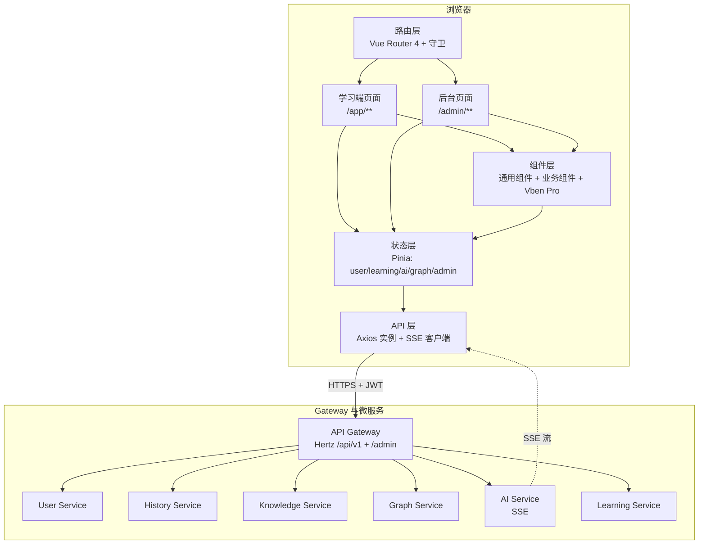

# 第十二章 前端设计

TCM-History-AI 平台前端承担两类截然不同的访问场景：面向 C 端学习者的沉浸式学习体验（首页、发展时间轴、知识图谱、课程学习、AI 对话、AI 考试等），以及面向 B 端管理者的后台 CMS（内容生产、知识库运维、AI 监控、用户与权限管控）。两端共享同一套后端 API、同一套设计 Token、同一套基础组件，但在路由布局、权限模型、视觉密度上分层组织。C 端追求沉浸感与知识可视化，B 端追求密度与操作效率。前端整体基于 Vue 3 + Vben Admin + Ant Design Vue + Pinia + Vite + TypeScript 构建，图谱采用 AntV G6，时间轴为自研 Vue 组件，HTTP 采用 Axios，AI 对话采用 SSE 流式输出。

## 一、前端整体架构

前端采用分层架构，自上而下依次为路由层、页面层、组件层、状态层、API 层，最终经 API Gateway 抵达后端微服务。路由层负责 URL 到页面组件的映射与权限守卫；页面层负责业务编排与布局；组件层提供可复用的 UI 单元；状态层用 Pinia 持久化跨页面共享的业务状态；API 层封装 Axios 实例、拦截器、SSE 客户端，统一与 Gateway 通信。学习端与后台在路由层分叉，复用组件层与 API 层。



学习端采用沉浸式导航布局（顶部 Logo 与全局搜索、左侧折叠知识树、主区沉浸内容），后台沿用 Vben Admin 的多标签页 + 左侧菜单树 + 面包屑布局。两端通过路由前缀 `/app` 与 `/admin` 切换基础布局组件 `LearnLayout` 与 `AdminLayout`，避免运行时混用样式。

## 二、目录结构设计

前端项目采用 Monorepo 思路的单仓多包结构，使用 pnpm workspace 管理。`apps/learner` 为学习端 SPA，`apps/admin` 为后台 SPA，`packages/` 内放置共享组件、工具、类型与设计 Token，确保两端复用同一套设计系统与 API 封装。

```
tcm-history-ai-web/
├── apps/
│   ├── learner/                          # 学习端 SPA
│   │   ├── src/
│   │   │   ├── main.ts                   # 入口：挂载 LearnLayout
│   │   │   ├── App.vue
│   │   │   ├── router/
│   │   │   │   ├── index.ts              # createRouter + 守卫注册
│   │   │   │   ├── routes.ts             # 静态路由（首页、登录）
│   │   │   │   └── guards.ts             # beforeEach 鉴权 + 动态路由注入
│   │   │   ├── layouts/
│   │   │   │   ├── LearnLayout.vue       # 顶栏 + 侧知识树 + 主区
│   │   │   │   └── BlankLayout.vue       # 登录、AI 全屏对话用
│   │   │   ├── views/
│   │   │   │   ├── home/                 # 首页
│   │   │   │   │   └── index.vue
│   │   │   │   ├── timeline/             # 发展时间轴
│   │   │   │   │   └── index.vue
│   │   │   │   ├── graph/                # 知识图谱可视化
│   │   │   │   │   └── index.vue
│   │   │   │   ├── course/
│   │   │   │   │   ├── list.vue          # 课程列表
│   │   │   │   │   └── learn.vue         # 课时学习
│   │   │   │   ├── ai/
│   │   │   │   │   ├── chat.vue          # AI 导师对话
│   │   │   │   │   ├── exam.vue          # AI 考试
│   │   │   │   │   ├── mistakes.vue      # AI 错题本
│   │   │   │   │   └── plan.vue          # AI 学习计划
│   │   │   │   └── detail/               # 人物/经典/学派详情
│   │   │   │       ├── person.vue
│   │   │   │       ├── book.vue
│   │   │   │       └── school.vue
│   │   │   ├── composables/              # 学习端组合式函数
│   │   │   │   ├── useTimeline.ts
│   │   │   │   ├── useGraph.ts
│   │   │   │   └── useSSE.ts
│   │   │   └── styles/
│   │   │       └── learner.theme.less
│   │   └── vite.config.ts
│   └── admin/                            # 后台 SPA
│       ├── src/
│       │   ├── main.ts
│       │   ├── router/
│       │   │   ├── index.ts
│       │   │   └── guards.ts             # RBAC 守卫 + 动态菜单
│       │   ├── layouts/
│       │   │   └── AdminLayout.vue       # 复用 Vben BasicLayout
│       │   ├── views/
│       │   │   ├── content/              # 人物/经典/学派/课程 CRUD
│       │   │   ├── knowledge/            # 知识库、Prompt、RAG 运维
│       │   │   ├── ai/                   # LLM 日志、Agent 日志、成本
│       │   │   ├── learning/             # 考试、错题、计划审计
│       │   │   ├── user/                 # 用户、角色、权限
│       │   │   └── system/               # 菜单、字典、监控
│       │   └── composables/
│       │       └── useProTable.ts
│       └── vite.config.ts
├── packages/
│   ├── ui/                               # 共享通用组件
│   │   ├── src/
│   │   │   ├── entity-card/
│   │   │   ├── timeline/
│   │   │   ├── graph-viewer/
│   │   │   ├── markdown-renderer/
│   │   │   ├── ai-chat/
│   │   │   └── source-citation/
│   │   └── index.ts
│   ├── api/                              # 共享 API 封装
│   │   ├── src/
│   │   │   ├── http.ts                   # Axios 实例 + 拦截器
│   │   │   ├── sse.ts                    # SSE 客户端
│   │   │   ├── modules/
│   │   │   │   ├── user.ts
│   │   │   │   ├── history.ts
│   │   │   │   ├── knowledge.ts
│   │   │   │   ├── graph.ts
│   │   │   │   ├── ai.ts
│   │   │   │   └── learning.ts
│   │   │   └── types/                    # OpenAPI 生成的 DTO 类型
│   │   └── index.ts
│   ├── stores/                           # 共享 Pinia store
│   │   ├── src/
│   │   │   ├── user.ts
│   │   │   ├── learning.ts
│   │   │   ├── ai.ts
│   │   │   ├── graph.ts
│   │   │   └── admin.ts
│   │   └── index.ts
│   ├── shared/                           # 工具、常量、设计 Token
│   │   ├── src/
│   │   │   ├── utils/
│   │   │   ├── constants/
│   │   │   └── design-tokens.ts          # 中医配色、断点、字号
│   │   └── index.ts
│   └── types/                            # 全局类型声明
├── pnpm-workspace.yaml
└── package.json
```

`packages/api` 的 DTO 类型由后端 OpenAPI 通过 `openapi-typescript-codegen` 自动生成，每次后端发布新版本触发前端 CI 拉取最新 schema，避免手写类型与接口漂移。

## 三、路由设计

学习端路由前缀 `/app`，后台路由前缀 `/admin`。学习端采用静态路由 + 动态路由混合模式：核心页面静态注册，详情页通过动态路由按 ID 注入；后台完全采用动态路由，菜单与路由树由后端 `GET /admin/menus/current` 下发，按角色过滤。

### 3.1 学习端路由表

```typescript
// apps/learner/src/router/routes.ts
import type { RouteRecordRaw } from 'vue-router';

export const learnerRoutes: RouteRecordRaw[] = [
  {
    path: '/app',
    component: () => import('@/layouts/LearnLayout.vue'),
    redirect: '/app/home',
    meta: { requiresAuth: true },
    children: [
      {
        path: 'home',
        name: 'Home',
        component: () => import('@/views/home/index.vue'),
        meta: { title: '首页', keepAlive: true },
      },
      {
        path: 'timeline',
        name: 'Timeline',
        component: () => import('@/views/timeline/index.vue'),
        meta: { title: '发展时间轴', keepAlive: true },
      },
      {
        path: 'graph',
        name: 'Graph',
        component: () => import('@/views/graph/index.vue'),
        meta: { title: '知识图谱' },
      },
      {
        path: 'course',
        name: 'CourseList',
        component: () => import('@/views/course/list.vue'),
        meta: { title: '课程列表', keepAlive: true },
      },
      {
        path: 'course/:courseId/lesson/:lessonId',
        name: 'CourseLearn',
        component: () => import('@/views/course/learn.vue'),
        meta: { title: '课时学习', requiresAuth: true },
        props: true,
      },
      {
        path: 'ai/chat',
        name: 'AIChat',
        component: () => import('@/views/ai/chat.vue'),
        meta: { title: 'AI 导师', requiresAuth: true },
      },
      {
        path: 'ai/exam',
        name: 'AIExam',
        component: () => import('@/views/ai/exam.vue'),
        meta: { title: 'AI 考试', requiresAuth: true },
      },
      {
        path: 'ai/mistakes',
        name: 'AIMistakes',
        component: () => import('@/views/ai/mistakes.vue'),
        meta: { title: 'AI 错题本', requiresAuth: true },
      },
      {
        path: 'ai/plan',
        name: 'AIPlan',
        component: () => import('@/views/ai/plan.vue'),
        meta: { title: 'AI 学习计划', requiresAuth: true },
      },
      {
        path: 'detail/person/:id',
        name: 'PersonDetail',
        component: () => import('@/views/detail/person.vue'),
        props: true,
      },
      {
        path: 'detail/book/:id',
        name: 'BookDetail',
        component: () => import('@/views/detail/book.vue'),
        props: true,
      },
      {
        path: 'detail/school/:id',
        name: 'SchoolDetail',
        component: () => import('@/views/detail/school.vue'),
        props: true,
      },
    ],
  },
  {
    path: '/login',
    component: () => import('@/views/auth/login.vue'),
    meta: { title: '登录', layout: 'blank' },
  },
];
```

### 3.2 后台路由表与动态注入

后台路由由 `guards.ts` 在用户登录后从后端拉取菜单树，递归转换为 `RouteRecordRaw` 并通过 `router.addRoute` 注入。每个路由 `meta.permission` 携带权限码，与按钮指令 `v-auth` 共享同一权限字典。

```typescript
// apps/admin/src/router/guards.ts
import type { Router } from 'vue-router';
import { useUserStore } from '@tcm/stores';
import { fetchMenus, transformMenusToRoutes } from './dynamic';

export function setupAdminGuards(router: Router) {
  router.beforeEach(async (to, _from, next) => {
    const userStore = useUserStore();
    if (to.path.startsWith('/admin') && !userStore.token) {
      return next({ path: '/login', query: { redirect: to.fullPath } });
    }
    if (to.path.startsWith('/admin') && !userStore.routesLoaded) {
      const menus = await fetchMenus();
      const routes = transformMenusToRoutes(menus);
      routes.forEach((r) => router.addRoute('AdminRoot', r));
      userStore.routesLoaded = true;
      return next({ ...to, replace: true });
    }
    if (to.meta?.permission && !userStore.hasPermission(to.meta.permission as string)) {
      return next({ name: 'Forbidden' });
    }
    next();
  });
}
```

学习端守卫逻辑较轻：仅校验 `requiresAuth` 路由是否携带 JWT，不拉取动态菜单；侧边知识树为静态结构。

## 四、核心页面设计

### 4.1 首页

首页是 C 端用户的入口聚合页，承担「今日学习 + 历史概览 + 快捷入口」三重职能。

布局描述：顶部为全宽 Hero 区，左侧显示用户名、连续学习天数、今日学习目标进度环；右侧为「今日学习卡片」，根据 `Learning Service` 返回的进行中课程与上次学习位置自动生成。Hero 下方为四列网格：发展时间轴入口（背景为朝代渐变图）、知识图谱入口（背景为 G6 缩略图）、AI 导师入口（背景为对话气泡）、AI 考试入口（背景为考卷图标）。再下方为「最近浏览」横向滚动列表与「推荐课程」卡片网格。

关键组件：`TodayLearnCard`、`QuickEntry`、`RecentList`（虚拟滚动）、`CourseCard`、`ProgressRing`。

数据来源：`GET /api/v1/learning/today`（今日学习聚合）、`GET /api/v1/learning/recent`（最近浏览）、`GET /api/v1/courses/recommended`（推荐课程）。首屏采用 SSR 友好的接口聚合，后端 `Learning Service` 内部 Fan-out 调用 `History Service` 与 `AI Service` 一次性返回所有首屏数据，前端只发一次请求。

### 4.2 发展时间轴页

发展时间轴是中医发展史的核心叙事载体，自研 Vue 组件 `<Timeline />` 实现朝代维度的时间线展示。

布局描述：顶部为朝代选择条（先秦、秦汉、魏晋、隋唐、宋金元、明清、近现代），点击切换朝代；中部为水平时间轴，轴上分布事件节点，节点按重要性分三档（大事件/中事件/小事件）以不同尺寸与颜色呈现；下方为事件详情面板，点击节点下钻显示事件描述、关联人物、关联经典、关联学派，并提供「在知识图谱中查看」跳转。

关键组件：`DynastySelector`、`TimelineAxis`（自研 SVG/Canvas 渲染）、`EventNode`、`EventDetailPanel`、`EntityCard`。

交互设计：朝代切换时时间轴平滑滚动到该朝代起始年；节点 hover 显示 tooltip 摘要；节点点击展开详情面板并触发 `GET /api/v1/history/events/:id` 拉取详情；双击节点跳转图谱页并高亮该事件节点。时间轴支持鼠标拖拽平移与滚轮缩放，缩放级别低于阈值时自动聚合小事件为簇节点，避免视觉拥挤。

数据来源：`GET /api/v1/history/timeline?dynasty=:dynasty`（朝代事件列表）、`GET /api/v1/history/events/:id`（事件详情）。

### 4.3 知识图谱可视化页

知识图谱页基于 AntV G6 5.x 渲染中医知识图谱，支持人物、经典、学派、事件、理论五类节点及「师承」「著述」「创立」「参与」「提出」等关系。

G6 集成方案：使用 G6 的 `Graph` 实例配合自定义 Node 与 Edge。节点按类型注册不同的 `draw` 函数，人物节点显示头像缩略图与姓名，经典节点显示书名与作者，学派节点显示学派名与代表人物数。布局算法按查询意图切换：全量浏览用 `force` 力导向布局，单实体邻域查询用 `radial` 辐射布局，朝代切片用 `dagre` 分层布局。

```typescript
// packages/ui/src/graph-viewer/useGraph.ts
import { Graph, register } from '@antv/g6';
import { personNode } from './nodes/person';
import { bookNode } from './nodes/book';

register('node', 'tcm-person', personNode);
register('node', 'tcm-book', bookNode);

export function useGraph(container: Ref<HTMLElement | null>) {
  const graph = shallowRef<Graph | null>(null);

  onMounted(() => {
    if (!container.value) return;
    graph.value = new Graph({
      container: container.value,
      autoResize: true,
      layout: { type: 'force', preventOverlap: true, nodeStrength: -50 },
      modes: { default: ['drag-canvas', 'zoom-canvas', 'drag-node'] },
      node: { type: 'tcm-person', palette: 'tcm' },
      edge: { type: 'quadratic', endArrow: true },
    });
  });

  const loadNeighborhood = async (entityId: string) => {
    const data = await graphApi.getNeighborhood(entityId, { depth: 2 });
    graph.value?.setData({ nodes: data.nodes, edges: data.edges });
    graph.value?.render();
  };

  return { graph, loadNeighborhood };
}
```

交互设计：节点点击触发 `loadNeighborhood` 展开邻域；节点双击跳转对应详情页；右键节点弹出菜单（在图谱中聚焦、隐藏、加入学习计划、让 AI 解释）；边 hover 显示关系描述 tooltip；图例与过滤器面板悬浮在右上角，按节点类型与关系类型筛选可见元素。

性能优化：G6 大图渲染采用以下策略——节点数超过 500 时切换为 `canvas` 渲染器并关闭阴影与渐变；超过 2000 时启用 `webgl` 渲染器与 LOD（Level of Detail）策略，缩放级别低时只渲染节点不渲染标签；增量加载邻域时使用 `graph.addItem` 而非全量 `setData`；图谱数据按朝代分片存储于 IndexedDB，切换朝代时本地命中避免重复请求。

数据来源：`GET /api/v1/graph/neighborhood?entityId=:id&depth=:depth`、`GET /api/v1/graph/slice?dynasty=:dynasty`、`GET /api/v1/graph/search?q=:keyword`。

### 4.4 课程学习页

课程学习页是学习者停留时长最长的页面，承载课时正文、关联实体、图谱片段、课后练习四块内容。

布局描述：左侧为课程大纲树（章节 → 课时，已学/未学/当前状态用图标标记）；主区为课时正文，采用沉浸式阅读排版（最大宽度 760px），正文内嵌「关联实体卡片」悬浮于右侧边栏，正文段落提及人物/经典时自动渲染为可点击的内联标签；右侧为图谱片段面板，显示当前课时涉及实体的子图谱（G6 mini 实例）；底部为课后练习入口，点击展开练习抽屉。

关键组件：`CourseOutline`、`LessonContent`（基于 `MarkdownRenderer`）、`EntityCard`、`GraphMiniView`、`ExerciseDrawer`、`InlineEntityTag`。

数据来源：`GET /api/v1/learning/courses/:courseId`（课程大纲）、`GET /api/v1/learning/lessons/:lessonId`（课时正文与关联实体）、`GET /api/v1/graph/fragment?lessonId=:lessonId`（课时图谱片段）、`GET /api/v1/learning/lessons/:lessonId/exercises`（课后练习）。学习进度通过 `POST /api/v1/learning/progress` 上报，节流为每 30 秒一次。

### 4.5 AI 对话页

AI 对话页是与 AI 导师多轮交互的核心场景，需支持 SSE 流式渲染、Markdown 富文本、代码高亮、来源引用展示。

布局描述：左侧为会话列表（按时间倒序，支持重命名、删除、固定）；主区为消息流，用户消息右对齐，AI 消息左对齐并显示头像；底部为输入区，支持多行输入、快捷指令（`/解释`、`/出题`、`/总结`）、附件上传（图片、PDF）。AI 消息在流式输出时显示打字光标，完成后渲染为完整 Markdown；引用来源以脚注形式列在消息末尾，点击展开来源卡片（实体名、来源片段、置信度）。

关键组件：`SessionList`、`MessageBubble`、`MarkdownRenderer`、`SourceCitation`、`ChatInput`、`TypingIndicator`。

SSE 流式渲染：基于 `packages/api/src/sse.ts` 封装的 `EventSourceLike` 客户端，使用 `fetch` + `ReadableStream` 实现（绕开浏览器原生 EventSource 不支持自定义 Header 的限制，便于携带 JWT）。流式 token 增量追加到当前消息的 Markdown 字符串，`MarkdownRenderer` 使用 `requestAnimationFrame` 节流重渲染，避免每个 token 触发一次完整解析。

```typescript
// packages/api/src/sse.ts
export async function* streamChat(
  payload: ChatRequest,
  signal?: AbortSignal,
): AsyncGenerator<ChatStreamChunk> {
  const res = await fetch(`${BASE_URL}/api/v1/ai/chat/stream`, {
    method: 'POST',
    headers: {
      'Content-Type': 'application/json',
      Authorization: `Bearer ${useUserStore().token}`,
      Accept: 'text/event-stream',
    },
    body: JSON.stringify(payload),
    signal,
  });

  const reader = res.body!.getReader();
  const decoder = new TextDecoder();
  let buffer = '';
  while (true) {
    const { done, value } = await reader.read();
    if (done) break;
    buffer += decoder.decode(value, { stream: true });
    const events = buffer.split('\n\n');
    buffer = events.pop()!;
    for (const evt of events) {
      const data = evt.match(/^data: (.+)$/m)?.[1];
      if (!data || data === '[DONE]') return;
      yield JSON.parse(data) as ChatStreamChunk;
    }
  }
}
```

Markdown 渲染采用 `markdown-it` + `highlight.js` + `markdown-it-katex`（支持中医方剂中的数学符号与公式）。代码高亮在 Web Worker 中执行，避免阻塞主线程。来源引用通过自定义 `markdown-it` 插件将 `[^n]` 脚注转换为可点击的 `<SourceCitation>` 组件占位符，渲染时由 Vue 接管。

数据来源：`POST /api/v1/ai/chat/stream`（流式对话）、`GET /api/v1/ai/sessions`（会话列表）、`POST /api/v1/ai/sessions`（新建会话）、`DELETE /api/v1/ai/sessions/:id`（删除会话）。

### 4.6 人物/经典/学派详情页

三类详情页共享同一详情页骨架 `EntityDetailLayout`，按实体类型切换内容区块。

人物详情页：顶部为人物头图、姓名、生卒年、朝代、籍贯；主体为生平传记（Markdown）、师承关系图（G6 mini）、代表著作列表（点击跳经典详情）、主要贡献、相关事件时间线；右侧为「让 AI 解释此人」按钮，点击在对话页中以该人物为上下文发起对话。

经典详情页：顶部为书名、作者、成书年、卷数；主体为内容提要、原文选读（分段展示，支持译文切换）、核心理论、影响与评价、相关人物；右侧为「加入学习计划」「在图谱中查看」操作。

学派详情页：顶部为学派名、代表人物、活跃朝代；主体为学派源流、核心理论、代表著作、与其他学派论争（用对比表格呈现）、现代影响；右侧为学派成员列表与学派图谱入口。

数据来源：`GET /api/v1/history/persons/:id`、`GET /api/v1/history/books/:id`、`GET /api/v1/history/schools/:id`、`GET /api/v1/graph/neighborhood?entityId=:id&depth=1`。

### 4.7 AI 考试页

AI 考试页由 AI 根据「选定的知识范围 + 难度 + 题型」自动出题，支持单选、多选、判断、简答四种题型。

布局描述：顶部为考试配置条（知识范围下拉、难度滑块、题型多选、题数输入、生成按钮）；主区为答题区，单题展示，左侧为题号导航格（已答/未答/标记状态），右侧为剩余时间倒计时；底部为上一题/下一题与交卷按钮。简答题由 AI 流式批改，批改结果以 Markdown 展示评分理由。交卷后进入结果页，展示总分、各题正误、AI 解析（错题点击「让 AI 解释」跳转对话页）。

关键组件：`ExamConfigBar`、`QuestionCard`、`QuestionNav`、`Countdown`、`ExamResult`、`AIJudgePanel`。

数据来源：`POST /api/v1/ai/exam/generate`（生成试卷）、`POST /api/v1/ai/exam/:id/submit`（交卷）、`POST /api/v1/ai/exam/:id/judge/stream`（简答题 AI 流式批改 SSE）。

### 4.8 AI 错题本页

错题本聚合学习者所有考试与练习中的错题，按知识点聚类，支持重做与 AI 讲解。

布局描述：左侧为知识点树（按朝代/学科聚类，显示错题数）；主区为错题列表（题干、原答案、正确答案、错题来源、错误次数、最近错误时间）；点击错题展开详情，提供「重做」「让 AI 讲解」两个操作。顶部统计条显示总错题数、本周新增、已掌握数（重做正确两次后自动标记掌握）。

数据来源：`GET /api/v1/ai/mistakes?cluster=:cluster`、`POST /api/v1/ai/mistakes/:id/redo`、`POST /api/v1/ai/mistakes/:id/explain/stream`（AI 讲解 SSE）。

### 4.9 AI 学习计划页

AI 学习计划页由 AI 根据学习者目标、可用时长、当前水平生成结构化学习计划。

布局描述：顶部为计划生成配置（目标下拉如「方剂学入门」「伤寒论精读」、每日时长、起始日期）；主区为计划甘特图（横向时间线，每个学习任务为一格，颜色表示完成度），点击任务展开详情（关联课程、关联课时、预计时长、知识点）；右侧为「今日任务」清单，勾选完成实时同步进度。计划支持「让 AI 调整」按钮，触发 AI 根据当前进度重新生成后续计划。

数据来源：`POST /api/v1/ai/plan/generate`（生成计划）、`GET /api/v1/ai/plan/current`（当前计划）、`PATCH /api/v1/ai/plan/tasks/:id`（更新任务状态）、`POST /api/v1/ai/plan/adjust/stream`（AI 调整 SSE）。

## 五、组件库设计

`packages/ui` 沉淀两端共享的通用组件，每个组件遵循「Props 单向数据流 + Events 上抛 + Slots 扩展」的规范，TypeScript 类型随组件导出。

### 5.1 EntityCard 实体卡片

```typescript
// packages/ui/src/entity-card/types.ts
export type EntityType = 'person' | 'book' | 'school' | 'event' | 'theory';

export interface EntityCardProps {
  type: EntityType;
  entityId: string;
  title: string;
  subtitle?: string;          // 人物：生卒年；经典：作者；学派：代表人物
  cover?: string;             // 头像/封面图 URL
  tags?: string[];            // 朝代、学派等标签
  description?: string;       // 一句话简介
  layout?: 'horizontal' | 'vertical' | 'compact';
  clickable?: boolean;        // 是否点击跳转详情
  showGraphShortcut?: boolean;// 是否显示「图谱查看」按钮
}

export interface EntityCardEmits {
  (e: 'click', payload: { entityId: string; type: EntityType }): void;
  (e: 'graph', payload: { entityId: string }): void;
  (e: 'ai-explain', payload: { entityId: string }): void;
}
```

### 5.2 Timeline 时间轴组件

```typescript
export interface TimelineProps {
  events: TimelineEvent[];
  dynasty?: string;                       // 当前朝代，控制初始视口
  orientation?: 'horizontal' | 'vertical';
  nodeSizeBy?: 'importance' | 'uniform';  // 节点尺寸策略
  zoom?: number;                          // 初始缩放
  minZoom?: number;
  maxZoom?: number;
  enableCluster?: boolean;                // 是否启用小事件聚合
  clusterThreshold?: number;              // 视口内节点数阈值
}

export interface TimelineEvent {
  id: string;
  year: number;
  title: string;
  importance: 1 | 2 | 3;
  dynasty: string;
  relatedEntities?: { id: string; type: EntityType }[];
}

export interface TimelineEmits {
  (e: 'select', event: TimelineEvent): void;
  (e: 'dynasty-change', dynasty: string): void;
  (e: 'zoom', scale: number): void;
}
```

### 5.3 GraphViewer 图谱查看器

```typescript
export interface GraphViewerProps {
  entityId?: string;                 // 中心实体，提供时加载邻域
  dynasty?: string;                  // 朝代切片
  depth?: number;                    // 邻域深度，默认 2
  layout?: 'force' | 'radial' | 'dagre' | 'grid';
  nodeTypes?: EntityType[];          // 可见节点类型过滤器
  edgeTypes?: string[];              // 可见关系类型过滤器
  renderer?: 'canvas' | 'webgl';     // 渲染器，默认 canvas
  enableLod?: boolean;               // 是否启用 LOD
  height?: number | string;
  readonly?: boolean;                // 是否禁用编辑（后台用）
}

export interface GraphViewerEmits {
  (e: 'node-click', node: GraphNode): void;
  (e: 'node-dblclick', node: GraphNode): void;
  (e: 'node-contextmenu', payload: { node: GraphNode; x: number; y: number }): void;
  (e: 'edge-click', edge: GraphEdge): void;
  (e: 'render-complete', stats: { nodes: number; edges: number }): void;
}
```

### 5.4 MarkdownRenderer

```typescript
export interface MarkdownRendererProps {
  source: string;
  streaming?: boolean;               // 流式模式，启用 rAF 节流
  enableHighlight?: boolean;         // 代码高亮，默认 true
  enableKatex?: boolean;             // 数学公式，默认 true
  enableCitation?: boolean;          // 来源引用脚注，默认 true
  citations?: SourceCitation[];      // 引用元数据，配合 ^n 脚注
  contentClass?: string;
  toc?: boolean;                     // 是否生成目录
}

export interface SourceCitation {
  index: number;
  entityId: string;
  entityType: EntityType;
  snippet: string;
  confidence: number;
}

export interface MarkdownRendererEmits {
  (e: 'citation-click', citation: SourceCitation): void;
  (e: 'toc-click', anchor: string): void;
  (e: 'rendered'): void;
}
```

### 5.5 AIChat 对话框

```typescript
export interface AIChatProps {
  sessionId?: string;                // 不传则新建会话
  contextEntity?: { id: string; type: EntityType }; // 上下文实体
  systemPrompt?: string;             // 自定义系统提示词
  presetCommands?: PresetCommand[];  // 快捷指令
  placeholder?: string;
  maxLength?: number;
  enableAttachment?: boolean;
  layout?: 'full' | 'embed';         // 全屏页或嵌入抽屉
}

export interface AIChatEmits {
  (e: 'session-created', sessionId: string): void;
  (e: 'message-complete', message: ChatMessage): void;
  (e: 'citation-click', citation: SourceCitation): void;
  (e: 'error', error: Error): void;
}
```

## 六、状态管理

Pinia store 按 业务域 划分，跨页面共享状态全部进入 store，页面局部状态用 `ref` 保留。两端共享 `user`、`learning`、`ai`、`graph` 四个 store，后台额外使用 `admin` store 管理菜单与权限。

### 6.1 user store

```typescript
// packages/stores/src/user.ts
export const useUserStore = defineStore('user', () => {
  const token = ref<string>('');
  const refreshToken = ref<string>('');
  const profile = ref<UserProfile | null>(null);
  const permissions = ref<string[]>([]);
  const routesLoaded = ref(false);

  const isLogged = computed(() => !!token.value);

  async function login(payload: LoginPayload) {
    const res = await userApi.login(payload);
    token.value = res.accessToken;
    refreshToken.value = res.refreshToken;
    profile.value = res.profile;
    permissions.value = res.permissions;
  }

  async function refresh() {
    const res = await userApi.refresh(refreshToken.value);
    token.value = res.accessToken;
  }

  function hasPermission(code: string) {
    return permissions.value.includes(code) || permissions.value.includes('*');
  }

  function logout() {
    token.value = '';
    refreshToken.value = '';
    profile.value = null;
    permissions.value = [];
    routesLoaded.value = false;
  }

  return { token, refreshToken, profile, permissions, routesLoaded, isLogged,
           login, refresh, hasPermission, logout };
}, {
  persist: { paths: ['token', 'refreshToken', 'profile', 'permissions'] },
});
```

### 6.2 learning store

```typescript
export const useLearningStore = defineStore('learning', () => {
  const todayPlan = ref<TodayPlan | null>(null);
  const currentCourse = ref<Course | null>(null);
  const currentLesson = ref<Lesson | null>(null);
  const lessonProgress = ref<Record<string, number>>({}); // lessonId -> 进度百分比
  const recentViews = ref<RecentItem[]>([]);

  async function loadToday() { todayPlan.value = await learningApi.getToday(); }
  async function openLesson(courseId: string, lessonId: string) {
    const [course, lesson] = await Promise.all([
      learningApi.getCourse(courseId),
      learningApi.getLesson(lessonId),
    ]);
    currentCourse.value = course;
    currentLesson.value = lesson;
  }
  function reportProgress(lessonId: string, percent: number) {
    lessonProgress.value[lessonId] = percent;
  }

  return { todayPlan, currentCourse, currentLesson, lessonProgress, recentViews,
           loadToday, openLesson, reportProgress };
});
```

### 6.3 ai store

```typescript
export const useAIStore = defineStore('ai', () => {
  const sessions = ref<ChatSession[]>([]);
  const currentSessionId = ref<string>('');
  const messages = ref<Record<string, ChatMessage[]>>({}); // sessionId -> 消息
  const streamingMessage = ref<ChatMessage | null>(null);
  const abortController = ref<AbortController | null>(null);

  async function loadSessions() { sessions.value = await aiApi.getSessions(); }
  async function newSession() {
    const s = await aiApi.createSession();
    sessions.value.unshift(s);
    currentSessionId.value = s.id;
  }

  async function sendMessage(content: string, contextEntity?: EntityRef) {
    if (!currentSessionId.value) await newSession();
    const sessionId = currentSessionId.value;
    const userMsg: ChatMessage = { role: 'user', content, ts: Date.now() };
    messages.value[sessionId] = [...(messages.value[sessionId] ?? []), userMsg];

    const aiMsg: ChatMessage = { role: 'assistant', content: '', streaming: true, ts: Date.now() };
    messages.value[sessionId].push(aiMsg);
    streamingMessage.value = aiMsg;

    abortController.value = new AbortController();
    try {
      for await (const chunk of streamChat(
        { sessionId, content, contextEntity },
        abortController.value.signal,
      )) {
        if (chunk.type === 'token') aiMsg.content += chunk.delta;
        if (chunk.type === 'citation') aiMsg.citations!.push(chunk.citation);
      }
    } finally {
      aiMsg.streaming = false;
      streamingMessage.value = null;
    }
  }

  function stopStreaming() {
    abortController.value?.abort();
  }

  return { sessions, currentSessionId, messages, streamingMessage,
           loadSessions, newSession, sendMessage, stopStreaming };
});
```

### 6.4 graph store

```typescript
export const useGraphStore = defineStore('graph', () => {
  const currentLayout = ref<'force' | 'radial' | 'dagre'>('force');
  const visibleNodeTypes = ref<EntityType[]>(['person', 'book', 'school', 'event', 'theory']);
  const visibleEdgeTypes = ref<string[]>(['teach', 'write', 'found', 'participate', 'propose']);
  const focusEntityId = ref<string>('');
  const sliceCache = ref<Record<string, GraphData>>({}); // dynasty -> data，IndexedDB 持久化

  function toggleNodeType(type: EntityType) {
    const i = visibleNodeTypes.value.indexOf(type);
    if (i >= 0) visibleNodeTypes.value.splice(i, 1);
    else visibleNodeTypes.value.push(type);
  }

  return { currentLayout, visibleNodeTypes, visibleEdgeTypes, focusEntityId, sliceCache,
           toggleNodeType };
});
```

## 七、API 层封装

`packages/api/src/http.ts` 导出统一的 Axios 实例，两端共用。所有业务模块（`user.ts`、`history.ts` 等）基于该实例封装具体接口。

### 7.1 Axios 实例与拦截器

```typescript
// packages/api/src/http.ts
import axios, { type AxiosInstance, type AxiosError } from 'axios';
import { useUserStore } from '@tcm/stores';
import { message } from 'ant-design-vue';

const http: AxiosInstance = axios.create({
  baseURL: import.meta.env.VITE_API_BASE,  // 学习端 /api/v1，后台 /admin
  timeout: 30000,
});

// 请求拦截：注入 JWT、追踪 ID
http.interceptors.request.use((config) => {
  const userStore = useUserStore();
  if (userStore.token) {
    config.headers.Authorization = `Bearer ${userStore.token}`;
  }
  config.headers['X-Request-Id'] = crypto.randomUUID();
  return config;
});

let refreshing: Promise<void> | null = null;

// 响应拦截：统一错误处理 + JWT 自动刷新
http.interceptors.response.use(
  (res) => {
    const { code, data, message: msg } = res.data;
    if (code === 0) return data;
    if (code === 40161) return doRefresh().then(() => http(res.config)); // access token 过期
    message.error(msg || '请求失败');
    return Promise.reject(new Error(msg));
  },
  async (err: AxiosError) => {
    if (err.response?.status === 401 && !err.config.url?.includes('/auth/refresh')) {
      try {
        await (refreshing ??= doRefresh());
        return http(err.config!);
      } catch {
        useUserStore().logout();
        location.href = '/login';
      }
    }
    const msg = err.response?.data?.message || err.message || '网络异常';
    message.error(msg);
    return Promise.reject(err);
  },
);

async function doRefresh() {
  try {
    await useUserStore().refresh();
  } finally {
    refreshing = null;
  }
}

export { http };
```

JWT 自动刷新策略：Access Token 过期由后端返回业务码 `40161`，响应拦截器识别后调用 `userStore.refresh()` 拉取新 token，并以 `refreshing` Promise 串行化避免并发刷新；Refresh Token 失效则跳转登录页。所有 401 响应在重试前会被「挂起」等待刷新完成，刷新成功后自动重放原请求。

### 7.2 SSE 封装

SSE 客户端见 4.5 节 `streamChat` 实现。封装要点：基于 `fetch` + `ReadableStream` 而非浏览器 `EventSource`，以支持自定义 `Authorization` Header；以 `AsyncGenerator` 形式向业务层吐出 chunk，业务层用 `for await` 消费；支持 `AbortSignal` 中断流式输出，对应 UI 上的「停止生成」按钮；按 SSE 规范以 `\n\n` 分隔事件，`data: [DONE]` 作为流结束标记。

### 7.3 错误统一处理

错误码分三层：HTTP 层（401/403/404/5xx）、业务层（`code` 字段非 0）、流式层（SSE 中 `type: 'error'`）。HTTP 401 走自动刷新流程，403 弹出无权限提示并记录审计日志，5xx 弹出通用错误并上报 Sentry。业务错误码由后端统一维护字典，前端 `constants/error-codes.ts` 同步，错误消息走 i18n 国际化。SSE 错误事件在 `streamChat` 内部捕获并以 `throw` 形式抛给业务层，由 `ai store` 的 `try/finally` 转换为消息气泡中的错误提示。

## 八、性能优化

### 8.1 路由懒加载

所有路由组件采用动态 `import()` 形式注册，Vite 自动按路由切割 chunk。首屏只加载 `LearnLayout` + `Home`，其余页面按访问延迟加载。`meta.keepAlive` 标记的页面（首页、时间轴、课程列表）通过 `<keep-alive>` 缓存组件实例，避免来回切换重新请求首屏数据。

### 8.2 组件按需加载

Ant Design Vue 使用 `unplugin-vue-components` + `AntDesignVueResolver` 实现自动按需引入，未使用的组件不打入主包。G6 按需引入 `Graph`、`register` 与所用布局、交互，不引入完整包，体积从 ~600KB 降至 ~180KB（gzip）。`highlight.js` 只注册中医领域常见语言（bash、json、python、sql、typescript），不引入全语言包。

### 8.3 虚拟滚动

错题本、课程列表、会话列表等长列表场景统一使用 `@tanstack/vue-virtual` 实现虚拟滚动，DOM 节点数固定在视口可见量 + 缓冲行数，万级数据下保持 60fps 滚动。`EntityCard` 在虚拟列表中通过 `KeepAlive` 复用，避免滚动时频繁创建销毁 G6 mini 实例。

### 8.4 G6 大图渲染优化

G6 大图（节点 > 500）场景采用分级策略：默认 `canvas` 渲染器并关闭阴影、渐变等昂贵特效；节点 > 2000 时切换 `webgl` 渲染器并启用 LOD，缩放级别低于 0.5 时只渲染节点几何形状不渲染标签；增量加载邻域用 `graph.addItem` 而非 `setData` 全量重渲染；图谱按朝代分片预计算并缓存到 IndexedDB，切换朝代时本地命中，命中失败再走后端。布局算法在 Web Worker 中执行，避免力导向迭代阻塞主线程。

### 8.5 首屏加载优化

Vite 构建配合 `rollup-plugin-visualizer` 分析包体积，主包 gzip 控制在 200KB 以内。关键路径资源（Logo、字体子集、首屏封面图）通过 `<link rel="preload">` 预加载。首屏数据接口由后端聚合（一次请求返回今日学习、推荐课程、最近浏览），减少首屏 RTT。图片统一走 CDN 并按设备 DPR 生成 `srcset`，首屏图片优先 WebP。Service Worker 缓存静态资源与上一会话快照，二次访问首屏 LCP 低于 1.5s。

## 九、主题与响应式

### 9.1 设计 Token

`packages/shared/src/design-tokens.ts` 统一管理设计 Token，两端共享。配色以中医风格为基调：朱砂红（强调色，用于关键操作与重要节点）、墨黑（主文本）、宣纸米白（C 端背景）、青瓷绿（次级强调，用于成功状态与图谱边）、藏青蓝（信息态）。色值经 WCAG AA 对比度校验。

```typescript
// packages/shared/src/design-tokens.ts
export const designTokens = {
  color: {
    primary: '#A23A30',       // 朱砂红
    primaryHover: '#8E2E25',
    ink: '#1F1A17',           // 墨黑
    paper: '#F7F2E8',         // 宣纸米白
    paperDark: '#2A2520',     // 暗色模式背景
    celadon: '#5C8A6A',       // 青瓷绿
    indigo: '#2C4A6B',        // 藏青蓝
    gold: '#C9A24A',          // 鎏金，用于徽章
    dynasty: {                // 朝代配色，用于时间轴与图谱
      preQin: '#5C8A6A',
      qinHan: '#A23A30',
      weiJin: '#7B5BA0',
      suiTang: '#C9A24A',
      songYuan: '#3E7CB1',
      mingQing: '#8E2E25',
      modern: '#4A4A4A',
    },
  },
  fontSize: { xs: 12, sm: 13, base: 14, lg: 16, xl: 18, xxl: 22, display: 32 },
  radius: { sm: 4, base: 6, lg: 8, pill: 999 },
  spacing: { xs: 4, sm: 8, base: 12, lg: 16, xl: 24, xxl: 32 },
  breakpoint: { mobile: 768, tablet: 1024, desktop: 1280, wide: 1536 },
  shadow: { card: '0 2px 8px rgba(31, 26, 23, 0.08)', hover: '0 4px 16px rgba(31, 26, 23, 0.12)' },
} as const;
```

### 9.2 暗色模式

暗色模式通过 `prefers-color-scheme` 媒体查询与手动切换相结合，Token 以 CSS 变量形式注入 `:root` 与 `[data-theme='dark']`。G6 节点配色随主题切换，通过监听主题变化调用 `graph.setTheme()` 重新渲染。MarkdownRenderer 的代码块在暗色模式切换为 `atom-one-dark` 主题。用户主题偏好持久化到 localStorage，首屏渲染前在内联脚本中读取，避免 FOUC（Flash of Unstyled Content）。

### 9.3 响应式断点

C 端最小支持 768px 平板横屏，不主动适配手机竖屏（手机端由独立的移动端 H5 项目承担）。响应式断点为：`mobile` 768px（平板竖屏，单列布局）、`tablet` 1024px（平板横屏，双列）、`desktop` 1280px（桌面，三列）、`wide` 1536px（宽屏，主区最大宽度限制 1440px 居中）。首页四列网格在 `tablet` 断点降为两列，在 `mobile` 断点降为一列；课程学习页的右侧图谱片段面板在 `tablet` 以下折叠为抽屉。后台沿用 Vben Admin 的响应式策略，菜单在 `mobile` 断点自动折叠为抽屉式。
