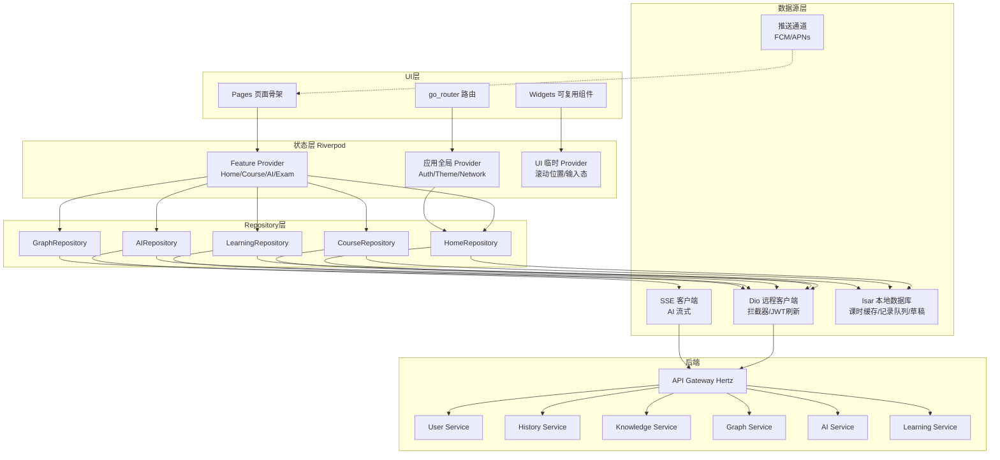

# 第十三章 移动端设计

TCM-History-AI 移动端定位为碎片化学习场景的补充入口，与 PC 端共用同一套后端 API（基于 Hertz 的 API Gateway，`/api/v1` 前缀，JWT 鉴权），不重建后端服务。核心使用场景集中在通勤、午休、睡前等碎片时段：用户可能在地铁上离线复习已下载的课时，在排队时发起一次 AI 问答，在睡前收到学习提醒推送并跳转回继续学习。三个技术锚点决定了移动端的工程取舍：离线缓存确保课时内容在弱网或无网环境下仍可阅读与做题，推送通知负责学习提醒与 AI 异步结果（AI 总结、AI 学习计划）的召回，手势交互（横向滑动、长按、下拉刷新、双指缩放）适配单手操作的触屏范式。

移动端基于 Flutter 3 + Dart 3 构建，一套代码覆盖 iOS 与 Android。状态管理采用 Riverpod，路由采用 go_router，网络请求采用 Dio，本地存储采用 Isar，AI 对话采用 SSE 流式输出。与 PC 端 Vue 实现的差异在于：移动端不依赖浏览器，所有数据本地化在 Isar 中持久化；离线优先策略使得 Repository 层在每次请求前判断网络与缓存新鲜度；推送通道通过 FCM（Android）与 APNs（iOS）统一接入。

## 一、移动端整体架构

移动端采用四层分层架构，自上而下依次为 UI 层、状态层、Repository 层、数据源层。UI 层只负责渲染与手势，不持有业务数据；状态层用 Riverpod Provider 暴露异步数据与操作方法；Repository 层封装业务逻辑，决策数据来自远程 API 还是本地 Isar；数据源层包含 Dio 远程客户端、Isar 本地数据库、SSE 客户端三套适配器。数据流向严格单向：UI 触发 Provider 方法，Provider 调用 Repository，Repository 决策远程或本地，数据回流到 UI 并同步写入 Isar 缓存。



架构上有三处关键约定。第一，Repository 是唯一的业务逻辑聚合点，Provider 不直接调用 Dio，避免网络逻辑散落到状态层。第二，LearningRepository 写入学习记录时先落 Isar 队列再异步同步远程，保证离线场景下记录不丢失。第三，AIRepository 同时持有 Dio（非流式接口，如 AI 考试提交）与 SSE 客户端（流式接口，如 AI 导师对话），二者共用同一份 JWT 凭证与错误处理。

## 二、目录结构设计

项目按 feature-first 组织，每个功能模块自包含 page、widget、provider、repository、model；公共能力集中在 `core` 与 `shared` 两层。`core` 放跨模块基础设施（网络、存储、路由、错误处理），`shared` 放跨模块复用的 UI 组件与设计 Token。

```
tcm_history_ai/
├── lib/
│   ├── main.dart                      # 入口：ProviderScope + runApp
│   ├── app.dart                       # MaterialApp.router 装配
│   ├── core/
│   │   ├── network/
│   │   │   ├── dio_client.dart        # Dio 单例与拦截器装配
│   │   │   ├── interceptors/
│   │   │   │   ├── auth_interceptor.dart      # JWT 注入与自动刷新
│   │   │   │   ├── cache_interceptor.dart     # 离线缓存命中
│   │   │   │   ├── retry_interceptor.dart     # 指数退避重试
│   │   │   │   └── error_interceptor.dart     # 统一错误映射
│   │   │   ├── sse_client.dart        # SSE 流式客户端封装
│   │   │   └── api_result.dart        # ApiResult<T> 统一返回包装
│   │   ├── storage/
│   │   │   ├── isar_provider.dart     # Isar 实例 Provider
│   │   │   └── collections/           # Isar 数据模型
│   │   │       ├── lesson_cache.dart
│   │   │       ├── learning_record_queue.dart
│   │   │       ├── exam_draft.dart
│   │   │       └── chat_draft.dart
│   │   ├── routing/
│   │   │   ├── app_router.dart        # go_router 路由表
│   │   │   ├── route_guards.dart      # 认证守卫
│   │   │   └── deep_links.dart        # 深链接解析
│   │   ├── error/
│   │   │   └── app_exception.dart     # 业务异常体系
│   │   └── constants/
│   │       └── api_endpoints.dart     # 后端路径常量
│   ├── shared/
│   │   ├── theme/
│   │   │   ├── app_colors.dart        # 中医风格配色
│   │   │   ├── app_text_styles.dart
│   │   │   └── app_theme.dart         # 明暗主题装配
│   │   ├── widgets/
│   │   │   ├── tcm_scaffold.dart      # 统一页面骨架
│   │   │   ├── loading_indicator.dart
│   │   │   ├── empty_state.dart
│   │   │   ├── error_view.dart
│   │   │   ├── markdown_view.dart     # Markdown 渲染器
│   │   │   └── cached_image.dart      # 图片缓存组件
│   │   └── extensions/
│   │       └── context_ext.dart
│   ├── features/
│   │   ├── auth/
│   │   │   ├── pages/login_page.dart
│   │   │   ├── providers/auth_provider.dart
│   │   │   └── repositories/auth_repository.dart
│   │   ├── home/
│   │   │   ├── pages/home_page.dart
│   │   │   ├── widgets/
│   │   │   │   ├── today_learning_card.dart
│   │   │   │   ├── timeline_strip.dart
│   │   │   │   ├── ai_entry_grid.dart
│   │   │   │   └── continue_learning_card.dart
│   │   │   ├── providers/home_provider.dart
│   │   │   └── repositories/home_repository.dart
│   │   ├── timeline/
│   │   │   ├── pages/timeline_page.dart
│   │   │   ├── widgets/
│   │   │   │   ├── dynasty_selector.dart
│   │   │   │   ├── horizontal_timeline.dart
│   │   │   │   └── event_card.dart
│   │   │   ├── providers/timeline_provider.dart
│   │   │   └── repositories/timeline_repository.dart
│   │   ├── graph/
│   │   │   ├── pages/graph_page.dart
│   │   │   ├── widgets/
│   │   │   │   ├── graph_painter.dart     # CustomPainter
│   │   │   │   └── graph_node_chip.dart
│   │   │   ├── providers/graph_provider.dart
│   │   │   └── repositories/graph_repository.dart
│   │   ├── course/
│   │   │   ├── pages/
│   │   │   │   ├── course_list_page.dart
│   │   │   │   └── lesson_page.dart
│   │   │   ├── widgets/
│   │   │   │   ├── lesson_content_view.dart
│   │   │   │   ├── related_entities.dart
│   │   │   │   ├── exercise_section.dart
│   │   │   │   └── progress_bar.dart
│   │   │   ├── providers/course_provider.dart
│   │   │   └── repositories/course_repository.dart
│   │   ├── ai/
│   │   │   ├── pages/
│   │   │   │   ├── ai_chat_page.dart
│   │   │   │   ├── ai_exam_page.dart
│   │   │   │   ├── ai_summary_page.dart
│   │   │   │   └── ai_plan_page.dart
│   │   │   ├── widgets/
│   │   │   │   ├── chat_bubble.dart
│   │   │   │   ├── streaming_text.dart
│   │   │   │   ├── source_citation.dart
│   │   │   │   └── exam_question_card.dart
│   │   │   ├── providers/
│   │   │   │   ├── ai_chat_provider.dart
│   │   │   │   └── ai_exam_provider.dart
│   │   │   └── repositories/ai_repository.dart
│   │   ├── exam/
│   │   │   ├── pages/exam_list_page.dart
│   │   │   ├── pages/wrong_book_page.dart
│   │   │   └── providers/wrong_book_provider.dart
│   │   ├── plan/
│   │   │   ├── pages/plan_page.dart
│   │   │   └── providers/plan_provider.dart
│   │   └── detail/
│   │       ├── pages/figure_detail_page.dart
│   │       ├── pages/classic_detail_page.dart
│   │       └── providers/detail_provider.dart
│   └── l10n/
│       └── app_zh.arb                 # 中文文案
├── assets/
│   ├── images/                        # 朝代插画、人物画像
│   ├── icons/                         # 中医主题图标
│   └── fonts/                         # 思源宋体等
├── test/
│   ├── features/
│   └── core/
└── pubspec.yaml
```

`features` 下每个模块对外只暴露 `pages` 中的顶层 Widget 与 `providers` 中的 Provider，模块间依赖通过 Provider 注入而非直接 import widget，保证模块边界清晰。

## 三、路由设计

路由基于 go_router 声明式路由表，配合 `ShellRoute` 实现底部导航栏的持久化（切换 Tab 时导航栏不重建）。认证守卫通过根路由的 `redirect` 钩子统一拦截：未登录用户访问受保护页面时跳转登录页并携带 `returnUrl`，登录成功后回跳。深链接支持 `tcmhistoryai://course/lesson/{id}`、`tcmhistoryai://ai/chat?topic=张仲景` 等格式，用于推送通知落地与外部跳转。

```dart
final appRouter = GoRouter(
  initialLocation: '/home',
  redirect: (context, state) => RouteGuards.authGuard(context, state),
  routes: [
    ShellRoute(
      builder: (context, state, child) => MainShell(child: child),
      routes: [
        GoRoute(
          path: '/home',
          name: 'home',
          builder: (_, __) => const HomePage(),
        ),
        GoRoute(
          path: '/timeline',
          name: 'timeline',
          builder: (_, __) => const TimelinePage(),
        ),
        GoRoute(
          path: '/graph',
          name: 'graph',
          builder: (_, __) => const GraphPage(),
        ),
        GoRoute(
          path: '/profile',
          name: 'profile',
          builder: (_, __) => const ProfilePage(),
        ),
      ],
    ),
    GoRoute(
      path: '/course/lesson/:lessonId',
      name: 'lesson',
      builder: (_, state) => LessonPage(
        lessonId: state.pathParameters['lessonId']!,
      ),
    ),
    GoRoute(
      path: '/ai/chat',
      name: 'aiChat',
      builder: (_, state) => AiChatPage(
        initialTopic: state.uri.queryParameters['topic'],
      ),
    ),
    GoRoute(
      path: '/ai/exam',
      name: 'aiExam',
      builder: (_, __) => const AiExamPage(),
    ),
    GoRoute(
      path: '/exam/wrong-book',
      name: 'wrongBook',
      builder: (_, __) => const WrongBookPage(),
    ),
    GoRoute(
      path: '/plan',
      name: 'plan',
      builder: (_, __) => const PlanPage(),
    ),
    GoRoute(
      path: '/figure/:figureId',
      name: 'figureDetail',
      builder: (_, state) => FigureDetailPage(
        figureId: state.pathParameters['figureId']!,
      ),
    ),
    GoRoute(
      path: '/classic/:classicId',
      name: 'classicDetail',
      builder: (_, state) => ClassicDetailPage(
        classicId: state.pathParameters['classicId']!,
      ),
    ),
    GoRoute(path: '/login', builder: (_, __) => const LoginPage()),
  ],
);
```

认证守卫逻辑集中在 `RouteGuards.authGuard`：读取 `authProvider` 的 token 状态，若目标路径属于受保护集合（除 `/login` 外全部受保护）且 token 为空，则重定向到 `/login?from=${state.matchedLocation}`。登录成功后 `authRepository` 通过 `go(state.uri.queryParameters['from'] ?? '/home')` 回跳。深链接解析在 `deep_links.dart` 中将 `tcmhistoryai://` scheme 转换为 go_router 的 path 后调用 `router.go`，确保推送落地与手动跳转走同一套路由栈。

## 四、核心页面设计

### 首页

首页是用户每次启动的落地页，布局自上而下分四区：顶部今日学习卡（学习连续天数、今日计划进度环、一句话激励）、发展时间轴横滑条（精选 5 个里程碑事件缩略卡，可左右滑动）、AI 入口宫格（AI 导师、AI 总结、AI 考试、AI 错题、AI 出题、AI 学习计划六个入口，2 行 3 列）、继续学习卡（最近一条未完成课时，带封面、标题、进度条）。关键 Widget 包括 `TodayLearningCard`（进度环用 `CustomPaint` 绘制）、`TimelineStrip`（`PageView` 横滑 + `Indicator`）、`AiEntryGrid`（`GridView.count`）、`ContinueLearningCard`。数据来源是 `homeProvider`，它并行调用 `GET /api/v1/learning/today`、`GET /api/v1/history/timeline/highlights`、`GET /api/v1/learning/continue`，三路结果合并为 `HomeState`。下拉刷新触发 `RefreshIndicator` 重新拉取全部三路数据。

### 发展时间轴页

发展时间轴页以横向滑动的时间轴为主体，朝代为切换维度。顶部是朝代选择条（先秦、秦汉、魏晋、隋唐、宋金元、明清、近现代），点击切换后中部时间轴平滑滚动到对应区间。中部横向时间轴用 `PageView.builder` 实现，每页承载一个朝代的事件流，时间轴轴线用 `CustomPaint` 绘制贯穿，事件节点为圆形标记。下部为当前选中事件的详情卡片，展示事件标题、年份、配图、摘要与「查看关联人物/经典」入口。关键 Widget 为 `DynastySelector`（`HorizontalScrollableTab`）、`HorizontalTimeline`（`PageView` + `CustomPaint` 轴线）、`EventCard`。数据来源是 `timelineProvider`，调用 `GET /api/v1/history/timeline?dynasty={dynasty}`，结果按朝代缓存到 Isar 以支持离线浏览。朝代切换时若缓存命中且新鲜（1 小时内）则直接渲染，同时后台静默刷新。

### 知识图谱页

知识图谱页提供简化版图谱展示，受限于移动端算力与屏幕尺寸，单屏只渲染以某实体为中心的一跳邻域（中心节点 + 关联节点 + 边），而非 PC 端的全图力导向布局。顶部搜索栏支持按人物、经典、方剂、概念检索，选中后图谱以该实体为中心重新布局。图谱主体用 `CustomPainter` 自绘：节点为带标签的圆形（按类型着色，人物朱红、经典墨青、方剂赭石、概念黛蓝），边为贝塞尔曲线，支持双指缩放与单指拖拽平移。点击节点弹出底部 Sheet 展示实体摘要与「进入详情」入口。备选方案是 `graphview` 包的 `BuchheimWalkerLayout`，但自绘方案在节点数量超过 30 时帧率更稳定。数据来源是 `graphProvider`，调用 `GET /api/v1/graph/neighborhood?entityId={id}&depth=1`。

### 课程学习页

课程学习页是核心学习场景，自上而下分四段：课时标题与学习进度条（`LinearProgressIndicator`，进度来自 `learningRepository` 的本地记录）、课时正文（`MarkdownView` 渲染富文本，支持图片、引用块、内联实体链接）、关联实体区（横向滑动的 `Chip` 列表，点击跳转详情页）、课后练习区（选择题与判断题，作答后即时判分并写入学习记录）。底部固定操作栏含「上一节」「标记完成」「下一节」三按钮。关键 Widget 为 `LessonContentView`（基于 `flutter_markdown` 扩展，自定义内联实体链接的 `Builder`）、`RelatedEntities`（`SingleChildScrollView` + `Row` of `Chip`）、`ExerciseSection`（`ListView` of `ExamQuestionCard`）、`ProgressBar`。数据来源是 `courseProvider`，调用 `GET /api/v1/history/lessons/{id}`，内容落 Isar 缓存以支持离线阅读。学习进度与练习作答通过 `learningRepository.recordProgress()` 写入本地队列并异步同步。

### AI 对话页

AI 对话页是 AI 模块的高频入口，采用聊天界面布局。顶部 AppBar 显示当前对话主题与「清空」按钮，中部消息列表（用户气泡右对齐、AI 气泡左对齐），底部输入栏（多行输入框 + 发送按钮 + 话题快捷切换）。AI 回复采用 SSE 流式渲染：首字到达即开始增量绘制，光标处显示打字指示器，流结束后渲染 Markdown 与来源引用。来源引用以可折叠的脚注列表呈现，每条引用标注出处典籍与置信度，点击跳转对应详情页。关键 Widget 为 `ChatBubble`（区分用户与 AI 样式）、`StreamingText`（监听 SSE 流的 `Stream<String>`，用 `StatefulWidget` 增量 `setState`）、`MarkdownView`（流结束后切换为完整 Markdown 渲染）、`SourceCitation`（`ExpansionTile`）。数据来源是 `aiChatProvider`，调用 `POST /api/v1/ai/chat/stream`（SSE），消息历史落 Isar 的 `chat_draft` 集合以支持离线回看。流式过程中若网络中断，Provider 捕获异常并提示「重连」，已接收部分保留。

### AI 考试页与错题本页

AI 考试页承载 AI 出题生成的练习，顶部显示题目计数与计时，中部为单题卡片（题干 + 选项），底部为「上一题」「下一题」「交卷」按钮。AI 出题调用 `POST /api/v1/ai/exam/generate`（按知识点或朝代出题），题目流式或一次性返回后本地缓存。交卷调用 `POST /api/v1/ai/exam/submit`，返回评分与解析，错题自动写入错题本。关键 Widget 为 `ExamQuestionCard`（支持单选、多选、判断）、`ExamProgressHeader`。错题本页以列表展示历史错题，每条含题干、错误选项、正确选项、AI 解析，支持按知识点筛选与「重做」。错题数据来源是 `wrongBookProvider`，调用 `GET /api/v1/learning/wrong-questions`，结果缓存到 Isar 支持离线复习。

### 学习计划页

学习计划页展示 AI 生成学习计划与每日任务清单。顶部为计划概览（计划周期、总体进度环、本周目标），中部为每日任务列表（每条含任务标题、关联课时、预计时长、完成勾选），底部为「重新生成计划」按钮（调用 `POST /api/v1/ai/plan/generate`）。任务勾选状态实时写入 `learningRepository`。关键 Widget 为 `PlanOverviewCard`、`DailyTaskTile`（`CheckboxListTile` 扩展）。学习计划由 AI Service 异步生成，生成完成后通过推送通知召回用户，通知落地深链接 `/plan`。

### 人物/经典详情页

人物详情页展示中医历史人物的生平、学术贡献、代表著作、师承关系。布局分 Tab：概述、生平年表、著作、关系图（复用知识图谱的 `CustomPainter` 渲染一跳师承关系）。经典详情页结构类似，Tab 为概述、原文摘录、注家、相关方剂。两页共用 `detailProvider`，按实体类型调用 `GET /api/v1/knowledge/figures/{id}` 或 `GET /api/v1/knowledge/classics/{id}`。关键 Widget 为 `DetailTabBar`、`FigureTimeline`、`RelationGraph`（复用 `graph_painter.dart`）。

## 五、状态管理

Riverpod Provider 分三层：应用全局 Provider（Auth、Theme、Network）、Feature 业务 Provider（Home、Course、AI、Exam、Plan 等）、UI 临时 Provider（滚动位置、输入态、展开态）。全局 Provider 用 `Provider` 或 `NotifierProvider` 持有单例，业务 Provider 多为 `AsyncNotifierProvider` 处理异步加载与缓存，UI 临时 Provider 用 `StateProvider` 表达简单状态。

关键 Provider 结构如下：

```dart
// 应用全局
final authProvider = NotifierProvider<AuthNotifier, AuthState>(AuthNotifier.new);
final themeProvider = NotifierProvider<ThemeNotifier, ThemeMode>(ThemeNotifier.new);
final networkProvider = StreamProvider<ConnectivityResult>(
  (ref) => Connectivity().onConnectivityChanged,
);

// 首页
final homeProvider = AsyncNotifierProvider<HomeNotifier, HomeState>(HomeNotifier.new);

// 课程
final courseListProvider = AsyncNotifierProvider<CourseListNotifier, List<CourseSummary>>(CourseListNotifier.new);
final lessonProvider = FutureProvider.family<LessonDetail, String>(
  (ref, lessonId) => ref.read(courseRepositoryProvider).fetchLesson(lessonId),
);

// AI 对话
final aiChatProvider = NotifierProvider<AiChatNotifier, AiChatState>(AiChatNotifier.new);

// 错题本
final wrongBookProvider = AsyncNotifierProvider<WrongBookNotifier, List<WrongQuestion>>(WrongBookNotifier.new);

// Repository 注入
final dioProvider = Provider<Dio>((ref) => DioClient.create(ref));
final isarProvider = Provider<Isar>((ref) => IsarProvider.open());
final courseRepositoryProvider = Provider<CourseRepository>(
  (ref) => CourseRepository(ref.read(dioProvider), ref.read(isarProvider)),
);
```

`AuthState` 持有 token、用户信息、刷新 token；`authProvider` 在登录成功后写入 Isar 持久化，启动时从 Isar 恢复会话。`AiChatState` 持有消息列表、当前流式回复的缓冲 `String`、连接状态枚举（idle / streaming / error），`AiChatNotifier.sendMessage` 触发 SSE 订阅并增量更新缓冲。Repository Provider 全部通过 `ref.read` 注入 Dio 与 Isar，便于测试时替换为 mock。

## 六、网络层封装

Dio 实例在 `dio_client.dart` 中单例装配，注册四类拦截器，顺序为 `ErrorInterceptor` → `AuthInterceptor` → `CacheInterceptor` → `RetryInterceptor`（请求方向自上而下，响应方向自下而上）。`AuthInterceptor` 负责注入 `Authorization: Bearer {token}` 头，并在收到 401 时触发 token 刷新：用互斥锁保证并发请求只刷新一次，刷新成功后重放原请求，刷新失败则清空 `authProvider` 并跳转登录。`CacheInterceptor` 在请求头标记 `x-cache: force-cache` 时优先从 Isar 读取，命中且新鲜则直接返回响应不发起网络请求。`RetryInterceptor` 对网络错误与 5xx 执行指数退避重试，最多 3 次。

```dart
class AuthInterceptor extends Interceptor {
  final Ref ref;
  AuthInterceptor(this.ref);

  @override
  void onRequest(RequestOptions options, RequestInterceptorHandler handler) {
    final token = ref.read(authProvider).accessToken;
    if (token != null) {
      options.headers['Authorization'] = 'Bearer $token';
    }
    handler.next(options);
  }

  @override
  void onError(DioException err, ErrorInterceptorHandler handler) async {
    if (err.response?.statusCode == 401) {
      final refreshed = await ref.read(authProvider.notifier).refreshToken();
      if (refreshed) {
        final clone = err.requestOptions;
        clone.headers['Authorization'] = 'Bearer ${ref.read(authProvider).accessToken}';
        handler.resolve(await ref.read(dioProvider).fetch(clone));
        return;
      }
      ref.read(authProvider.notifier).logout();
    }
    handler.next(err);
  }
}
```

SSE 客户端封装在 `sse_client.dart`，基于 Dio 的 `ResponseType.stream` 接收 chunked 响应，按 `\n\n` 分割事件帧，解析 `data:` 行并通过 `Stream<String>` 暴露增量文本。SSE 客户端复用 Dio 的拦截器链（含 JWT 注入），保证鉴权一致。封装提供 `SseClient.connect(url, body)` 返回 `Stream<String>`，调用方在 Provider 中订阅并增量更新 UI。

```dart
class SseClient {
  final Dio dio;
  SseClient(this.dio);

  Stream<String> connect(String path, {required Map<String, dynamic> body}) async* {
    final response = await dio.post<ResponseBody>(
      path,
      data: body,
      options: Options(
        responseType: ResponseType.stream,
        headers: {'Accept': 'text/event-stream'},
      ),
    );
    final stream = response.data!.stream
        .transform(const Utf8Decoder())
        .transform(const LineSplitter());

    String buffer = '';
    await for (final line in stream) {
      buffer += '$line\n';
      if (buffer.endsWith('\n\n')) {
        for (final frame in buffer.split('\n\n')) {
          if (frame.startsWith('data:')) {
            yield frame.substring(5).trim();
          }
        }
        buffer = '';
      }
    }
  }
}
```

离线缓存策略由 `CacheInterceptor` 与各 Repository 协同。Repository 调用接口时通过 `Options(extra: {'cacheKey': 'lesson_$id', 'maxAge': Duration(hours: 1)})` 声明缓存策略，`CacheInterceptor` 在请求前查 Isar，命中则返回缓存并在后台静默刷新（stale-while-revalidate）。

## 七、本地存储

Isar 作为本地数据库承载三类数据：离线课时缓存、学习记录队列、用户草稿。Isar 模型用 `@collection` 注解声明，字段以原生类型为主以保证查询性能。

```dart
@collection
class LessonCache {
  Id id = Isar.autoIncrement;
  @Index(unique: true) late String lessonId;
  late String title;
  late String dynasty;
  late String contentMd;          // Markdown 正文
  late List<String> relatedEntityIds;
  late List<String> exerciseJson; // 练习题 JSON
  @Index() late DateTime cachedAt;
}

@collection
class LearningRecordQueue {
  Id id = Isar.autoIncrement;
  late String lessonId;
  late String action;             // progress / exercise_complete / lesson_finish
  late String payloadJson;
  @Index() late DateTime createdAt;
  late bool synced;               // 是否已同步远程
}

@collection
class ExamDraft {
  Id id = Isar.autoIncrement;
  late String examId;
  late Map<String, String> answers; // questionId -> answer
  late DateTime updatedAt;
}

@collection
class ChatDraft {
  Id id = Isar.autoIncrement;
  @Index(unique: true) late String conversationId;
  late List<ChatMessage> messages;
  late DateTime updatedAt;
}

@embedded
class ChatMessage {
  late String role;    // user / assistant
  late String content;
  late List<String> sourceIds;
}
```

`LessonCache` 在用户主动下载课时或浏览时写入，`cachedAt` 字段用于新鲜度判断。`LearningRecordQueue` 是离线写入的核心载体：每次学习行为先落队列（`synced=false`），后台同步任务扫描未同步记录批量上报 `POST /api/v1/learning/records/batch`，成功后置 `synced=true` 并定期清理。`ExamDraft` 与 `ChatDraft` 保存用户未提交的考试作答与未发送的对话草稿，防止意外退出丢失。

## 八、离线策略

离线策略围绕「内容可读、行为可记、降级可感知」三个目标展开。课时内容离线下载在课程详情页提供「下载」按钮，触发 `courseRepository.downloadLesson(id)` 将正文、图片（预下载到本地缓存目录）、练习题一并写入 `LessonCache`；批量下载支持整朝代或整课程下载，由 `DownloadManager` 串行队列执行避免并发抢占带宽。图片下载后用 `cached_network_image` 的本地路径替换远程 URL，离线时直接读取本地。

学习记录离线写入流程为：UI 触发 `learningRepository.recordProgress(lessonId, progress)`，Repository 同步写入 `LearningRecordQueue`（`synced=false`）并立即更新本地 `LessonProgress` 缓存以驱动 UI 进度条，随后异步触发同步任务。同步任务由 `SyncWorker`（基于 `workmanager` 周期任务 + 网络恢复监听）执行，扫描 `synced=false` 的记录批量上报，冲突时以服务端时间为准并回写本地。

断网降级分三层。网络层 `CacheInterceptor` 在请求失败且缓存存在时返回缓存并标记响应头 `x-offline: true`；UI 层 `TcmScaffold` 监听全局 `networkProvider`，离线时在顶部展示离线提示条；AI 层 SSE 流不可用时降级为非流式 `POST /api/v1/ai/chat` 一次性返回，并在对话气泡上标注「离线模式，回复已简化」。AI 考试、AI 学习计划等异步任务在断网时入队，网络恢复后自动触发，完成后推送通知。

## 九、推送通知

推送通知分两类：学习提醒与 AI 异步结果召回。学习提醒由后端 Learning Service 按用户设定的学习时段（如每日 20:00）下发，内容为「今日学习计划未完成，还剩 N 个任务」。AI 异步结果召回用于耗时较长的 AI 任务：AI 总结、AI 学习计划、AI 出题生成完成后，AI Service 通过推送通知告知用户「你的 AI 学习计划已生成」，落地深链接直达对应页面。

推送通道采用 FCM 统一接入：Android 直接走 FCM，iOS 走 APNs 但通过 FCM 中转，两端共用一套消息体。客户端用 `firebase_messaging` 注册设备 token，登录后调用 `POST /api/v1/user/device` 绑定 token 到用户。通知点击处理在 `FirebaseMessaging.onMessageOpenedApp` 中解析 `data` 字段的 `route` 与参数，调用 `router.go` 跳转。前台收到通知时用 `flutter_local_notifications` 展示顶部横幅，避免 SSE 流被打断时用户无感知。

```dart
Future<void> initPushNotifications() async {
  await FirebaseMessaging.instance.requestPermission();
  final token = await FirebaseMessaging.instance.getToken();
  if (token != null) {
    await ref.read(authRepositoryProvider).registerDevice(token);
  }
  FirebaseMessaging.onMessageOpenedApp.listen((message) {
    final route = message.data['route'] as String?;
    if (route != null) {
      ref.read(appRouterProvider).go(route);
    }
  });
}
```

## 十、性能优化

列表懒加载统一采用 `ListView.builder` 与 `SliverList`，itemExtent 在已知行高时显式声明以提升滚动性能；长列表（错题本、课程列表）配合分页加载，每页 20 条，滚动到末尾 5 条时预取下一页。图片缓存使用 `cached_network_image`，默认内存缓存上限 100MB、磁盘缓存上限 500MB，朝代插画与人物画像在首次下载后命中磁盘缓存避免重复请求；列表中的图片统一通过 ` precacheImage` 在空闲帧预解码。

内存管理关注三处：SSE 流订阅在页面 `dispose` 时取消，避免 Stream 泄漏；`PageView` 与 `TabBarView` 的子页通过 `AutomaticKeepAliveClientMixin` 保持状态但限制 keepAlive 数量；大对象（如完整课时 Markdown）在页面退出时从 Provider 释放，仅 Isar 持有。启动速度优化包括：`main.dart` 中仅做最小初始化（Isar 打开、路由装配），FCM 与同步任务延迟到首页 `initState` 后执行；首帧使用 `flutter_native_splash` 占位避免白屏；依赖注入改为懒加载，避免启动期实例化全部 Repository。

## 十一、主题与适配

主题以中医风格配色为基底，主色取自传统色谱：朱砂红（`#B22222`）用于主操作与人物标识，墨青（`#2F5C6E`）用于经典与链接，赭石（`#8B5A2B`）用于方剂，黛蓝（`#3A506B`）用于概念，背景宣纸色（`#F5F0E6`）模拟古籍纸感。配色集中定义在 `app_colors.dart`，通过 `ColorScheme` 装配到 `ThemeData`，深色模式将背景切换为墨色（`#1C1B19`）并降低主色饱和度，保证夜间可读性。深色模式跟随系统并支持手动覆盖，状态持久化在 Isar。

```dart
class AppColors {
  static const cinnabar = Color(0xFFB22222);    // 朱砂红
  static const inkBlue = Color(0xFF2F5C6E);     // 墨青
  static const ochre = Color(0xFF8B5A2B);       // 赭石
  static const daiBlue = Color(0xFF3A506B);     // 黛蓝
  static const ricePaper = Color(0xFFF5F0E6);   // 宣纸色
  static const inkBlack = Color(0xFF1C1B19);    // 墨色（深色背景）
}
```

字体采用思源宋体（标题）与思源黑体（正文），呼应古籍排印气质，字体文件打包在 `assets/fonts` 下。平板适配通过 `LayoutBuilder` 断点切换布局：手机宽度下首页 AI 入口为 2 列宫格，平板宽度（>600dp）切换为 3 列并启用主从分栏（左侧列表 + 右侧详情），知识图谱页在平板上直接展示两跳邻域而非一跳。安全区域用 `SafeArea` 与 `MediaQuery.padding` 处理刘海屏与底部手势条，底部导航栏与输入栏的避让通过 `viewInsets` 动态调整。
