# 14 部署方案

本章是 TCM-History-AI 整体部署架构的总览。第十五章 Docker 负责单机与开发环境的容器化编排，第十六章 Kubernetes 负责生产级集群编排，本章聚焦部署目标、网络拓扑、环境划分、服务部署策略、数据层部署、可观测性、安全防护、灾备与容量规划等架构层面的决策，为后两章提供上下文约束。

## 1 部署目标

部署架构围绕四个量化目标设计，所有资源规划、副本数、可用区分布均由这些目标反推得出。

| 目标维度 | 指标 | 设计约束 |
| -------- | ---- | -------- |
| 可用性 | 全年可用率 99.9% | 年度停机预算约 8.76 小时，核心链路跨可用区部署，数据库主从自动切换 |
| 日常吞吐 | 1000 QPS | 无状态服务按 70% 水位规划副本数，单 Pod 承载约 150 QPS |
| 峰值吞吐 | 5000 QPS | 通过 HPA 弹性扩容应对，CDN 卸载静态流量，Redis 缓存拦截 60% 读请求 |
| AI 接口延迟 | P95 < 800ms（流式首 token < 500ms） | LLM 调用走独立出口网关，向量检索 Milvus 与图谱查询 Neo4j 并行化 |
| RTO | < 15 分钟 | 数据库主从切换 < 3 分钟，服务滚动更新 < 5 分钟 |
| RPO | < 1 分钟 | PostgreSQL 流复制 + WAL 归档，Redis AOF 每秒 fsync |

99.9% 的可用性意味着单可用区故障不能导致服务中断，因此生产环境采用双可用区（AZ-A、AZ-B）对等部署，数据库主从跨可用区同步。AI 接口低延迟要求将 LLM 外部调用与内部检索解耦，Agent 编排过程中 Knowledge Service 的向量检索与 Graph Service 的图谱查询并行发起，单次 RAG 检索总耗时控制在 200ms 以内。

## 2 部署架构总览

整体流量自上而下经过 CDN、负载均衡、Nginx、API Gateway、微服务、数据层六层，每层职责单一、可独立扩缩容。

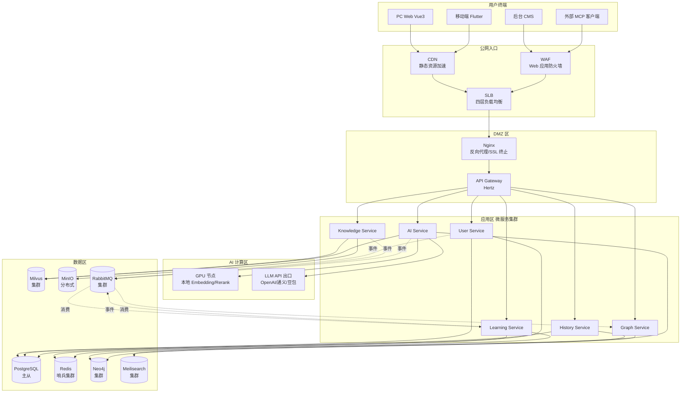

前端静态资源（Vue3 构建产物、Flutter Web 资源）由 CDN 直接分发，回源至 Nginx；API 流量经 WAF 清洗后进入 SLB，再由 Nginx 做 SSL 终止与七层路由，最终到达 API Gateway。Gateway 作为统一鉴权与限流入口，将请求分发到六个微服务。AI Service 同时依赖本地 GPU 节点（Embedding/Rerank 推理）与外部 LLM API，二者走不同的网络出口以隔离故障域。

## 3 环境划分

平台设置四个独立环境，各自隔离的命名空间与基础设施，配置通过 Viper 按 `APP_ENV` 环境变量加载不同配置文件。

| 环境 | 命名空间 | 用途 | 规模 | 数据 | 关键配置差异 |
| ---- | -------- | ---- | ---- | ---- | ------------ |
| 开发环境 dev | `tcm-dev` | 日常开发联调 | 单节点，1 副本 | 本地种子数据 | 关闭 TLS，日志级别 DEBUG，单机 Redis/PG，MinIO 单节点 |
| 测试环境 test | `tcm-test` | 自动化测试、集成测试 | 单节点，1 副本 | 合成测试数据 | 开启 TLS，日志级别 INFO，独立 RabbitMQ，每次构建后重置 |
| 预发布环境 staging | `tcm-staging` | 上线前验证、压测 | 双副本，缩容集群 | 生产数据脱敏副本 | 与生产同构配置，连接生产只读从库，启用全链路压测 |
| 生产环境 prod | `tcm-prod` | 对外服务 | 多副本，跨 AZ | 真实数据 | 开启 WAF/DDoS，日志级别 WARN，全量监控告警，跨 AZ 高可用 |

开发环境面向开发者本地与共享开发集群，资源最小化以控制成本，所有中间件可单点运行。测试环境由 CI 流水线触发部署，每次合并到 `main` 分支后自动构建并跑全量测试用例，数据库在每次运行前通过 Flyway 重建。预发布环境是生产的小规模镜像，硬件规格与生产同比例缩减（约为生产的 1/4），用于回归验证与性能压测，数据库挂载生产从库的延迟快照。生产环境是唯一面向真实用户的环境，所有变更必须经预发布验证后通过 GitOps 滚动发布。

## 4 网络架构

网络按安全纵深分为公网入口、DMZ 区、应用区、数据区四层，每层之间通过安全组与网络策略隔离，仅放行白名单端口。

### 4.1 网络分区

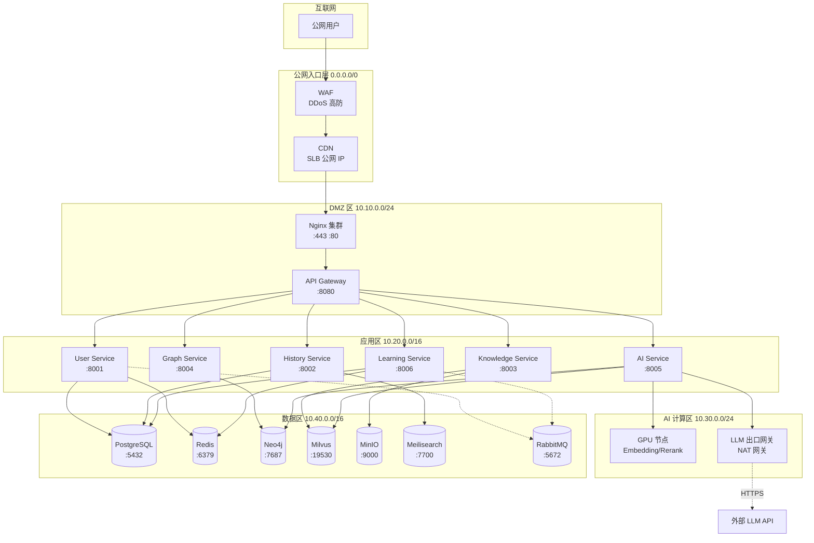

### 4.2 安全组策略

| 安全组 | 入站规则 | 出站规则 | 说明 |
| ------ | -------- | -------- | ---- |
| `sg-public` | 0.0.0.0/0:443, :80 | 仅至 `sg-dmz` | SLB/WAF 入口，拒绝直连后端 |
| `sg-dmz` | 来自 `sg-public`:443, :80 | 至 `sg-app`:8080 | Nginx 与 Gateway，禁止直连数据区 |
| `sg-app` | 来自 `sg-dmz`:8080, 来自 `sg-app` 内部 RPC 端口 | 至 `sg-data` 各 DB 端口、至 `sg-ai` | 微服务 Pod，禁止公网访问 |
| `sg-ai` | 来自 `sg-app`:8005 | 至 `sg-data`:19530/7687，至 NAT 网关出公网 | GPU 节点与 LLM 出口，出公网仅放行 LLM API 域名白名单 |
| `sg-data` | 来自 `sg-app`、`sg-ai` 各 DB 端口 | 拒绝所有出站公网 | 数据库节点完全内网隔离 |

公网入口层仅暴露 443 与 80 端口，所有入站流量必须经过 WAF 与 DDoS 高防清洗。DMZ 区的 Nginx 与 Gateway 不直连数据区，只能转发到应用区。应用区微服务之间通过 Kitex RPC 通信，RPC 端口仅在 `sg-app` 内部放行。AI 计算区是唯一需要出公网的区域，但出口网关基于域名白名单限制，仅允许访问 OpenAI、通义千问、豆包等 LLM API 域名，防止 GPU 节点被滥用为跳板。数据区彻底禁止出站公网，所有备份流量走内网到对象存储或专线。

## 5 服务部署策略

### 5.1 无状态服务

Gateway 与六个微服务均为无状态服务，会话状态外置到 Redis，因此可通过 HPA（Horizontal Pod Autoscaler）按 CPU 利用率与 QPS 指标水平扩展。部署采用多副本滚动更新，最小可用副本数保证更新期间不降级。

| 服务 | 最小副本 | HPA 目标 | 扩缩容范围 | 反亲和策略 |
| ---- | -------- | -------- | ---------- | ---------- |
| Gateway | 3 | CPU 60% | 3–10 | 跨 AZ 分散 |
| User Service | 2 | CPU 65% | 2–6 | 跨 AZ 分散 |
| History Service | 3 | CPU 65% | 3–8 | 跨 AZ 分散 |
| Knowledge Service | 2 | CPU 70% | 2–6 | 跨 AZ 分散 |
| Graph Service | 2 | CPU 65% | 2–5 | 跨 AZ 分散 |
| AI Service | 3 | CPU 75% + QPS 自定义 | 3–12 | 跨 AZ 分散，优先 GPU 节点亲和 |
| Learning Service | 2 | CPU 65% | 2–6 | 跨 AZ 分散 |

Pod 反亲和（podAntiAffinity）强制同一服务的副本分布到不同可用区与不同节点，避免单节点故障导致服务全挂。Gateway 保持至少 3 副本以支撑滚动更新零中断，AI Service 副本数上限最高（12），因为 RAG 检索与 Agent 编排是 CPU 密集型且峰值流量大。

### 5.2 有状态服务

PostgreSQL、Redis、Neo4j、Milvus、MinIO、Meilisearch、RabbitMQ 均为有状态服务，使用 StatefulSet 部署，配合 PV/PVC 持久化。有状态服务不直接参与 HPA 弹性扩缩容，而是通过主从复制或分片集群横向扩展。详见第 6 节各数据库拓扑。

### 5.3 AI Service 特殊考虑

AI Service 同时承担 LLM 调用、Agent 编排、Embedding/Rerank 推理三类负载，部署上拆分为两类节点。

普通节点（CPU）负责 LLM API 调用与 Agent 编排，这类负载是 IO 密集型（等待外部 LLM 响应），无需 GPU。GPU 节点负责本地 Embedding 与 Rerank 模型推理（如 BGE-M3、bge-reranker-v2），这类负载是计算密集型，部署在带 NVIDIA GPU 的专用节点池。

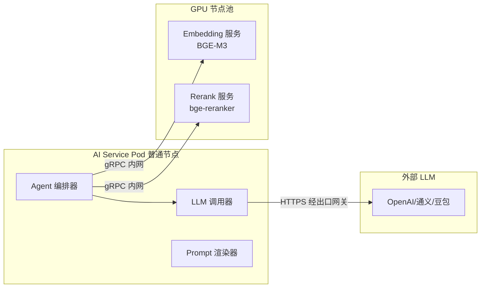

LLM 调用走独立的出口网关（NAT 网关 + 域名白名单），与内部服务流量隔离。这样设计的目的是当 LLM API 限流或抖动时，出口网关层的熔断与降级不会影响内部检索链路。GPU 节点池通过 nodeSelector 与 toleration 调度，普通 AI Service Pod 不会调度到 GPU 节点，避免浪费 GPU 资源。若选择全云端 LLM 方案（不本地部署 Embedding），GPU 节点池可省略，Embedding 与 Rerank 改用云厂商 API。

## 6 数据库部署

### 6.1 PostgreSQL 主从读写分离

PostgreSQL 16 采用一主两从架构，主库跨可用区同步流复制，从库承担只读查询与备份。

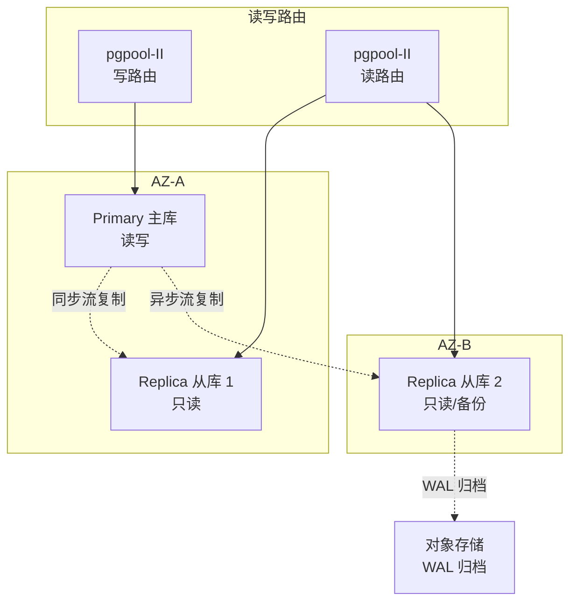

主库与从库 1 位于 AZ-A 同步复制（synchronous_commit = on），保证主库故障时从库 1 零数据丢失晋升为主库；从库 2 位于 AZ-B 异步复制，承担报表查询与每日全量备份。读写分离由 pgpool-II 中间件实现，写请求路由到主库，读请求按权重分发到从库。Patroni 负责主库故障自动切换，切换时间 < 30 秒。

### 6.2 Redis 哨兵集群

Redis 7 采用一主两从三哨兵架构，哨兵监控主库存活并在故障时自动选举新主。

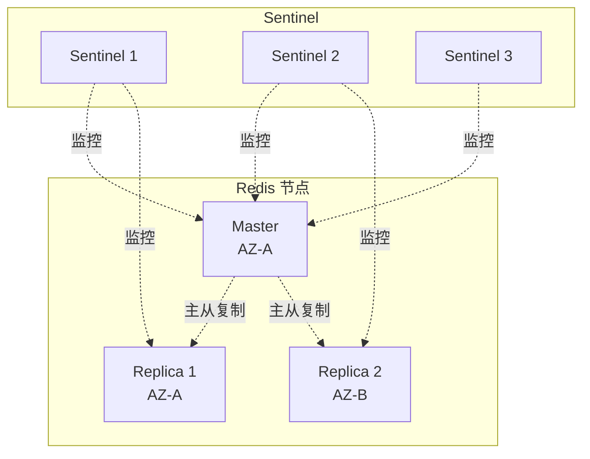

主库故障时，三个哨兵节点通过 Raft 协议选举新主，客户端通过 Sentinel 获取最新主库地址。Redis 开启 AOF 持久化（appendfsync everysec），RPO < 1 秒。会话、限流计数、热点缓存分片到不同逻辑库，避免单实例热点。

### 6.3 Neo4j 集群

Neo4j 5 采用因果集群（Causal Cluster），一主两读，主库承担写与强一致读，读库承担图遍历查询。

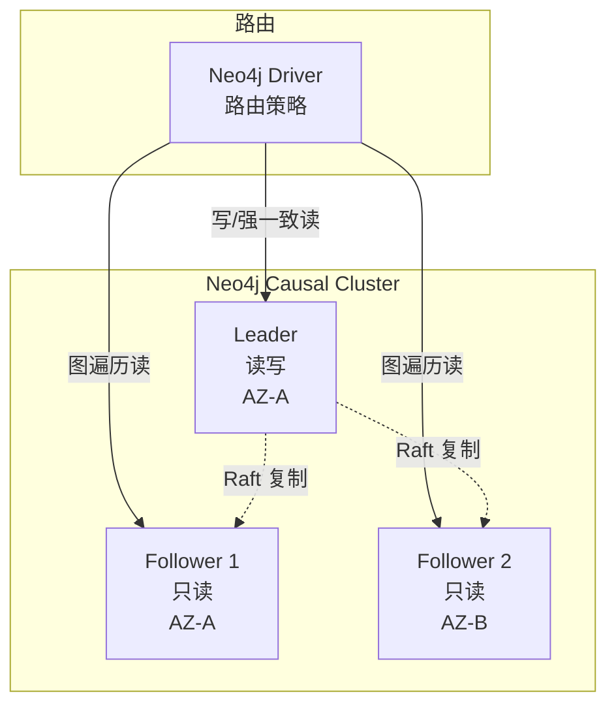

知识图谱的写操作（节点/关系增删改）路由到 Leader，图谱遍历查询（如「张仲景的所有师承关系」多跳 Cypher）路由到 Follower 分担负载。Raft 协议保证多数派写入一致，Leader 故障时 Follower 选举新 Leader，切换时间 < 10 秒。

### 6.4 Milvus 集群

Milvus 2 采用分布式集群部署，按角色拆分节点，存储与计算分离。

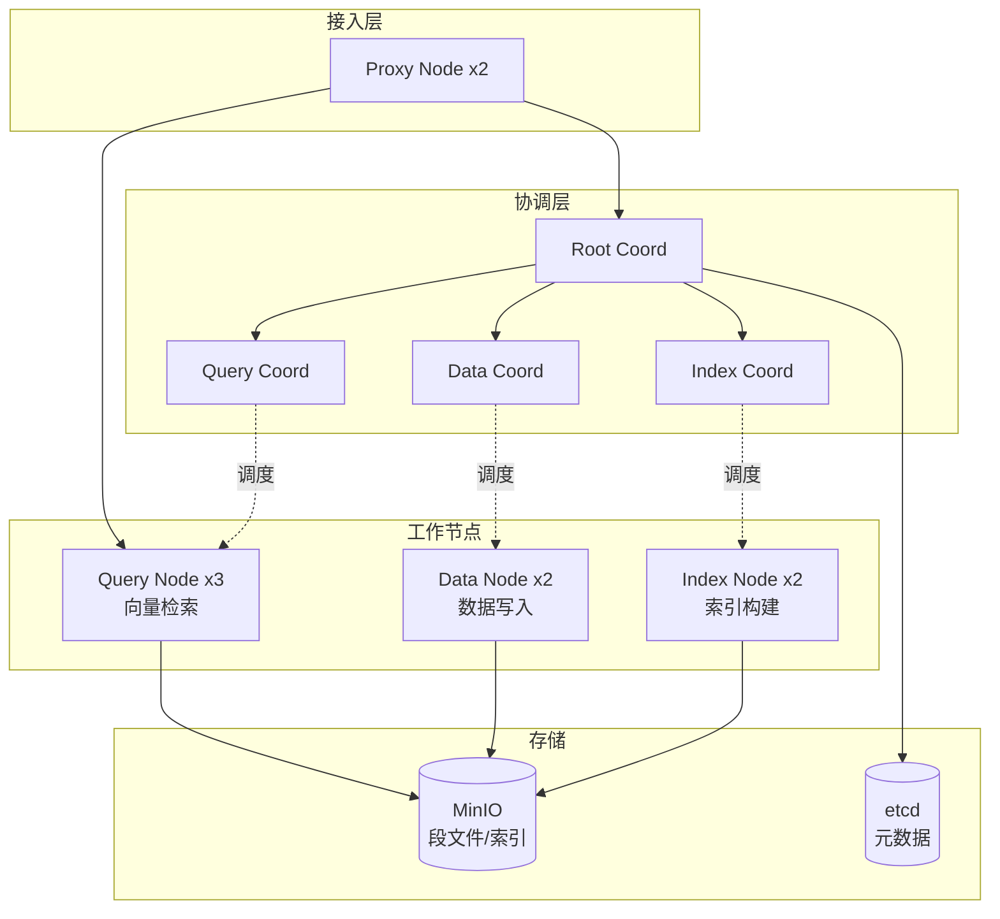

Proxy Node 是无状态接入节点，可水平扩展；Query Node 承担向量 ANN 检索，按集合分片负载均衡；Index Node 负责索引构建（IVF_FLAT/HNSW），构建过程不阻塞查询。段文件与索引存储在 MinIO，元数据存储在 etcd。存储计算分离使 Query Node 可独立扩缩容，应对 RAG 检索峰值流量。

## 7 存储方案

### 7.1 MinIO 分布式集群

MinIO 采用 4 节点分布式模式，每节点挂载 4 块 2TB NVMe 磁盘，总裸容量 32TB，纠删码（EC:4）后可用容量约 24TB。MinIO 同时服务于 Knowledge Service 的文献原文存储与 Milvus 的段文件存储，通过独立 Bucket 隔离。

| Bucket | 用途 | 存储类别 | 生命周期 |
| ------ | ---- | -------- | -------- |
| `tcm-documents` | 中医文献原文（PDF/图片） | 标准 | 永久 |
| `tcm-chunks` | 文献切片文本 | 标准 | 永久 |
| `tcm-milvus` | Milvus 段文件与索引 | 标准 | 随集合生命周期 |
| `tcm-backup` | 数据库备份与 WAL 归档 | 标准 | 30 天后转归档 |
| `tcm-assets` | 前端静态资源与上传图片 | 标准 | 永久 |

### 7.2 持久化卷规划

| 组件 | StorageClass | 卷模式 | 单卷容量 | 访问模式 |
| ---- | ------------ | ------ | -------- | -------- |
| PostgreSQL | `fast-ssd` | Filesystem | 500Gi | ReadWriteOnce |
| Redis | `fast-ssd` | Filesystem | 50Gi | ReadWriteOnce |
| Neo4j | `fast-ssd` | Filesystem | 200Gi | ReadWriteOnce |
| Milvus Query/Data Node | `fast-ssd` | Filesystem | 100Gi | ReadWriteOnce |
| MinIO | `fast-nvme` | Filesystem | 2Ti x4 | ReadWriteOnce |
| RabbitMQ | `fast-ssd` | Filesystem | 100Gi | ReadWriteOnce |
| Grafana/Loki | `standard` | Filesystem | 100Gi | ReadWriteOnce |

生产环境 StorageClass 绑定 SSD/NVMe CSI 驱动，IOPS 与吞吐满足数据库要求。`fast-ssd` 延迟 < 1ms，`fast-nvme` 延迟 < 0.2ms，`standard` 为云盘用于非热点数据。

### 7.3 备份策略

| 数据源 | 备份方式 | 频率 | 保留期 | 存储位置 |
| ------ | -------- | ---- | ------ | -------- |
| PostgreSQL | pg_basebackup 全量 + WAL 归档增量 | 全量每日 02:00，WAL 实时 | 全量 30 天，WAL 7 天 | MinIO `tcm-backup` + 异地 OSS |
| Redis | RDB 快照 + AOF | RDB 每 6 小时，AOF 实时 | RDB 7 天 | MinIO `tcm-backup` |
| Neo4j | `neo4j-admin dump` | 每日 03:00 | 14 天 | MinIO `tcm-backup` |
| Milvus | MinIO 段文件级快照 | 每日 04:00 | 7 天 | 异地 OSS |
| MinIO 文档 | 跨区域复制 | 实时 | 永久 | 异地 OSS |

PostgreSQL 备份采用「全量 + WAL 连续归档」组合，支持任意时间点恢复（PITR）。全量备份与 WAL 归档同步到异地对象存储（OSS），确保单区域灾难时备份仍可用。Neo4j 逻辑转储在从库执行，不影响主库读写。MinIO 文献数据通过跨区域复制实现异地容灾，RPO 接近 0。

## 8 可观测性部署

可观测性遵循 Metrics、Logs、Traces 三支柱模型，各自独立的采集链路与存储后端，通过 TraceID 关联。

### 8.1 监控指标采集

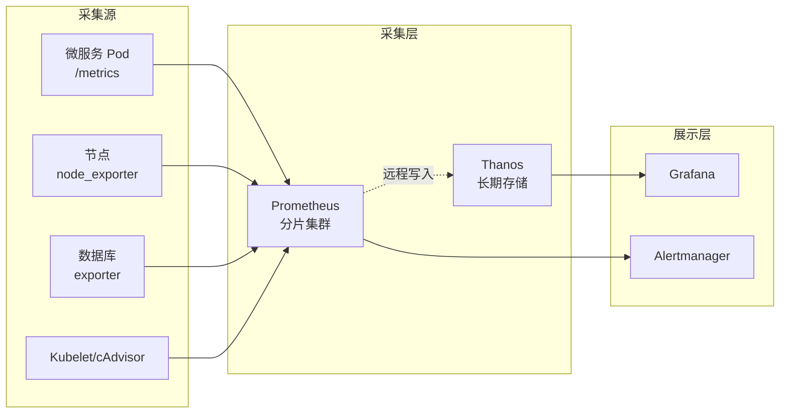

Prometheus 通过 ServiceMonitor 自动发现微服务 `/metrics` 端点，采集间隔 15 秒。Hertz 与 Kitex 框架原生暴露 Prometheus 指标（QPS、延迟分位、错误率）。数据库通过 postgres_exporter、redis_exporter、neo4j 内置 metrics、milvus 内置 metrics 采集。Thanos 负责 Prometheus 数据长期存储（对象存储后端）与全局查询，单 Prometheus 实例保留 15 天，Thanos 保留 1 年。告警经 Alertmanager 路由到飞书/钉钉/邮件。

### 8.2 日志采集

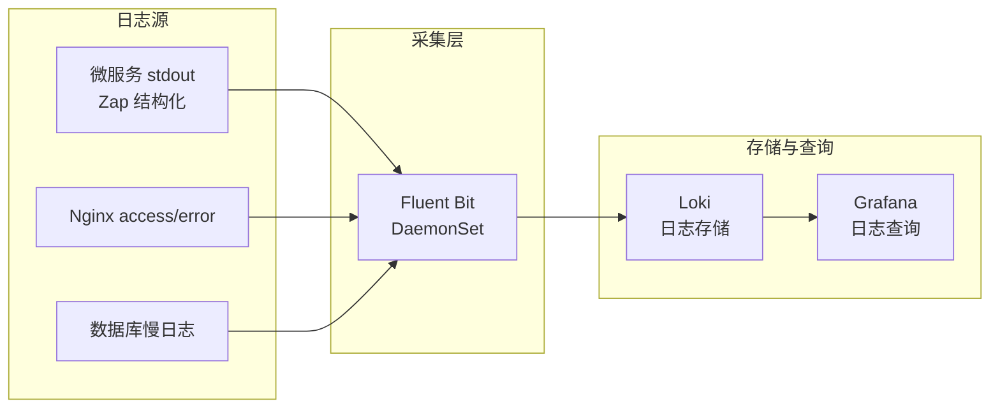

微服务日志统一输出到 stdout，Zap 产出 JSON 结构化日志（含 TraceID、SpanID、RequestID）。Fluent Bit 以 DaemonSet 方式运行在每个节点，采集容器 stdout 与节点日志文件，过滤后推送到 Loki。Loki 采用日志流（stream）标签索引而非全文索引，存储成本低，查询通过 LogQL 语法。日志保留 30 天，敏感字段（手机号、邮箱）在采集阶段脱敏。

### 8.3 链路追踪

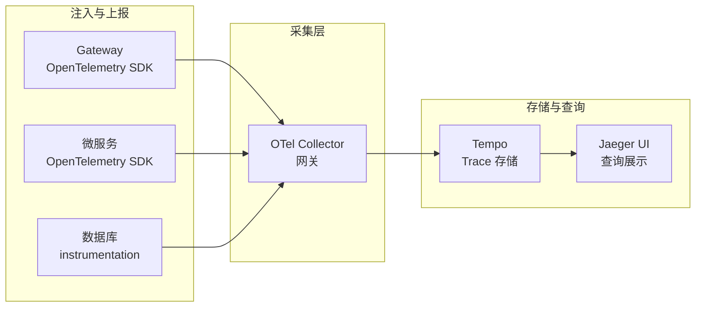

Gateway 在请求入口生成 TraceID 并通过 W3C TraceContext Header 透传到下游微服务。Hertz 与 Kitex 通过 OpenTelemetry instrumentation 自动埋点，记录 HTTP/RPC Span。AI Service 内部的 LLM 调用、向量检索、图谱查询作为子 Span 记录，便于定位 Agent 编排耗时瓶颈。OTel Collector 统一接收上报，去重采样后写入 Tempo。Tempo 仅索引 TraceID 而非标签，存储压缩比高，与 Jaeger UI 集成查询。Trace 采样率生产环境 10%，错误请求 100% 采样。

## 9 安全防护

### 9.1 网络边界防护

WAF 部署在公网入口，基于 OWASP 规则集拦截 SQL 注入、XSS、路径遍历等攻击，自定义规则拦截中医文献爬虫滥用。DDoS 高防在 WAF 上游，提供 > 100 Gbps 流量清洗能力，抵御 SYN Flood、UDP Flood、HTTP Flood。SLB 层配置连接数限流（单 IP 100 连接/秒）与黑洞策略。

### 9.2 SSL 证书管理

SSL 证书由 Let's Encrypt 签发，通过 cert-manager 在 Kubernetes 内自动签发与续期。通配符证书 `*.tcm-history.ai` 覆盖所有子域名，证书有效期 90 天，到期前 30 天自动轮转。Nginx 做 SSL 终止，启用 TLS 1.3 与 HSTS，内部服务间通信（Gateway 到微服务）走 mTLS（基于 Istio 或自签 CA）。

### 9.3 密钥管理

| 密钥类型 | 存储方式 | 轮转策略 |
| -------- | -------- | -------- |
| 数据库密码、Redis 密码 | Kubernetes Secret + Sealed Secrets | 季度轮转 |
| LLM API Key | HashiCorp Vault | 动态获取，不落盘 |
| 第三方 OAuth Client Secret | HashiCorp Vault | 半年轮转 |
| TLS 私钥 | cert-manager 自动管理 | 随证书轮转 |
| MinIO 访问密钥 | Kubernetes Secret | 季度轮转 |

敏感配置优先存入 HashiCorp Vault，微服务通过 Vault Agent Sidecar 或 Kubernetes Auth 方法动态获取，密钥不进入镜像与 Git 仓库。非敏感配置存入 Kubernetes Secret 并用 Sealed Secrets 加密后提交 GitOps 仓库。Vault 自身以 Raft 模式集群部署，启用自动 unseal（KMS）。

## 10 灾备与高可用

### 10.1 跨可用区部署

生产环境在两个可用区（AZ-A、AZ-B）对等部署，无状态服务副本均匀分布到两个 AZ，有状态服务主从跨 AZ 同步。

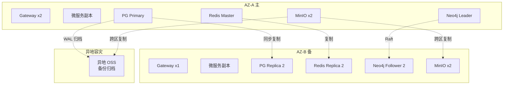

AZ-A 与 AZ-B 同时承载流量（双活），SLB 将流量按权重分发到两个 AZ 的 Nginx。任一 AZ 故障时，另一 AZ 承接全量流量，依赖 HPA 扩容补足容量。数据库主库故障由 Patroni/Sentinel 自动切换到同 AZ 或跨 AZ 从库。

### 10.2 故障切换策略

| 故障场景 | 检测机制 | 切换动作 | RTO |
| -------- | -------- | -------- | --- |
| 单 Pod 故障 | Liveness Probe 失败 | K8s 自动重启/重建 Pod | < 30 秒 |
| 单节点故障 | Node Controller | Pod 重新调度到健康节点 | < 2 分钟 |
| 单 AZ 故障 | SLB 健康检查 | 流量切到另一 AZ，HPA 扩容 | < 5 分钟 |
| PostgreSQL 主库故障 | Patroni 健康检查 | 从库提升为主库，连接池重连 | < 30 秒 |
| Redis 主库故障 | Sentinel 选举 | 哨兵选新主，客户端重连 | < 10 秒 |
| Neo4j Leader 故障 | Raft 选举 | Follower 提升为 Leader | < 10 秒 |
| Milvus Proxy 故障 | K8s 健康检查 | 重建 Proxy Pod | < 30 秒 |
| LLM API 限流/超时 | Sentinel 熔断 | 降级到备用 LLM 或返回缓存 | 即时 |

### 10.3 RTO/RPO 目标

| 业务等级 | 服务 | RTO | RPO |
| -------- | ---- | --- | --- |
| P0 核心 | 用户登录、AI 对话 | < 5 分钟 | < 1 分钟 |
| P1 重要 | 知识检索、学习记录 | < 15 分钟 | < 5 分钟 |
| P2 一般 | 图谱浏览、后台管理 | < 30 分钟 | < 15 分钟 |

P0 核心服务跨 AZ 双活，数据库同步复制，RPO 接近 0。P1 服务容忍异步复制带来的少量数据丢失（< 5 分钟）。P2 服务在单 AZ 故障时可延迟恢复，优先保障 P0/P1。

## 11 容量规划

容量规划基于日常 1000 QPS、峰值 5000 QPS 的目标，按各服务的请求占比与资源消耗推算。下表为生产环境推荐配置，预发布环境按 1/4 缩减，测试环境按 1/8 缩减。

### 11.1 计算资源配额

| 服务 | CPU 请求 | CPU 上限 | 内存请求 | 内存上限 | 副本数 | 说明 |
| ---- | -------- | -------- | -------- | -------- | ------ | ---- |
| Gateway | 500m | 2000m | 512Mi | 2Gi | 3 | 入口限流鉴权，CPU 敏感 |
| User Service | 500m | 1500m | 512Mi | 1Gi | 2 | JWT 验签轻量 |
| History Service | 1000m | 3000m | 1Gi | 2Gi | 3 | 列表检索 Meilisearch 偏 IO |
| Knowledge Service | 1000m | 4000m | 1Gi | 3Gi | 2 | RAG 检索 CPU 密集 |
| Graph Service | 500m | 2000m | 1Gi | 2Gi | 2 | Cypher 查询偏 Neo4j |
| AI Service（CPU） | 1000m | 4000m | 2Gi | 4Gi | 3 | Agent 编排 IO 密集 |
| AI Service（GPU） | 2000m | 4000m | 4Gi | 8Gi | 2 | 附 NVIDIA T4 16GB |
| Learning Service | 500m | 2000m | 512Mi | 1Gi | 2 | CRUD 为主 |
| Nginx | 500m | 1000m | 256Mi | 512Mi | 2 | SSL 终止 |
| Grafana | 250m | 500m | 512Mi | 1Gi | 1 | 监控展示 |
| Prometheus | 1000m | 2000m | 4Gi | 8Gi | 2 | 高内存 |
| Loki | 500m | 1000m | 1Gi | 2Gi | 2 | 日志存储 |
| OTel Collector | 250m | 500m | 256Mi | 512Mi | 2 | 链路采集 |

### 11.2 数据层资源配额

| 组件 | CPU | 内存 | 副本数 | 存储 | 说明 |
| ---- | --- | ---- | ------ | ---- | ---- |
| PostgreSQL Primary | 4 核 | 16Gi | 1 | 500Gi SSD | 主库承载写入 |
| PostgreSQL Replica | 4 核 | 16Gi | 2 | 500Gi SSD | 从库承载只读 |
| Redis Master | 2 核 | 8Gi | 1 | 50Gi SSD | 会话与缓存 |
| Redis Replica | 2 核 | 8Gi | 2 | 50Gi SSD | 读写分离与容灾 |
| Redis Sentinel | 250m | 256Mi | 3 | — | 仲裁 |
| Neo4j Leader | 4 核 | 16Gi | 1 | 200Gi SSD | 图谱写入 |
| Neo4j Follower | 4 核 | 16Gi | 2 | 200Gi SSD | 图谱遍历读 |
| Milvus Proxy | 1 核 | 2Gi | 2 | — | 接入路由 |
| Milvus Query Node | 4 核 | 16Gi | 3 | 100Gi SSD | 向量检索 |
| Milvus Data Node | 2 核 | 4Gi | 2 | 100Gi SSD | 数据写入 |
| Milvus Index Node | 4 核 | 8Gi | 2 | 100Gi SSD | 索引构建 |
| MinIO | 2 核 | 4Gi | 4 | 2Ti NVMe x4 | 对象存储 |
| RabbitMQ Node | 4 核 | 8Gi | 3 | 100Gi SSD | 事件流（镜像队列/仲裁队列） |
| etcd | 1 核 | 2Gi | 3 | 50Gi SSD | Milvus 元数据 |
| Meilisearch | 2 核 | 4Gi | 2 | 100Gi SSD | 全文检索 |

### 11.3 节点池规划

| 节点池 | 机型 | 节点数 | 用途 | 污点/亲和 |
| ------ | ---- | ------ | ---- | --------- |
| app-pool | 8 核 16Gi | 6 | 无状态微服务 | 跨 AZ 均匀 |
| data-pool | 16 核 64Gi | 4 | 数据库与中间件 | 专用节点，污点隔离 |
| gpu-pool | 8 核 32Gi + T4 16GB | 2 | AI 推理 | GPU 污点，仅 AI Service 调度 |
| infra-pool | 4 核 8Gi | 3 | 监控/日志/Ingress | 基础设施专用 |

集群总计算资源约 192 核 CPU、512Gi 内存、16TB 存储（含 GPU 节点）。app-pool 6 节点承载约 36 核可用 CPU，满足日常 1000 QPS 下 60% 水位运行，峰值 5000 QPS 时通过 HPA 触发 Cluster Autoscaler 扩容到 10 节点。data-pool 与 gpu-pool 为专用节点池，通过污点（taint）与容忍（toleration）确保数据库与 GPU 工作负载不被普通服务抢占资源。infra-pool 隔离监控组件，避免日志与指标采集尖峰影响业务 Pod。

后续第十五章将给出 Docker Compose 形式的开发与测试环境一键编排，第十六章给出生产级 Kubernetes 的 Helm Chart 与 ArgoCD GitOps 配置，本章的架构约束（网络分区、副本数、资源配额、灾备目标）作为后两章的实现依据。
