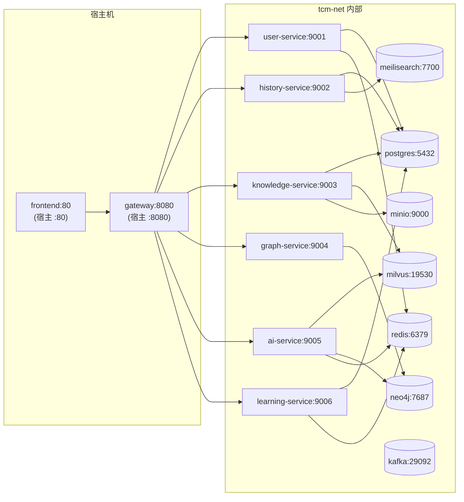
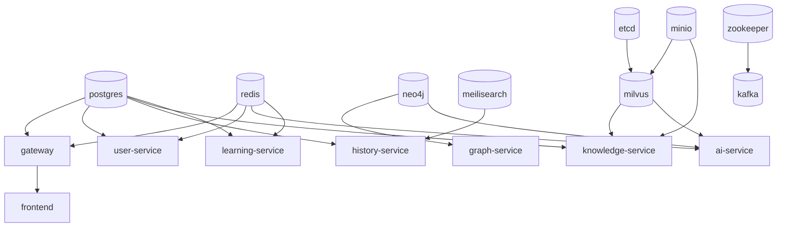

# 15 Docker 部署

Docker Compose 是 TCM-History-AI 在开发与测试环境下的唯一启动方式，通过一份 `docker-compose.yml` 把 PostgreSQL、Redis、Neo4j、Milvus、MinIO、Meilisearch、Kafka 及七个 Go 微服务、Vue3 前端一次性拉起，团队成员无需关心中间件安装与版本对齐。生产环境不使用 Compose，统一见第十六章 Kubernetes 部署，原因在于 Compose 单机编排无法满足滚动升级、HPA 弹性、多可用区打散等生产诉求。

本章覆盖镜像构建、Compose 全量编排、网络与卷规划、环境变量、健康检查、启动依赖链、一键脚本与常见排错八个维度，目标是让新成员克隆仓库后执行 `make up` 即可在 5 分钟内拿到一个可访问的本地全栈环境。

## 1 镜像构建

### 1.1 Go 微服务多阶段 Dockerfile

七个 Go 微服务共享仓库根目录的单个 `Dockerfile`，通过构建参数 `SERVICE_NAME` 区分编译目标，避免每个服务维护一份高度重复的构建脚本。Builder 阶段基于 `golang:1.22-alpine` 完成依赖下载与静态编译，Runtime 阶段基于 `alpine:3.19` 仅装 `ca-certificates`、`tzdata`、`wget` 三件套，最终镜像体积控制在 25 MB 左右。

```dockerfile
# syntax=docker/dockerfile:1.7
ARG GO_VERSION=1.22

############################
# Builder：拉依赖 + 静态编译
############################
FROM golang:${GO_VERSION}-alpine AS builder

ARG SERVICE_NAME=gateway
ARG SERVICE_PATH=cmd/${SERVICE_NAME}

WORKDIR /build

# 仅装编译期工具，不进最终镜像
RUN apk add --no-cache git make

# 先拷依赖清单，利用层缓存：go.mod 不变则跳过 go mod download
COPY go.mod go.sum ./
RUN --mount=type=cache,target=/go/pkg/mod \
    go mod download

# 拷源码并编译，CGO_ENABLED=0 产出纯静态二进制
COPY . .
RUN --mount=type=cache,target=/go/pkg/mod \
    --mount=type=cache,target=/root/.cache/go-build \
    CGO_ENABLED=0 GOOS=linux GOARCH=amd64 \
    go build -trimpath -ldflags="-s -w" -o /out/app ./${SERVICE_PATH}

############################
# Runtime：最小化运行镜像
############################
FROM alpine:3.19 AS runtime

# ca-certificates 用于 TLS 调用外部 LLM；tzdata 保证 Asia/Shanghai 生效；
# wget 供 healthcheck 调用 /health 端点
RUN apk add --no-cache ca-certificates tzdata wget && \
    addgroup -S app && adduser -S -G app -u 10001 app

ENV TZ=Asia/Shanghai

WORKDIR /app
COPY --from=builder /out/app /app/app
COPY --from=builder /build/configs /app/configs

USER app

# EXPOSE 仅声明，实际端口由 docker-compose 映射
EXPOSE 8080

ENTRYPOINT ["/app/app"]
```

关键决策说明：

- `CGO_ENABLED=0` 配合 `GOOS=linux` 产出无 C 依赖的静态二进制，使其能在 alpine（musl libc）甚至 distroless 上直接运行。若未来切换 `gcr.io/distroless/static-debian12` 作为 runtime，只需替换最后一阶段并去掉 `apk add`。
- `-trimpath -ldflags="-s -w"` 去除调试信息与文件路径，镜像体积再减约 30%，同时避免泄露构建机绝对路径。
- `--mount=type=cache` 把 Go module 缓存与 build cache 挂载到 BuildKit 缓存卷，跨构建复用，二次构建从分钟级降到秒级。该语法要求 `DOCKER_BUILDKIT=1`，Compose v2 与 Docker 20.10+ 默认满足。
- 运行用户为非 root 的 `app`（UID 10001），符合容器安全基线，避免容器内进程以 root 写卷导致宿主机权限错乱。

### 1.2 前端 Vue3 Dockerfile

前端为 Vben Admin（Vue3 + Vite + pnpm），构建产物是纯静态文件，由 Nginx 托管。Builder 阶段用 `node:20-alpine` 执行 `pnpm build` 产出 `dist/`，Runtime 阶段把 `dist/` 拷进官方 `nginx:1.25-alpine` 镜像并覆盖默认配置。

```dockerfile
# syntax=docker/dockerfile:1.7

############################
# Builder：pnpm install + build
############################
FROM node:20-alpine AS builder

WORKDIR /app

RUN corepack enable && corepack prepare pnpm@9 --activate

# 仅拷依赖清单，命中层缓存
COPY package.json pnpm-lock.yaml ./
RUN pnpm install --frozen-lockfile

COPY . .

# 构建参数注入 API 网关地址，构建期写死到静态产物
ARG VITE_API_BASE=/api
ENV VITE_API_BASE=${VITE_API_BASE}
RUN pnpm build

############################
# Runtime：Nginx 托管静态资源
############################
FROM nginx:1.25-alpine AS runtime

# 用项目自定义 nginx.conf 覆盖默认站点
COPY nginx/default.conf /etc/nginx/conf.d/default.conf
COPY --from=builder /app/dist /usr/share/nginx/html

EXPOSE 80

HEALTHCHECK --interval=30s --timeout=3s --retries=3 \
  CMD wget -qO- http://127.0.0.1/ > /dev/null || exit 1
```

前端 Nginx 配置的核心职责有两点：把 `/api` 反向代理到 Gateway 容器（`proxy_pass http://gateway:8080`），以及对 Vue Router 的 history 模式做 `try_files` 回退，避免刷新子路由 404。

### 1.3 镜像优化策略

镜像瘦身与构建加速是同一组手段的两面，统一在仓库根 `.dockerignore` 与 Dockerfile 层缓存设计里落地。

```text
# .dockerignore
.git
.github
.idea
.vscode
**/node_modules
**/dist
**/.env
**/*.log
**/testdata
**/coverage
docs/
*.md
```

优化策略矩阵：

| 策略 | 落地方式 | 收益 |
| ---- | -------- | ---- |
| 多阶段构建 | builder 与 runtime 分离，runtime 不含编译工具链 | 最终镜像 25 MB vs 全量镜像 1.2 GB |
| .dockerignore | 排除 node_modules、.git、日志、测试数据 | 减小构建上下文，避免无效层失效缓存 |
| 依赖清单先行 | 先 `COPY go.mod go.sum` 再 `go mod download` | 源码改动不触发依赖重下 |
| BuildKit 缓存挂载 | `--mount=type=cache` 复用 pkg/mod 与 go-build | 二次构建秒级 |
| 静态编译 + scratch 基础镜像 | `CGO_ENABLED=0`，可选 distroless | 无 shell 攻击面 |
| 合并 RUN 与清理 | `apk add --no-cache` 不留 apk 缓存 | 减少层数与残留文件 |

## 2 docker-compose.yml 完整设计

### 2.1 服务清单与端口规划

Compose 共编排 17 个服务，分为基础设施、应用、前端三组。端口规划遵循「对外仅暴露前端与调试端口，服务间走内部网络」的原则。

| 服务 | 容器内端口 | 宿主机映射 | 用途 |
| ---- | ---------- | ---------- | ---- |
| postgres | 5432 | 5432 | 关系型主库 |
| redis | 6379 | 6379 | 缓存与会话 |
| neo4j | 7474 / 7687 | 7474 / 7687 | 图数据库 HTTP / Bolt |
| etcd | 2379 | — | Milvus 元数据 |
| minio | 9000 / 9001 | 9000 / 9001 | 对象存储 API / 控制台 |
| milvus | 19530 / 9091 | 19530 / 9091 | 向量库 gRPC / 指标 |
| meilisearch | 7700 | 7700 | 全文检索 |
| zookeeper | 2181 | — | Kafka 协调 |
| kafka | 9092 | 9092 | 消息队列 |
| gateway | 8080 | 8080 | API 网关 |
| user-service | 9001 / 8081 | — | RPC / 指标 |
| history-service | 9002 / 8082 | — | RPC / 指标 |
| knowledge-service | 9003 / 8083 | — | RPC / 指标 |
| graph-service | 9004 / 8084 | — | RPC / 指标 |
| ai-service | 9005 / 8085 | — | RPC / 指标 |
| learning-service | 9006 / 8086 | — | RPC / 指标 |
| frontend | 80 | 80 | PC Web |

Kitex RPC 端口（9001-9006）仅暴露在内部网络，Gateway 通过 `user-service:9001` 这样的服务名直连，宿主机无法访问，降低本地被扫描风险。

### 2.2 完整 compose 文件

```yaml
# docker-compose.yml
# 用法：make up / docker compose up -d
name: tcm-history-ai

services:
  # ======================== 基础设施 ========================
  postgres:
    image: postgres:16-alpine
    container_name: tcm-postgres
    restart: unless-stopped
    environment:
      POSTGRES_USER: ${POSTGRES_USER}
      POSTGRES_PASSWORD: ${POSTGRES_PASSWORD}
      POSTGRES_DB: ${POSTGRES_DB}
      TZ: Asia/Shanghai
    ports:
      - "${POSTGRES_PORT}:5432"
    volumes:
      - postgres_data:/var/lib/postgresql/data
    healthcheck:
      test: ["CMD-SHELL", "pg_isready -U ${POSTGRES_USER} -d ${POSTGRES_DB}"]
      interval: 10s
      timeout: 5s
      retries: 5
      start_period: 20s
    networks: [tcm-net]

  redis:
    image: redis:7-alpine
    container_name: tcm-redis
    restart: unless-stopped
    command: ["redis-server", "--requirepass", "${REDIS_PASSWORD}", "--appendonly", "yes"]
    ports:
      - "${REDIS_PORT}:6379"
    volumes:
      - redis_data:/data
    healthcheck:
      test: ["CMD", "redis-cli", "-a", "${REDIS_PASSWORD}", "ping"]
      interval: 10s
      timeout: 3s
      retries: 5
    networks: [tcm-net]

  neo4j:
    image: neo4j:5-community
    container_name: tcm-neo4j
    restart: unless-stopped
    environment:
      NEO4J_AUTH: neo4j/${NEO4J_PASSWORD}
      NEO4J_PLUGINS: '["apoc"]'
      NEO4J_server_memory_heap_initial__size: 512m
      NEO4J_server_memory_heap_max__size: 1G
      NEO4J_server_memory_pagecache_size: 512m
      TZ: Asia/Shanghai
    ports:
      - "${NEO4J_HTTP_PORT}:7474"
      - "${NEO4J_BOLT_PORT}:7687"
    volumes:
      - neo4j_data:/data
      - neo4j_logs:/logs
    healthcheck:
      test: ["CMD-SHELL", "wget -qO- http://127.0.0.1:7474 || exit 1"]
      interval: 15s
      timeout: 5s
      retries: 10
      start_period: 40s
    networks: [tcm-net]

  etcd:
    image: quay.io/coreos/etcd:v3.5.5
    container_name: tcm-etcd
    restart: unless-stopped
    environment:
      ETCD_AUTO_COMPACTION_MODE: revision
      ETCD_AUTO_COMPACTION_RETENTION: "1000"
      ETCD_QUOTA_BACKEND_BYTES: "4294967296"
      ETCD_SNAPSHOT_COUNT: "50000"
    command:
      - etcd
      - -advertise-client-urls=http://etcd:2379
      - -listen-client-urls=http://0.0.0.0:2379
      - --data-dir=/etcd
    volumes:
      - etcd_data:/etcd
    healthcheck:
      test: ["CMD", "etcdctl", "endpoint", "health"]
      interval: 15s
      timeout: 5s
      retries: 5
      start_period: 15s
    networks: [tcm-net]

  minio:
    image: minio/minio:RELEASE.2024-01-01T00-00-00Z
    container_name: tcm-minio
    restart: unless-stopped
    command: server /data --console-address ":9001"
    environment:
      MINIO_ROOT_USER: ${MINIO_ROOT_USER}
      MINIO_ROOT_PASSWORD: ${MINIO_ROOT_PASSWORD}
    ports:
      - "${MINIO_API_PORT}:9000"
      - "${MINIO_CONSOLE_PORT}:9001"
    volumes:
      - minio_data:/data
    healthcheck:
      test: ["CMD", "curl", "-f", "http://127.0.0.1:9000/minio/health/live"]
      interval: 15s
      timeout: 5s
      retries: 5
      start_period: 20s
    networks: [tcm-net]

  milvus:
    image: milvusdb/milvus:v2.4.0
    container_name: tcm-milvus
    restart: unless-stopped
    command: ["milvus", "run", "standalone"]
    security_opt:
      - seccomp:unconfined
    environment:
      ETCD_ENDPOINTS: etcd:2379
      MINIO_ADDRESS: minio:9000
      MINIO_ACCESS_KEY_ID: ${MINIO_ROOT_USER}
      MINIO_SECRET_ACCESS_KEY: ${MINIO_ROOT_PASSWORD}
      MINIO_BUCKET_NAME: milvus
    depends_on:
      etcd:
        condition: service_healthy
      minio:
        condition: service_healthy
    ports:
      - "${MILVUS_GRPC_PORT}:19530"
      - "${MILVUS_METRICS_PORT}:9091"
    volumes:
      - milvus_data:/var/lib/milvus
    healthcheck:
      test: ["CMD", "curl", "-f", "http://127.0.0.1:9091/healthz"]
      interval: 20s
      timeout: 5s
      retries: 10
      start_period: 60s
    networks: [tcm-net]

  meilisearch:
    image: getmeili/meilisearch:v1.6
    container_name: tcm-meili
    restart: unless-stopped
    environment:
      MEILI_MASTER_KEY: ${MEILI_MASTER_KEY}
      MEILI_ENV: development
    ports:
      - "${MEILI_PORT}:7700"
    volumes:
      - meili_data:/meili_data
    healthcheck:
      test: ["CMD", "wget", "-qO-", "http://127.0.0.1:7700/health"]
      interval: 15s
      timeout: 3s
      retries: 5
    networks: [tcm-net]

  zookeeper:
    image: confluentinc/cp-zookeeper:7.5.0
    container_name: tcm-zookeeper
    restart: unless-stopped
    environment:
      ZOOKEEPER_CLIENT_PORT: 2181
      ZOOKEEPER_TICK_TIME: 2000
    volumes:
      - zookeeper_data:/var/lib/zookeeper/data
      - zookeeper_log:/var/lib/zookeeper/log
    healthcheck:
      test: ["CMD", "nc", "-z", "127.0.0.1", "2181"]
      interval: 15s
      timeout: 3s
      retries: 5
    networks: [tcm-net]

  kafka:
    image: confluentinc/cp-kafka:7.5.0
    container_name: tcm-kafka
    restart: unless-stopped
    environment:
      KAFKA_BROKER_ID: 1
      KAFKA_ZOOKEEPER_CONNECT: zookeeper:2181
      KAFKA_ADVERTISED_LISTENERS: PLAINTEXT://kafka:29092,PLAINTEXT_HOST://127.0.0.1:${KAFKA_PORT}
      KAFKA_LISTENER_SECURITY_PROTOCOL_MAP: PLAINTEXT:PLAINTEXT,PLAINTEXT_HOST:PLAINTEXT
      KAFKA_INTER_BROKER_LISTENER_NAME: PLAINTEXT
      KAFKA_OFFSETS_TOPIC_REPLICATION_FACTOR: 1
      KAFKA_AUTO_CREATE_TOPICS_ENABLE: "true"
    depends_on:
      zookeeper:
        condition: service_healthy
    ports:
      - "${KAFKA_PORT}:9092"
    volumes:
      - kafka_data:/var/lib/kafka/data
    healthcheck:
      test: ["CMD", "kafka-broker-api-versions", "--bootstrap-server", "127.0.0.1:9092"]
      interval: 20s
      timeout: 10s
      retries: 8
      start_period: 30s
    networks: [tcm-net]

  # ======================== 应用服务 ========================
  gateway:
    build:
      context: .
      dockerfile: Dockerfile
      args:
        SERVICE_NAME: gateway
    image: tcm/gateway:dev
    container_name: tcm-gateway
    restart: unless-stopped
    env_file: [.env]
    environment:
      SERVICE_NAME: gateway
      HTTP_PORT: "8080"
    depends_on:
      postgres: {condition: service_healthy}
      redis: {condition: service_healthy}
    ports:
      - "${GATEWAY_PORT}:8080"
    healthcheck:
      test: ["CMD", "wget", "-qO-", "http://127.0.0.1:8080/health"]
      interval: 15s
      timeout: 3s
      retries: 5
      start_period: 20s
    networks: [tcm-net]

  user-service:
    build:
      context: .
      dockerfile: Dockerfile
      args:
        SERVICE_NAME: user-service
    image: tcm/user-service:dev
    container_name: tcm-user
    restart: unless-stopped
    env_file: [.env]
    environment:
      SERVICE_NAME: user-service
      RPC_PORT: "9001"
      METRICS_PORT: "8081"
    depends_on:
      postgres: {condition: service_healthy}
      redis: {condition: service_healthy}
    healthcheck:
      test: ["CMD", "wget", "-qO-", "http://127.0.0.1:8081/health"]
      interval: 15s
      timeout: 3s
      retries: 5
      start_period: 20s
    networks: [tcm-net]

  history-service:
    build:
      context: .
      dockerfile: Dockerfile
      args:
        SERVICE_NAME: history-service
    image: tcm/history-service:dev
    container_name: tcm-history
    restart: unless-stopped
    env_file: [.env]
    environment:
      SERVICE_NAME: history-service
      RPC_PORT: "9002"
      METRICS_PORT: "8082"
    depends_on:
      postgres: {condition: service_healthy}
      meilisearch: {condition: service_healthy}
    healthcheck:
      test: ["CMD", "wget", "-qO-", "http://127.0.0.1:8082/health"]
      interval: 15s
      timeout: 3s
      retries: 5
      start_period: 20s
    networks: [tcm-net]

  knowledge-service:
    build:
      context: .
      dockerfile: Dockerfile
      args:
        SERVICE_NAME: knowledge-service
    image: tcm/knowledge-service:dev
    container_name: tcm-knowledge
    restart: unless-stopped
    env_file: [.env]
    environment:
      SERVICE_NAME: knowledge-service
      RPC_PORT: "9003"
      METRICS_PORT: "8083"
    depends_on:
      postgres: {condition: service_healthy}
      milvus: {condition: service_healthy}
      minio: {condition: service_healthy}
    healthcheck:
      test: ["CMD", "wget", "-qO-", "http://127.0.0.1:8083/health"]
      interval: 15s
      timeout: 3s
      retries: 5
      start_period: 20s
    networks: [tcm-net]

  graph-service:
    build:
      context: .
      dockerfile: Dockerfile
      args:
        SERVICE_NAME: graph-service
    image: tcm/graph-service:dev
    container_name: tcm-graph
    restart: unless-stopped
    env_file: [.env]
    environment:
      SERVICE_NAME: graph-service
      RPC_PORT: "9004"
      METRICS_PORT: "8084"
    depends_on:
      neo4j: {condition: service_healthy}
    healthcheck:
      test: ["CMD", "wget", "-qO-", "http://127.0.0.1:8084/health"]
      interval: 15s
      timeout: 3s
      retries: 5
      start_period: 20s
    networks: [tcm-net]

  ai-service:
    build:
      context: .
      dockerfile: Dockerfile
      args:
        SERVICE_NAME: ai-service
    image: tcm/ai-service:dev
    container_name: tcm-ai
    restart: unless-stopped
    env_file: [.env]
    environment:
      SERVICE_NAME: ai-service
      RPC_PORT: "9005"
      METRICS_PORT: "8085"
    depends_on:
      milvus: {condition: service_healthy}
      neo4j: {condition: service_healthy}
      redis: {condition: service_healthy}
    healthcheck:
      test: ["CMD", "wget", "-qO-", "http://127.0.0.1:8085/health"]
      interval: 15s
      timeout: 3s
      retries: 5
      start_period: 20s
    networks: [tcm-net]

  learning-service:
    build:
      context: .
      dockerfile: Dockerfile
      args:
        SERVICE_NAME: learning-service
    image: tcm/learning-service:dev
    container_name: tcm-learning
    restart: unless-stopped
    env_file: [.env]
    environment:
      SERVICE_NAME: learning-service
      RPC_PORT: "9006"
      METRICS_PORT: "8086"
    depends_on:
      postgres: {condition: service_healthy}
      redis: {condition: service_healthy}
    healthcheck:
      test: ["CMD", "wget", "-qO-", "http://127.0.0.1:8086/health"]
      interval: 15s
      timeout: 3s
      retries: 5
      start_period: 20s
    networks: [tcm-net]

  # ======================== 前端 ========================
  frontend:
    build:
      context: ./frontend
      dockerfile: Dockerfile
      args:
        VITE_API_BASE: /api
    image: tcm/frontend:dev
    container_name: tcm-frontend
    restart: unless-stopped
    depends_on:
      gateway: {condition: service_healthy}
    ports:
      - "${FRONTEND_PORT}:80"
    networks: [tcm-net]

networks:
  tcm-net:
    name: tcm-net
    driver: bridge

volumes:
  postgres_data:
  redis_data:
  neo4j_data:
  neo4j_logs:
  etcd_data:
  minio_data:
  milvus_data:
  meili_data:
  zookeeper_data:
  zookeeper_log:
  kafka_data:
```

## 3 网络规划

Compose 创建一个名为 `tcm-net` 的自定义 bridge 网络，所有服务挂载到该网络。自定义 bridge 相比默认 bridge 的关键差异在于：容器间通过服务名自动 DNS 解析（`postgres`、`gateway` 直接可达），无需 `links`；隔离性更好，不与宿主机其他 Compose 项目的默认网络混用。

服务间通信一律使用「服务名 + 容器内端口」的地址形式，例如 Knowledge Service 连接 Milvus 用 `milvus:19530`、连接 MinIO 用 `minio:9000`，不使用宿主机映射端口。这样配置与是否暴露宿主机端口解耦，迁移到 K8s 时只需把服务名替换为 Service 名。



## 4 数据持久化

所有有状态服务的数据目录挂载到命名卷，命名卷由 Docker 统一管理在 `/var/lib/docker/volumes` 下，便于备份与跨容器复用。不使用 bind mount，避免宿主机路径差异与权限问题。卷规划如下表。

| 卷名 | 挂载点 | 所属服务 | 说明 |
| ---- | ------ | -------- | ---- |
| `postgres_data` | /var/lib/postgresql/data | postgres | 主库数据 |
| `redis_data` | /data | redis | AOF 持久化 |
| `neo4j_data` | /data | neo4j | 图数据 |
| `neo4j_logs` | /logs | neo4j | 事务与查询日志 |
| `etcd_data` | /etcd | etcd | Milvus 元数据 |
| `minio_data` | /data | minio | 对象存储（应用 + Milvus 共用，按 bucket 隔离） |
| `milvus_data` | /var/lib/milvus | milvus | 向量索引落盘 |
| `meili_data` | /meili_data | meilisearch | 倒排索引 |
| `zookeeper_data` | /var/lib/zookeeper/data | zookeeper | 协调数据 |
| `zookeeper_log` | /var/lib/zookeeper/log | zookeeper | 事务日志 |
| `kafka_data` | /var/lib/kafka/data | kafka | 分区日志 |

MinIO 采用单实例同时服务应用文件存储与 Milvus 的对象存储，通过 bucket 隔离：应用用 `tcm-assets`，Milvus 用 `milvus`。这样减少一个容器与一份存储，代价是 IO 共享，但开发环境流量极低，不构成瓶颈。生产环境按第十六章方案拆分。

## 5 环境配置

敏感信息与可变配置统一放 `.env` 文件，Compose 自动注入，Compose 文件本身不含任何明文密钥。`.env` 不提交到 Git（已在 `.gitignore`），仓库提供 `.env.example` 作为模板。

```bash
# .env.example —— 复制为 .env 后按需修改

# ===== PostgreSQL =====
POSTGRES_USER=tcm
POSTGRES_PASSWORD=change-me-in-local
POSTGRES_DB=tcm_history
POSTGRES_PORT=5432

# ===== Redis =====
REDIS_PASSWORD=change-me-in-local
REDIS_PORT=6379

# ===== Neo4j =====
NEO4J_PASSWORD=change-me-in-local
NEO4J_HTTP_PORT=7474
NEO4J_BOLT_PORT=7687

# ===== MinIO =====
MINIO_ROOT_USER=tcm
MINIO_ROOT_PASSWORD=change-me-in-local
MINIO_API_PORT=9000
MINIO_CONSOLE_PORT=9001

# ===== Milvus =====
MILVUS_GRPC_PORT=19530
MILVUS_METRICS_PORT=9091

# ===== Meilisearch =====
MEILI_MASTER_KEY=change-me-in-local
MEILI_PORT=7700

# ===== Kafka =====
KAFKA_PORT=9092

# ===== 应用 =====
GATEWAY_PORT=8080
FRONTEND_PORT=80
JWT_SECRET=change-me-to-a-long-random-string
LLM_API_KEY=sk-xxx
LLM_BASE_URL=https://api.example.com/v1
```

配置加载优先级在服务内由 Viper 控制：环境变量 > `.env` 文件 > 配置中心 > 本地 `configs/*.yaml`。Compose 阶段以环境变量为主，端口与密钥全部来自 `.env`。

## 6 健康检查

每个服务配置 `healthcheck`，Compose 通过 `depends_on.condition: service_healthy` 据此控制启动顺序。健康端点与探测命令按服务类型区分。

| 服务 | 探测命令 | start_period | 说明 |
| ---- | -------- | ------------ | ---- |
| postgres | `pg_isready -U $USER -d $DB` | 20s | 官方就绪探测 |
| redis | `redis-cli -a $PASS ping` | — | 鉴权后 ping |
| neo4j | `wget http://127.0.0.1:7474` | 40s | JVM 启动慢 |
| etcd | `etcdctl endpoint health` | 15s | 元数据就绪 |
| minio | `curl /minio/health/live` | 20s | 存活探针 |
| milvus | `curl http://127.0.0.1:9091/healthz` | 60s | 索引服务初始化慢 |
| meilisearch | `wget http://127.0.0.1:7700/health` | — | 引擎就绪 |
| zookeeper | `nc -z 127.0.0.1 2181` | — | 端口监听即就绪 |
| kafka | `kafka-broker-api-versions` | 30s | Broker 可服务 |
| Go 微服务 | `wget http://127.0.0.1:808x/health` | 20s | 自实现 `/health` 端点 |

Go 微服务的 `/health` 端点返回 200 表示进程存活且配置加载完成，不检查下游依赖（依赖检查归 `/ready`，避免级联重启）。`start_period` 期间失败不计入 retries，给 JVM（Neo4j）与索引初始化（Milvus）留足冷启动时间。

## 7 启动顺序

启动顺序由 `depends_on` 的 `service_healthy` 条件驱动，下游服务在上游健康检查通过后才启动，避免「连接被拒绝」式的启动竞态。完整依赖链如下。



启动分三层推进：第一层是无依赖的基础设施（postgres、redis、neo4j、etcd、minio、meilisearch、zookeeper）并行启动；第二层是依赖第一层的 milvus（依赖 etcd + minio）与 kafka（依赖 zookeeper）；第三层是七个 Go 微服务，各自等待自己依赖的基础设施 healthy 后启动；最末是 frontend，等 gateway healthy 才启动，保证 Nginx 反代目标已就绪。Compose 会按拓扑序自动调度，无需手动排序。

## 8 一键启动脚本

仓库根目录提供 `Makefile`，封装常用 Compose 操作，团队成员只需记忆 `make up`、`make down`、`make logs`、`make reset` 四个命令。

```makefile
# Makefile
COMPOSE := docker compose
ENV     := .env

.PHONY: up down logs ps build reset clean init help

init: ## 从模板生成 .env（首次使用）
	@if [ ! -f $(ENV) ]; then cp .env.example $(ENV) && echo "已生成 $(ENV)，请按需修改"; \
	else echo "$(ENV) 已存在，跳过"; fi

build: ## 构建全部镜像
	$(COMPOSE) build

up: init ## 构建并后台启动全部服务
	$(COMPOSE) up -d --build

down: ## 停止并删除容器（保留卷）
	$(COMPOSE) down

logs: ## 跟踪全部日志
	$(COMPOSE) logs -f --tail=200

ps: ## 查看服务状态
	$(COMPOSE) ps

reset: down ## 停止并删除容器与卷（清空数据，慎用）
	$(COMPOSE) down -v

clean: reset ## 删除容器、卷与本地镜像
	$(COMPOSE) down -v --rmi local

help:
	@grep -E '^[a-zA-Z_-]+:.*?## .*$$' $(MAKEFILE_LIST) | \
		awk 'BEGIN{FS=":.*?## "}{printf "  \033[36m%-10s\033[0m %s\n", $$1, $$2}'
```

常用操作速查：

| 命令 | 作用 | 是否清数据 |
| ---- | ---- | ---------- |
| `make up` | 首次生成 .env，构建镜像并后台启动 | 否 |
| `make down` | 停止并删除容器、网络，保留卷 | 否 |
| `make logs` | 实时跟踪全部服务日志 | — |
| `make ps` | 查看各服务运行与健康状态 | — |
| `make reset` | 删除容器与卷，下次 `make up` 即干净环境 | 是 |
| `make clean` | 在 reset 基础上删除本地构建的镜像 | 是 |

`make reset` 适合排查「数据脏导致服务异常」的问题，但会清空 Neo4j 图谱与 Milvus 向量索引，重新灌库耗时较长，日常优先用 `make down` + `make up` 重启。

## 9 常见问题与排错

### 9.1 端口冲突

宿主机若已占用 80、8080、5432、6379、7474 等端口，`make up` 报 `bind: address already in use`。处理方式是修改 `.env` 中对应端口映射，例如把 `FRONTEND_PORT=80` 改为 `FRONTEND_PORT=8088`，容器内端口不变。容器间通信走内部网络不受影响。排查占用进程：`lsof -i :80` 或 `ss -lntp | grep :80`。

### 9.2 数据卷权限

PostgreSQL 与 Neo4j 镜像以固定 UID（postgres 为 999、neo4j 为 7474）写卷，若宿主机曾用 bind mount 或手动 `chown` 过卷目录，可能触发 `permission denied`。命名卷由 Docker 初始化正确权限，通常不会出现；若从 bind mount 迁移过来报错，执行 `make reset` 清掉旧卷重建即可。不要在宿主机对 `/var/lib/docker/volumes` 手动改权限。

### 9.3 Milvus 依赖未就绪

Milvus 启动依赖 etcd 与 minio，常见错误是 `failed to connect to etcd` 或 `minio connection refused`，根因是 etcd 或 minio 尚未 healthy 就被 Milvus 抢连。本 Compose 已用 `depends_on.condition: service_healthy` 规避，若仍偶发，检查 etcd 的 `etcdctl endpoint health` 是否真的返回 healthy。Milvus 首次初始化索引需 60 秒以上，`start_period: 60s` 期间的健康失败属正常，耐心等待即可。

### 9.4 Neo4j 内存不足

Neo4j 默认按宿主机内存自动分配 heap，在内存紧张的本地机器上可能 OOM 或启动极慢。本 Compose 已显式限制 `heap_max=1G`、`pagecache=512M`，适合 8 GB 内存机器。若宿主机只有 4 GB，把这两项下调到 `512m` / `256m`，同时关闭 APOC（去掉 `NEO4J_PLUGINS`）以减负。日志查看：`docker logs tcm-neo4j | grep -i memory`。

### 9.5 镜像构建慢

首次 `make up` 需拉取 12 个基础镜像并编译 7 个 Go 服务，国内网络下 `go mod download` 与 `apk add` 易超时。两个加速手段：配置 Go 代理 `GOPROXY=https://goproxy.cn,direct`（在 Dockerfile builder 阶段 `ENV GOPROXY=...` 或 `.env` 注入）；配置 Docker 镜像加速器（`/etc/docker/daemon.json` 加 `registry-mirrors`）。二次构建因 BuildKit 缓存命中，通常 10 秒内完成。

### 9.6 服务健康但接口 502

Gateway healthy 只代表进程启动，若下游微服务未全部就绪，Gateway 转发会 502。用 `make ps` 确认七个微服务全部 `healthy`，再访问接口。Kitex RPC 连接是懒建立的，首个请求可能慢，属正常。

### 9.7 Kafka 消费者无法连接

Kafka 的 `advertised.listeners` 决定 broker 返回给客户端的连接地址。本 Compose 配置 `PLAINTEXT://kafka:29092`（容器内）与 `PLAINTEXT_HOST://127.0.0.1:9092`（宿主机），容器内服务用 `kafka:29092` 连接，宿主机调试用 `127.0.0.1:9092`。若应用配置写错地址会导致 `Connection refused` 或超时，核对配置中的 broker 地址与服务所在网络一致。
