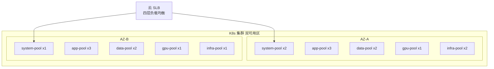
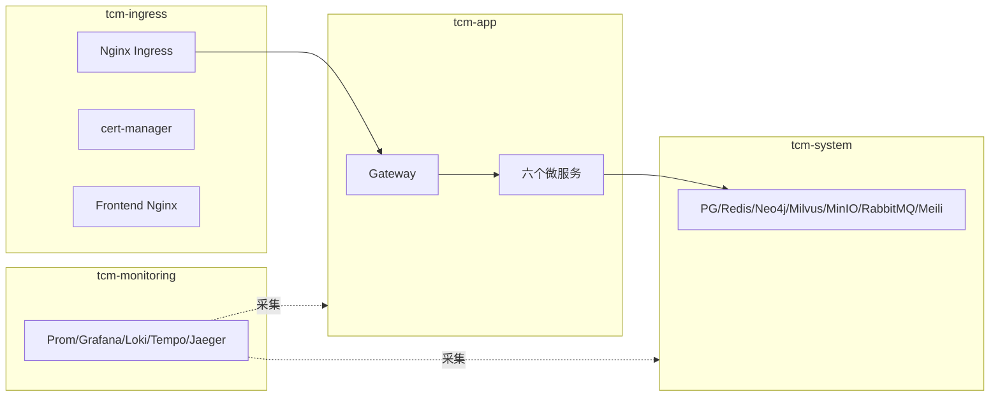
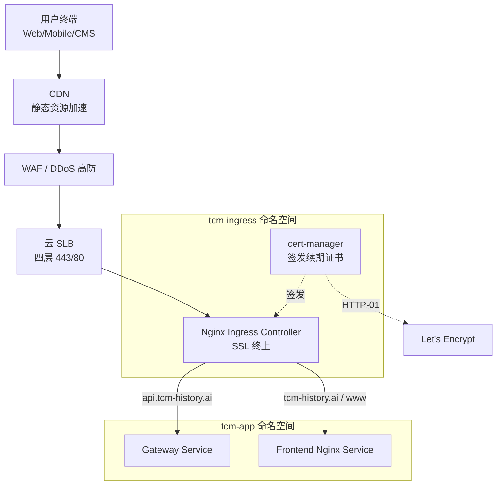
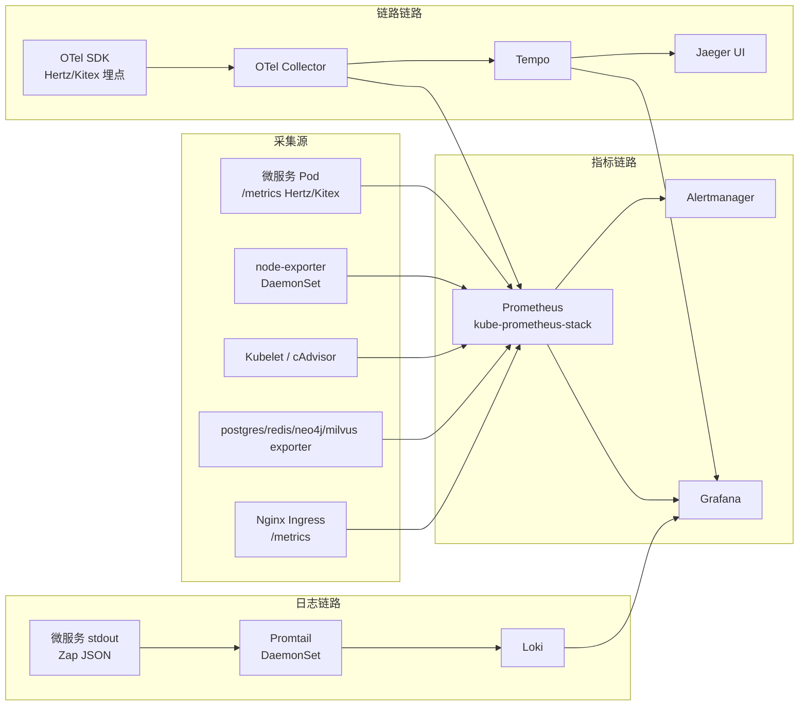
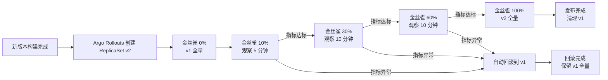

# 16 Kubernetes 部署

Kubernetes 是 TCM-History-AI 生产环境唯一的编排平台。第十四章定义了部署架构、网络分区、副本数、资源配额与 RTO/RPO 目标，第十五章用 Docker Compose 解决了开发与测试环境的单机启动，本章把这些架构约束落地为生产级 Kubernetes 清单：节点池划分、Operator 化的基础设施、Deployment 化的应用服务、Nginx Ingress 入口、kube-prometheus-stack 全栈可观测性，以及 NetworkPolicy、Pod Security Standards、Trivy 镜像扫描构成的安全基线。

生产集群不使用裸 `kubectl apply` 维护，全部资源通过 ArgoCD GitOps 同步，Helm Chart 与 Kustomize overlay 分层管理。镜像统一推送至 GitHub Container Registry（`ghcr.io/tcm-history-ai`），CI 流水线构建后打 Git commit short SHA 与 `latest` 双标签，生产环境固定引用 SHA 标签以保证可追溯与可回滚。

## 1 集群规划

集群基于自建或托管 Kubernetes 1.29，启用 Containerd 运行时、Cilium CNI（支持 NetworkPolicy 与 eBPF 可观测）、CSI 块存储驱动。节点按工作负载类型划分为四个独立节点池，彼此通过污点（taint）与标签（label）隔离，避免数据库、GPU、监控工作负载互相抢占资源。节点池规格承接第十四章容量规划，按日常 1000 QPS、峰值 5000 QPS 反推得出。

| 节点池 | 机型 | 节点数 | 可用区分布 | 用途 | 污点 / 亲和 |
| ------ | ---- | ------ | ---------- | ---- | ----------- |
| system-pool | 4 核 8Gi 100Gi SSD | 3 | AZ-A x2 / AZ-B x1 | 控制面组件、CoreDNS、Cilium、Ingress Controller | 无污点，系统组件优先 |
| app-pool | 8 核 16Gi 100Gi SSD | 6 | AZ-A x3 / AZ-B x3 | 无状态微服务（Gateway 及六个微服务） | 无污点，跨 AZ 均匀打散 |
| data-pool | 16 核 64Gi 500Gi NVMe | 4 | AZ-A x2 / AZ-B x2 | PostgreSQL、Redis、Neo4j、Milvus、MinIO、RabbitMQ、Meilisearch | `dedicated=data:NoSchedule` |
| gpu-pool | 8 核 32Gi + NVIDIA T4 16GB | 2 | AZ-A x1 / AZ-B x1 | AI Service GPU 副本（Embedding/Rerank 推理） | `nvidia.com/gpu=present:NoSchedule` |
| infra-pool | 4 核 8Gi 200Gi SSD | 3 | AZ-A x2 / AZ-B x1 | Prometheus、Grafana、Loki、Tempo、Jaeger、OTel Collector | `dedicated=infra:NoSchedule` |

集群总规模约 192 核 CPU、512Gi 内存、16TB 存储（含 GPU 节点）。app-pool 6 节点承载约 48 核可分配 CPU，满足日常 1000 QPS 下 60% 水位运行；峰值 5000 QPS 时由 HPA 触发 Cluster Autoscaler 将 app-pool 扩到 10 节点。data-pool 与 gpu-pool 为专用节点池，通过 `NoSchedule` 污点确保普通 Pod 不会被调度上来，只有配置了对应 toleration 的有状态服务与 AI Service GPU 副本才能落位。infra-pool 隔离监控组件，避免日志与指标采集尖峰抢占业务 Pod 的 CPU。



## 2 命名空间规划

命名空间按职责隔离基础设施、应用、监控与入口四层，配合 ResourceQuota 与 LimitRange 限制每个命名空间的资源总量与单 Pod 配额。跨命名空间通信通过 NetworkPolicy 显式放行，默认拒绝。

| 命名空间 | 用途 | 核心工作负载 | ResourceQuota 概要 |
| -------- | ---- | ------------ | ------------------ |
| `tcm-system` | 基础设施与数据层 | PostgreSQL、Redis、Neo4j、Milvus、MinIO、RabbitMQ、Meilisearch、etcd | CPU 100 核 / 内存 256Gi |
| `tcm-app` | 业务微服务 | Gateway、User/History/Knowledge/Graph/AI/Learning Service | CPU 48 核 / 内存 96Gi |
| `tcm-monitoring` | 可观测性栈 | Prometheus、Grafana、Loki、Promtail、Tempo、Jaeger、OTel Collector、Alertmanager | CPU 16 核 / 内存 64Gi |
| `tcm-ingress` | 入口与证书 | Nginx Ingress Controller、cert-manager、Frontend Nginx | CPU 8 核 / 内存 16Gi |



命名空间初始化统一通过一个 `namespace.yaml` 创建并打标签，标签供 NetworkPolicy 与 Prometheus 服务发现使用。

```yaml
# namespace.yaml
apiVersion: v1
kind: Namespace
metadata:
  name: tcm-system
  labels:
    name: tcm-system
    pod-security.kubernetes.io/enforce: baseline
    pod-security.kubernetes.io/audit: restricted
    pod-security.kubernetes.io/warn: restricted
---
apiVersion: v1
kind: Namespace
metadata:
  name: tcm-app
  labels:
    name: tcm-app
    pod-security.kubernetes.io/enforce: restricted
    pod-security.kubernetes.io/audit: restricted
    pod-security.kubernetes.io/warn: restricted
---
apiVersion: v1
kind: Namespace
metadata:
  name: tcm-monitoring
  labels:
    name: tcm-monitoring
    pod-security.kubernetes.io/enforce: baseline
---
apiVersion: v1
kind: Namespace
metadata:
  name: tcm-ingress
  labels:
    name: tcm-ingress
    pod-security.kubernetes.io/enforce: baseline
```

## 3 基础设施部署

数据层组件均部署在 `tcm-system` 命名空间，优先采用 Operator 或官方 Helm Chart 管理，避免手写零散 StatefulSet。Operator 负责备份、扩缩容、故障切换等运维动作，StatefulSet 仅用于无成熟 Operator 的组件（Meilisearch）。

### 3.1 PostgreSQL CloudNativePG 主从集群

PostgreSQL 16 采用 CloudNativePG（CNPG）Operator 管理，CNPG 原生支持主从流复制、自动故障切换、WAL 归档到对象存储与 PITR，无需额外引入 Patroni 与 pgpool。集群一主两从，主库与从库 1 跨 AZ 同步复制，从库 2 异步复制承担报表与备份。

```yaml
# postgres-cluster.yaml
apiVersion: postgresql.cnpg.io/v1
kind: Cluster
metadata:
  name: tcm-postgres
  namespace: tcm-system
spec:
  instances: 3
  imageName: ghcr.io/cloudnative-pg/postgresql:16.2
  primaryUpdateStrategy: unsupervised
  postgresql:
    parameters:
      max_connections: "200"
      shared_buffers: "4GB"
      effective_cache_size: "12GB"
      work_mem: "16MB"
      wal_level: replica
      synchronous_commit: "on"
      max_wal_senders: "10"
      max_replication_slots: "10"
      log_min_duration_statement: "500"
    pg_hba:
      - hostssl app app 0.0.0.0/0 scram-sha-256
  bootstrap:
    initdb:
      database: tcm_history
      owner: app
      secret:
        name: postgres-app-secret
  storage:
    storageClass: fast-ssd
    size: 500Gi
  walStorage:
    storageClass: fast-ssd
    size: 50Gi
  affinity:
    enablePodAntiAffinity: true
    topologyKey: topology.kubernetes.io/zone
    podAntiAffinityType: required
  backup:
    barmanObjectStore:
      destinationPath: s3://tcm-backup/postgres
      endpointURL: http://minio.tcm-system.svc:9000
      s3Credentials:
        accessKeyId:
          name: minio-backup-secret
          key: ACCESS_KEY
        secretAccessKey:
          name: minio-backup-secret
          key: SECRET_KEY
      wal:
        compression: gzip
        maxParallel: 2
    retentionPolicy: "30d"
  nodeMaintenanceWindow:
    reusePVC: false
  resources:
    requests:
      cpu: "4"
      memory: 16Gi
    limits:
      cpu: "4"
      memory: 16Gi
```

CNPG 通过 `instances: 3` 创建三个 Pod，`enablePodAntiAffinity` 强制它们分布到不同可用区。`synchronous_commit: "on"` 保证主库故障时同步从库零数据丢失。`backup.barmanObjectStore` 将 WAL 持续归档到 MinIO，配合每日全量备份实现 PITR，保留 30 天。应用通过 CNPG 暴露的 `tcm-postgres-rw`（读写）与 `tcm-postgres-ro`（只读）两个 Service 接入，无需 pgpool 中间件。

### 3.2 Redis Sentinel 集群

Redis 7 采用一主两从三哨兵架构，通过 `redis-operator`（OT Container）管理，Operator 自动维护主从复制与 Sentinel 仲裁。主从跨 AZ 分布，Sentinel 通过 Raft 选举新主，切换时间 < 10 秒。

```yaml
# redis-cluster.yaml
apiVersion: redis.opstreelabs.in/v1beta2
kind: Redis
metadata:
  name: tcm-redis
  namespace: tcm-system
spec:
  mode: cluster
  clusterSize: 3
  kubernetesConfig:
    image: quay.io/opstree/redis:v7.2.4
    imagePullPolicy: IfNotPresent
    serviceType: ClusterIP
    resources:
      requests:
        cpu: "2"
        memory: 8Gi
      limits:
        cpu: "2"
        memory: 8Gi
  redisExporter:
    enabled: true
    image: quay.io/opstree/redis-exporter:v1.59.0
  storage:
    volumeClaimTemplate:
      spec:
        storageClassName: fast-ssd
        accessModes: ["ReadWriteOnce"]
        resources:
          requests:
            storage: 50Gi
  persistence:
    enabled: true
    aof:
      enabled: true
      appendfsync: everysec
    rdb:
      enabled: true
      schedule: "0 */6 * * *"
  podSecurityContext:
    runAsUser: 1000
    fsGroup: 1000
  affinity:
    podAntiAffinity:
      requiredDuringSchedulingIgnoredDuringExecution:
        - labelSelector:
            matchLabels:
              app: tcm-redis
          topologyKey: topology.kubernetes.io/zone
```

AOF 每秒 fsync 保证 RPO < 1 秒，RDB 每 6 小时快照作为冷备。`redisExporter.enabled` 暴露 `/metrics` 端点供 Prometheus 采集。应用连接 Sentinel 获取主库地址，主库故障时客户端自动重连新主。

### 3.3 Neo4j Helm Chart 集群

Neo4j 5 因果集群通过官方 Helm Chart 部署，一主两读，Leader 承担写与强一致读，Follower 承担图遍历查询。Raft 协议保证多数派写入一致，Leader 故障时 Follower 选举新 Leader，切换 < 10 秒。

```yaml
# neo4j-values.yaml
neo4j:
  name: tcm-neo4j
  passwordFromSecret: neo4j-secret
  edition: enterprise
  acceptLicenseAgreement: "yes"

cluster:
  enabled: true
  numberOfServers: 3
  baseURI: neo4j://tcm-neo4j.tcm-system.svc:7687

services:
  neo4j:
    type: ClusterIP

config:
  dbms.mode: CORE
  dbms.default_database: neo4j
  server.memory.heap.initial_size: 8G
  server.memory.heap.max_size: 12G
  server.memory.pagecache.size: 4G
  server.directories.data: /data
  causal_clustering.expected_core_cluster_size: 3
  causal_clustering.minimum_core_cluster_size_at_formation: 3
  server.bolt.listen_address: ":7687"
  server.http.listen_address: ":7474"

resources:
  requests:
    cpu: "4"
    memory: 16Gi
  limits:
    cpu: "4"
    memory: 16Gi

persistence:
  enabled: true
  storageClassName: fast-ssd
  size: 200Gi
  accessMode: ReadWriteOnce

nodeSelector:
  dedicated: data
tolerations:
  - key: dedicated
    value: data
    effect: NoSchedule

podAntiAffinity:
  type: required
  topologyKey: topology.kubernetes.io/zone

apoc:
  enabled: true
```

`dbms.mode: CORE` 使三个节点均为 Core 节点参与 Raft 选举。应用通过 Neo4j Driver 的路由策略自动将写请求发往 Leader、遍历读请求分发到 Follower。APOC 插件启用以支持图算法与过程扩展。

### 3.4 Milvus Helm Chart 分布式集群

Milvus 2 采用分布式集群部署，存储与计算分离，按角色拆分 Proxy、Query Node、Data Node、Index Node。段文件与索引存于 MinIO，元数据存于 etcd。Query Node 可独立扩缩容应对 RAG 检索峰值。

```yaml
# milvus-values.yaml
cluster:
  enabled: true

image:
  all:
    repository: milvusdb/milvus
    tag: v2.4.0

queryNode:
  replicas: 3
  resources:
    requests:
      cpu: "4"
      memory: 16Gi
    limits:
      cpu: "4"
      memory: 16Gi
  persistence:
    enabled: true
    storageClass: fast-ssd
    accessMode: ReadWriteOnce
    size: 100Gi

dataNode:
  replicas: 2
  resources:
    requests: { cpu: "2", memory: 4Gi }
    limits: { cpu: "2", memory: 4Gi }

indexNode:
  replicas: 2
  resources:
    requests: { cpu: "4", memory: 8Gi }
    limits: { cpu: "4", memory: 8Gi }

proxy:
  replicas: 2
  resources:
    requests: { cpu: "1", memory: 2Gi }
    limits: { cpu: "1", memory: 2Gi }

etcd:
  enabled: true
  replicaCount: 3
  persistence:
    enabled: true
    size: 50Gi
    storageClass: fast-ssd

minio:
  enabled: false   # 复用 tcm-system 下独立 MinIO Operator 集群

externalS3:
  enabled: true
  host: minio.tcm-system.svc
  port: 9000
  accessKey: ""
  secretKey: ""
  useSSL: false
  bucketName: tcm-milvus
  cloudProvider: aws

attu:
  enabled: true
  service:
    type: ClusterIP

nodeSelector:
  dedicated: data
tolerations:
  - key: dedicated
    value: data
    effect: NoSchedule
```

`minio.enabled: false` 关闭内置 MinIO，改用 `externalS3` 指向 `tcm-system` 下独立 MinIO Operator 集群的 `tcm-milvus` bucket，避免存储重复部署。Attu 作为 Milvus 可视化管理面板仅集群内访问。

### 3.5 MinIO Operator 集群

MinIO 采用官方 Operator 管理，4 节点分布式模式，每节点挂载 4 块 2TB NVMe，纠删码（EC:4）后可用容量约 24TB。MinIO 同时服务文献原文存储与 Milvus 段文件，通过独立 Bucket 隔离。

```yaml
# minio-tenant.yaml
apiVersion: minio.min.io/v2
kind: Tenant
metadata:
  name: tcm-minio
  namespace: tcm-system
spec:
  image: minio/minio:RELEASE.2024-01-01T00-00-00Z
  imagePullPolicy: IfNotPresent
  credsSecret:
    name: minio-creds-secret
  pools:
    - servers: 4
      volumesPerServer: 4
      volumeClaimTemplate:
        metadata:
          name: data
        spec:
          storageClassName: fast-nvme
          accessModes: [ReadWriteOnce]
          resources:
            requests:
              storage: 2Ti
      resources:
        requests:
          cpu: "2"
          memory: 4Gi
        limits:
          cpu: "2"
          memory: 4Gi
      nodeSelector:
        dedicated: data
      tolerations:
        - key: dedicated
          value: data
          effect: NoSchedule
      affinity:
        podAntiAffinity:
          requiredDuringSchedulingIgnoredDuringExecution:
            - labelSelector:
                matchLabels:
                  v1.min.io/tenant: tcm-minio
              topologyKey: kubernetes.io/hostname
  requestAutoCert: true
  podManagementPolicy: Parallel
  metrics:
    enabled: true
    port: 9000
```

`servers: 4` + `volumesPerServer: 4` 构成 16 块盘的分布式集群，单节点或单盘故障不影响数据完整性。`requestAutoCert` 启用内部 TLS，`metrics.enabled` 暴露 Prometheus 指标。

### 3.6 RabbitMQ Cluster Operator

RabbitMQ 通过 Cluster Operator 管理，3 节点仲裁队列（Quorum Queue）集群，Exchange/Queue/Binding 通过 `definitions.json` 启动时导入或 management plugin 声明，纳入 GitOps。

```yaml
# rabbitmq-cluster.yaml
apiVersion: rabbitmq.com/v1beta1
kind: RabbitmqCluster
metadata:
  name: tcm-rabbitmq
  namespace: tcm-system
spec:
  replicas: 3
  image: rabbitmq:3.13-management
  service:
    type: ClusterIP
  rabbitmq:
    additionalConfig: |
      default_vhost = /tcm
      default_user_tags.administrator = true
      default_permissions.configure = .*
      default_permissions.write = .*
      default_permissions.read = .*
      quorum_commands_default = 128
      cluster_partition_handling = pause_minority
    additionalPlugins:
      - rabbitmq_management
      - rabbitmq_peer_discovery_k8s
      - rabbitmq_prometheus
    envConfig: |
      RABBITMQ_DEFAULT_USER=tcm
      RABBITMQ_DEFAULT_PASS_FILE=/etc/rabbitmq/secret/password
  persistence:
    storageClassName: fast-ssd
    storage: 100Gi
  resources:
    requests: { cpu: "4", memory: 8Gi }
    limits: { cpu: "4", memory: 8Gi }
  affinity:
    podAntiAffinity:
      requiredDuringSchedulingIgnoredDuringExecution:
        - labelSelector:
            matchLabels:
              app.kubernetes.io/name: tcm-rabbitmq
          topologyKey: topology.kubernetes.io/zone
  tolerations:
    - key: dedicated
      value: data
      effect: NoSchedule
  secretBackend:
    externalSecret:
      name: rabbitmq-secret
```

3 副本跨可用区打散，任一节点故障剩余 2 节点仍可形成多数派继续服务，配合 `pause_minority` 防止脑裂。仲裁队列（Quorum Queue）基于 Raft 协议保证消息不丢，替代旧的镜像队列。Exchange/Queue/Binding 通过 `definitions.json` 挂载启动时导入，运维变更走 GitOps；用户与密码经 `secretBackend.externalSecret` 对接 External Secrets Operator，从 Vault 拉取，不入仓库。`rabbitmq_prometheus` 插件暴露 `/metrics` 供 Prometheus 抓取。

### 3.7 Meilisearch StatefulSet

Meilisearch 无成熟 Operator，采用 StatefulSet 直接部署，两副本分别承担读写，索引数据通过启动时从共享存储加载或主从同步保持一致。生产环境 Meilisearch 以单主实例 + 备份恢复为主，多副本用于读分担时需配合其分布式特性评估。

```yaml
# meilisearch-statefulset.yaml
apiVersion: apps/v1
kind: StatefulSet
metadata:
  name: tcm-meilisearch
  namespace: tcm-system
spec:
  serviceName: tcm-meilisearch
  replicas: 1
  selector:
    matchLabels:
      app: tcm-meilisearch
  template:
    metadata:
      labels:
        app: tcm-meilisearch
    spec:
      nodeSelector:
        dedicated: data
      tolerations:
        - key: dedicated
          value: data
          effect: NoSchedule
      securityContext:
        runAsUser: 1000
        runAsNonRoot: true
        fsGroup: 1000
      containers:
        - name: meilisearch
          image: getmeili/meilisearch:v1.6
          args: ["--env", "production", "--master-key", "$(MEILI_MASTER_KEY)"]
          env:
            - name: MEILI_MASTER_KEY
              valueFrom:
                secretKeyRef:
                  name: meili-secret
                  key: MEILI_MASTER_KEY
            - name: MEILI_ENV
              value: production
            - name: MEILI_NO_ANALYTICS
              value: "true"
          ports:
            - name: http
              containerPort: 7700
          resources:
            requests: { cpu: "2", memory: 4Gi }
            limits: { cpu: "2", memory: 4Gi }
          readinessProbe:
            httpGet:
              path: /health
              port: http
            initialDelaySeconds: 10
            periodSeconds: 10
          livenessProbe:
            httpGet:
              path: /health
              port: http
            initialDelaySeconds: 30
            periodSeconds: 20
          volumeMounts:
            - name: data
              mountPath: /meili_data
  volumeClaimTemplates:
    - metadata:
        name: data
      spec:
        storageClassName: fast-ssd
        accessModes: ["ReadWriteOnce"]
        resources:
          requests:
            storage: 100Gi
```

## 4 应用服务部署

应用层七个微服务均为无状态服务，采用 Deployment + HPA + PDB 三件套部署在 `tcm-app` 命名空间。会话状态外置到 Redis，Pod 可任意销毁重建。下面以 Gateway 为例给出完整清单，其余六个微服务结构相同，仅镜像名、端口、资源配额、HPA 阈值按第十四章容量规划表替换。

### 4.1 Gateway 完整清单

```yaml
# gateway-deployment.yaml
apiVersion: apps/v1
kind: Deployment
metadata:
  name: gateway
  namespace: tcm-app
  labels:
    app: gateway
    app.kubernetes.io/name: gateway
    app.kubernetes.io/part-of: tcm-history-ai
spec:
  replicas: 3
  revisionHistoryLimit: 10
  strategy:
    type: RollingUpdate
    rollingUpdate:
      maxUnavailable: 0
      maxSurge: 1
  selector:
    matchLabels:
      app: gateway
  template:
    metadata:
      labels:
        app: gateway
        app.kubernetes.io/name: gateway
      annotations:
        prometheus.io/scrape: "true"
        prometheus.io/port: "8080"
        prometheus.io/path: "/metrics"
    spec:
      serviceAccountName: gateway-sa
      terminationGracePeriodSeconds: 60
      affinity:
        podAntiAffinity:
          preferredDuringSchedulingIgnoredDuringExecution:
            - weight: 100
              podAffinityTerm:
                labelSelector:
                  matchLabels:
                    app: gateway
                topologyKey: topology.kubernetes.io/zone
      topologySpreadConstraints:
        - maxSkew: 1
          topologyKey: topology.kubernetes.io/zone
          whenUnsatisfiable: ScheduleAnyway
          labelSelector:
            matchLabels:
              app: gateway
      containers:
        - name: gateway
          image: ghcr.io/tcm-history-ai/gateway:a1b2c3d
          imagePullPolicy: IfNotPresent
          ports:
            - name: http
              containerPort: 8080
          envFrom:
            - configMapRef:
                name: gateway-config
            - secretRef:
                name: gateway-secret
          env:
            - name: POD_NAME
              valueFrom:
                fieldRef:
                  fieldPath: metadata.name
            - name: POD_NAMESPACE
              valueFrom:
                fieldRef:
                  fieldPath: metadata.namespace
          resources:
            requests:
              cpu: 500m
              memory: 512Mi
            limits:
              cpu: 2000m
              memory: 2Gi
          readinessProbe:
            httpGet:
              path: /ready
              port: http
            initialDelaySeconds: 5
            periodSeconds: 10
            failureThreshold: 3
          livenessProbe:
            httpGet:
              path: /health
              port: http
            initialDelaySeconds: 15
            periodSeconds: 20
            failureThreshold: 3
          startupProbe:
            httpGet:
              path: /health
              port: http
            failureThreshold: 30
            periodSeconds: 5
          lifecycle:
            preStop:
              exec:
                command: ["/bin/sh", "-c", "sleep 15"]
          securityContext:
            runAsNonRoot: true
            runAsUser: 10001
            readOnlyRootFilesystem: true
            allowPrivilegeEscalation: false
            capabilities:
              drop: ["ALL"]
      imagePullSecrets:
        - name: ghcr-pull-secret
---
apiVersion: v1
kind: Service
metadata:
  name: gateway
  namespace: tcm-app
  labels:
    app: gateway
spec:
  type: ClusterIP
  ports:
    - name: http
      port: 8080
      targetPort: http
      protocol: TCP
  selector:
    app: gateway
---
apiVersion: autoscaling/v2
kind: HorizontalPodAutoscaler
metadata:
  name: gateway
  namespace: tcm-app
spec:
  scaleTargetRef:
    apiVersion: apps/v1
    kind: Deployment
    name: gateway
  minReplicas: 3
  maxReplicas: 10
  metrics:
    - type: Resource
      resource:
        name: cpu
        target:
          type: Utilization
          averageUtilization: 60
    - type: Resource
      resource:
        name: memory
        target:
          type: Utilization
          averageUtilization: 70
    - type: Pods
      pods:
        metric:
          name: http_requests_per_second
        target:
          type: AverageValue
          averageValue: "150"
  behavior:
    scaleUp:
      stabilizationWindowSeconds: 30
      policies:
        - type: Percent
          value: 100
          periodSeconds: 30
        - type: Pods
          value: 4
          periodSeconds: 30
      selectPolicy: Max
    scaleDown:
      stabilizationWindowSeconds: 300
      policies:
        - type: Percent
          value: 25
          periodSeconds: 60
      selectPolicy: Min
---
apiVersion: policy/v1
kind: PodDisruptionBudget
metadata:
  name: gateway-pdb
  namespace: tcm-app
spec:
  minAvailable: 2
  selector:
    matchLabels:
      app: gateway
```

三探针分工：`startupProbe` 覆盖冷启动期避免被 `livenessProbe` 误杀（Go 服务首次加载配置与连 DB 可能 30 秒以上），`readinessProbe` 控制是否进负载（失败即从 Service 端点摘除但不重启），`livenessProbe` 控制是否重启。`preStop` sleep 15 秒配合 `terminationGracePeriodSeconds: 60`，给 Ingress 与 Gateway 上游连接排空留时间，实现滚动更新零中断。`maxUnavailable: 0` 保证更新期间始终有足够副本承接流量。`topologySpreadConstraints` 强制副本跨 AZ 均匀分布。HPA 同时基于 CPU、内存与自定义 QPS 指标（`http_requests_per_second` 由 Prometheus Adapter 提供）三维度扩容，`scaleDown.stabilizationWindowSeconds: 300` 避免流量毛刺导致频繁缩容。

### 4.2 ConfigMap 与 Secret 管理

非敏感配置存 ConfigMap，敏感配置存 Secret 并用 Sealed Secrets 加密后入 GitOps 仓库。高敏密钥（LLM API Key）走 HashiCorp Vault 动态获取，不落盘不进 Git。

```yaml
# gateway-config.yaml
apiVersion: v1
kind: ConfigMap
metadata:
  name: gateway-config
  namespace: tcm-app
data:
  APP_ENV: "prod"
  LOG_LEVEL: "warn"
  HTTP_PORT: "8080"
  METRICS_PORT: "8080"
  USER_SERVICE_ADDR: "user-service.tcm-app.svc:9001"
  HISTORY_SERVICE_ADDR: "history-service.tcm-app.svc:9002"
  KNOWLEDGE_SERVICE_ADDR: "knowledge-service.tcm-app.svc:9003"
  GRAPH_SERVICE_ADDR: "graph-service.tcm-app.svc:9004"
  AI_SERVICE_ADDR: "ai-service.tcm-app.svc:9005"
  LEARNING_SERVICE_ADDR: "learning-service.tcm-app.svc:9006"
  REDIS_SENTINEL_ADDR: "redis-sentinel.tcm-system.svc:26379"
  REDIS_MASTER_NAME: "mymaster"
  OTEL_EXPORTER_OTLP_ENDPOINT: "http://otel-collector.tcm-monitoring.svc:4317"
  OTEL_SERVICE_NAME: "gateway"
```

```yaml
# SealedSecret 例子，明文 Secret 经 kubeseal 加密后可安全提交 Git
apiVersion: bitnami.com/v1alpha1
kind: SealedSecret
metadata:
  name: gateway-secret
  namespace: tcm-app
spec:
  encryptedData:
    JWT_SECRET: AgB...加密串...
    REDIS_PASSWORD: AgB...加密串...
  template:
    metadata:
      name: gateway-secret
      namespace: tcm-app
    type: Opaque
```

Sealed Secrets Controller 在集群内解密还原为普通 Secret，开发与生产用不同私钥隔离。配置加载顺序在服务内由 Viper 控制：环境变量 > 配置中心 > 本地 `configs/*.yaml`，K8s 阶段以环境变量注入为主。

### 4.3 资源 requests/limits 配置表

| 服务 | CPU request | CPU limit | 内存 request | 内存 limit | 副本 | HPA 目标 | 扩缩容范围 |
| ---- | ----------- | --------- | ------------ | ---------- | ---- | -------- | ---------- |
| Gateway | 500m | 2000m | 512Mi | 2Gi | 3 | CPU 60% / QPS 150 | 3–10 |
| User Service | 500m | 1500m | 512Mi | 1Gi | 2 | CPU 65% | 2–6 |
| History Service | 1000m | 3000m | 1Gi | 2Gi | 3 | CPU 65% | 3–8 |
| Knowledge Service | 1000m | 4000m | 1Gi | 3Gi | 2 | CPU 70% | 2–6 |
| Graph Service | 500m | 2000m | 1Gi | 2Gi | 2 | CPU 65% | 2–5 |
| AI Service（CPU） | 1000m | 4000m | 2Gi | 4Gi | 3 | CPU 75% / QPS 自定义 | 3–12 |
| AI Service（GPU） | 2000m | 4000m | 4Gi | 8Gi | 2 | GPU 显存 80% | 2–4 |
| Learning Service | 500m | 2000m | 512Mi | 1Gi | 2 | CPU 65% | 2–6 |

CPU request 决定调度权重与 HPA 基线，limit 决定单 Pod 上限。无状态服务 request 与 limit 拉开差距以吸收突发流量，但差距过大易导致节点超卖引发 throttle，因此 Gateway 的 request:limit 控制在 1:4 以内。AI Service GPU 副本通过 `nodeSelector: nvidia.com/gpu.present: "true"` 与 toleration 调度到 gpu-pool，并声明 `nvidia.com/gpu: 1` 资源请求。

## 5 Ingress 配置

入口流量由云 SLB（四层）转发到 Nginx Ingress Controller（七层），Nginx 完成 SSL 终止、路由分发与限流。TLS 证书由 cert-manager 自动签发与续期，使用 Let's Encrypt 通配符证书覆盖所有子域名。

### 5.1 流量入口架构



公网流量经 CDN 与 WAF 清洗后进入 SLB，SLB 以四层方式转发到 Nginx Ingress Controller 的 443/80。Nginx 按 Host 与 Path 路由：`api.tcm-history.ai` 转发到 Gateway，`tcm-history.ai` 与 `www.tcm-history.ai` 转发到前端 Nginx，`grafana.tcm-history.ai` 等监控子域仅内网或经认证网关访问。

### 5.2 cert-manager 与 ClusterIssuer

cert-manager 通过 HTTP-01 challenge 向 Let's Encrypt 申请通配符证书，生产环境用 DNS-01 challenge 配合域名服务商 API 自动签发 `*.tcm-history.ai`。

```yaml
# cluster-issuer.yaml
apiVersion: cert-manager.io/v1
kind: ClusterIssuer
metadata:
  name: letsencrypt-prod
spec:
  acme:
    server: https://acme-v02.api.letsencrypt.org/directory
    email: ops@tcm-history.ai
    privateKeySecretRef:
      name: letsencrypt-prod-account-key
    solvers:
      - dns01:
          cloudDNS:
            project: tcm-history-prod
            serviceAccountSecretRef:
              name: clouddns-service-account
              key: service-account.json
```

```yaml
# api-ingress.yaml
apiVersion: networking.k8s.io/v1
kind: Ingress
metadata:
  name: tcm-api-ingress
  namespace: tcm-app
  annotations:
    nginx.ingress.kubernetes.io/ssl-redirect: "true"
    nginx.ingress.kubernetes.io/backend-protocol: "HTTP"
    nginx.ingress.kubernetes.io/proxy-body-size: "50m"
    nginx.ingress.kubernetes.io/proxy-read-timeout: "120"
    nginx.ingress.kubernetes.io/proxy-send-timeout: "120"
    nginx.ingress.kubernetes.io/limit-connections: "100"
    nginx.ingress.kubernetes.io/limit-rps: "200"
    nginx.ingress.kubernetes.io/configuration-snippet: |
      more_set_headers "X-Content-Type-Options: nosniff";
      more_set_headers "X-Frame-Options: DENY";
      more_set_headers "Strict-Transport-Security: max-age=31536000; includeSubDomains";
    cert-manager.io/cluster-issuer: letsencrypt-prod
spec:
  ingressClassName: nginx
  tls:
    - hosts:
        - api.tcm-history.ai
        - tcm-history.ai
        - www.tcm-history.ai
      secretName: tcm-tls
  rules:
    - host: api.tcm-history.ai
      http:
        paths:
          - path: /
            pathType: Prefix
            backend:
              service:
                name: gateway
                port:
                  number: 8080
    - host: tcm-history.ai
      http:
        paths:
          - path: /
            pathType: Prefix
            backend:
              service:
                name: frontend
                port:
                  number: 80
    - host: www.tcm-history.ai
      http:
        paths:
          - path: /
            pathType: Prefix
            backend:
              service:
                name: frontend
                port:
                  number: 80
```

`limit-rps: 200` 对单 IP 限流 200 请求/秒，超过返回 503，配合 WAF 抵御爬虫滥用。`proxy-read-timeout: 120` 适配 AI 流式响应的长连接。HSTS 头部强制浏览器后续走 HTTPS。

## 6 可观测性栈部署

可观测性遵循 Metrics、Logs、Traces 三支柱模型，统一部署在 `tcm-monitoring` 命名空间。Prometheus 采集指标，Loki 聚合日志，Tempo 存储链路，Grafana 统一展示，三者通过 TraceID 关联。

### 6.1 监控数据采集架构



Prometheus 通过 ServiceMonitor 与 PodMonitor 自动发现采集目标，采集间隔 15 秒。Promtail 以 DaemonSet 方式运行在每个节点采集容器 stdout。OTel Collector 作为链路汇聚网关，接收微服务 OTLP 上报，去重采样后写入 Tempo，同时把 Collector 自身指标与 Span 指标暴露给 Prometheus。

### 6.2 Prometheus + Grafana kube-prometheus-stack

通过 kube-prometheus-stack Helm Chart 一次性部署 Prometheus、Alertmanager、Grafana、node-exporter、kube-state-metrics 与所有 ServiceMonitor。

```yaml
# kube-prometheus-stack-values.yaml
prometheus:
  prometheusSpec:
    replicas: 2
    shards: 1
    retention: 15d
    retentionSize: 80GB
    enableFeatures:
      - exemplar-storage
    storageSpec:
      volumeClaimTemplate:
        spec:
          storageClassName: standard
          accessModes: ["ReadWriteOnce"]
          resources:
            requests:
              storage: 100Gi
    podAntiAffinity: required
    topologySpreadConstraints:
      - maxSkew: 1
        topologyKey: topology.kubernetes.io/zone
        whenUnsatisfiable: ScheduleAnyway
    additionalScrapeConfigs:
      - job_name: 'tcm-microservices'
        kubernetes_sd_configs:
          - role: pod
        relabel_configs:
          - source_labels: [__meta_kubernetes_pod_annotation_prometheus_io_scrape]
            action: keep
            regex: "true"
          - source_labels: [__meta_kubernetes_pod_annotation_prometheus_io_path]
            action: replace
            target_label: __metrics_path__
          - source_labels: [__meta_kubernetes_pod_annotation_prometheus_io_port, __meta_kubernetes_pod_ip]
            action: replace
            regex: (.+);(.+)
            replacement: $2:$1
            target_label: __address__

alertmanager:
  alertmanagerSpec:
    replicas: 2
    storage:
      volumeClaimTemplate:
        spec:
          storageClassName: standard
          accessModes: ["ReadWriteOnce"]
          resources:
            requests:
              storage: 10Gi
  config:
    route:
      receiver: 'feishu'
      group_by: ['alertname', 'namespace']
      group_wait: 30s
      group_interval: 5m
      repeat_interval: 4h
      routes:
        - matchers: ['severity="critical"']
          receiver: 'feishu-critical'
        - matchers: ['severity="warning"']
          receiver: 'feishu-warning'
    receivers:
      - name: 'feishu'
        webhook_configs:
          - url: 'http://alert-router/feishu'
      - name: 'feishu-critical'
        webhook_configs:
          - url: 'http://alert-router/feishu-critical'
      - name: 'feishu-warning'
        webhook_configs:
          - url: 'http://alert-router/feishu-warning'

grafana:
  replicas: 1
  persistence:
    enabled: true
    storageClassName: standard
    size: 10Gi
  adminPassword:
    existingSecret: grafana-admin-secret
    userKey: admin-user
    passwordKey: admin-password
  grafana.ini:
    server:
      root_url: https://grafana.tcm-history.ai
    auth.generic_oauth:
      enabled: true
      client_id: grafana
      scopes: openid profile email
  datasources:
    datasources.yaml:
      apiVersion: 1
      datasources:
        - name: Prometheus
          type: prometheus
          access: proxy
          url: http://prometheus-operated.tcm-monitoring.svc:9090
          isDefault: true
        - name: Loki
          type: loki
          access: proxy
          url: http://loki-gateway.tcm-monitoring.svc:80
        - name: Tempo
          type: tempo
          access: proxy
          url: http://tempo.tcm-monitoring.svc:3200
          jsonData:
            tracesToLogs:
              datasourceUid: loki
              filterByTraceID: true

nodeExporter:
  enabled: true

kubeStateMetrics:
  enabled: true

defaultRules:
  create: true
  rules:
    alertmanager: true
    etcd: false
    configReloaders: true
    general: true
    k8s: true
    kubeApiserverAvailability: true
    kubePrometheusNodeAlerting: true
    kubePrometheusNodeRecording: true
    kubernetesApps: true
    kubernetesResources: true
    kubernetesStorage: true
    kubernetesSystem: true
    network: true
    node: true
    prometheus: true
    prometheusOperator: true
```

Prometheus 双副本跨 AZ，保留 15 天本地数据，`exemplar-storage` 启用后可在指标上关联 TraceID 实现指标到链路的跳转。Grafana 配置三个数据源并启用 `tracesToLogs`，从 Tempo 链路一键跳转到对应时间窗口的 Loki 日志。

### 6.3 Loki + Promtail 日志采集

Loki 采用微服务模式（distributor / ingester / query-frontend / compactor），后端存储复用 MinIO 对象存储，仅索引日志流标签而非全文，存储成本低。Promtail 以 DaemonSet 采集所有节点容器 stdout。

```yaml
# loki-values.yaml
loki:
  commonConfig:
    replication_factor: 2
  storage:
    type: s3
    s3:
      endpoint: http://minio.tcm-system.svc:9000
      bucketnames: tcm-loki
      s3forcepathstyle: true
  schemaConfig:
    configs:
      - from: 2024-01-01
        store: tsdb
        object_store: s3
        schema: v13
        index:
          prefix: index_
          period: 24h
  limits_config:
    retention_period: 720h
    max_query_series: 1000
    ingestion_rate_mb: 10
    ingestion_burst_size_mb: 20
  compactor:
    retention_enabled: true
    delete_request_store: s3

gateway:
  enabled: true

read:
  replicas: 2
write:
  replicas: 2
backend:
  replicas: 2
```

```yaml
# promtail-values.yaml
promtail:
  daemonset:
    enabled: true
  config:
    clients:
      - url: http://loki-gateway.tcm-monitoring.svc/loki/api/v1/push
        tenant_id: tcm
    snippets:
      pipelineStages:
        - docker: {}
        - json:
            expressions:
              level: level
              trace_id: trace_id
              service: service
        - labels:
            level:
            service:
        - output:
            source: message
      relabelConfigs:
        - source_labels: ['__meta_kubernetes_pod_name']
          target_label: pod
        - source_labels: ['__meta_kubernetes_namespace']
          target_label: namespace
        - source_labels: ['__meta_kubernetes_pod_label_app']
          target_label: app
  tolerations:
    - key: dedicated
      operator: Exists
```

日志保留 30 天（720h），`level` 与 `service` 提取为标签便于按服务名与日志级别过滤。`trace_id` 保留在日志正文中供 Grafana 从链路跳转时按 TraceID 过滤。Promtail 容忍所有专用节点污点，确保 data-pool 与 gpu-pool 的日志也被采集。

### 6.4 Tempo + Jaeger 链路追踪

链路通过 OpenTelemetry Collector 汇聚，Tempo 存储 TraceID 索引，Jaeger UI 提供查询界面（Tempo 原生兼容 Jaeger 查询 API，也可用 Grafana 内置 Trace 视图）。

```yaml
# otel-collector.yaml
apiVersion: opentelemetry.io/v1alpha1
kind: OpenTelemetryCollector
metadata:
  name: otel-collector
  namespace: tcm-monitoring
spec:
  mode: deployment
  replicas: 2
  config:
    receivers:
      otlp:
        protocols:
          grpc:
            endpoint: 0.0.0.0:4317
          http:
            endpoint: 0.0.0.0:4318
    processors:
      batch:
        timeout: 5s
        send_batch_size: 1024
      memory_limiter:
        check_interval: 1s
        limit_percentage: 80
        spike_limit_percentage: 25
      k8sattributes:
        auth_type: serviceAccount
        extract:
          metadata: [k8s.pod.name, k8s.namespace.name, k8s.node.name]
      tail_sampling:
        decision_wait: 10s
        policies:
          - name: errors
            type: status_code
            status_code:
              status_codes: [ERROR]
          - name: slow
            type: latency
            latency:
              threshold_ms: 800
          - name: base-rate
            type: probabilistic
            probabilistic:
              sampling_percentage: 10
    exporters:
      otlp/tempo:
        endpoint: tempo.tcm-monitoring.svc:4317
        tls:
          insecure: true
      prometheus:
        endpoint: 0.0.0.0:8889
        namespace: tcm_traces
      loki:
        endpoint: http://loki-gateway.tcm-monitoring.svc/loki/api/v1/push
    service:
      pipelines:
        traces:
          receivers: [otlp]
          processors: [memory_limiter, k8sattributes, tail_sampling, batch]
          exporters: [otlp/tempo]
        metrics:
          receivers: [otlp]
          processors: [memory_limiter, batch]
          exporters: [prometheus]
```

`tail_sampling` 实现智能采样：错误请求 100% 保留，慢请求（> 800ms）100% 保留，其余按 10% 概率采样，在控制存储成本的同时保留故障排查所需的全量链路。Collector 同时把 Span 指标导出到 Prometheus，可在 Grafana 看 RED 指标（Rate、Error、Duration）。

```yaml
# tempo-values.yaml
tempo:
  storage:
    trace:
      backend: s3
      s3:
        endpoint: minio.tcm-system.svc:9000
        bucket: tcm-tempo
      pool:
        max_workers: 100
  ingester:
    replicas: 2
  retention: 720h
  queryFrontend:
    query:
      max_search_duration: 0
```

### 6.5 Grafana Dashboard 与告警规则概要

Grafana 预置四类核心 Dashboard，全部通过 ConfigMap 或 Grafana Provisioning 自动导入，避免人工配置漂移。

| Dashboard | 数据源 | 核心面板 | 用途 |
| --------- | ------ | -------- | ---- |
| 微服务总览 | Prometheus | QPS、P50/P95/P99 延迟、错误率、副本数 | RED 指标全局视图 |
| K8s 集群资源 | Prometheus | 节点 CPU/内存水位、Pod 调度、PV 用量 | 容量与调度监控 |
| 数据库健康 | Prometheus | PG 连接数/复制延迟、Redis 命中率/内存、Neo4j 事务、Milvus 检索延迟 | 数据层巡检 |
| AI Service 链路 | Prometheus + Tempo | LLM 调用耗时、Token 用量、Embedding/Rerank 延迟、RAG 命中率 | AI 链路性能 |

关键告警规则概要：

| 告警名 | PromQL 概要 | 级别 | 触发条件 |
| ------ | ----------- | ---- | -------- |
| PodCrashLooping | `increase(kube_pod_container_status_restarts_total[1h]) > 5` | critical | Pod 1 小时重启超 5 次 |
| HighErrorRate | `sum(rate(http_requests_total{status=~"5.."}[5m])) / sum(rate(http_requests_total[5m])) > 0.05` | critical | 5xx 错误率 > 5% 持续 5 分钟 |
| HighLatencyP95 | `histogram_quantile(0.95, http_request_duration_seconds_bucket) > 1` | warning | P95 延迟 > 1 秒持续 5 分钟 |
| PGReplicationLag | `pg_replication_lag_seconds > 10` | critical | 主从复制延迟 > 10 秒 |
| RedisMemoryHigh | `redis_memory_used_bytes / redis_memory_max_bytes > 0.9` | warning | Redis 内存使用率 > 90% |
| NodeCPUHigh | `rate(node_cpu_seconds_total{mode!="idle"}[5m]) > 0.85` | warning | 节点 CPU > 85% 持续 10 分钟 |
| PVNearFull | `kubelet_volume_stats_used_bytes / kubelet_volume_stats_capacity_bytes > 0.85` | warning | PV 用量 > 85% |
| LLMApiLatencyHigh | `histogram_quantile(0.95, llm_request_duration_seconds_bucket) > 3` | warning | LLM P95 > 3 秒 |
| CertExpiringSoon | `certmanager_certificate_expiration_timestamp_seconds < time() + 86400 * 7` | warning | 证书 7 天内过期 |

告警经 Alertmanager 路由，critical 级别即时推送到飞书值班群并电话告警，warning 级别合并后通知，避免告警风暴。

## 7 持久化存储

### 7.1 StorageClass 配置

生产环境定义三类 StorageClass，分别对应不同性能档位的块存储，绑定云盘 CSI 驱动并设置合理的 `reclaimPolicy` 与 `volumeBindingMode`。

```yaml
# storageclass.yaml
apiVersion: storage.k8s.io/v1
kind: StorageClass
metadata:
  name: fast-nvme
provisioner: disk.csi.example.com
reclaimPolicy: Retain
volumeBindingMode: WaitForFirstConsumer
allowVolumeExpansion: true
parameters:
  type: nvme-ssd
  iops: "50000"
  throughput: "1000"
---
apiVersion: storage.k8s.io/v1
kind: StorageClass
metadata:
  name: fast-ssd
provisioner: disk.csi.example.com
reclaimPolicy: Retain
volumeBindingMode: WaitForFirstConsumer
allowVolumeExpansion: true
parameters:
  type: premium-ssd
  iops: "10000"
---
apiVersion: storage.k8s.io/v1
kind: StorageClass
metadata:
  name: standard
provisioner: disk.csi.example.com
reclaimPolicy: Delete
volumeBindingMode: WaitForFirstConsumer
allowVolumeExpansion: true
parameters:
  type: standard-ssd
```

`WaitForFirstConsumer` 延迟卷绑定直到 Pod 调度完成，确保 PV 与 Pod 落在同一可用区，避免跨区卷带来的延迟与费用。`reclaimPolicy: Retain` 保护数据库卷不被误删，`Delete` 用于监控等可重建的临时数据。`fast-nvme` 延迟 < 0.2ms 供 MinIO，`fast-ssd` 延迟 < 1ms 供数据库，`standard` 供 Grafana 等非热点数据。

### 7.2 PV/PVC 规划表

| 组件 | StorageClass | 卷模式 | 单卷容量 | 访问模式 | 卷数量 | 说明 |
| ---- | ------------ | ------ | -------- | -------- | ------ | ---- |
| PostgreSQL（每实例） | fast-ssd | Filesystem | 500Gi | RWO | 3 | 数据 + 50Gi WAL |
| Redis（每实例） | fast-ssd | Filesystem | 50Gi | RWO | 3 | AOF + RDB |
| Neo4j（每实例） | fast-ssd | Filesystem | 200Gi | RWO | 3 | 图数据 |
| Milvus Query Node | fast-ssd | Filesystem | 100Gi | RWO | 3 | 检索缓存 |
| Milvus Data Node | fast-ssd | Filesystem | 100Gi | RWO | 2 | 写入缓冲 |
| etcd（Milvus 元数据） | fast-ssd | Filesystem | 50Gi | RWO | 3 | 元数据 |
| MinIO（每盘） | fast-nvme | Filesystem | 2Ti | RWO | 16 | 对象存储 4 节点 x4 盘 |
| RabbitMQ（每节点） | fast-ssd | Filesystem | 100Gi | RWO | 3 | 队列消息与节点状态 |
| Meilisearch | fast-ssd | Filesystem | 100Gi | RWO | 1 | 倒排索引 |
| Prometheus | standard | Filesystem | 100Gi | RWO | 2 | 指标 15 天 |
| Grafana | standard | Filesystem | 10Gi | RWO | 1 | 仪表板配置 |
| Loki 后端 | S3（对象存储） | — | — | — | — | 日志流，复用 MinIO |
| Tempo 后端 | S3（对象存储） | — | — | — | — | Trace，复用 MinIO |

块存储卷均为 `ReadWriteOnce`（RWO），与 StatefulSet 一一绑定。Loki 与 Tempo 采用对象存储后端而非块存储，日志与链路数据量大且无需低延迟访问，对象存储成本仅为块存储的 1/5。

## 8 弹性伸缩

### 8.1 HPA 指标维度

HPA 同时基于资源指标（CPU/内存）与自定义指标（QPS）触发扩容，三个维度互为补充。CPU 反映计算压力，内存反映缓存与对象压力，QPS 反映业务流量。自定义指标通过 Prometheus Adapter 将 Prometheus 查询转换为 K8s 自定义指标 API。

```yaml
# prometheus-adapter 规则片段
- seriesQuery: 'http_requests_total{namespace!="",pod!=""}'
  resources:
    overrides:
      namespace: {resource: "namespace"}
      pod: {resource: "pod"}
  name:
    matches: "^(.*)_total"
    as: "${1}_per_second"
  metricsQuery: 'sum(rate(<<.Series>>{<<.LabelMatchers>>}[2m])) by (<<.GroupBy>>)'
```

Adapter 把 `http_requests_total` 转换为 `http_requests_per_second` 自定义指标，HPA 引用该指标按每 Pod 150 QPS 触发扩容。扩容策略 `selectPolicy: Max` 取百分比与绝对值策略中扩容更快者，缩容策略 `stabilizationWindowSeconds: 300` 保证 5 分钟内流量持续低才缩容。

### 8.2 VPA 预留

Vertical Pod Autoscaler（VPA）目前以 `Off` 模式运行，仅采集资源建议不自动调整，作为 request/limit 调优的数据依据。原因是 VPA 与 HPA 同时基于 CPU/内存自动调整会互相干扰，且 VPA 重启 Pod 调整资源影响可用性。生产策略是：HPA 管水平扩缩容，VPA 提供 request 建议供人工定期评审后通过 GitOps 更新。待 VPA In-Place Pod Vertical Scaling 特性稳定后，可在不重启 Pod 的前提下调整 request，届时再启用自动模式。

```yaml
# vpa-off.yaml
apiVersion: autoscaling.k8s.io/v1
kind: VerticalPodAutoscaler
metadata:
  name: gateway-vpa
  namespace: tcm-app
spec:
  targetRef:
    apiVersion: "apps/v1"
    kind: Deployment
    name: gateway
  updatePolicy:
    updateMode: "Off"
  resourcePolicy:
    containerPolicies:
      - containerName: '*'
        minAllowed:
          cpu: 100m
          memory: 128Mi
        maxAllowed:
          cpu: 4000m
          memory: 4Gi
```

## 9 滚动更新与回滚

### 9.1 Deployment 滚动更新策略

无状态服务采用 `RollingUpdate` 策略，`maxUnavailable: 0` 保证更新期间始终有满副本可用，`maxSurge: 1` 控制临时超额副本数。配合 `preStop` hook 与 `readinessProbe` 实现零中断：新 Pod readiness 通过后才进负载，旧 Pod 收到 SIGTERM 后先 sleep 排空连接再退出。

### 9.2 蓝绿与金丝雀发布

重大版本发布采用金丝雀策略，通过 ArgoCD 与 Argo Rollouts 编排，逐步将流量切到新版本，每阶段观察指标达标才继续。



金丝雀阶段通过 Argo Rollouts 的 `analysis` 模板自动评估 Prometheus 指标（错误率、P95 延迟），任一指标超阈值自动回滚，无需人工值守。蓝绿发布用于无状态服务的快速切换：同时运行 v1、v2 两套 ReplicaSet，通过 Service selector 或 Ingress 权重瞬时切流，回滚即切回 v1，但需要双倍资源，仅在数据库 schema 不兼容等需要快速回滚场景使用。

```yaml
# rollout-canary.yaml
apiVersion: argoproj.io/v1alpha1
kind: Rollout
metadata:
  name: ai-service
  namespace: tcm-app
spec:
  replicas: 3
  strategy:
    canary:
      canaryService: ai-service-canary
      stableService: ai-service-stable
      trafficRouting:
        nginx:
          stableIngress: ai-service-ingress
      steps:
        - setWeight: 10
        - pause: { duration: 5m }
        - analysis:
            templates:
              - templateName: success-rate
            args:
              - name: service-name
                value: ai-service
        - setWeight: 30
        - pause: { duration: 10m }
        - analysis:
            templates:
              - templateName: success-rate
            args:
              - name: service-name
                value: ai-service
        - setWeight: 60
        - pause: { duration: 10m }
        - setWeight: 100
```

普通小版本更新直接走 Deployment 滚动更新即可，回滚通过 `kubectl rollout undo deployment/gateway` 或 ArgoCD 一键回退到上一 revision。`revisionHistoryLimit: 10` 保留 10 个历史 ReplicaSet 供回滚。

## 10 安全

### 10.1 NetworkPolicy 网络隔离

集群默认拒绝所有跨命名空间流量，通过 NetworkPolicy 显式放行合法链路。Cilium CNI 提供高性能 NetworkPolicy 实现，且支持 L7 协议（HTTP method、AMQP routing key）级策略。核心隔离规则：仅 ingress 命名空间可访问 app 命名空间，仅 app 命名空间可访问 system 命名空间的数据端口，monitoring 命名空间只读采集所有命名空间的 metrics 端口。

```yaml
# networkpolicy-app.yaml
apiVersion: networking.k8s.io/v1
kind: NetworkPolicy
metadata:
  name: tcm-app-default-deny
  namespace: tcm-app
spec:
  podSelector: {}
  policyTypes:
    - Ingress
    - Egress
---
apiVersion: networking.k8s.io/v1
kind: NetworkPolicy
metadata:
  name: gateway-ingress
  namespace: tcm-app
spec:
  podSelector:
    matchLabels:
      app: gateway
  policyTypes:
    - Ingress
  ingress:
    - from:
        - namespaceSelector:
            matchLabels:
              name: tcm-ingress
      ports:
        - protocol: TCP
          port: 8080
    - from:
        - namespaceSelector:
            matchLabels:
              name: tcm-monitoring
      ports:
        - protocol: TCP
          port: 8080
---
apiVersion: networking.k8s.io/v1
kind: NetworkPolicy
metadata:
  name: app-to-data-egress
  namespace: tcm-app
spec:
  podSelector: {}
  policyTypes:
    - Egress
  egress:
    # DNS
    - to:
        - namespaceSelector: {}
          podSelector:
            matchLabels:
              k8s-app: kube-dns
      ports:
        - protocol: UDP
          port: 53
    # 到 tcm-system 数据库端口
    - to:
        - namespaceSelector:
            matchLabels:
              name: tcm-system
      ports:
        - { protocol: TCP, port: 5432 }
        - { protocol: TCP, port: 6379 }
        - { protocol: TCP, port: 26379 }
        - { protocol: TCP, port: 7687 }
        - { protocol: TCP, port: 19530 }
        - { protocol: TCP, port: 9000 }
        - { protocol: TCP, port: 9092 }
        - { protocol: TCP, port: 7700 }
    # app 命名空间内部 RPC
    - to:
        - namespaceSelector:
            matchLabels:
              name: tcm-app
      ports:
        - { protocol: TCP, port: 9001 }
        - { protocol: TCP, port: 9002 }
        - { protocol: TCP, port: 9003 }
        - { protocol: TCP, port: 9004 }
        - { protocol: TCP, port: 9005 }
        - { protocol: TCP, port: 9006 }
    # OTel Collector
    - to:
        - namespaceSelector:
            matchLabels:
              name: tcm-monitoring
      ports:
        - { protocol: TCP, port: 4317 }
    # AI Service 出口到 LLM API 经 egress 网关
    - to:
        - namespaceSelector:
            matchLabels:
              name: tcm-system
          podSelector:
            matchLabels:
              app: llm-egress
      ports:
        - { protocol: TCP, port: 443 }
```

`default-deny` 先拒绝所有出入站，再逐条放行合法流量，遵循最小权限原则。AI Service 访问外部 LLM API 必须经专用 egress 网关，egress 网关基于域名白名单（OpenAI、通义、豆包）限制出站，防止 Pod 被滥用为跳板。

### 10.2 Pod Security Standards

命名空间级别启用 Pod Security Standards，`tcm-app` 命名空间强制 `restricted` 级别，禁止特权容器、禁止 root 运行、要求 `readOnlyRootFilesystem`、必须 drop 所有 Linux capabilities。`tcm-system` 与 `tcm-monitoring` 因部分 Operator 组件需要系统权限，降级为 `baseline`。

restricted 级别的强制约束已在命名空间标签（见第 2 节 `namespace.yaml`）落地，违反约束的 Pod 会被 API Server 拒绝创建。所有应用 Pod 的 securityContext 必须满足：

```yaml
securityContext:
  runAsNonRoot: true
  runAsUser: 10001          # 非 0
  readOnlyRootFilesystem: true
  allowPrivilegeEscalation: false
  capabilities:
    drop: ["ALL"]
  seccompProfile:
    type: RuntimeDefault
```

### 10.3 RBAC

每个微服务使用独立 ServiceAccount，按最小权限授予 Role，避免使用 default ServiceAccount 或集群级 ClusterRole。ServiceAccount Token 通过 projected volume 投影，启用 TokenRequest API 生成短期令牌（默认 1 小时），避免长期 Token 泄露风险。

```yaml
# rbac-gateway.yaml
apiVersion: v1
kind: ServiceAccount
metadata:
  name: gateway-sa
  namespace: tcm-app
  annotations:
    iam.gke.io/gcp-service-account: gateway@tcm-history-prod.iam.gserviceaccount.com
automountServiceAccountToken: false
---
apiVersion: rbac.authorization.k8s.io/v1
kind: Role
metadata:
  name: gateway-role
  namespace: tcm-app
rules:
  - apiGroups: [""]
    resources: ["configmaps"]
    verbs: ["get", "list", "watch"]
    resourceNames: ["gateway-config"]
  - apiGroups: [""]
    resources: ["secrets"]
    verbs: ["get"]
    resourceNames: ["gateway-secret"]
---
apiVersion: rbac.authorization.k8s.io/v1
kind: RoleBinding
metadata:
  name: gateway-rolebinding
  namespace: tcm-app
subjects:
  - kind: ServiceAccount
    name: gateway-sa
    namespace: tcm-app
roleRef:
  kind: Role
  name: gateway-role
  apiGroup: rbac.authorization.k8s.io
```

`automountServiceAccountToken: false` 关闭自动挂载长期 Token，改为按需通过 TokenRequest 投影短期 Token。CI/CD 流水线使用独立的 deployer ServiceAccount 配合 OIDC 与 GitHub Actions 做身份联合，不长期持有 kubeconfig 凭证。

### 10.4 镜像扫描

所有镜像推送 ghcr.io 前经 Trivy 扫描，CI 流水线在 `docker push` 后立即 `trivy image` 扫描，CRITICAL 漏洞阻断发布。集群准入层通过 Kyverno 或 OPA Gatekeeper 策略拒绝未扫描或含 CRITICAL 漏洞的镜像部署。

```yaml
# .github/workflows/build-scan.yaml 扫描片段
- name: Trivy scan
  run: |
    trivy image --exit-code 1 --severity CRITICAL --ignore-unfixed \
      --format json --output trivy-report.json \
      ghcr.io/tcm-history-ai/gateway:${{ github.sha }}
- name: Upload Trivy report
  if: always()
  uses: actions/upload-artifact@v4
  with:
    name: trivy-report-gateway
    path: trivy-report.json
```

```yaml
# kyverno 策略 拒绝未扫描镜像
apiVersion: kyverno.io/v1
kind: ClusterPolicy
metadata:
  name: require-image-scanned
spec:
  validationFailureAction: enforce
  rules:
    - name: check-trivy-annotation
      match:
        resources:
          kinds: [Pod]
      validate:
        message: "镜像必须经 Trivy 扫描且无 CRITICAL 漏洞"
        pattern:
          spec:
            containers:
              - image: "*ghcr.io/tcm-history-ai/*"
```

镜像签名采用 Cosign 基于 OIDC 签名，Kyverno 在准入时校验签名，确保部署到生产的镜像来自可信 CI 流水线、未被篡改。镜像拉取策略 `IfNotPresent` 配合固定 SHA 标签，避免 `latest` 标签漂移导致回滚失效。所有镜像仓库访问通过 `imagePullSecrets` 引用 ghcr.io 的 PAT，PAT 定期轮转并限制为只读 pull 权限。

本章给出的集群规划、Operator 化数据层、Deployment 化应用层、Nginx Ingress 入口、kube-prometheus-stack 可观测性栈、StorageClass 持久化、HPA/VPA 弹性、Argo Rollouts 金丝雀、NetworkPolicy 与 Trivy 安全基线，共同构成 TCM-History-AI 生产环境的 Kubernetes 落地方案，承接第十四章的部署架构与容量规划目标。
