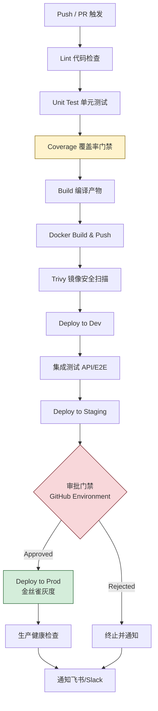

# 17 CI/CD

CI/CD 是 TCM-History-AI 从代码提交到生产部署的全自动化通道，目标是用流水线替代手工发布，把质量门禁、镜像构建、环境晋升、回滚都收敛到 GitHub Actions 一套可审计的流程里。后端 Go 微服务、前端 Vue3、移动端 Flutter 三条技术栈共用同一仓库，统一在 GitHub Actions 上编排，避免多套 CI 系统造成的配置漂移。本章覆盖流程总览、分支与触发规则、五类核心工作流、质量门禁、制品管理、部署策略、环境晋升、通知、密钥与缓存十个维度，所有 YAML 均可直接放入 `.github/workflows/` 运行。

## 1 CI/CD 目标

CI/CD 围绕四个量化目标设计，所有流水线阶段、门禁阈值、晋升条件均由这些目标反推得出。

| 目标维度 | 指标 | 设计约束 |
| -------- | ---- | -------- |
| 交付周期 | 主干合并到生产 < 30 分钟 | 流水线全阶段并行化，Docker 多架构构建走 buildx 矩阵 |
| 质量门禁 | 单元测试覆盖率 ≥ 70%，lint 零 error | 覆盖率不达标阻断流水线，golangci-lint 设为必需检查 |
| 部署安全 | 生产发布需双人审批，回滚 < 3 分钟 | GitHub Environment Protection Rules 强制 reviewer，Helm rollback 一键恢复 |
| 部署可用 | 滚动更新零停机，金丝雀灰度 5% 流量 | K8s RollingUpdate maxSurge=1/maxUnavailable=0，Argo Rollouts 管理金丝雀 |

全自动化意味着从 `git push` 到生产 Pod Ready 之间不需要人工干预，唯一的人工介入点是 staging 晋升 prod 的审批门禁。质量门禁在 CI 阶段拦截不合格代码，部署阶段通过健康检查与金丝雀分析拦截不合格镜像，两层防护确保生产稳定。

## 2 CI/CD 整体流程

完整流水线由 Push/PR 事件触发，依次经过 Lint、Test、Build、Docker 构建推送、Dev 部署、集成测试、Staging 部署、审批、Prod 部署、通知十个阶段，每个阶段失败即中止后续流程并通知。



流水线设计遵循三条原则：一是「快速失败」，Lint 与 Unit Test 在 Build 之前执行，避免对编译失败的代码浪费时间构建镜像；二是「环境逐级晋升」，Dev 自动部署、Staging 自动部署、Prod 审批后部署，每级晋升都有前置条件；三是「制品不可变」，同一镜像 Tag 贯穿 Dev、Staging、Prod 三个环境，杜绝「Dev 用一份镜像、Prod 重新构建一份」导致的漂移。

## 3 分支策略与触发规则

项目采用 Git Flow 变体，主干 `main` 对应生产，`develop` 对应集成，`feature/*`、`fix/*`、`release/*` 为短期分支。选择 Git Flow 而非纯 Trunk Based 的原因在于中医内容贡献者多为非工程角色，需要 feature 分支隔离未完成的历史史料录入工作，避免污染主干。

| 分支 | 触发工作流 | 部署目标 | 备注 |
| ---- | ---------- | -------- | ---- |
| `main` | ci-backend、ci-frontend、ci-mobile、docker-build、deploy-prod | 生产 Prod | tag 推送触发生产部署，需审批 |
| `develop` | ci-backend、ci-frontend、ci-mobile、docker-build、deploy-dev | 开发 Dev | 合并即部署，自动集成测试 |
| `feature/*` | ci-backend、ci-frontend | 无 | 仅跑 Lint 与单测，不构建镜像 |
| `fix/*` | ci-backend、ci-frontend | 无 | 同 feature，PR 合并到 develop |
| `release/*` | ci-backend、ci-frontend、ci-mobile、docker-build | 预发 Staging | 从 develop 切出，验证后合并 main 并打 tag |
| `tag v*.*.*` | docker-build、deploy-staging、deploy-prod | Staging → Prod | 语义化版本 tag，触发正式发布 |

PR 到 `develop` 或 `main` 时强制运行 CI 并要求全部检查通过方可合并，分支保护规则在 GitHub 仓库 Settings → Branches 配置。`feature/*` 分支不触发镜像构建与部署，仅保证代码质量，降低 Actions 运行成本。

## 4 GitHub Actions 工作流设计

五类工作流按职责拆分，分别放在 `.github/workflows/` 下的独立文件中，通过 `workflow_run` 与 `repository_dispatch` 串联，避免单个巨型工作流难以维护。

### 4.1 后端 CI 工作流

后端 CI 覆盖七个 Go 微服务的静态检查、lint、单测、覆盖率与编译，使用 `actions/setup-go@v5` 配合 `cache: true` 自动缓存 `$GOMODCACHE` 与 `$GOCACHE`。覆盖率门槛设为 70%，低于阈值用 `coverage-badger` 上报并阻断流水线。

```yaml
# .github/workflows/ci-backend.yml
name: CI Backend

on:
  push:
    branches: [main, develop, 'feature/*', 'fix/*', 'release/*']
  pull_request:
    branches: [main, develop]

defaults:
  run:
    working-directory: backend

jobs:
  lint-and-test:
    name: Lint & Test & Build
    runs-on: ubuntu-latest
    steps:
      - name: Checkout
        uses: actions/checkout@v4
        with:
          fetch-depth: 0

      - name: Setup Go
        uses: actions/setup-go@v5
        with:
          go-version: '1.22'
          cache: true
          cache-dependency-path: backend/go.sum

      - name: Go vet
        run: go vet ./...

      - name: golangci-lint
        uses: golangci/golangci-lint-action@v6
        with:
          version: v1.59
          working-directory: backend
          args: --timeout=5m --config=.golangci.yml

      - name: Unit test with coverage
        run: |
          go test -race -coverprofile=coverage.out -covermode=atomic \
            -coverpkg=./... ./...
          go tool cover -func=coverage.out > coverage.txt
          cat coverage.txt

      - name: Coverage gate (>= 70%)
        run: |
          COV=$(grep -E '^total:' coverage.txt | awk '{print $3}' | tr -d '%')
          echo "Total coverage: ${COV}%"
          if [ "$(echo "$COV < 70" | bc -l)" -eq 1 ]; then
            echo "::error::Coverage ${COV}% below threshold 70%"
            exit 1
          fi

      - name: Upload coverage to Codecov
        if: github.event_name == 'push'
        uses: codecov/codecov-action@v4
        with:
          files: backend/coverage.out
          flags: backend
          token: ${{ secrets.CODECOV_TOKEN }}

      - name: gosec security scan
        uses: securego/gosec@master
        with:
          args: -severity medium -confidence medium -exclude-dir=test ./...

      - name: Build all services
        run: |
          for svc in gateway user history knowledge graph ai learning; do
            go build -trimpath -ldflags="-s -w" -o /tmp/bin/${svc} ./cmd/${svc}
          done

      - name: Upload build artifacts
        uses: actions/upload-artifact@v4
        with:
          name: backend-binaries
          path: /tmp/bin/
          retention-days: 7
```

`go test -race` 开启竞态检测，捕获 Kitex 并发场景下的数据竞争；`-coverpkg=./...` 让覆盖率统计覆盖被调用包而非仅测试包，避免跨包调用造成的覆盖率低估。gosec 设为 medium 级别起步，低危告警（如 hardcoded-credentials 误报）通过 `#nosec` 注释抑制，不阻断流水线。

### 4.2 前端 CI 工作流

前端 CI 针对 Vue3 + Vite + pnpm 工程链，包含 lint、type check、单测、构建四步。pnpm store 通过 `actions/setup-node` 的 `cache: pnpm` 复用，Vite 构建产物作为 artifact 上传供 Docker 工作流复用。

```yaml
# .github/workflows/ci-frontend.yml
name: CI Frontend

on:
  push:
    branches: [main, develop, 'feature/*', 'fix/*', 'release/*']
    paths:
      - 'frontend/**'
      - '.github/workflows/ci-frontend.yml'
  pull_request:
    branches: [main, develop]
    paths:
      - 'frontend/**'

defaults:
  run:
    working-directory: frontend

jobs:
  quality:
    name: Lint & TypeCheck & Test & Build
    runs-on: ubuntu-latest
    steps:
      - name: Checkout
        uses: actions/checkout@v4

      - name: Setup pnpm
        uses: pnpm/action-setup@v4
        with:
          version: 9

      - name: Setup Node
        uses: actions/setup-node@v4
        with:
          node-version: '20'
          cache: pnpm
          cache-dependency-path: frontend/pnpm-lock.yaml

      - name: Install dependencies
        run: pnpm install --frozen-lockfile

      - name: Lint (ESLint + Stylelint)
        run: |
          pnpm run lint:eslint
          pnpm run lint:stylelint

      - name: Type check (Vue TSC)
        run: pnpm run typecheck

      - name: Unit test (Vitest)
        run: pnpm run test:unit -- --coverage --reporter=junit

      - name: Upload Vitest coverage
        if: always()
        uses: actions/upload-artifact@v4
        with:
          name: frontend-coverage
          path: frontend/coverage/
          retention-days: 7

      - name: Build (Vite)
        run: pnpm run build
        env:
          VITE_API_BASE: /api

      - name: Upload dist artifact
        uses: actions/upload-artifact@v4
        with:
          name: frontend-dist
          path: frontend/dist/
          retention-days: 3
```

`typecheck` 调用 `vue-tsc --noEmit` 对 `.vue` 与 `.ts` 文件做类型检查，Vite 构建本身不做类型校验，需独立步骤兜底。`paths` 过滤让仅修改后端或文档的提交不触发前端 CI，节省 Actions 配额。

### 4.3 移动端 CI 工作流

移动端 CI 覆盖 Flutter 工程的 analyze、test、build apk/ipa。Android 构建在 ubuntu 上完成，iOS 构建需 macOS runner 并配置签名证书，本章给出 Android 完整流程与 iOS 关键差异。

```yaml
# .github/workflows/ci-mobile.yml
name: CI Mobile

on:
  push:
    branches: [main, develop, 'release/*']
    paths:
      - 'mobile/**'
      - '.github/workflows/ci-mobile.yml'
  pull_request:
    branches: [main, develop]
    paths:
      - 'mobile/**'

defaults:
  run:
    working-directory: mobile

jobs:
  android:
    name: Android Analyze & Test & Build
    runs-on: ubuntu-latest
    steps:
      - name: Checkout
        uses: actions/checkout@v4

      - name: Setup Java
        uses: actions/setup-java@v4
        with:
          distribution: temurin
          java-version: '17'
          cache: gradle

      - name: Setup Flutter
        uses: subosito/flutter-action@v2
        with:
          flutter-version: '3.22'
          channel: stable
          cache: true

      - name: Flutter pub get
        run: flutter pub get

      - name: Flutter analyze
        run: flutter analyze --fatal-infos

      - name: Flutter test
        run: flutter test --coverage --machine > test-results.json

      - name: Build APK (debug)
        run: flutter build apk --debug --flavor dev

      - name: Upload APK
        uses: actions/upload-artifact@v4
        with:
          name: android-apk
          path: mobile/build/app/outputs/flutter-apk/*.apk
          retention-days: 7

  ios:
    name: iOS Build
    runs-on: macos-14
    if: github.ref == 'refs/heads/main' || startsWith(github.ref, 'refs/tags/v')
    steps:
      - name: Checkout
        uses: actions/checkout@v4

      - name: Setup Flutter
        uses: subosito/flutter-action@v2
        with:
          flutter-version: '3.22'
          channel: stable
          cache: true

      - name: Flutter pub get
        run: flutter pub get

      - name: Flutter analyze
        run: flutter analyze --fatal-infos

      - name: Decode signing certificate
        env:
          IOS_CERT_BASE64: ${{ secrets.IOS_CERT_BASE64 }}
          IOS_CERT_PASSWORD: ${{ secrets.IOS_CERT_PASSWORD }}
        run: |
          echo "$IOS_CERT_BASE64" | base64 --decode > cert.p12
          security create-keychain -p "" build.keychain
          security import cert.p12 -k build.keychain -P "$IOS_CERT_PASSWORD" -T /usr/bin/codesign
          security list-keychains -s build.keychain

      - name: Install provisioning profile
        env:
          IOS_PROFILE_BASE64: ${{ secrets.IOS_PROFILE_BASE64 }}
        run: |
          mkdir -p ~/Library/MobileDevice/Provisioning\ Profiles
          echo "$IOS_PROFILE_BASE64" | base64 --decode \
            > ~/Library/MobileDevice/Provisioning\ Profiles/tcm.mobileprovision

      - name: Build IPA
        run: flutter build ipa --release --export-options-plist=ios/ExportOptions.plist

      - name: Upload IPA
        uses: actions/upload-artifact@v4
        with:
          name: ios-ipa
          path: mobile/build/ios/ipa/*.ipa
          retention-days: 7
```

iOS 构建仅在 `main` 或 tag 推送时触发，原因在于 macOS runner 计费倍率为 ubuntu 的 10 倍，限制触发频次可控制成本。签名证书与 Provisioning Profile 以 base64 存储在 GitHub Secrets，运行时解码注入 keychain。

### 4.4 Docker 镜像构建与推送工作流

镜像构建采用 Docker buildx 多架构（amd64/arm64）方案，一次构建同时产出适配 x86 服务器与 ARM 自建节点的镜像。Tag 策略为 `commit SHA` + `语义版本`（若为 tag 推送）+ `latest`（仅 main），推送到 ghcr.io 命名空间 `ghcr.io/tcm-history-ai/<service>`。

```yaml
# .github/workflows/docker-build.yml
name: Docker Build & Push

on:
  workflow_run:
    workflows: [CI Backend, CI Frontend]
    branches: [main, develop, 'release/*']
    types: [completed]
  push:
    tags: ['v*.*.*']

env:
  REGISTRY: ghcr.io
  IMAGE_PREFIX: ghcr.io/tcm-history-ai

jobs:
  build-services:
    name: Build ${{ matrix.service }}
    runs-on: ubuntu-latest
    if: ${{ github.event.workflow_run.conclusion == 'success' || startsWith(github.ref, 'refs/tags/v') }}
    strategy:
      fail-fast: false
      matrix:
        service: [gateway, user, history, knowledge, graph, ai, learning, frontend]
    permissions:
      contents: read
      packages: write
      id-token: write
    steps:
      - name: Checkout
        uses: actions/checkout@v4

      - name: Docker meta
        id: meta
        uses: docker/metadata-action@v5
        with:
          images: ${{ env.IMAGE_PREFIX }}/${{ matrix.service }}
          tags: |
            type=sha,format=short,prefix=sha-
            type=ref,event=branch
            type=semver,pattern={{version}}
            type=semver,pattern={{major}}.{{minor}}
            type=raw,value=latest,enable={{is_default_branch}}

      - name: Set up QEMU
        uses: docker/setup-qemu-action@v3

      - name: Set up Docker Buildx
        uses: docker/setup-buildx-action@v3

      - name: Login to GHCR
        uses: docker/login-action@v3
        with:
          registry: ${{ env.REGISTRY }}
          username: ${{ github.actor }}
          password: ${{ secrets.GITHUB_TOKEN }}

      - name: Build and push (backend)
        if: matrix.service != 'frontend'
        uses: docker/build-push-action@v6
        with:
          context: .
          file: ./Dockerfile
          build-args: |
            SERVICE_NAME=${{ matrix.service }}
          platforms: linux/amd64,linux/arm64
          push: true
          tags: ${{ steps.meta.outputs.tags }}
          labels: ${{ steps.meta.outputs.labels }}
          cache-from: type=gha,scope=${{ matrix.service }}
          cache-to: type=gha,mode=max,scope=${{ matrix.service }}
          provenance: true
          sbom: true

      - name: Build and push (frontend)
        if: matrix.service == 'frontend'
        uses: docker/build-push-action@v6
        with:
          context: ./frontend
          file: ./frontend/Dockerfile
          platforms: linux/amd64,linux/arm64
          push: true
          tags: ${{ steps.meta.outputs.tags }}
          labels: ${{ steps.meta.outputs.labels }}
          cache-from: type=gha,scope=frontend
          cache-to: type=gha,mode=max,scope=frontend
          provenance: true
          sbom: true

  scan-images:
    name: Trivy Security Scan
    needs: build-services
    runs-on: ubuntu-latest
    strategy:
      matrix:
        service: [gateway, user, history, knowledge, graph, ai, learning, frontend]
    steps:
      - name: Trivy scan
        uses: aquasecurity/trivy-action@master
        with:
          image-ref: ${{ env.IMAGE_PREFIX }}/${{ matrix.service }}:sha-${{ github.sha }}
          severity: CRITICAL,HIGH
          exit-code: '1'
          ignore-unfixed: true
          format: sarif
          output: trivy-${{ matrix.service }}.sarif

      - name: Upload SARIF
        if: always()
        uses: github/codeql-action/upload-sarif@v3
        with:
          sarif_file: trivy-${{ matrix.service }}.sarif
```

`docker/metadata-action` 自动生成多 Tag，`type=sha` 保证镜像与 commit 一一对应便于回溯，`type=semver` 让 tag 推送时自动生成 `v1.2.3` 与 `1.2` 两层版本 Tag。`cache-from/cache-to: type=gha` 把 BuildKit 缓存托管在 GitHub Actions 缓存中，跨工作流复用，二次构建仅变更层重打。Trivy 扫描独立成 job，CRITICAL 与 HIGH 级漏洞未修复时 `exit-code: 1` 阻断部署，SARIF 结果上传到 GitHub Security 面板可视化。

### 4.5 部署工作流

部署工作流按环境拆分为三个独立 job，使用 GitHub Environments 隔离 K8s 凭证与审批策略。Dev 与 Staging 自动触发，Prod 需指定 reviewer 审批。部署工具选择 Helm，Chart 维护在 `deploy/helm/tcm-history-ai/`，通过 `helm upgrade --install` 原子更新。

```yaml
# .github/workflows/deploy.yml
name: Deploy

on:
  workflow_run:
    workflows: [Docker Build & Push]
    types: [completed]
    branches: [main, develop, 'release/*']
  workflow_dispatch:
    inputs:
      environment:
        description: Target environment
        required: true
        type: choice
        options: [dev, staging, prod]
      image_tag:
        description: Image tag (sha-xxxx or v1.2.3)
        required: true

env:
  IMAGE_PREFIX: ghcr.io/tcm-history-ai
  CHART_PATH: deploy/helm/tcm-history-ai

jobs:
  deploy-dev:
    name: Deploy to Dev
    if: >-
      github.event.workflow_run.conclusion == 'success' &&
      github.event.workflow_run.head_branch == 'develop'
    runs-on: ubuntu-latest
    environment:
      name: dev
      url: https://dev.tcm-history.internal
    steps:
      - name: Checkout
        uses: actions/checkout@v4

      - name: Setup Helm
        uses: azure/setup-helm@v4
        with:
          version: v3.14.0

      - name: Setup kubeconfig
        run: |
          mkdir -p $HOME/.kube
          echo "${{ secrets.DEV_KUBECONFIG }}" | base64 -d > $HOME/.kube/config

      - name: Helm upgrade (dev)
        run: |
          IMAGE_TAG=sha-${GITHUB_SHA::7}
          helm upgrade --install tcm-history ${{ env.CHART_PATH }} \
            --namespace tcm-dev --create-namespace \
            --set global.image.tag=${IMAGE_TAG} \
            --set global.image.prefix=${{ env.IMAGE_PREFIX }} \
            -f ${{ env.CHART_PATH }}/values-dev.yaml \
            --wait --timeout 5m \
            --atomic

      - name: Smoke test
        run: |
          kubectl -n tcm-dev rollout status deploy/gateway --timeout=180s
          curl -sf https://dev.tcm-history.internal/health || exit 1

  deploy-staging:
    name: Deploy to Staging
    if: >-
      github.event.workflow_run.conclusion == 'success' &&
      startsWith(github.event.workflow_run.head_branch, 'release/')
    needs: deploy-dev
    runs-on: ubuntu-latest
    environment:
      name: staging
      url: https://staging.tcm-history.internal
    steps:
      - name: Checkout
        uses: actions/checkout@v4

      - name: Setup Helm
        uses: azure/setup-helm@v4

      - name: Setup kubeconfig
        run: |
          mkdir -p $HOME/.kube
          echo "${{ secrets.STAGING_KUBECONFIG }}" | base64 -d > $HOME/.kube/config

      - name: Helm upgrade (staging)
        run: |
          IMAGE_TAG=sha-${GITHUB_SHA::7}
          helm upgrade --install tcm-history ${{ env.CHART_PATH }} \
            --namespace tcm-staging --create-namespace \
            --set global.image.tag=${IMAGE_TAG} \
            --set global.image.prefix=${{ env.IMAGE_PREFIX }} \
            -f ${{ env.CHART_PATH }}/values-staging.yaml \
            --wait --timeout 8m \
            --atomic

      - name: Integration test
        run: |
          kubectl -n tcm-staging rollout status deploy/gateway --timeout=300s
          go test -tags=integration -v ./test/integration/... \
            -host=https://staging.tcm-history.internal

  deploy-prod:
    name: Deploy to Prod (Canary)
    if: >-
      github.event.workflow_run.conclusion == 'success' &&
      github.event.workflow_run.head_branch == 'main'
    needs: deploy-staging
    runs-on: ubuntu-latest
    environment:
      name: prod
      url: https://tcm-history.ai
    steps:
      - name: Checkout
        uses: actions/checkout@v4

      - name: Setup Helm
        uses: azure/setup-helm@v4

      - name: Setup kubeconfig
        run: |
          mkdir -p $HOME/.kube
          echo "${{ secrets.PROD_KUBECONFIG }}" | base64 -d > $HOME/.kube/config

      - name: Helm upgrade (prod, canary via Argo Rollouts)
        run: |
          IMAGE_TAG=sha-${GITHUB_SHA::7}
          helm upgrade --install tcm-history ${{ env.CHART_PATH }} \
            --namespace tcm-prod --create-namespace \
            --set global.image.tag=${IMAGE_TAG} \
            --set global.image.prefix=${{ env.IMAGE_PREFIX }} \
            --set global.deployment.strategy=canary \
            -f ${{ env.CHART_PATH }}/values-prod.yaml \
            --wait --timeout 10m \
            --atomic

      - name: Wait for canary analysis
        run: |
          kubectl argo rollouts get rollout gateway -n tcm-prod --watch \
            --timeout 20m

      - name: Promote or abort
        run: |
          kubectl argo rollouts status rollout gateway -n tcm-prod \
            --timeout 5m || \
          (kubectl argo rollouts abort rollout gateway -n tcm-prod && exit 1)
```

`--atomic` 保证 Helm 失败时自动回滚到上一个 Release，避免半成功状态。Prod 部署使用 Argo Rollouts 的 canary 策略，先灰度 5% 流量观察 20 分钟，分析错误率与延迟指标，通过后自动提升至 100%，异常则 `kubectl argo rollouts abort` 触发回滚。`workflow_dispatch` 入参支持手动指定 image_tag，用于紧急回滚到历史版本或修复版本重发。

## 5 质量门禁

质量门禁分代码级与镜像级两层，前者在 CI 阶段拦截，后者在 Docker 构建后拦截，两层都通过才允许进入部署。

| 门禁类型 | 工具 | 阈值 | 失败动作 |
| -------- | ---- | ---- | -------- |
| 后端覆盖率 | go test -cover | 总覆盖率 ≥ 70%，单包 ≥ 50% | 阻断流水线 |
| 后端 lint | golangci-lint | 0 error，warning 不阻断 | error 阻断 |
| 前端 lint | ESLint + Stylelint | 0 error | error 阻断 |
| 前端类型 | vue-tsc | 0 error | error 阻断 |
| 移动端 lint | flutter analyze | 0 info（`--fatal-infos`） | 阻断 |
| 代码安全 | gosec | medium 及以上 | 阻断 |
| 镜像安全 | Trivy | CRITICAL/HIGH 未修复 | 阻断部署 |
| 依赖漏洞 | Dependabot | weekly 扫描 | PR 提示 |
| 镜像签名 | cosign | 生产镜像必签 | 未签名拒绝部署 |

镜像签名通过 cosign + Sigstore 实现，Docker 构建后用 `cosign sign` 对镜像签名，部署前 K8s 准入控制器（Kyverno）校验签名，未签名镜像被拒绝拉起，防止镜像仓库被篡改后恶意镜像进入生产。

## 6 制品管理

制品分镜像与 Helm Chart 两类，分别托管在 ghcr.io 与 OCI Registry（同 ghcr.io 的 OCI artifact）。Tag 策略保证可追溯与可回滚。

镜像 Tag 策略矩阵：

| Tag 形态 | 生成时机 | 用途 | 示例 |
| -------- | -------- | ---- | ---- |
| `sha-<7位SHA>` | 每次 push | 唯一追溯，部署主用 | `sha-a1b2c3d` |
| `<分支名>` | 分支推送 | 分支最新镜像 | `develop`、`release-1.2` |
| `v<语义版本>` | tag 推送 | 正式发布版本 | `v1.2.3` |
| `<major>.<minor>` | tag 推送 | 滚动最新小版本 | `1.2` |
| `latest` | 仅 main 分支 | 便捷拉取，生产禁用 | `latest` |

生产环境部署强制使用 `sha-` 或 `v` Tag，禁止 `latest`，原因在于 `latest` 可变，无法固定到具体 commit，回滚时找不到目标版本。Helm Chart 版本独立维护在 `Chart.yaml` 的 `version` 字段，遵循 SemVer，每次 values 或模板变更必须 bump 版本，并通过 `helm push` 推送到 OCI Registry：

```bash
helm package deploy/helm/tcm-history-ai -d dist/
helm push dist/tcm-history-ai-1.2.3.tgz \
  oci://ghcr.io/tcm-history-ai/charts
```

部署时通过 `--version` 锁定 Chart 版本，与镜像 Tag 组合形成完整的制品快照，回滚即恢复到某个 Chart 版本 + 镜像 Tag 的组合。

## 7 部署策略实现

K8s 原生 RollingUpdate 适用于 Dev 与 Staging，maxSurge=1/maxUnavailable=0 保证更新过程中总有可用副本。生产采用 Argo Rollouts 管理的金丝雀发布，分阶段灰度并配合指标分析自动决定提升或回滚。

```yaml
# deploy/helm/tcm-history-ai/templates/rollout-gateway.yaml
apiVersion: argoproj.io/v1alpha1
kind: Rollout
metadata:
  name: gateway
spec:
  replicas: 4
  strategy:
    canary:
      canaryService: gateway-canary
      stableService: gateway-stable
      trafficRouting:
        nginx:
          stableIngress: gateway-ingress
      steps:
        - setWeight: 5
        - pause: { duration: 5m }
        - analysis:
            templates:
              - templateName: success-rate
            args:
              - name: service-name
                value: gateway-canary
        - setWeight: 25
        - pause: { duration: 5m }
        - analysis:
            templates:
              - templateName: success-rate
            args:
              - name: service-name
                value: gateway-canary
        - setWeight: 50
        - pause: { duration: 10m }
        - setWeight: 100
  template:
    spec:
      containers:
        - name: gateway
          image: ghcr.io/tcm-history-ai/gateway:sha-{{ .Values.global.image.tag }}
          readinessProbe:
            httpGet:
              path: /health
              port: 8080
            initialDelaySeconds: 5
            periodSeconds: 5
```

AnalysisTemplate 通过 Prometheus 查询金丝雀实例的 5xx 错误率与 P95 延迟，错误率 > 1% 或延迟超基线 1.5 倍时自动判定失败并触发回滚：

```yaml
apiVersion: argoproj.io/v1alpha1
kind: AnalysisTemplate
metadata:
  name: success-rate
spec:
  args:
    - name: service-name
  metrics:
    - name: success-rate
      interval: 30s
      successCondition: result[0] >= 0.99
      failureLimit: 2
      provider:
        prometheus:
          address: http://prometheus.monitoring:9090
          query: |
            sum(rate(http_requests_total{service="{{args.service-name}}",code!~"5.."}[1m]))
            /
            sum(rate(http_requests_total{service="{{args.service-name}}"}[1m]))
    - name: latency-p95
      interval: 30s
      successCondition: result[0] <= 300
      failureLimit: 2
      provider:
        prometheus:
          address: http://prometheus.monitoring:9090
          query: |
            histogram_quantile(0.95,
              sum(rate(http_request_duration_ms_bucket{service="{{args.service-name}}"}[1m])) by (le))
```

回滚机制分三级：Helm 层 `helm rollback` 恢复上一个 Release；Argo Rollouts 层 `kubectl argo rollouts undo` 回到上一个稳定版本；镜像层通过重新部署历史 `sha-` Tag 实现。生产回滚优先用 Argo Rollouts undo，秒级生效，无需重新构建镜像。

## 8 环境晋升流程

dev → staging → prod 的晋升通过 GitHub Environments 与 Protection Rules 实现，每个环境独立的 kubeconfig、审批人、等待时间策略。

| 环境 | 触发方式 | 审批要求 | 部署策略 | 晋升前置条件 |
| ---- | -------- | -------- | -------- | ------------ |
| Dev | develop 分支 push 自动 | 无 | RollingUpdate | CI 全绿 |
| Staging | release/* 分支自动 | 无 | RollingUpdate | Dev 集成测试通过 |
| Prod | main 分支或 tag 自动 | 1 名 reviewer 审批 | Canary | Staging 验收通过，Trivy 扫描通过 |

GitHub Environment Protection Rules 配置：Prod 环境启用 Required reviewers，指定 SRE 与后端 Tech Lead 两人组，任一审批即可部署；配置 Wait timer 5 分钟，避免误触立即部署；配置 Deployment branch 限制为 `main`，防止其他分支直接部署生产。审批记录沉淀在 GitHub Actions 部署历史，满足审计合规要求。

晋升条件自动化校验：Staging 部署后自动运行集成测试套件（API 契约测试 + 关键路径 E2E），全部通过才允许触发 Prod 部署 job；Trivy 扫描结果为 0 CRITICAL 才允许进入 Prod；镜像签名校验通过才允许进入 Prod。任一条件不满足，Prod job 直接 skip 并通知。

## 9 通知机制

通知覆盖部署成功、失败、需审批三类事件，主通道为飞书 Webhook（团队主用），备用通道为 GitHub Slack 集成。通知通过 `workflow_run` 的 status 字段判断，复用 `actions/workflow-run` 上下文。

```yaml
# .github/workflows/notify.yml
name: Notify

on:
  workflow_run:
    workflows: [Deploy]
    types: [completed, requested]

jobs:
  notify:
    runs-on: ubuntu-latest
    if: always()
    steps:
      - name: Send Feishu Webhook
        env:
          FEISHU_WEBHOOK: ${{ secrets.FEISHU_WEBHOOK }}
          STATUS: ${{ github.event.workflow_run.conclusion }}
          REPO: ${{ github.repository }}
          BRANCH: ${{ github.event.workflow_run.head_branch }}
          RUN_URL: ${{ github.event.workflow_run.html_url }}
        run: |
          if [ "$STATUS" = "success" ]; then
            COLOR=green; TITLE="部署成功"; EMOJI="[OK]"
          elif [ "$STATUS" = "failure" ]; then
            COLOR=red; TITLE="部署失败"; EMOJI="[FAIL]"
          else
            COLOR=orange; TITLE="部署中/待审批"; EMOJI="[WAIT]"
          fi
          PAYLOAD=$(cat <<EOF
          {
            "msg_type": "interactive",
            "card": {
              "header": { "title": { "tag": "plain_text",
                "content": "$EMOJI $TITLE - $REPO" }, "template": "$COLOR" },
              "elements": [
                { "tag": "div", "text": { "tag": "lark_md",
                  "content": "**分支**: $BRANCH\n**状态**: $STATUS\n**流水线**: $RUN_URL" } }
              ]
            }
          }
          EOF
          )
          curl -sS -X POST -H 'Content-Type: application/json' \
            -d "$PAYLOAD" "$FEISHU_WEBHOOK"
```

飞书卡片消息包含分支、状态、流水线链接，点击链接直达 GitHub Actions 运行详情。失败通知额外 @值班 SRE，审批待办通过飞书审批卡片交互式按钮触发审批或拒绝，避免在 GitHub 与飞书间切换。

## 10 密钥管理

密钥分两类：GitHub Actions 运行时所需（Kubeconfig、第三方 Token）与 K8s 运行时所需（数据库密码、LLM API Key）。前者存 GitHub Secrets，后者存 K8s Secret（生产用 ExternalSecret + Vault）。

GitHub Secrets 按环境隔离，Dev/Staging/Prod 各自持有独立的 `*_KUBECONFIG`，命名 `DEV_KUBECONFIG`、`STAGING_KUBECONFIG`、`PROD_KUBECONFIG`，配合 Environment 自动注入对应环境的 Secret。第三方 Token 如 `CODECOV_TOKEN`、`FEISHU_WEBHOOK`、`IOS_CERT_BASE64` 存为 Repository Secrets，所有环境共享。

K8s Secret 通过 Sealed Secrets 或 ExternalSecrets Operator 管理，避免明文 Secret 进 Git。生产环境采用 ExternalSecret + Vault 方案，GitHub Actions 仅持 Kubeconfig，不接触业务密钥：

```yaml
# K8s ExternalSecret 示例
apiVersion: external-secrets.io/v1beta1
kind: ExternalSecret
metadata:
  name: tcm-db-secret
  namespace: tcm-prod
spec:
  refreshInterval: 1h
  secretStoreRef:
    name: vault-backend
    kind: ClusterSecretStore
  target:
    name: tcm-db-secret
    creationPolicy: Owner
  data:
    - secretKey: POSTGRES_PASSWORD
      remoteRef:
        key: secret/tcm/prod/db
        property: password
```

Kubeconfig 通过 base64 编码存入 GitHub Secrets，运行时解码到 `$HOME/.kube/config`，使用短期 ServiceAccount Token 而非长期证书，定期轮换降低泄露风险。所有 Secrets 在日志中自动脱敏，GitHub Actions 检测到 Secret 值出现在输出时自动替换为 `***`。

## 11 缓存优化

缓存是流水线加速的核心手段，覆盖 Go module、pnpm store、Docker layer、Gradle/Flutter pub 六类缓存，整体目标是二次构建把分钟级流程压到秒级。

| 缓存对象 | 实现方式 | 命中条件 | 失效策略 |
| -------- | -------- | -------- | -------- |
| Go module | `actions/setup-go` 内置 `cache: true` | `go.sum` 不变 | go.sum 变更自动失效 |
| Go build cache | BuildKit `--mount=type=cache` | 同上 | 同上 |
| pnpm store | `actions/setup-node` `cache: pnpm` | `pnpm-lock.yaml` 不变 | lockfile 变更失效 |
| Vite 构建产物 | 不缓存，依赖源码 | — | — |
| Docker layer | buildx `cache-from/to: type=gha` | Dockerfile 层指令不变 | 层指令变更失效 |
| Gradle | `actions/setup-java` `cache: gradle` | `build.gradle` 不变 | gradle 文件变更失效 |
| Flutter pub | `subosito/flutter-action` `cache: true` | `pubspec.lock` 不变 | lock 变更失效 |

Go module 缓存通过 `actions/setup-go@v5` 的 `cache: true` 自动管理，依据 `go.sum` 哈希判断命中，命中后跳过 `go mod download`，七个微服务的依赖下载从 90 秒降到 5 秒。pnpm store 同理，`pnpm install --frozen-lockfile` 在缓存命中时仅做软链接，安装耗时从 60 秒降到 8 秒。

Docker layer 缓存采用 GitHub Actions Cache（`type=gha`）而非 Registry Cache，原因是前者免费且延迟低，后者按存储计费。`cache-from: type=gha,scope=<service>` 按服务隔离缓存避免互相污染，`cache-to: type=gha,mode=max` 缓存所有中间层而非仅最终层，最大化复用率。多架构构建中 buildx 自动处理不同平台的层缓存，amd64 与 arm64 各自独立缓存键。

缓存清理通过 GitHub Actions 缓存配额（10 GB/仓库）自动 LRU 淘汰，无需手动维护；遇到缓存污染（如依赖源异常导致坏缓存），通过删除 `~/.cache` 或在 workflow 中临时加 `cache: false` 强制绕过。
