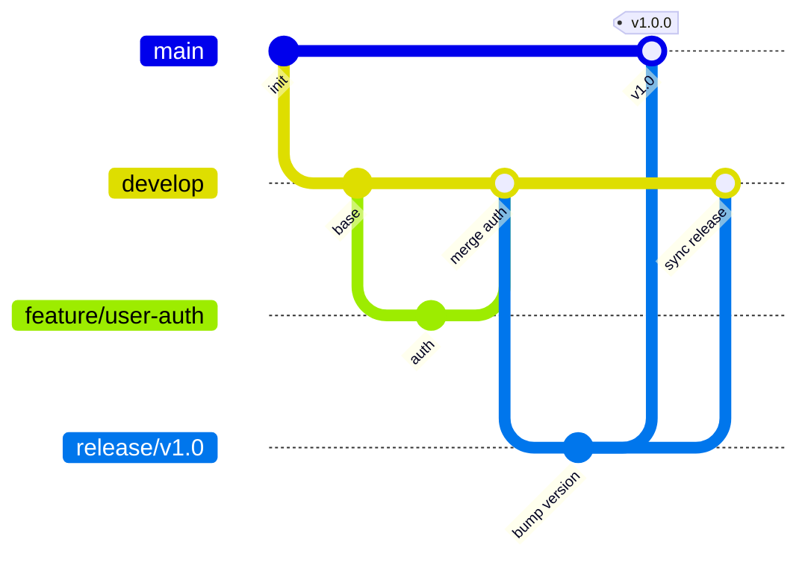

# 第十八章 开发规范

开发规范的目标是统一团队编码风格、降低跨成员协作摩擦、保证长周期演进下的代码可维护性。TCM-History-AI 平台后端 Go、前端 Vue/TypeScript、移动端 Flutter/Dart 三端并存，七项微服务并行迭代，若各行其是，接口契约、命名习惯、错误处理将迅速碎片化。本章从仓库结构、各端代码规范、Git 流程、API 与数据库约定、文档纪律六个层面确立底线规则，所有规则以「减少歧义、便于检索、利于自动化校验」为准则，能由 linter 或 CI 卡口的规则优先写入流水线而非依赖人工记忆。

## 一、Monorepo 仓库结构

全平台代码收归单一 Git 仓库，采用 Monorepo 模式管理。后端七项微服务、前端 pnpm workspace、移动端 Flutter 工程、部署配置、文档同仓共存，共享依赖版本与发布节奏。后端按服务划分顶层目录，跨服务复用代码集中到 `backend/pkg`；前端以 pnpm workspace 组织 `apps` 与 `packages`；部署配置按 docker / k8s / helm 分层；文档随仓维护，与代码同版本演进。

```text
tcm-history-ai/
├── backend/                              # 后端全部 Go 服务
│   ├── gateway/                          # API Gateway（Hertz）
│   │   ├── cmd/
│   │   │   └── gateway/
│   │   │       ├── main.go               # 入口，初始化 Wire 注入器
│   │   │       └── wire.go               # wireinject 声明（生成 wire_gen.go）
│   │   ├── internal/
│   │   │   ├── controller/               # HTTP handler
│   │   │   ├── application/              # 用例编排、DTO
│   │   │   ├── domain/                   # 领域实体、领域服务接口
│   │   │   └── infrastructure/           # 路由、中间件、鉴权实现
│   │   ├── api/                          # OpenAPI 产物
│   │   ├── conf/                         # 配置模板 yaml
│   │   ├── Dockerfile
│   │   └── README.md
│   ├── user-service/                     # User Service（Kitex RPC + Hertz）
│   │   └── ...                           # 目录结构同 gateway
│   ├── history-service/                  # History Service
│   ├── knowledge-service/                # Knowledge Service
│   ├── graph-service/                    # Graph Service
│   ├── ai-service/                       # AI Service
│   ├── learning-service/                 # Learning Service
│   ├── api/
│   │   └── idl/                          # 跨服务共享 Thrift IDL
│   │       ├── user.thrift
│   │       ├── history.thrift
│   │       └── ai.thrift
│   ├── pkg/                              # 跨服务共享代码
│   │   ├── errno/                        # 统一错误码与 Error 类型
│   │   ├── logger/                       # Zap 封装、TraceID 适配
│   │   ├── config/                       # Viper 加载与校验
│   │   ├── idgen/                        # 雪花 ID 生成
│   │   ├── pagination/                   # 分页结构体与转换
│   │   ├── tracing/                      # OpenTelemetry 初始化
│   │   ├── gormutil/                     # GORM 公共 scope、BaseModel
│   │   ├── kitexutil/                    # Kitex client/server 公共封装
│   │   └── response/                     # 统一响应体构造
│   ├── go.mod                            # 统一 go.mod
│   ├── go.work                           # Go workspace 编排多模块
│   └── Makefile                          # build/test/lint/codegen 入口
├── frontend/                             # 前端 pnpm workspace
│   ├── apps/
│   │   ├── learner/                      # 学习端 SPA
│   │   └── admin/                        # 后台 SPA（Vben Admin）
│   ├── packages/
│   │   ├── ui/                           # 共享通用组件
│   │   ├── api/                          # 共享 API 封装
│   │   ├── types/                        # 共享 TS 类型
│   │   ├── utils/                        # 共享工具函数
│   │   └── eslint-config/                # 共享 ESLint 规则
│   ├── pnpm-workspace.yaml
│   ├── package.json
│   └── turbo.json                        # Turborepo 任务编排
├── mobile/                               # Flutter 移动端
│   ├── lib/
│   │   ├── main.dart
│   │   ├── core/                         # 主题、路由、常量、错误
│   │   ├── data/                         # Repository 实现、数据源
│   │   ├── domain/                       # 实体、Repository 接口、用例
│   │   ├── presentation/                 # 页面、Widget、Provider
│   │   └── shared/                       # 共享 Widget、工具
│   ├── test/
│   ├── pubspec.yaml
│   └── README.md
├── deploy/                               # 部署配置
│   ├── docker/
│   │   ├── docker-compose.dev.yml        # 开发环境依赖编排
│   │   └── docker-compose.prod.yml
│   ├── k8s/
│   │   ├── base/                         # Kustomize base
│   │   │   ├── gateway/
│   │   │   ├── user-service/
│   │   │   └── ...
│   │   └── overlays/                     # 环境覆盖
│   │       ├── dev/
│   │       ├── staging/
│   │       └── prod/
│   └── helm/
│       └── tcm-history-ai/               # Helm Chart
│           ├── Chart.yaml
│           ├── values.yaml
│           └── templates/
├── docs/                                 # 项目文档
│   ├── adr/                              # 架构决策记录
│   │   ├── 0001-use-cloudwego-stack.md
│   │   └── 0002-monorepo-decision.md
│   ├── api/                              # 自动生成的 OpenAPI 产物
│   ├── design/                           # 设计稿与流程图
│   └── runbook/                          # 运维手册
├── .github/
│   ├── workflows/
│   │   ├── backend-ci.yml
│   │   ├── frontend-ci.yml
│   │   ├── mobile-ci.yml
│   │   └── release.yml
│   └── PULL_REQUEST_TEMPLATE.md
├── .gitignore
├── .editorconfig
├── Makefile                              # 顶层任务入口
└── README.md
```

每个微服务内部遵循第二章 Clean Architecture 的四层划分：`cmd` 负责启动与依赖注入装配，`internal/controller` 承接 HTTP/RPC 入口，`internal/application` 编排用例与 DTO 转换，`internal/domain` 定义实体与领域服务接口，`internal/infrastructure` 提供 GORM/Redis/Neo4j 等具体实现。`pkg` 只放无业务语义的通用工具，不放领域逻辑。

## 二、Go 代码规范

### 1 命名规范

包名使用全小写单数名词，不启用下划线或驼峰，如 `controller`、`domain`、`errno`。包名与目录名严格一致，避免 `import` 路径与包名不符导致别名蔓延。文件名采用 `snake_case.go`，测试文件以 `_test.go` 结尾，mock 文件以 `mock_` 前缀标注。

变量命名遵循「作用域越小越简短」原则。包级导出变量用 PascalCase，包内私有变量用 camelCase，首字母缩写词统一全大写（`HTTPServer`、`userID`，禁止 `UserId`）。接收者命名取类型名首字母小写（`func (u *User) ...`），1 字符接收者仅限接口实现场景。常量分组声明，枚举类常量以自定义类型约束并配 `iota`，错误变量以 `Err` 前缀声明在 `var` 块中。

```go
package domain

// User 用户聚合根，缩写词全大写，接收者取首字母
type User struct {
    ID       int64  `gorm:"primaryKey"`
    Username string `gorm:"column:username"`
}

func (u *User) IsLocked() bool {
    return u.Status == "locked"
}

// 枚举常量分组声明，自定义类型约束
type UserStatus string

const (
    UserStatusActive   UserStatus = "active"
    UserStatusLocked   UserStatus = "locked"
    UserStatusDisabled UserStatus = "disabled"
)
```

### 2 错误处理规范

Go 错误处理遵循三层原则：底层包装上下文、中层归一错误码、顶层统一响应。底层调用使用 `fmt.Errorf("...: %w", err)` 保留原始错误链，禁止 `fmt.Errorf("...: %v", err)` 丢弃 wrapping；中层将领域错误映射为 `pkg/errno` 定义的 `*errno.Error`，携带业务码；顶层在 Controller 与统一中间件捕获并转换为响应体。

错误码体系沿用第十章定义的 6 位结构（服务段 + 模块段 + 具体错误），全部集中在 `backend/pkg/errno` 维护，禁止各服务散落硬编码。

```go
package errno

// Error 统一业务错误，携带业务码与 HTTP 映射
type Error struct {
    Code    int    // 6 位业务码，0 表示成功
    Message string
    HTTP    int    // 对应 HTTP 状态码
    Cause   error  // 原始错误
}

func (e *Error) Error() string {
    if e.Cause != nil {
        return fmt.Sprintf("code=%d msg=%s cause=%s", e.Code, e.Message, e.Cause)
    }
    return fmt.Sprintf("code=%d msg=%s", e.Code, e.Message)
}

func (e *Error) Unwrap() error { return e.Cause }

// Wrap 附加原始错误，保留错误链
func (e *Error) Wrap(err error) *Error {
    return &Error{Code: e.Code, Message: e.Message, HTTP: e.HTTP, Cause: err}
}

// 预定义错误，集中声明，对齐第十章错误码表
var (
    ErrUserNotFound     = &Error{Code: 100101, Message: "user not found", HTTP: 404}
    ErrTokenExpired     = &Error{Code: 100102, Message: "token expired", HTTP: 401}
    ErrPasswordMismatch = &Error{Code: 100103, Message: "password mismatch", HTTP: 401}
    ErrGraphUnreachable = &Error{Code: 400202, Message: "path unreachable", HTTP: 422}
)
```

应用层返回错误时优先用预定义常量，必要时 `Wrap` 附加底层信息。Controller 层禁止再次 `fmt.Errorf` 包装业务错误，直接交由统一中间件 `ErrorHandler` 转换。

```go
func (uc *UserUsecase) GetProfile(ctx context.Context, uid int64) (*domain.User, error) {
    u, err := uc.repo.FindByID(ctx, uid)
    if err != nil {
        if errors.Is(err, gorm.ErrRecordNotFound) {
            return nil, errno.ErrUserNotFound.Wrap(err)
        }
        return nil, errno.ErrInternal.Wrap(err)
    }
    return u, nil
}
```

`panic` 仅允许出现在 `main` 启动阶段（配置加载失败、依赖注入失败），业务路径一律返回 `error`，禁止用 `panic` 做控制流。

### 3 GORM 规范

模型统一嵌入 `pkg/gormutil` 提供的 `BaseModel`，包含 `ID`、`CreatedAt`、`UpdatedAt`、`DeletedAt` 四个公共字段，避免每个模型重复声明。表名通过 `TableName()` 显式指定，使用 `snake_case` 复数形式，与第四章命名约定一致。

```go
package gormutil

import (
    "time"
    "gorm.io/gorm"
)

// BaseModel 公共字段基类，雪花 ID + 审计字段 + 软删除
type BaseModel struct {
    ID        int64          `gorm:"primaryKey;autoIncrement:false" json:"id"`
    CreatedAt time.Time      `gorm:"column:created_at" json:"created_at"`
    UpdatedAt time.Time      `gorm:"column:updated_at" json:"updated_at"`
    DeletedAt gorm.DeletedAt `gorm:"column:deleted_at;index" json:"-"`
}
```

```go
package domain

import "tcm-history-ai/backend/pkg/gormutil"

type User struct {
    gormutil.BaseModel
    Username     string `gorm:"column:username;size:64;uniqueIndex;not null"`
    Email        string `gorm:"column:email;size:255;uniqueIndex"`
    PasswordHash string `gorm:"column:password_hash;size:255;not null"`
    Status       string `gorm:"column:status;size:32;default:active;index"`
}

func (User) TableName() string { return "users" }
```

软删除由 `gorm.DeletedAt` 自动托管，查询默认附加 `deleted_at IS NULL` 条件，无需手动 `Where`。需要查询含已删除记录时使用 `Unscoped()`，并在代码注释中标注原因。钩子（Hook）仅用于审计字段补全与事件触发，禁止在钩子内执行远程调用或长耗时操作。`BeforeCreate` 用于补全默认值，`AfterCreate` 仅投递领域事件到内存 channel，由独立的 Outbox 消费者异步落地。

```go
func (u *User) BeforeCreate(tx *gorm.DB) error {
    if u.Status == "" {
        u.Status = "active"
    }
    return nil
}
```

跨表查询禁止 `Preload` 穿透三个以上关联，超出拆为多次查询在应用层组装，规避 N+1 与深 JOIN 性能塌陷。所有写操作通过 `Transaction` 包裹，事务边界在 application 层划定，repository 不自启事务。查询禁止 `SELECT *`，显式 `Select` 所需列；`LIMIT` 必须强制上限，防止全表扫描。

### 4 Hertz Controller 规范

Controller 层只做四件事：参数绑定、参数校验、调用 application、返回响应。禁止在 Controller 内直接访问 repository 或执行业务计算。参数绑定使用 Hertz 的 `BindAndValidate`，校验规则以 `go-tagexpr` 标签声明在 DTO 结构体上，不在 Controller 内手写 `if` 校验。

```go
package controller

import (
    "context"
    "github.com/cloudwego/hertz/pkg/app"
    "github.com/cloudwego/hertz/pkg/app/server"
    "tcm-history-ai/backend/pkg/errno"
    "tcm-history-ai/backend/pkg/response"
)

type CreateUserReq struct {
    Username string `vd:"len($)>1 && len($)<=64; msg:'username length 2-64'"`
    Email    string `vd:"email($); msg:'invalid email'"`
    Password string `vd:"len($)>=8; msg:'password too short'"`
}

type UserController struct {
    uc application.UserUsecase
}

func RegisterUserController(h *server.Hertz, uc application.UserUsecase) {
    c := &UserController{uc: uc}
    g := h.Group("/api/v1/users")
    g.POST("", c.Create)
    g.GET("/:id", c.Get)
}

func (c *UserController) Create(ctx context.Context, req *app.RequestContext) {
    var in CreateUserReq
    if err := req.BindAndValidate(&in); err != nil {
        response.Fail(ctx, errno.ErrInvalidParam.Wrap(err))
        return
    }
    user, err := c.uc.Create(ctx, in)
    if err != nil {
        response.Fail(ctx, err)
        return
    }
    response.OK(ctx, user)
}
```

响应统一通过 `pkg/response` 的 `OK`/`Fail` 构造，输出第十章定义的四字段结构（`code`、`message`、`data`、`trace_id`）。Controller 不直接拼 `map[string]any`，杜绝字段命名漂移。`trace_id` 从 context 中提取，由 tracing 中间件在请求入口生成并注入。

### 5 Kitex RPC 规范

服务间通信用 Kitex RPC，IDL 以 Thrift 定义，跨服务共享 IDL 存放于 `backend/api/idl`，服务私有 IDL 存于 `backend/<service>/api`。IDL 命名采用 `snake_case.thrift`，结构体字段 `snake_case`，Go 侧生成代码自动转为 PascalCase。每个服务对外暴露的 RPC 接口集中在单个 `service` 块，禁止拆分多个 thrift service 导致 client 包膨胀。

```thrift
// api/idl/user.thrift
namespace go user

struct User {
    1: required i64 id
    2: required string username
    3: optional string email
    4: optional string status
}

struct GetUserReq {
    1: required i64 id
}

service UserService {
    User GetUser(1: GetUserReq req)
    bool CheckPermission(1: i64 user_id, 2: string permission_code)
}
```

Client 端通过 `pkg/kitexutil` 封装的工厂创建，统一注入超时、重试、熔断（Sentinel）、链路追踪中间件。禁止在业务代码中直接 `NewClient`，所有 client 经 Wire 注入。Server 端复用同一套中间件链，保证 TraceID 与超时语义一致。IDL 变更必须先合并 thrift 文件、再重新生成代码，生成命令固化在 `Makefile` 的 `codegen` 目标中，禁止手写 client 与 service 存根。

### 6 日志规范

日志统一使用 Zap 结构化输出，禁止 `fmt.Println` 与 `log` 标准库混用。`pkg/logger` 封装 Zap 实例，提供 `Info`/`Warn`/`Error`/`Debug` 四级，开发环境输出 Console 编码，生产环境输出 JSON 编码。日志级别语义：Debug 仅本地与预发开启、Info 记录正常关键路径、Warn 记录可恢复异常、Error 记录需告警的故障，禁止用 Info 灌刷高频日志。

每条日志强制携带 `trace_id`、`service`、`module` 三字段。`trace_id` 从 context 透传，由 tracing 中间件在入口生成并写入 context.Value，跨服务经 Kitex metadata 传递。调用方必须传 `ctx`，禁止裸用包级 logger 丢失链路信息。

```go
package logger

import (
    "context"
    "go.uber.org/zap"
)

type Logger struct{ l *zap.Logger }

// C 从 context 提取 trace_id 后输出
func (lg *Logger) C(ctx context.Context) *zap.Logger {
    traceID, _ := ctx.Value(traceIDKey).(string)
    return lg.l.With(zap.String("trace_id", traceID))
}
```

```go
// 业务调用示例
logger.C(ctx).Info("user login success",
    zap.Int64("user_id", uid),
    zap.String("ip", ip),
)
```

敏感字段（密码、Token、手机号）必须在日志层脱敏，通过 `pkg/logger` 提供的 `MaskPhone`、`MaskToken` 工具统一处理，禁止明文落盘。

### 7 配置规范

配置使用 Viper 加载，结构体集中在各服务 `internal/conf`，以强类型 `struct` 表达，禁止散落 `viper.GetString`。配置文件按环境分目录：`conf/config.dev.yaml`、`conf/config.prod.yaml`，环境由 `APP_ENV` 环境变量切换。环境变量覆盖配置项时，Viper 的 `AutomaticEnv` 配合 `SetEnvKeyReplacer` 将 `.` 替换为 `_`，例如 `database.host` 对应环境变量 `DATABASE_HOST`。

```go
package conf

type Config struct {
    App      AppConfig      `mapstructure:"app"`
    HTTP     HTTPConfig     `mapstructure:"http"`
    Database DatabaseConfig `mapstructure:"database"`
    Redis    RedisConfig    `mapstructure:"redis"`
    Log      LogConfig      `mapstructure:"log"`
}

type DatabaseConfig struct {
    Driver          string `mapstructure:"driver"`
    Host            string `mapstructure:"host"`
    Port            int    `mapstructure:"port"`
    User            string `mapstructure:"user"`
    Password        string `mapstructure:"password"`
    DBName          string `mapstructure:"dbname"`
    MaxOpenConns    int    `mapstructure:"max_open_conns"`
    MaxIdleConns    int    `mapstructure:"max_idle_conns"`
    ConnMaxLifetime int    `mapstructure:"conn_max_lifetime"` // 秒
}
```

配置加载后必须经 `Validate()` 校验，缺失必填项或数值越界直接 `panic` 终止启动，避免带病运行。密钥类配置（JWT secret、数据库密码）仅从环境变量或 K8s Secret 注入，禁止写入 yaml 提交仓库。

### 8 依赖注入（Wire）

依赖注入使用 Wire 编译时生成，禁止运行时反射注入。各服务在 `cmd/<service>/wire.go`（build tag `//go:build wireinject`）声明 Provider 集合，经 `wire` 命令生成 `wire_gen.go`。Provider 按层组织：infrastructure → domain → application → controller，依赖方向与 Clean Architecture 一致，禁止反向依赖。

```go
//go:build wireinject

package main

import (
    "github.com/google/wire"
    "tcm-history-ai/backend/user-service/internal/application"
    "tcm-history-ai/backend/user-service/internal/conf"
    "tcm-history-ai/backend/user-service/internal/controller"
    "tcm-history-ai/backend/user-service/internal/infrastructure"
)

func InitializeApp(cfg *conf.Config) (*App, func(), error) {
    wire.Build(
        infrastructure.NewDB,
        infrastructure.NewRedis,
        infrastructure.NewUserRepo,
        application.NewUserUsecase,
        controller.NewUserController,
        newApp,
    )
    return nil, nil, nil
}
```

`wire_gen.go` 必须提交仓库，保证 CI 可直接 `go build` 而不依赖本地 wire 工具。新增 Provider 后立即重新生成，禁止手工修改生成文件。

## 三、TypeScript / Vue 代码规范

### 1 组件命名与目录组织

组件文件名采用 PascalCase，单文件组件（SFC）为 `.vue`，组合式函数为 `useXxx.ts`。组件分为三类：页面级（`views/` 下，路由直接引用）、业务级（`packages/ui` 下，跨端复用）、通用级（基础原子组件）。目录按业务域聚合，不按组件类型（form/table/modal）拆分，保证同一业务的相关文件就近放置。

```text
packages/ui/src/
├── entity-card/
│   ├── EntityCard.vue
│   ├── EntityCardMeta.ts          # Props/Emits 类型
│   └── index.ts
├── timeline/
│   ├── TimelineViewer.vue
│   ├── useTimelineData.ts
│   └── index.ts
└── index.ts                       # 统一 barrel 导出
```

### 2 Composition API 使用规范

全面使用 `<script setup lang="ts">` 语法，禁止 Options API 与 `setup()` 函数返回对象写法混用。响应式数据优先 `ref`，对象或数组需响应式时用 `reactive`，禁止 `ref` 与 `reactive` 嵌套使用导致解包混乱。`computed` 必须有明确语义命名，副作用统一收敛到 `watch`/`watchEffect`，禁止在 `computed` 内触发请求或修改外部状态。

```vue
<script setup lang="ts">
import { ref, computed } from 'vue'
import { useUserStore } from '@tcm/store'

interface Props {
  userId: number
  readonly?: boolean
}

const props = withDefaults(defineProps<Props>(), {
  readonly: false,
})

const emit = defineEmits<{
  (e: 'submit', value: { userId: number; nickname: string }): void
  (e: 'cancel'): void
}>()

const userStore = useUserStore()
const nickname = ref('')

const displayName = computed(() => nickname.value || userStore.username)

async function handleSubmit() {
  emit('submit', { userId: props.userId, nickname: nickname.value })
}
</script>
```

### 3 Props 与 Emits 类型定义

Props 与 Emits 必须用 TypeScript 泛型定义，禁止运行时对象声明。Props 类型独立抽取到同目录 `XxxMeta.ts`，便于复用与文档生成。可选 Props 用 `withDefaults` 提供默认值，禁止依赖 `undefined` 兜底。Emits 事件名用 kebab-case（`update:nickname`、`submit-success`），与模板内 `@submit-success` 调用一致，避免大小写不一致导致的监听失效。

### 4 API 调用规范

所有 HTTP 请求经 `packages/api` 的统一 Axios 实例，禁止在组件内直接 `import axios`。请求模块按服务域组织（`modules/user.ts`、`modules/history.ts`），每个函数返回强类型 `Promise<ApiResponse<T>>`，与第十章统一响应结构对齐。请求函数命名 `fetchXxx`（查询）、`createXxx`（创建）、`updateXxx`（更新）、`removeXxx`（删除），动词统一。

```typescript
// packages/api/src/modules/user.ts
import { http } from '../http'
import type { ApiResponse, User } from '@tcm/types'

export function fetchUser(id: number): Promise<ApiResponse<User>> {
  return http.get(`/api/v1/users/${id}`)
}

export function createUser(payload: CreateUserPayload): Promise<ApiResponse<User>> {
  return http.post('/api/v1/users', payload)
}
```

Axios 实例统一注入请求拦截器（附加 `Authorization`、`X-Trace-Id`）与响应拦截器（统一解包 `code` 非 0 时抛错、401 触发刷新）。组件层只调用 API 模块函数并处理业务结果，不感知 HTTP 细节。SSE 流式请求单独走 `sse.ts` 客户端，不复用 Axios 实例。

## 四、Flutter / Dart 代码规范

### 1 目录组织与命名规范

移动端遵循 `lib/` 下 `core`、`data`、`domain`、`presentation`、`shared` 五层划分，与第十三章四层架构对齐。文件名采用 `snake_case.dart`，类名 PascalCase，变量与函数 camelCase，私有成员以 `_` 前缀。每个 feature 在 `presentation/<feature>/` 下聚合 `pages`、`widgets`、`providers` 三类文件，禁止跨 feature 直接引用 widget。

```text
lib/
├── core/
│   ├── theme/
│   ├── router/                     # go_router 路由配置
│   ├── constants/
│   └── error/                      # 异常与 Failure 定义
├── data/
│   ├── datasources/                # Dio 远程 + Isar 本地
│   ├── models/                     # DTO 与实体转换
│   └── repositories/               # Repository 实现
├── domain/
│   ├── entities/
│   ├── repositories/               # Repository 抽象接口
│   └── usecases/
├── presentation/
│   ├── home/
│   │   ├── pages/
│   │   ├── widgets/
│   │   └── providers/
│   ├── course/
│   ├── ai/
│   └── exam/
└── shared/
    └── widgets/
```

### 2 Riverpod 使用规范

状态管理统一 Riverpod，禁止混用 `setState`（仅限纯 UI 局部态如动画）与 `ChangeNotifier`。Provider 按职责分三类：`Provider`（同步计算或单例服务）、`FutureProvider`/`AsyncNotifierProvider`（异步数据）、`StateNotifierProvider`（带可变状态的业务逻辑）。所有 Provider 用代码生成 `@riverpod` 注解，生成文件 `*.g.dart` 必须提交。

```dart
import 'package:riverpod_annotation/riverpod_annotation.dart';

part 'user_controller.g.dart';

@riverpod
class UserController extends _$UserController {
  @override
  FutureOr<User?> build() async {
    return ref.watch(userRepositoryProvider).getCurrentUser();
  }

  Future<void> login(String username, String password) async {
    state = const AsyncLoading();
    try {
      final user = await ref.read(userRepositoryProvider).login(username, password);
      state = AsyncData(user);
    } on Failure catch (f) {
      state = AsyncError(f, f.stackTrace);
    }
  }
}
```

错误类型统一用 `Failure` 值对象表达，不抛裸异常到 UI 层。`AsyncValue` 的 `when`/`maybeWhen` 处理加载、数据、错误三态，禁止用 `if (snapshot.hasData)` 旧式判断。

### 3 Widget 拆分原则

Widget 拆分以「单一职责 + 复用边界」为准。一个 Widget 文件不超过 200 行，超过即按子区域拆为私有 Widget。无状态展示组件提取为 `StatelessWidget`，含动画或交互的用 `StatefulWidget`。业务逻辑不下沉到 Widget，统一经 Provider 暴露。Widget 间通信通过 `ref.read`/`ref.watch` 共享 Provider，禁止 `setState` 跨层级用回调穿透超过两层。

```dart
class CourseCard extends ConsumerWidget {
  const CourseCard({super.key, required this.course});

  final Course course;

  @override
  Widget build(BuildContext context, WidgetRef ref) {
    return Card(
      child: Column(
        children: [
          CourseHeader(course: course),
          CourseProgress(progress: course.progress),
          CourseActions(course: course),
        ],
      ),
    );
  }
}
```

## 五、Git 规范

### 1 分支策略

采用 Git Flow 变体。长期分支两条：`main`（生产，仅接收 release 合并，受保护）、`develop`（集成，日常开发基线）。短期分支三类：`feature/*`（新功能，从 `develop` 拉出）、`fix/*`（缺陷修复）、`release/*`（发布预演，冻结后仅修 bug）。紧急修复走 `hotfix/*` 从 `main` 拉出，修复合并回 `main` 与 `develop` 双线。



分支命名以类型前缀加简短描述：`feature/graph-traversal`、`fix/login-redirect`、`hotfix/token-refresh`。分支生命周期不超过两周，合并后立即删除，避免长期分支堆积冲突。

### 2 Commit Message 规范

遵循 Conventional Commits，格式 `type(scope): subject`。`type` 限定为 `feat`、`fix`、`docs`、`style`、`refactor`、`perf`、`test`、`build`、`ci`、`chore`、`revert`。`scope` 标注影响的服务或模块（`user-service`、`gateway`、`learner`、`mobile`、`deploy`）。`subject` 用祈使句、中文或英文均可但同一仓库保持一致，不超过 50 字符。破坏性变更在脚注标注 `BREAKING CHANGE:` 并说明迁移方式。

```text
feat(ai-service): 接入豆包大模型流式对话

- 新增 DoubaoStreamClient 实现 SSE 解析
- Agent 编排复用现有 PromptTemplate 体系
- 关联 issue #142

BREAKING CHANGE: AI 对话响应格式由整体 JSON 改为 SSE 流，前端需适配 useSSE
```

```text
fix(history-service): 修复朝代时间区间校验越界

朝代结束年份早于开始年份时未拦截，补充 BeforeSave 钩子校验
```

```text
refactor(gateway): 提取鉴权中间件到 pkg
```

一个 commit 只做一件事，混合类型改动必须拆分。CI 通过 `commitlint` 强制校验格式，违规直接阻断。

### 3 PR 规范与 Code Review 清单

PR 标题与最终 squash merge 的 commit message 一致。PR 描述模板覆盖：变更目的、影响范围、自测清单、关联 issue、风险点。PR 必须满足以下硬性门槛方可合并：CI 全绿（lint + 单测 + 构建）、至少一名 Reviewer 批准、代码覆盖率不低于该服务基线 2 个百分点、无 `console.log`/`fmt.Println`/`print` 残留。

Code Review 清单：

- 命名是否表意清晰、是否符合本章命名规范
- 错误处理是否 wrapping 原始错误、是否归一到 errno
- 是否存在跨层调用（Controller 直连 repository、domain 反向依赖 infrastructure）
- 日志是否携带 trace_id、是否泄露敏感字段
- 是否存在 N+1 查询、事务边界是否正确
- 是否新增硬编码配置或密钥
- 测试是否覆盖核心分支与边界条件
- IDL 或接口变更是否同步更新文档与 client 生成代码

### 4 .gitignore 关键项

```gitignore
# Go
backend/**/bin/
backend/**/output/
backend/**/wire_gen.go.bak
*.test
*.out
coverage.txt

# 前端
frontend/**/node_modules/
frontend/**/dist/
frontend/**/.turbo/
frontend/**/.pnpm-store/
frontend/**/coverage/

# 移动端
mobile/.dart_tool/
mobile/.flutter-plugins
mobile/.flutter-plugins-dependencies
mobile/build/
mobile/ios/Pods/
mobile/android/.gradle/

# 编辑器与系统
.idea/
.vscode/
.DS_Store
*.swp

# 密钥与本地配置
*.local
*.env
deploy/k8s/overlays/*/secrets/
```

`wire_gen.go`、`*.g.dart`、前端 `*.d.ts` 等 codegen 产物需提交仓库，不进 gitignore，保证 CI 可直接构建。密钥、本地配置、各环境 secrets 一律忽略，禁止误提交。

## 六、API 设计规范

API 设计遵循第十章确立的 RESTful 约定，本节仅重申强约束项。路径以 `/api/v1` 版本前缀，资源用名词复数（`/users`、`/history/persons`），动作用 HTTP method 表达，非 CRUD 动作以子资源动词收尾（`POST /courses/:id/publish`）。响应体严格四字段结构（`code`/`message`/`data`/`trace_id`），禁止裸数组、裸字符串返回。

错误码沿用第十章 6 位分段体系，新增错误码必须在 `pkg/errno` 与第十章错误码表同步登记，未登记的码禁止上线。分页统一 `page`+`page_size`（偏移）或 `cursor`+`limit`（游标），`page_size` 默认 20、上限 100，超出按 100 截断。接口契约以 OpenAPI 3.0 描述，IDL 以 Thrift 描述，二者由 `Makefile codegen` 目标统一生成客户端与文档，禁止手写 client。

## 七、数据库规范

数据库命名与索引规范以第四章为准，本节固化工程纪律。表名、字段名一律 `snake_case`，主键 `bigint` 雪花 ID，审计字段 `created_at`/`updated_at`/`deleted_at` 强制存在。迁移使用 `golang-migrate`，每个变更一个顺序编号的 SQL 文件（`000007_add_user_avatar.up.sql` 与对应 `.down.sql`），禁止在应用启动时 `AutoMigrate` 改生产表结构。

```bash
# 生成迁移文件
migrate create -ext sql -dir backend/user-service/migrations -seq add_user_avatar

# 应用迁移
migrate -path backend/user-service/migrations -database "postgres://..." up
```

迁移文件遵循「可前向不可逆原则」：`up.sql` 必须幂等可重放，`down.sql` 仅用于开发回滚，生产禁止执行 down。新增列必须带默认值或允许 `NULL`，禁止 `NOT NULL` 无默认值导致锁表与写入失败。索引遵循第四章规范：高频查询条件建联合索引，遵循最左前缀；`deleted_at` 默认纳入联合索引尾部；单表索引不超过 8 个，超出需 ADR 评审。慢查询阈值 200ms，超过由 PgExporter 采集告警。

## 八、文档规范

### 1 服务 README

每个微服务根目录维护 `README.md`，固定六段结构：服务职责一句话描述、依赖的外部组件与下游服务、本地启动步骤、配置项说明、IDL 或接口入口、测试与构建命令。README 随接口与配置变更同步更新，CI 校验 README 的「配置项说明」段与 `conf.Config` 结构体字段一一对应，漂移即报警。

### 2 API 文档自动生成

OpenAPI 文档由代码注解或独立 yaml 维护，CI 流水线在合并到 `develop` 时自动校验 yaml 合法性并发布到内部文档站点。Kitex IDL 生成的 Go 类型同步生成 Markdown 接口表。文档与代码同仓，文档版本与代码 tag 绑定，禁止文档滞后于接口超过一个发布周期。

### 3 架构决策记录（ADR）

重大技术决策以 ADR 记录，存放于 `docs/adr/`，文件名 `NNNN-短标题.md`，序号四位递增。每份 ADR 含五段：背景、决策、理由、后果、状态（Proposed/Accepted/Deprecated/Superseded）。ADR 一旦 Accepted 不可修改，变更通过新 ADR 标记旧记录为 Superseded。

```markdown
# ADR 0001 采用 CloudWeGo 全套生态

## 状态
Accepted (2025-03-12)

## 背景
平台需高并发 HTTP + RPC，候选 Gin+gRPC 与 CloudWeGo 两套。

## 决策
后端 HTTP 用 Hertz、RPC 用 Kitex、网络库 Netpoll，统一 CloudWeGo 生态。

## 理由
同生态中间件、协议、网络层一致，降低跨框架适配成本；字节跳动大规模验证。

## 后果
团队需熟悉 Thrift IDL；生态相对 gRPC 仍小众，社区组件偏少。
```

需 ADR 评审的决策包括：引入新中间件、跨服务数据一致性方案变更、数据库分库分表、ID 唯一性策略变更、核心领域模型重构。日常 bug 修复与小功能无需 ADR。ADR 与本章各规范形成闭环：规范固化既有决策，ADR 记录决策演进，二者共同构成团队知识的可检索资产。
