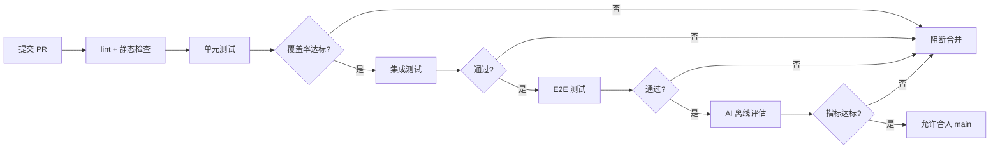
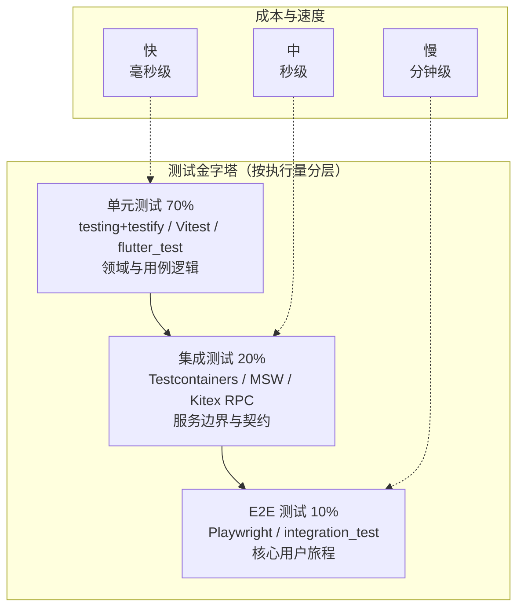
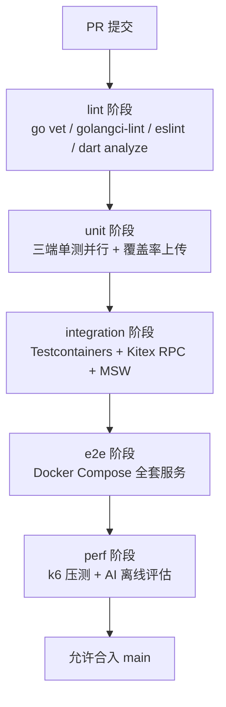

# 19 测试方案

## 1 测试策略概述

TCM-History-AI 的测试体系围绕测试金字塔构建，单元测试占 70%、集成测试占 20%、E2E 测试占 10%，从底向上覆盖度递减而单次执行成本递增。金字塔比例并非凭经验拍定，而是结合后端 Clean Architecture 分层、前端组件粒度与 AI 功能的非确定性特征反推得出：领域层与用例层逻辑密度高，单元测试承担主要回归负担；微服务边界与外部依赖众多，集成测试保证契约一致性；核心用户旅程有限，E2E 仅覆盖注册、学习、AI 问答、考试四条主路径。

质量门禁分四级：编译与静态检查（`go vet`、`golangci-lint`、ESLint、`dart analyze`）必须零告警；单元测试通过率 100%；后端 Go 单测覆盖率不低于 75%，前端 Vue 组件覆盖率不低于 70%，Flutter Widget 覆盖率不低于 70%；集成测试与 E2E 测试在 CI 的 `integration` 与 `e2e` 阶段执行，全绿方可合入 `main`。AI 功能另设离线评估门禁：RAG 召回率不低于 0.85、可溯源率不低于 95%（对齐第一章 PRD 的数据准确率指标）、内容安全审核通过率 100%。

覆盖率目标按层细化而非一刀切：领域层（`domain/`）目标 90%，因为纯逻辑无副作用；用例层（`usecase/`）目标 80%；适配器层（`adapter/`、Repository 实现）目标 60%，剩余部分由集成测试补足；AI Service 的 Prompt 编排逻辑目标 70%，LLM 本身不在覆盖率统计范围内，转由评估集质量门禁约束。



## 2 测试金字塔



金字塔各层的边界划分明确：单元测试只验证单个函数或类的内部逻辑，所有跨进程依赖通过 Mock 注入；集成测试启动真实的外部依赖容器（PostgreSQL、Redis、Neo4j、Milvus）或模拟网络层（MSW），验证 Repository 与 Service 的真实行为；E2E 测试启动整套服务，从浏览器或模拟器视角验证端到端流程。

## 3 单元测试

### 3.1 Go 后端单元测试

Go 后端遵循 Clean Architecture，测试按层切片。领域层（`domain/`）只依赖纯 Go 类型，使用标准库 `testing` + `testify/assert` 直接断言；用例层（`usecase/`）依赖 Repository、Gateway 等接口，使用 `gomock` 生成 Mock 注入测试；适配器层不做单元测试，留给集成测试覆盖。

用例层测试的核心策略是「只测编排逻辑，不测依赖实现」。例如 `LearningUseCase.MarkLessonComplete` 的测试只关心：是否按正确顺序调用了 Repository 的 `Get` 与 `Update`、是否触发了事件发布、对不存在课时的输入是否返回了领域错误，至于 PostgreSQL 是否真的写成功，不在单测范围。

领域层示例——课时完成状态机：

```go
// domain/lesson/lesson.go
package lesson

import "time"

type Status string

const (
    StatusNotStarted Status = "not_started"
    StatusInProgress Status = "in_progress"
    StatusCompleted  Status = "completed"
)

type Lesson struct {
    ID     string
    Status Status
    UpdatedAt time.Time
}

func (l *Lesson) MarkComplete() error {
    if l.Status == StatusCompleted {
        return ErrAlreadyCompleted
    }
    l.Status = StatusCompleted
    l.UpdatedAt = time.Now()
    return nil
}
```

```go
// domain/lesson/lesson_test.go
package lesson

import (
    "testing"
    "time"

    "github.com/stretchr/testify/assert"
)

func TestLesson_MarkComplete_FromNotStarted(t *testing.T) {
    l := &Lesson{ID: "l-1", Status: StatusNotStarted}
    before := time.Now()

    err := l.MarkComplete()

    assert.NoError(t, err)
    assert.Equal(t, StatusCompleted, l.Status)
    assert.True(t, l.UpdatedAt.After(before))
}

func TestLesson_MarkComplete_AlreadyCompleted(t *testing.T) {
    l := &Lesson{ID: "l-1", Status: StatusCompleted}

    err := l.MarkComplete()

    assert.ErrorIs(t, err, ErrAlreadyCompleted)
}
```

用例层示例——用 gomock Mock Repository 与事件发布器：

```go
// usecase/learning/complete_lesson.go
package learning

import (
    "context"
    "errors"

    "tcm-history-ai/domain/lesson"
)

type LessonRepository interface {
    Get(ctx context.Context, id string) (*lesson.Lesson, error)
    Update(ctx context.Context, l *lesson.Lesson) error
}

type EventPublisher interface {
    Publish(ctx context.Context, topic string, payload any) error
}

type CompleteLessonUseCase struct {
    repo    LessonRepository
    events  EventPublisher
}

func NewCompleteLessonUseCase(r LessonRepository, e EventPublisher) *CompleteLessonUseCase {
    return &CompleteLessonUseCase{repo: r, events: e}
}

func (uc *CompleteLessonUseCase) Execute(ctx context.Context, lessonID string) error {
    l, err := uc.repo.Get(ctx, lessonID)
    if err != nil {
        return err
    }
    if l == nil {
        return errors.New("lesson not found")
    }
    if err := l.MarkComplete(); err != nil {
        return err
    }
    if err := uc.repo.Update(ctx, l); err != nil {
        return err
    }
    return uc.events.Publish(ctx, "lesson.completed", l)
}
```

```go
// usecase/learning/complete_lesson_test.go
package learning

import (
    "context"
    "testing"

    "github.com/golang/mock/gomock"
    "github.com/stretchr/testify/assert"
    "tcm-history-ai/domain/lesson"
    "tcm-history-ai/usecase/learning/mocks"
)

func TestCompleteLesson_Success(t *testing.T) {
    ctrl := gomock.NewController(t)
    defer ctrl.Finish()

    mockRepo := mocks.NewMockLessonRepository(ctrl)
    mockEvents := mocks.NewMockEventPublisher(ctrl)
    uc := NewCompleteLessonUseCase(mockRepo, mockEvents)

    target := &lesson.Lesson{ID: "l-1", Status: lesson.StatusNotStarted}
    ctx := context.Background()

    mockRepo.EXPECT().Get(ctx, "l-1").Return(target, nil)
    mockRepo.EXPECT().Update(ctx, gomock.Any()).
        DoAndReturn(func(_ context.Context, l *lesson.Lesson) error {
            assert.Equal(t, lesson.StatusCompleted, l.Status)
            return nil
        })
    mockEvents.EXPECT().Publish(ctx, "lesson.completed", gomock.Any()).Return(nil)

    err := uc.Execute(ctx, "l-1")
    assert.NoError(t, err)
}

func TestCompleteLesson_NotFound(t *testing.T) {
    ctrl := gomock.NewController(t)
    defer ctrl.Finish()

    mockRepo := mocks.NewMockLessonRepository(ctrl)
    mockEvents := mocks.NewMockEventPublisher(ctrl)
    uc := NewCompleteLessonUseCase(mockRepo, mockEvents)

    mockRepo.EXPECT().Get(gomock.Any(), "missing").Return(nil, nil)
    // 不应有 Update 与 Publish 调用，gomock 会在 Finish 时校验

    err := uc.Execute(context.Background(), "missing")
    assert.Error(t, err)
}
```

Mock 通过 `mockgen` 生成：`go run github.com/golang/mock/mockgen -source=usecase/learning/complete_lesson.go -destination=usecase/learning/mocks/complete_lesson_mock.go`。`gomock` 的 `EXPECT()` 严格匹配调用次数与参数，未触发的 Mock 会在 `ctrl.Finish()` 时报错，天然防止遗漏断言。

### 3.2 前端 Vue3 单元测试

前端测试基于 Vitest + `@vue/test-utils`，组件测试遵循「渲染 + 交互 + 断言」三段式。只测组件自身的 props、emits、slots 与组合式函数行为，跨组件的数据流交给 E2E 测。Pinia store 单独测，组件通过 `createTestingPinia` 注入 Mock store。

组件示例——朝代时间轴节点：

```typescript
// src/components/timeline/DynastyNode.vue
<script setup lang="ts">
import { computed } from 'vue'

const props = defineProps<{
  name: string
  startYear: number
  endYear: number
  active?: boolean
}>()
const emit = defineEmits<{ (e: 'select', name: string): void }>()

const duration = computed(() => props.endYear - props.startYear)
</script>

<template>
  <button
    class="dynasty-node"
    :class="{ active }"
    :aria-pressed="active"
    @click="emit('select', name)"
  >
    <span class="name">{{ name }}</span>
    <span class="duration">{{ duration }} 年</span>
  </button>
</template>
```

```typescript
// src/components/timeline/__tests__/DynastyNode.spec.ts
import { mount } from '@vue/test-utils'
import { describe, it, expect } from 'vitest'
import DynastyNode from '../DynastyNode.vue'

describe('DynastyNode', () => {
  it('渲染朝代名与延续年数', () => {
    const wrapper = mount(DynastyNode, {
      props: { name: '汉', startYear: -206, endYear: 220 },
    })
    expect(wrapper.text()).toContain('汉')
    expect(wrapper.text()).toContain('426 年')
  })

  it('点击时 emit select 事件并携带朝代名', async () => {
    const wrapper = mount(DynastyNode, {
      props: { name: '唐', startYear: 618, endYear: 907 },
    })
    await wrapper.trigger('click')
    expect(wrapper.emitted('select')).toHaveLength(1)
    expect(wrapper.emitted('select')![0]).toEqual(['唐'])
  })

  it('active 状态下应用 active 类与 aria-pressed', () => {
    const wrapper = mount(DynastyNode, {
      props: { name: '宋', startYear: 960, endYear: 1279, active: true },
    })
    expect(wrapper.classes()).toContain('active')
    expect(wrapper.attributes('aria-pressed')).toBe('true')
  })
})
```

Store 测试通过 `createTestingPinia` 隔离状态：

```typescript
// src/stores/__tests__/learning.spec.ts
import { setActivePinia, createPinia } from 'pinia'
import { createTestingPinia } from '@pinia/testing'
import { describe, it, expect, beforeEach } from 'vitest'
import { useLearningStore } from '../learning'

describe('useLearningStore', () => {
  beforeEach(() => setActivePinia(createTestingPinia()))

  it('markComplete 更新课时状态并写本地缓存', () => {
    const store = useLearningStore()
    store.lessons = [{ id: 'l-1', status: 'not_started' }]

    store.markComplete('l-1')

    expect(store.lessons[0].status).toBe('completed')
    expect(store.completedCount).toBe(1)
  })
})
```

### 3.3 移动端 Flutter 单元测试

Flutter 测试分两层：纯 Dart 逻辑（model、repository 接口实现、状态机）用 `flutter test` 跑在 Dart VM 上，速度与 Go 单测同级；Widget 行为用 Widget 测试，挂载到 `WidgetTester` 中验证渲染与交互。BLoC 状态机用 `bloc_test` 验证状态流转序列。

Widget 测试示例——课程卡片：

```dart
// lib/features/learning/widgets/lesson_card.dart
class LessonCard extends StatelessWidget {
  const LessonCard({
    super.key,
    required this.lesson,
    required this.onTap,
  });

  final Lesson lesson;
  final VoidCallback onTap;

  @override
  Widget build(BuildContext context) {
    return Card(
      child: ListTile(
        title: Text(lesson.title),
        subtitle: Text(lesson.status.label),
        trailing: lesson.status == LessonStatus.completed
            ? const Icon(Icons.check_circle, color: Colors.green)
            : null,
        onTap: onTap,
      ),
    );
  }
}
```

```dart
// test/features/learning/widgets/lesson_card_test.dart
import 'package:flutter/material.dart';
import 'package:flutter_test/flutter_test.dart';
import 'package:tcm_history_ai/features/learning/widgets/lesson_card.dart';
import 'package:tcm_history_ai/features/learning/models/lesson.dart';

void main() {
  testWidgets('已完成课时显示绿色对勾', (tester) async {
    var tapped = false;
    await tester.pumpWidget(
      MaterialApp(
        home: Scaffold(
          body: LessonCard(
            lesson: const Lesson(
              id: 'l-1',
              title: '伤寒论',
              status: LessonStatus.completed,
            ),
            onTap: () => tapped = true,
          ),
        ),
      ),
    );

    expect(find.text('伤寒论'), findsOneWidget);
    expect(find.byIcon(Icons.check_circle), findsOneWidget);
    final icon = tester.widget<Icon>(find.byIcon(Icons.check_circle));
    expect(icon.color, Colors.green);

    await tester.tap(find.byType(ListTile));
    await tester.pump();
    expect(tapped, isTrue);
  });

  testWidgets('未开始课时不显示对勾图标', (tester) async {
    await tester.pumpWidget(
      MaterialApp(
        home: Scaffold(
          body: LessonCard(
            lesson: const Lesson(
              id: 'l-2',
              title: '金匮要略',
              status: LessonStatus.notStarted,
            ),
            onTap: () {},
          ),
        ),
      ),
    );
    expect(find.byIcon(Icons.check_circle), findsNothing);
  });
}
```

BLoC 状态流转测试：

```dart
// test/features/learning/bloc/learning_bloc_test.dart
import 'package:bloc_test/bloc_test.dart';
import 'package:flutter_test/flutter_test.dart';
import 'package:tcm_history_ai/features/learning/bloc/learning_bloc.dart';

void main() {
  blocTest<LearningBloc, LearningState>(
    'MarkComplete 事件流转 notStarted -> completed',
    build: () => LearningBloc(repository: FakeRepo()),
    act: (bloc) => bloc.add(const LessonMarkComplete('l-1')),
    expect: () => [
      const LearningState.loading(),
      const LearningState.completed(lessonId: 'l-1'),
    ],
  );
}
```

## 4 集成测试

### 4.1 后端微服务集成测试

Repository 与 Service 层的真实行为必须靠真实依赖验证。Testcontainers 在测试启动时拉起一次性容器，测试结束自动销毁，避免共享环境的脏数据污染。History Service 的集成测试覆盖 PostgreSQL 与 Neo4j，Knowledge Service 覆盖 Milvus，AI Service 覆盖 Redis 与 MinIO（向量与原文缓存）。

Repository 集成测试示例——History Service 的 Neo4j 图谱查询：

```go
// adapter/repository/history/integration/person_repo_test.go
//go:build integration

package history_test

import (
    "context"
    "testing"

    "github.com/stretchr/testify/assert"
    "github.com/stretchr/testify/suite"
    "github.com/testcontainers/testcontainers-go"
    "github.com/testcontainers/testcontainers-go/modules/neo4j"
    "tcm-history-ai/adapter/repository/history"
)

type PersonRepoSuite struct {
    suite.Suite
    container *neo4j.Neo4jContainer
    repo      *history.PersonRepository
}

func (s *PersonRepoSuite) SetupSuite() {
    ctx := context.Background()
    container, err := neo4j.Run(ctx, "neo4j:5.20",
        testcontainers.WithWaitStrategy(neo4j.DefaultWaitStrategy()),
    )
    s.Require().NoError(err)
    s.container = container

    uri, _ := s.container.BoltUrl(ctx)
    s.repo, err = history.NewPersonRepository(uri, "neo4j", "testpass")
    s.Require().NoError(err)
    s.seedGraph(ctx)
}

func (s *PersonRepoSuite) seedGraph(ctx context.Context) {
    // 写入张仲景 -> 朱肱 -> 庞安时 的师承关系
    s.repo.Save(ctx, history.PersonNode{ID: "p-1", Name: "张仲景"})
    s.repo.Save(ctx, history.PersonNode{ID: "p-2", Name: "朱肱"})
    s.repo.LinkTeacher(ctx, "p-2", "p-1") // 朱肱师承张仲景
}

func (s *PersonRepoSuite) TearDownSuite() {
    _ = s.container.Terminate(context.Background())
}

func (s *PersonRepoSuite) TestFindTeacherChain_ReturnsLineage() {
    chain, err := s.repo.FindTeacherChain(context.Background(), "p-2")
    s.NoError(err)
    s.Len(chain, 2)
    assert.Equal(s.T(), "朱肱", chain[0].Name)
    assert.Equal(s.T(), "张仲景", chain[1].Name)
}

func TestPersonRepoSuite(t *testing.T) {
    suite.Run(t, new(PersonRepoSuite))
}
```

`//go:build integration` 标签隔离集成测试，默认 `go test ./...` 不执行，仅在 CI 的 `integration` 阶段用 `go test -tags=integration ./...` 触发。每个 Suite 自带容器生命周期管理，并行执行时各自独立。

### 4.2 服务间集成测试

微服务通过 Kitex RPC 通信，服务间集成测试验证 Thrift IDL 定义的契约。测试用 Kitex 自带的 `github.com/cloudwego/kitex/client` 构造真实 client，但把下游服务替换为 in-process 的 fake server，避免跨进程启动开销。

```go
// test/rpc/history_to_ai_test.go
//go:build integration

package rpc_test

import (
    "context"
    "testing"

    "github.com/cloudwego/kitex/client"
    "github.com/stretchr/testify/assert"
    "github.com/stretchr/testify/require"
    "tcm-history-ai/kitex_gen/ai"
    "tcm-history-ai/kitex_gen/ai/aiservice"
    "tcm-history-ai/kitex_gen/history"
)

// 在进程内启动一个 fake AI Service，验证 History Service 对其的调用契约
func TestHistoryService_CallsAISummary(t *testing.T) {
    fakeServer := newFakeAIServer() // 实现 aiservice.AIService 接口
    addr := startInProcessKitexServer(t, fakeServer)

    aiClient, err := aiservice.NewClient("ai",
        client.WithHostPorts(addr),
    )
    require.NoError(t)

    histUC := historyUseCaseWith(aiClient)
    err = histUC.GenerateSummary(context.Background(), &history.Lesson{ID: "l-1"})
    require.NoError(t)

    require.Len(t, fakeServer.summarizeCalls, 1)
    assert.Equal(t, "l-1", fakeServer.summarizeCalls[0].LessonId)
    // 校验 Thrift 字段类型与可选性符合 IDL 契约
    assert.NotEmpty(t, fakeServer.summarizeCalls[0].Context)
}
```

对于依赖第三方 LLM API 的 AI Service，集成测试用 `httpmock` 拦截 HTTP 调用，回放固定响应，避免真实 token 消耗与非确定性输出。

### 4.3 前端 API 集成测试

前端集成测试用 MSW（Mock Service Worker）拦截网络请求，让组件在真实 fetch 链路下运行，仅替换后端响应。这种方式比直接 Mock `axios` 更贴近生产行为，能捕获请求方法、URL、query、body 的契约偏差。

```typescript
// src/api/__tests__/learning.integ.spec.ts
import { setupServer } from 'msw/node'
import { http, HttpResponse } from 'msw'
import { afterAll, beforeAll, beforeEach, it, expect } from 'vitest'
import { markLessonComplete } from '../learning'

const server = setupServer(
  http.post('/api/v1/lessons/:id/complete', async ({ params }) => {
    return HttpResponse.json({
      id: params.id,
      status: 'completed',
    })
  }),
)

beforeAll(() => server.listen())
afterAll(() => server.close())

it('markLessonComplete 发 PATCH 请求并返回更新后状态', async () => {
  const result = await markLessonComplete('l-1')
  expect(result.status).toBe('completed')
})

it('服务端返回 404 时抛业务错误', async () => {
  server.use(
    http.post('/api/v1/lessons/:id/complete', () =>
      HttpResponse.json({ error: 'not_found' }, { status: 404 }),
    ),
  )
  await expect(markLessonComplete('missing')).rejects.toThrow('not_found')
})
```

## 5 E2E 测试

### 5.1 前端 E2E 测试（Playwright）

E2E 测试覆盖核心用户旅程：注册 → 完成 AI 学习计划问卷 → 学习第一课 → AI 导师提问 → AI 考试。Playwright 跨 Chromium、Firefox、WebKit 三套浏览器引擎跑，每条 journey 独立使用临时账号与隔离存储，避免状态串扰。

```typescript
// e2e/core-journey.spec.ts
import { test, expect } from '@playwright/test'

test('注册到 AI 考试的完整学习旅程', async ({ page }) => {
  // 1. 注册
  await page.goto('/register')
  await page.fill('[data-testid=email]', `e2e_${Date.now()}@example.com`)
  await page.fill('[data-testid=password]', 'Passw0rd!')
  await page.click('[data-testid=submit]')
  await expect(page).toHaveURL(/\/onboarding/)

  // 2. 学习偏好问卷
  await page.click('[data-testid=goal-30days]')
  await page.click('[data-testid=level-beginner]')
  await page.click('[data-testid=next]')
  await expect(page.locator('[data-testid=plan-title]')).toContainText('30 天')

  // 3. 学习第一课
  await page.click('[data-testid=lesson-1]')
  await page.click('[data-testid=mark-complete]')
  await expect(page.locator('[data-testid=progress-bar]')).toHaveAttribute(
    'data-progress', '1',
  )

  // 4. AI 导师问答
  await page.click('[data-testid=ai-tutor]')
  await page.fill('[data-testid=chat-input]', '张仲景的六经辨证是什么？')
  await page.click('[data-testid=chat-send]')
  await expect(page.locator('[data-testid=chat-answer]')).toBeVisible({ timeout: 15000 })
  // 校验回答必须带来源引用
  await expect(page.locator('[data-testid=source-citation]')).toHaveCount(1)

  // 5. AI 考试
  await page.click('[data-testid=ai-exam]')
  await page.click('[data-testid=start-exam]')
  // 回答 5 道题
  for (let i = 0; i < 5; i++) {
    await page.click(`[data-testid=question-${i}-option-0]`)
    await page.click('[data-testid=next-question]')
  }
  await expect(page.locator('[data-testid=exam-score]')).toBeVisible()
})
```

### 5.2 移动端 E2E 测试（integration_test）

Flutter 的 `integration_test` 包在真机或模拟器上跑完整应用，验证跨页面流程。

```dart
// integration_test/learning_journey_test.dart
import 'package:flutter_test/flutter_test.dart';
import 'package:integration_test/integration_test.dart';
import 'package:tcm_history_ai/main.dart' as app;

void main() {
  IntegrationTestWidgetsFlutterBinding.ensureInitialized();

  testWidgets('学习一课时并触发 AI 解释', (tester) async {
    app.main();
    await tester.pumpAndSettle();

    await tester.tap(find.byKey(const Key('lesson-1')));
    await tester.pumpAndSettle();

    // 选中"卫气营血"文本
    await tester.tapAt(tester.getCenter(find.textContaining('卫气营血')));
    await tester.pumpAndSettle();
    await tester.tap(find.byKey(const Key('explain-button')));
    await tester.pumpAndSettle(const Duration(seconds: 5));

    expect(find.byKey(const Key('explanation-panel')), findsOneWidget);
    expect(find.textContaining('温病学派'), findsWidgets);
  });
}
```

### 5.3 测试环境

E2E 测试环境由独立的 `docker-compose.e2e.yml` 启动全套服务：Gateway、User Service、History Service、Knowledge Service、Graph Service、AI Service、Learning Service，以及 PostgreSQL、Redis、Neo4j、Milvus、MinIO、Meilisearch。AI Service 在 E2E 环境下接 Mock LLM（基于规则回放固定回答），保证断言稳定可复现。

```yaml
# docker-compose.e2e.yml 片段
services:
  postgres:
    image: postgres:16
    environment:
      POSTGRES_DB: tcm_e2e
      POSTGRES_USER: e2e
      POSTGRES_PASSWORD: e2e
    ports: ["5432"]

  neo4j:
    image: neo4j:5.20
    environment:
      NEO4J_AUTH: neo4j/e2epass
    ports: ["7474", "7687"]

  ai-service:
    build: ./services/ai
    environment:
      LLM_PROVIDER: mock
      LLM_MOCK_RESPONSES_DIR: /etc/ai/mock-responses
    depends_on: [postgres, redis, milvus, minio]

  gateway:
    build: ./services/gateway
    depends_on: [ai-service, history-service, user-service]
```

E2E 启动脚本先 `docker compose -f docker-compose.e2e.yml up -d --wait`，等待所有健康检查通过后执行 `playwright test` 与 `flutter test integration_test`，结束后销毁整套环境。

## 6 AI 功能测试

AI 功能存在非确定性，传统断言式测试无法直接套用，需建立独立的评估体系。评估分四个维度：检索质量、Agent 链路、LLM 输出、Prompt 模板，分别用不同的方法学与门禁约束。

### 6.1 RAG 检索质量测试

RAG 检索质量用人工标注的 Golden Set 评估。Golden Set 由中医史领域专家标注，每条样本包含查询、期望命中的原文片段 ID 列表、相关度等级。每次 Prompt 或索引变更后跑全量评估，跟踪指标变化。

核心指标：

- 召回率（Recall@K）：Top-K 检索结果中命中标注集的比例，目标 ≥ 0.85
- 准确率（Precision@K）：Top-K 中相关片段占比，目标 ≥ 0.75
- MRR（Mean Reciprocal Rank）：首个相关结果的平均倒数排名
- Hit Rate：至少命中一个标注结果的查询占比

```go
// ai/rag/eval/eval_test.go
//go:build rag_eval

package eval_test

import (
    "testing"

    "github.com/stretchr/testify/assert"
    "tcm-history-ai/ai/rag"
    "tcm-history-ai/ai/rag/eval/fixtures"
)

func TestRAGRecallAgainstGoldenSet(t *testing.T) {
    retriever := rag.NewRetriever(testVectorStore())
    golden := fixtures.LoadGoldenSet("fixtures/golden_v3.json")

    var totalRecall, hitCount float64
    for _, q := range golden.Queries {
        results, _ := retriever.Search(ctx, q.Query, 10)
        hits := countHits(results, q.RelevantDocIDs)
        if hits > 0 {
            hitCount++
        }
        totalRecall += float64(hits) / float64(len(q.RelevantDocIDs))
    }

    recall := totalRecall / float64(len(golden.Queries))
    hitRate := hitCount / float64(len(golden.Queries))
    assert.GreaterOrEqual(t, recall, 0.85, "召回率门禁未达标")
    assert.GreaterOrEqual(t, hitRate, 0.95, "Hit Rate 门禁未达标")
}
```

### 6.2 Agent 链路测试

Agent 链路（Planner→Reasoner→Retriever→Knowledge Graph→Memory→Reflection→Answer）的测试关注多轮对话的状态流转与工具调用顺序。LLM 输出用 Mock 替换以隔离非确定性，重点验证编排逻辑：是否在缺少信息时触发反思、是否正确调用 GraphTool 查询师承关系、Memory 是否正确累积上下文。

```go
func TestAgent_MultiTurn_PreservesContext(t *testing.T) {
    agent := newAgentWithMockLLM(
        mockLLM.
            On("张仲景是谁").Return("东汉医学家").
            On("他的代表著作呢").Return("伤寒论"). // 第二轮应基于 Memory
            Build(),
    )

    _, _ = agent.Ask(ctx, "张仲景是谁")
    second, _ := agent.Ask(ctx, "他的代表著作呢")

    // 第二轮 LLM 调用的 prompt 必须包含第一轮对话历史
    require.Contains(t, second.PromptSentToLLM, "张仲景是谁")
    require.Contains(t, second.PromptSentToLLM, "东汉医学家")
    // 第二轮不应重复触发 Retriever（命中 Memory 短路）
    assert.False(t, second.ToolCalls["Retriever"])
}
```

### 6.3 LLM 输出测试

LLM 输出测试关注三类风险：幻觉（编造不存在的人物或著作）、出处不准确（引用了不存在的原文片段）、内容安全（涉及医疗建议的越界回答）。

幻觉检测通过交叉验证：对 LLM 回答中提到的每个实体（人名、书名、年代），调用知识图谱查询其是否存在，未命中即记为幻觉。

```go
func TestLLM_NoHallucinatedEntities(t *testing.T) {
    answer := runRAGQuery("金元四大家分别是谁？")
    entities := extractEntities(answer.Text)

    for _, e := range entities {
        exists, _ := graphRepo.Exists(context.Background(), e)
        if !exists {
            t.Errorf("幻觉实体: %s", e)
        }
    }
}
```

出处准确性校验回答中的引用 ID 是否真实存在于向量库中，且引用片段与回答内容语义相关（用嵌入余弦相似度 ≥ 0.7 判断）。

内容安全用独立的 Safety LLM 做二次审核，对涉及「诊断」「处方」「用药剂量」的回答标记为风险，门禁要求风险回答占比为 0。

### 6.4 Prompt 模板测试

Prompt 模板用 A/B 测试比较不同版本的效果。每次变更生成新版本 Prompt，在固定评估集上跑两个版本，比较回答质量分（用 LLM-as-Judge 打分，分数由另一个更强模型给出）、平均响应延迟、Token 消耗。

A/B 评估结果落库 `prompt_ab_results` 表，记录版本号、评估集 ID、各维度均分、显著性检验 p 值。仅当新版本在所有维度不劣于旧版本且至少一个维度显著更优时，才允许合入。

## 7 性能测试

### 7.1 工具与场景

性能测试主力工具为 k6，覆盖 HTTP 与 WebSocket（AI 流式输出）。wrk 用于快速基准对比，例如对比 GORM 与原生 SQL 的查询吞吐。Locust 作为补充，用于需要自定义 Python 协程逻辑的场景。

四类性能测试场景：

| 场景 | 工具 | 目的 |
| ---- | ---- | ---- |
| 常规接口压测 | k6 | Gateway、User、History 服务的 REST 接口吞吐与 P99 |
| AI 问答并发压测 | k6 (WebSocket) | 流式首字延迟、并发下吞吐上限 |
| 知识图谱查询压测 | k6 + Neo4j 基准 | 多跳 Cypher 查询在并发下的延迟分布 |
| 全链路混合压测 | k6 | 按真实流量配比混合以上场景 |

### 7.2 性能指标目标

性能指标目标对齐第一章 PRD 的非功能性需求：

| 指标 | 目标 | 来源 |
| ---- | ---- | ---- |
| 普通接口 P99 延迟 | ≤ 200ms | PRD §7 |
| AI 接口 P99 延迟 | ≤ 5s | PRD §7 |
| AI 问答首字延迟 | ≤ 3s（流式） | PRD §7 |
| 日常吞吐 | 1000 QPS | PRD §7 |
| 峰值吞吐 | 5000 QPS | PRD §7 |
| 可用性 | 99.9% | PRD §7 |
| 首屏加载 | PC ≤ 2s，移动端 ≤ 3s | PRD §7 |

压测报告必须给出：每秒请求数（RPS）、P50/P95/P99 延迟、错误率、每秒错误数、各资源水位（CPU、内存、数据库连接池、Redis 连接数）。门禁要求：在目标 RPS 下，P99 不超标且错误率低于 0.1%。

### 7.3 k6 压测脚本示例

AI 问答流式接口压测脚本，验证首字延迟与并发吞吐：

```javascript
// performance/ai_tutor_streaming.js
import http from 'k6/http'
import ws from 'k6/ws'
import { check, sleep } from 'k6'
import { Trend, Counter } from 'k6/metrics'

const firstByteLatency = new Trend('ai_first_byte_latency', true)
const tokenCount = new Counter('ai_token_count')

export const options = {
  scenarios: {
    ramping: {
      executor: 'ramping-vus',
      startVUs: 0,
      stages: [
        { duration: '30s', target: 50 },   // 预热到 50 并发
        { duration: '2m', target: 200 },   // 爬升到 200 并发
        { duration: '3m', target: 200 },   // 稳定压测
        { duration: '30s', target: 0 },    // 降温
      ],
    },
  },
  thresholds: {
    'ai_first_byte_latency': ['p(99)<3000'], // PRD: 首字延迟 ≤ 3s
    'http_req_failed': ['rate<0.001'],
  },
}

const QUESTIONS = [
  '张仲景的六经辨证是什么？',
  '金元四大家各自的学术主张？',
  '温病学派的核心理论有哪些？',
  '《本草纲目》的历史地位？',
  '黄帝内经的成书年代与作者？',
]

export default function () {
  // 1. 先用普通 HTTP 登录拿 token
  const loginRes = http.post(
    `${__ENV.BASE_URL}/api/v1/auth/login`,
    JSON.stringify({ email: 'perf@test.com', password: 'Passw0rd!' }),
    { headers: { 'Content-Type': 'application/json' } },
  )
  const token = loginRes.json('access_token')

  // 2. WebSocket 流式问答
  const question = QUESTIONS[Math.floor(Math.random() * QUESTIONS.length)]
  const url = `${__ENV.WS_URL}/api/v1/ai/tutor/stream?token=${token}`
  const start = Date.now()

  ws.connect(url, {}, function (socket) {
    socket.on('open', () => {
      socket.send(JSON.stringify({ type: 'ask', content: question }))
    })

    let firstByteReceived = false
    socket.on('message', (data) => {
      if (!firstByteReceived) {
        firstByteLatency.add(Date.now() - start)
        firstByteReceived = true
      }
      tokenCount.add(1)
      const msg = JSON.parse(data)
      if (msg.type === 'done') socket.close()
    })

    socket.on('error', (e) => console.error('ws error', e))
    socket.setTimeout(() => socket.close(), 10000) // 兜底超时
  })

  sleep(1) // 模拟用户思考间隔
}
```

执行：`k6 run -e BASE_URL=https://perf.tcm.local -e WS_URL=wss://perf.tcm.local performance/ai_tutor_streaming.js --out json=results.json`。结果通过 `k6 run --out json` 落盘，CI 中用脚本提取 P99 与错误率，与门禁阈值比对。

知识图谱查询压测脚本（多跳 Cypher）：

```javascript
import http from 'k6/http'
import { check } from 'k6'

export const options = {
  vus: 100,
  duration: '3m',
  thresholds: {
    http_req_duration: ['p(99)<200'], // PRD: 普通接口 P99 ≤ 200ms
  },
}

const ENTITIES = ['张仲景', '李时珍', '吴又可', '刘完素', '叶天士']

export default function () {
  const entity = ENTITIES[Math.floor(Math.random() * ENTITIES.length)]
  const res = http.get(
    `${__ENV.BASE_URL}/api/v1/graph/lineage?entity=${encodeURIComponent(entity)}&depth=4`,
    { headers: { Authorization: `Bearer ${__ENV.TOKEN}` } },
  )
  check(res, {
    'status 200': (r) => r.status === 200,
    'has lineage': (r) => r.json('nodes').length > 0,
  })
}
```

## 8 测试数据管理

测试数据分三类，分别采用不同管理策略：

**领域实体工厂**用于单元测试，在代码内构造最小化 fixture，避免共享 setup。Go 端用 `testify` 配合 builder 函数，前端用 `@faker-js/faker` 生成随机但稳定的测试数据。

```go
// test/fixtures/lesson_factory.go
func NewLesson(overrides ...func(*lesson.Lesson)) *lesson.Lesson {
    l := &lesson.Lesson{
        ID: "l-test",
        Title: "伤寒论入门",
        Status: lesson.StatusNotStarted,
    }
    for _, o := range overrides {
        o(l)
    }
    return l
}
// 用法：NewLesson(func(l *lesson.Lesson) { l.Status = lesson.StatusCompleted })
```

**数据库 seed**用于集成与 E2E 测试，按场景拆分多套 seed 包：`seed_minimal`（最小骨架数据）、`seed_full_graph`（完整知识图谱，约 2000 实体 5000 关系）、`seed_perf`（性能压测专用，含 10 万用户与百万学习记录）。Seed 脚本用 Go 写成可执行程序，按 `--scenario` 参数选择数据集，幂等执行。

**数据隔离**策略：单元测试不接触数据库；集成测试每个 Suite 启动独立容器，Suite 内测试共享 seed，但每个测试在事务内执行并在 `TearDownTest` 中回滚，保证测试间零污染；E2E 测试每个 journey 用独立临时账号，测试结束清理账号及其关联数据。性能测试环境独立部署，每日凌晨重建数据避免长期累积偏差。

```go
// test/db/tx_rollback.go
type TxSuite struct {
    suite.Suite
    db *gorm.DB
    tx *gorm.DB
}

func (s *TxSuite) SetupTest() {
    s.tx = s.db.Begin()
}

func (s *TxSuite) TearDownTest() {
    s.tx.Rollback()
}

// 测试中所有 Repository 注入 s.tx，测试结束自动回滚
```

## 9 CI 中的测试集成

CI 流水线（详见第十七章 CI/CD 设计）将测试分为五个阶段，每阶段独立门禁，失败即阻断后续阶段。阶段顺序按成本从低到高排列，最大化早期失败收益。



各阶段 GitHub Actions 配置要点：

- **lint 阶段**：`go vet ./...`、`golangci-lint run`、`pnpm lint`、`dart analyze --fatal-infos`，零告警门禁
- **unit 阶段**：三端并行 job，Go 用 `go test -race -coverprofile=coverage.out ./...`，前端 `vitest run --coverage`，Flutter `flutter test --coverage`；覆盖率上传 Codecov，PR 评论中展示 diff 覆盖率
- **integration 阶段**：`go test -tags=integration ./...`，Testcontainers 自动管理容器，job 内并行度受 Docker socket 限制设为 4
- **e2e 阶段**：先 `docker compose -f docker-compose.e2e.yml up -d --wait`，再 `playwright test --shard=${{ matrix.shard }}/4`（4 路分片并行），最后 `flutter test integration_test`
- **perf 阶段**：仅在 `main` 分支与 `release/*` 分支每日定时触发，PR 不跑全量压测；AI 离线评估每次 Prompt 或索引变更 PR 触发

PR 门禁规则：lint、unit、integration 必须通过；e2e 必须通过；perf 与 AI 评估在特定路径变更（`ai/`、`services/ai/`、`performance/`）时触发。Codecov 覆盖率下降超过 2% 时阻断合入。

## 10 测试覆盖率报告

三端覆盖率独立采集后合并为统一报告，统一上传至 Codecov 仪表盘。各端采集方式：

**Go 覆盖率**用 `go test -coverprofile` 生成，跨服务合并用 `gocovmerge`：

```bash
# 各服务分别生成
go test -coverprofile=coverage.gateway.out ./services/gateway/...
go test -coverprofile=coverage.history.out ./services/history/...
# 合并
gocovmerge coverage.*.out > coverage.merged.out
go tool cover -func=coverage.merged.out | tail -1 # 输出总覆盖率
```

**Vitest 覆盖率**用 `@vitest/coverage-v8`，配置 `vitest.config.ts` 的 `coverage` 选项，输出 lcov 格式供 Codecov 解析：

```typescript
// vitest.config.ts
export default defineConfig({
  test: {
    coverage: {
      provider: 'v8',
      reporter: ['text', 'lcov', 'html'],
      thresholds: {
        lines: 70,
        branches: 65,
        functions: 70,
      },
      exclude: ['**/__tests__/**', '**/*.d.ts', 'src/main.ts'],
    },
  },
})
```

**Flutter 覆盖率**用 `flutter test --coverage` 生成 `coverage/lcov.info`，直接上传 Codecov。

合并报告在 Codecov 仪表盘按服务、按目录维度展示，PR 中显示行覆盖率、分支覆盖率、diff 覆盖率三个核心指标。门禁策略：总行覆盖率不低于历史最高值的 95%（允许小幅波动），单次 PR 的 diff 覆盖率不低于 80%（新增代码必须高覆盖）。

覆盖率报告每月生成一次趋势分析，识别覆盖率持续下降的模块，作为技术债排期输入。覆盖率本身不是终点——结合变异测试（Go 端用 `go-mutesting`）验证测试的有效性：能被杀死 80% 以上变异体的测试集才算合格，避免「高覆盖率低质量」的纸面指标。
