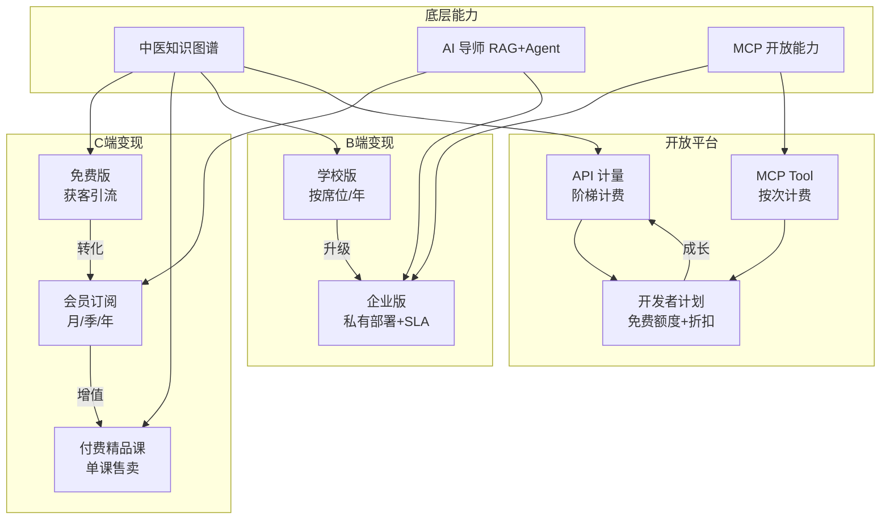

# 第二十章 商业化方案

## 20.1 商业化目标

TCM-History-AI 的商业化遵循「免费获客、AI 变现、开放拓展」三层逻辑。基础内容与有限 AI 体验保持永久免费，降低用户接触中医知识的门槛，形成规模化流量入口；AI 导师、学习计划、考试错题等深度能力通过订阅制变现，将高价值用户转化为付费会员；API 与 MCP 开放能力面向 B 端机构与开发者，把中医知识图谱变成可被 Claude、GPT、Gemini 等第三方模型调用的基础设施，拓展企业、学校与开放生态市场。

中医发展史天然具备文化教育属性与专业学术属性的双重特征，C 端用户价格敏感但愿为优质内容付费，B 端机构预算稳定但对功能与数据安全要求高。基于这一判断，C 端采取「Freemium + 单课售卖」混合模式，B 端采取「席位授权 + 定制部署」模式，开放平台采取「计量计费 + 开发者计划」模式，三条线并行形成可持续的收入组合。

## 20.2 商业模式总览

平台收入由 C 端订阅、B 端授权、开放平台计量三条主线构成，付费课程作为补充。三条线共享同一套中医知识图谱与 AI 能力底座，边际成本低，规模效应显著。

变现矩阵的核心在于 AI 能力分层。基础模型问答纳入会员权益，强模型（学术级）与高阶出题能力单独计费，形成「会员打底 + 增值上探」的收入结构。

## 20.3 C 端收费体系

### 20.3.1 免费版

免费版面向所有注册用户，目标是最大化获客与传播。核心权益包括：浏览全部公开时间轴、人物、典籍条目，每日 5 次 AI 导师问答（基础模型），1 门入门课程，知识图谱基础可视化浏览。免费版不设使用期限，但 AI 问答达到每日上限后需等待次日刷新或升级会员。

### 20.3.2 会员版

会员版是 C 端主要收入来源，覆盖学习闭环中的全部 AI 能力与深度内容。权益包括无限 AI 问答（基础模型）、AI 学习计划生成与跟踪、AI 考试与错题本、AI 出题、全部会员课程、离线下载、知识图谱高级检索、学习数据导出。会员定价采用月、季、年三档，年付给予明显折扣以提升预付现金流与留存。

| 周期 | 定价 | 折算月价 | 适用人群 |
|------|------|----------|----------|
| 月度会员 | ¥39/月 | ¥39 | 短期备考、尝鲜用户 |
| 季度会员 | ¥99/季 | ¥33 | 在校学生、季节性学习 |
| 年度会员 | ¥299/年 | ¥25 | 深度学习者、从业者 |

定价参考国内教育类与 AI 类产品：得到单课多在 ¥19–99，知乎盐选会员 ¥19/月，文心一言专业版 ¥49.9/月。考虑到中医垂直内容的专业性与 AI 能力的综合价值，¥39/月、¥299/年的定价处于用户可接受区间，且年付折扣约 6.4 折，利于锁定长期用户。

### 20.3.3 付费精品课程

付费课程独立于会员体系，定位为深度专题内容，由名医、院校教师或平台内容团队打造。典型课程包括《伤寒论条文精讲》《金元四大家学术源流》《近代中医存废之争》《中医典籍版本学》等，单课价格区间 ¥99–399，课程时长 8–20 小时。会员购买付费课程享 8 折。付费课程收入占比预期不高，但承担内容品牌建设与高端用户价值挖掘的作用。

### 20.3.4 会员权益对比表

| 权益项 | 免费版 | 会员版 | 付费课程（单买） |
|--------|--------|--------|------------------|
| 公开内容浏览 | 全部 | 全部 | 全部 |
| AI 导师问答（基础模型） | 5 次/天 | 无限 | 不含 |
| AI 导师问答（强模型/学术级） | 不含 | 需额外付费 | 不含 |
| AI 学习计划 | 不含 | 含 | 不含 |
| AI 考试与错题本 | 不含 | 含 | 不含 |
| AI 出题 | 不含 | 含 | 不含 |
| 会员课程 | 1 门入门 | 全部 | 不含 |
| 付费精品课程 | 单买原价 | 8 折 | 购买后永久访问 |
| 知识图谱高级检索 | 不含 | 含 | 不含 |
| 离线下载 | 不含 | 含 | 不含 |
| 学习数据导出 | 不含 | 含 | 不含 |
| 价格 | 免费 | ¥39/月起 | ¥99–399/课 |

## 20.4 B 端收费体系

### 20.4.1 学校版

学校版面向中医院校及开设中医课程的综合院校，提供班级管理、教师后台、学习数据看板、批量账号开通、课程定制、考试组织等功能。教师可在后台布置学习计划、查看学生完成度与错题分布，院系管理员可查看整体学习画像。定价采用按席位/年模式，基础版 ¥99/席位/年，完整版 ¥199/席位/年，500 席位以上提供阶梯折扣。学校版支持公有云 SaaS 部署，数据存储于国内合规云。

### 20.4.2 企业版

企业版面向中医机构、药企、研究院与文化企业，提供定制内容开发、私有化部署、API 接入、SSO 单点登录、SLA 99.9% 保障、专属客户成功经理、合规审计日志等能力。典型客户包括连锁中医馆（员工培训）、中药企业（知识库与新品培训）、科研机构（知识图谱 API 接入研究流程）。定价采取「年度授权 + 实施费」模式，起步 ¥80,000/年，根据席位数、定制范围、部署方式浮动，大型项目可至 ¥300,000–500,000/年。

### 20.4.3 B 端方案对比表

| 维度 | 学校版 | 企业版 |
|------|--------|--------|
| 目标客户 | 中医院校、开设中医课程高校 | 中医机构、药企、研究院、文化企业 |
| 部署方式 | 公有云 SaaS | 公有云 / 私有化部署 |
| 账号管理 | 班级、院系、全校层级 | 组织架构、SSO、多角色 |
| 教师后台 | 含 | 含（培训管理员视角） |
| 学习数据看板 | 班级、院系维度 | 组织维度 + 自定义报表 |
| 定制内容 | 课程定制（额外计费） | 深度定制开发 |
| API 接入 | 不含 | 含，按调用配额 |
| SLA 保障 | 99.5% | 99.9% + 专属运维 |
| 合规审计 | 基础日志 | 完整审计日志 |
| 客户成功 | 工单支持 | 专属客户成功经理 |
| 定价模式 | 按席位/年 | 年度授权 + 实施费 |
| 起步价格 | ¥99/席位/年 | ¥80,000/年 |

## 20.5 开放平台（API + MCP）

开放平台把中医知识图谱与 AI 能力以 API 与 MCP 协议对外提供，使第三方应用、智能体、大模型能够调用中医知识。Claude、GPT、Gemini 等模型可通过 MCP 直接接入，实现「在对话中查询中医历史人物、典籍、流派、时间轴」的能力。

### 20.5.1 API 计量收费

API 采用按调用量阶梯计费，提供免费额度降低开发者试用门槛，超出后按套餐计费。计费维度包括知识检索调用、图谱查询调用、AI 问答调用三类，分别计量。

| 套餐 | 月费 | 知识检索调用 | 图谱查询调用 | AI 问答调用 | 适用场景 |
|------|------|-------------|-------------|-------------|----------|
| 免费版 | ¥0 | 1,000 次/月 | 500 次/月 | 50 次/月 | 开发调试、个人项目 |
| 入门版 | ¥99/月 | 20,000 次 | 10,000 次 | 2,000 次 | 小型应用、公众号 |
| 标准版 | ¥499/月 | 150,000 次 | 80,000 次 | 20,000 次 | 中型产品、教育工具 |
| 专业版 | ¥1,999/月 | 800,000 次 | 400,000 次 | 120,000 次 | 商业应用、平台集成 |
| 企业定制 | 联系商务 | 不限 | 不限 | 不限 | 大规模接入、私有部署 |

超出套餐配额后，知识检索 ¥0.005/次、图谱查询 ¥0.01/次、AI 问答 ¥0.05/次，按量后付费。

### 20.5.2 MCP Tool 调用计费

MCP Tool 调用按 Tool 调用次数计费，与 API 计量独立。开放的核心 Tool 包括 `search_tcm_entity`（实体检索）、`query_tcm_graph`（图谱查询）、`tcm_timeline`（时间轴查询）、`tcm_tutor`（AI 导师问答）。免费开发者每月 2,000 次 Tool 调用额度，付费按 ¥0.02/次计费，企业版可购买 ¥999/月 50,000 次的 MCP 套餐。

### 20.5.3 开发者计划

开发者计划旨在培育生态。注册即送免费额度（API + MCP），完成实名认证后额度翻倍；认证开发者（提交应用案例并通过审核）享套餐 7 折；企业合作伙伴享专属技术支持与联合营销。开发者社区提供沙箱环境、SDK（Python/Node.js）、MCP Server 示例与文档，降低接入成本。

## 20.6 AI 能力差异化定价

AI 能力按模型强度与场景分层定价，基础能力纳入会员，强能力与高频能力单独计费，避免高成本 AI 能力被低价订阅无限制消耗。

### 20.6.1 AI 能力分层逻辑

基础模型（如通义千问、GLM 等国产中等规模模型）成本可控，纳入会员无限使用。强模型（学术级，调用 GPT-4 级或具备深度推理能力的模型）单次调用成本高，单独计费或仅对高级会员开放。AI 出题与考试场景因涉及质量校验与多轮生成，按次或按会员组合计费。

### 20.6.2 AI 能力定价表

| AI 能力 | 免费版 | 会员版 | 计费方式 |
|---------|--------|--------|----------|
| AI 导师问答（基础模型） | 5 次/天 | 无限 | 含于会员 |
| AI 导师问答（强模型/学术级） | 不含 | ¥9.9/月 附加包 或 高级会员 | 月费附加 |
| AI 学习计划生成 | 不含 | 每月 10 次 | 含于会员，超出 ¥1/次 |
| AI 出题（单题） | 不含 | 每月 100 题 | 含于会员，超出 ¥0.5/题 |
| AI 模拟考试（一套） | 不含 | 每月 5 套 | 含于会员，超出 ¥5/套 |
| AI 错题讲解 | 不含 | 无限 | 含于会员 |
| AI 知识图谱问答 | 不含 | 无限（基础模型） | 含于会员 |

高级会员定位为面向研究者和深度从业者的更高档位，定价 ¥599/年，在标准会员权益基础上增加：强模型 AI 导师无限问答、每月 500 题 AI 出题、每月 20 套模拟考试、学术文献检索摘要。高级会员与标准会员形成梯度，覆盖对 AI 能力有重度需求的研究者与考研/执业备考人群。

## 20.7 收入预测

收入预测基于以下假设：第一年以 C 端积累与 B 端试点为主，第二年 B 端与开放平台起量，第三年三条线均衡增长。C 端会员规模假设为第一年 5 万付费会员、第二年 15 万、第三年 35 万；B 端学校客户第一年 30 所、第二年 80 所、第三年 160 所；API 开发者第一年 1,000、第三年 8,000。金额单位为人民币万元。

| 收入来源 | 第一年 | 占比 | 第二年 | 占比 | 第三年 | 占比 |
|----------|--------|------|--------|------|--------|------|
| C 端会员 | 1,200 | 48% | 3,800 | 44% | 9,200 | 42% |
| 付费课程 | 150 | 6% | 420 | 5% | 880 | 4% |
| B 端授权（学校+企业） | 600 | 24% | 2,400 | 28% | 5,600 | 26% |
| API / 开放平台 | 550 | 22% | 2,000 | 23% | 6,100 | 28% |
| 合计 | 2,500 | 100% | 8,620 | 100% | 21,780 | 100% |

第一年 C 端会员占比最高，因 B 端签约周期长、开放平台尚在培育。第二年 B 端授权快速上升，学校版规模化落地。第三年 API/开放平台占比接近三成，反映生态成熟后计量收入的爆发特征。C 端会员绝对值持续增长但占比缓慢下降，符合平台从单一 C 端向 C+B+生态三轮驱动的演进路径。

## 20.8 增长策略

### 20.8.1 内容驱动

中医发展史的内容护城河是平台长期竞争力的根本。内容建设聚焦三个方向：经典库持续扩充（《黄帝内经》《伤寒论》《本草纲目》等核心典籍的全文与注释结构化）、知识图谱持续深化（人物、流派、典籍、方剂、医案的关联关系扩展）、时间轴持续延伸（从先秦到当代的完整断代覆盖）。内容生产采用「专家审校 + AI 辅助结构化」模式，专家负责学术准确性，AI 负责抽取、关联与可视化，单条目生产成本随流程成熟递减。内容越完整，AI 导师的 RAG 召回质量越高，形成内容反哺体验的正循环。

### 20.8.2 社区运营

社区运营围绕学习行为展开。学习打卡与连续签到提升日活，排行榜（学习时长、答题正确率、笔记被点赞数）激发竞争，用户生成笔记与课程评价沉淀 UGC 内容并降低内容生产压力。社区重点运营考研群体、执业医师备考群体、中医文化爱好者三类人群，分别配置学习营、模考周、文化主题月活动。社区也是付费转化的关键场景，活跃社区用户的会员转化率显著高于普通用户。

### 20.8.3 渠道拓展

渠道拓展分三条线。中医院校合作通过学校版切入，以教研室试用、课程共建为切入点，逐步扩展到院系采购；中医文化进校园通过中小学传统文化课程包形式，与教育局和学校合作，使用免费版或低门槛版本扩大青少年用户基盘；KOL 合作聚焦中医领域知名医师、文化博主与教育博主，以内容共创与分销分成模式合作，借助其粉丝基础精准获客。三条渠道分别覆盖专业、普及、传播三个层面。

### 20.8.4 开放生态

开放生态通过 API 与 MCP 吸引第三方应用接入，把中医知识能力嵌入更多场景。典型接入场景包括：第三方 AI 助手调用中医历史知识、教育类 App 集成中医文化模块、科研工具调用知识图谱做文献分析、中医 SaaS 产品接入典籍检索。生态规模扩大后，平台从「自建应用」升级为「中医知识基础设施」，议价能力与替代成本同步提升。生态合作伙伴的应用案例反过来增强平台品牌，形成正向循环。

## 20.9 成本结构

平台成本由 LLM 调用、基础设施、内容生产、人力四块构成，随规模变化呈现不同的边际特征。LLM 调用成本随 AI 问答量增长而上升，但可通过模型路由（基础问题用小模型、复杂问题用强模型）与缓存机制控制单位成本。基础设施成本随用户量与数据量增长，但云服务弹性伸缩下单位成本递减。内容生产成本前期较高（专家审校投入大），随知识图谱沉淀和 AI 辅助流程成熟，单条目边际成本下降。人力成本随团队扩张线性增长，是中后期主要固定成本项。

| 成本项 | 第一年占比 | 第三年占比 | 成本特征 |
|--------|-----------|-----------|----------|
| LLM 调用成本 | 30% | 35% | 随调用量增长，模型路由与缓存可降本 |
| 基础设施（云、存储、带宽） | 20% | 18% | 规模效应，单位成本递减 |
| 内容生产（专家、审校、AI 辅助） | 25% | 17% | 前期高，边际递减 |
| 人力（研发、内容、运营、商务） | 20% | 25% | 线性增长，中后期主要固定成本 |
| 其他（合规、营销、渠道分成） | 5% | 5% | 相对稳定 |
| 合计 | 100% | 100% | — |

LLM 调用成本在第三年占比上升，原因在于 AI 能力使用频次随用户规模与功能扩展快速增长，是成本管控的重点。控制手段包括：基础问答路由到国产低成本模型、高频常见问题引入缓存命中、强模型仅在明确学术需求时触发、RAG 召回优化降低无效 Token 消耗。

## 20.10 关键指标

### 20.10.1 North Star Metric

平台的 North Star Metric 定义为「周活跃付费用户数（Weekly Active Paid Users, WAPU）」，即每周内至少产生一次有效学习行为的付费用户数。该指标同时反映获客、转化与留存三个环节的健康度：免费用户转化为付费、付费用户持续使用产品、付费用户产生深度学习行为，三者缺一都会反映在 WAPU 上。

### 20.10.2 支撑指标

| 指标 | 定义 | 目标值（第一年） | 目标值（第三年） |
|------|------|-----------------|-----------------|
| DAU | 日活跃用户数 | 50,000 | 300,000 |
| 付费转化率 | 付费会员 / 注册用户 | 5% | 8% |
| ARPU | 每付费用户平均收入 | ¥220/年 | ¥280/年 |
| API 调用量 | 月度 API 调用总次数 | 500 万 | 1.2 亿 |
| 次月留存率 | 注册次月仍活跃用户占比 | 35% | 45% |
| 年会员续费率 | 年度会员到期续费比例 | 55% | 70% |
| B 端客户数 | 学校 + 企业客户总数 | 35 | 180 |
| NPS | 净推荐值 | 35 | 50 |

DAU 与付费转化率反映 C 端获客与变现效率，ARPU 与续费率反映付费深度与用户满意度，API 调用量反映开放平台规模，B 端客户数反映机构市场渗透，NPS 反映产品口碑。指标体系围绕 WAPU 展开，任何单一指标的优化都应服务于 WAPU 的增长，避免局部优化损害整体健康度。

留存率是商业化可持续性的核心前提。中医学习属于长周期、强目的性场景（备考、从业、研究），用户天然有持续使用动机，但也存在考完即走的流失风险。通过学习计划长期化、社区陪伴、持续内容更新与职业发展相关功能（如执业医师继续教育衔接），延长用户生命周期，把单次备考场景转化为长期学习场景，是提升 LTV 的关键路径。

## 20.11 商业化阶段规划

商业化分三阶段推进，与产品成熟度和市场认知度匹配。

第一阶段（第 1–12 个月）以 C 端免费获客与会员验证为主，B 端开展 5–10 所院校试点，开放平台邀请制内测。重点验证会员定价合理性、付费转化漏斗、AI 成本可控性。收入目标 ¥2,500 万，不追求盈利，聚焦模型跑通。

第二阶段（第 13–24 个月）以 B 端规模化和开放平台公测为主，C 端会员通过内容与社区运营提升 ARPU 与续费率。学校版客户扩展至 80 所，API 开放注册。收入目标 ¥8,620 万，实现单月经营性盈亏平衡。

第三阶段（第 25–36 个月）以开放生态与国际化探索为主，API/MCP 计量收入成为增长最快板块，企业版客户进入稳定交付阶段。收入目标 ¥2.18 亿，实现全年盈利，启动中医药文化出海（多语言知识图谱与 API）的前期准备。

三阶段的核心权衡始终是增长与成本的平衡：C 端不过早涨价以免伤留存，B 端不低价冲量以免稀释服务能力，开放平台不盲目补贴以免养成免费依赖。商业化节奏服从于产品体验与知识图谱质量，后者才是平台长期价值的根基。
